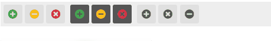
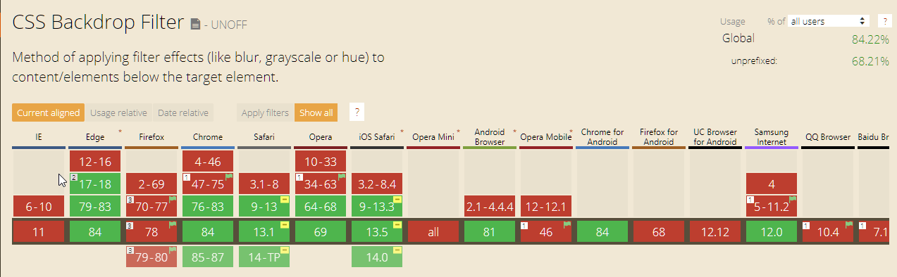

# Using the brightness() CSS Filter to generically highlight Content

  

So it seems I have to pay better attention to CSS standards as I just realized that you can quite easily use CSS Filters to apply useful effects for generic control behaviors. Sure, I remember `filter` merely from the old, evil IE6 days to handle things like shadows and opacity, but it looks like the filter properties have migrated into the CSS mainstream with two now widely used and accepted filter operations that have quite a few useful filters available. 

The two filter properties are:

* [filter ](https://developer.mozilla.org/en-US/docs/Web/CSS/filter)
* [backdrop-filter](https://developer.mozilla.org/en-US/docs/Web/CSS/backdrop-filter)

There are a number of [filter functions](https://developer.mozilla.org/en-US/docs/Web/CSS/filter-function) available:

* blur()
* brightness()
* contrast()
* drop-shadow()
* grayscale()
* hue-rotate()
* invert()
* opacity()
* saturate()
* sepia()

A few of these are very useful as generic tools - especially `brightness()` and `grayscale()`.

## Filter and Brightness
I recently ran discovered the `brightness()` filter, which I didn't realize existed, but which is very, very useful for a number of generic operations.

It's so useful because it allows you to **generically** change the color of an element, **without having to specify a specific color value**. Instead you can vary the brightness (or perhaps also the hue or saturation if you want to get more fancy) and basically affect he behavior of the element. That makes it quite useful for generic things like a 'button' control or other highlightable element.

> Note: `brightness()` affects both the element **foreground and background** when using `filter`.

## brightness() Filter for Generic Highlighting
I can't tell you how many times over the years I've implemented a custom 'button' like CSS implementation. Over the years I've used images, backgrounds, gradients and opacity to effectively 'highlight' a control. All that works of course, but the problem with most of these approaches is that one way or the other you're hard coding a color value, image or gradient. Which means every type of button needs it's own highlight configuration and if you're doing any sort of theming the buttons need to be overridden for each theme to work typically.

The `brightness()` filter offers a potentially simpler alternative by simply **boosting the color brightness of either or both foreground and background colors**. Because `brightness()` works off the existing base color values, using a modifier style like `:hover`,  you don't have to explicitly provide a new color, but rather just provide a generic brightness adjustment value.

What this means is that you can apply the button behavior to just about any content, **regardless** of what color it is which is great. 

For example, this is what I use for turning FontAwesome icons into using button-like behavior:

```html
<style>
  .toolbar { 
      padding: 5px;
      background: #f5f5f5;
  }
  .fa-button {
      padding: 0.5em 0.5em;
      background: #e0e0e0;  
      border-radius: 3px;                    
  }           
  .fa-button.dark {
      background: #555;                      
  }
  .fa-button:hover {
      cursor: pointer;
      border-radius: 3px;                    
      filter: brightness(120%);                    
  }            
  .fa-button.disabled {
      filter: grayscale(100%);
  }
</style>

<div style="padding: 5px; background: #eee;" class="mt-3">
  <a href="#"><i class="fas fa-plus-circle fa-button text-success"></i></a>
  <a href="#"><i class="fas fa-minus-circle fa-button text-warning"></i></a>
  <a href="#"><i class="fas fa-times-circle fa-button text-danger"></i></a>

  <a href="#"class="ml-1"><i class="fas fa-plus-circle fa-button  dark text-success"></i></a>
  <a href="#"><i class="fas fa-minus-circle fa-button dark text-warning"></i></a>
  <a href="#"><i class="fas fa-times-circle fa-button dark text-danger"></i></a> 
  
                  
  <a href="#" class="ml-1" title="this button is disabled (b&w filter)"><i class="fas fa-plus-circle fa-button text-danger disabled"></i></a>
<a href="#" title="this button is disabled (b&w filter)"><i class="fas fa-times-circle fa-button  text-danger disabled"></i></a>
<a href="#" title="this button is disabled (b&w filter)"><i class="fas fa-minus-circle fa-button text-danger disabled"></i></a>
</div>
```


Here's what that looks like:

  
<small>[sample on CodePen](https://codepen.io/rstrahl/pen/GRoaYgN)</small>

No matter which color is applied to the icon - **the highlighting just works**!

If you've been paying attention to CSS standards this is probably not news to you, but I didn't know that this was something you could do. In fact I didn't realize that there are so many useful filters available including filters to blur, gray scale and a few other things that are useful for things like disabling buttons.

## Background Filters with backdrop-filter
Another very useful thing and again new to me is the ability to apply a `backdrop-filter`. A backdrop filter lets you apply a filter to the content that the affected elements *sits on top of* in HTML compositional layout.

Effectively - with a little extra effort - you can apply many of these filters to the background only which was previously very difficult to do unless you used absolute positioning and z-index!

This makes it much easier to highlight content that sits on top of background images for example.

```html
<style>
    .image-background-text {                    
        background: url(./images/Icon.png);
        background-repeat: no-repeat;                    
        border: 1px solid #eee;
        display: flex;
        justify-content: center;
        align-items: center;
        height: 256px;
        width: 256px;
    }
    .text-overlay {
        -webkit-backdrop-filter: blur(10px);
        backdrop-filter: blur(10px);

        height: 256px;
        width: 256px;
        text-align: center;
          
        background: transparent;
        font-size: 70pt;
        font-weight: bold; 
        color: firebrick;
    }
</style>

<div class="image-background-text mt-4">
    <h3 class="text-overlay">Icon</h3>
</div>
```

which produces this:

  
<small>[sample on CodePen](https://codepen.io/rstrahl/pen/GRoaYgN)</small>

What makes this work is the `backdrop-filter` which lets you apply a filter to anything that **sits behind the filtered element**. This was notoriously difficult to do otherwise, because without the `backdrop-filter` applying a filter or opacity to a background element would also apply to any child content contained within a parent element. 

Note that using `backdrop-filter` is different than setting `filter` **on the background element**, because `filter` also **applies to all contained elements**. 

If you do this, which seems very similar:

```css
.image-background-text {     
   ...
   filter: blur(10px);
}
.text-overlay {
    /*backdrop-filter: blur(2px);*/
    ...
```                    

You get this unsatisfying result:

  
<small>[sample on CodePen](https://codepen.io/rstrahl/pen/GRoaYgN)</small>

Using `backdrop-filter` on the top level elements instead of `blur` on the bottom element, makes that actually work as it applies the filter to any content **behind** the top element.

It's still not exactly easy to do these kind of layouts, because you still have to make sure that the content on top completely covers the bottom container in order to ensure a full fill. But it still considerably easier than having to  explicitly mess around with relative and absolute positioning layout in the middle of your document.

> #### @icon-warning Backdrop Filter Caveats
> To be clear: The `backdrop-filter` does not apply to the affected element background properties like `background`, `background-image`, gradients and so on. Rather it's applied to any content that sits **behind** the current element. Only the area that is 'covered' by the element with the `backdrop-filter` gets the filter applied.

As useful as I think that `backdrop-filter` is, the bad news is that it takes a very recent browser to work. It requires Chromium 76 or later (current is 84).

In the current evergreen, release FireFox version (79) you need to:

* go to `about:config`
* set `layout.css.backdrop-filter.enabled` to `true`
* set `gfx.webrender.all` to `true`

which is unfortunate. Couldn't find anything on plans to integrate that without flags in Firefox. The [official status](https://drafts.fxtf.org/filter-effects-2/#BackdropFilterProperty) for `backdrop-filter` is **Editor's Draft**. 

As of today, here's the compatibility chart for `backdrop-filter` (not for `filter` which works in all browsers):

[](https://caniuse.com/#search=backdrop-filter)

It works in current Chromium browsers. FireFox requires special config flags for now, and it looks like iOS still requires `-webkit-backdrop-filter` (apparently no longer required in IOS 13). So this feature is pretty new and just making it into evergreen browsers.

## Summary
Filters have been around for a long time, but they've gotten a bad name, mainly because of the quirks that come from original usage with Internet Explorer. But filters are a legitimate part of the CSS Standard now. They are surprisingly useful especially for generic styling of elements for dynamic hover behaviors which I've been using `filter` for a lot lately to reduce a bunch of redundant hard coded style rules.

`backdrop-filter` is still a little too bleeding edge in terms of browser support to be used widely, unless you are explicitly targeting browsers that support it today. But since these are mostly aesthetic features you can probably get away with not applying the filters in unsupported browsers for  a slightly less visual experience. Nevertheless, `backdrop-filter` is useful for some cool effects that otherwise are a pain in the ass to achieve via layered content and it looks like it will be available to all everygreen browsers soon.

## Resources

* [Filter Examples on CodePen](https://codepen.io/rstrahl/pen/GRoaYgN)


<div style="margin-top: 30px;font-size: 0.8em;
            border-top: 1px solid #eee;padding-top: 8px;">
    
    this post created and published with the 
    <a href="https://markdownmonster.west-wind.com" 
       target="top">Markdown Monster Editor</a> 
</div>