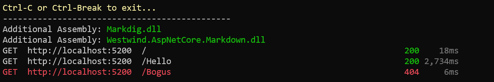
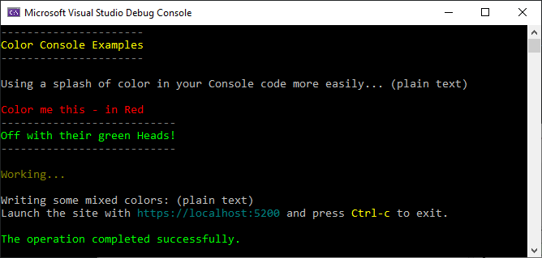

# A .NET Color Console Helper



I recently started posting shorter and more basic posts on this blog with some small, but practical things that I've found useful. Incidentally over the years of blogging some of the most popular posts here have been these short and often very simple tips rather than the long form articles which tend to have high short term popularity but less long term appeal. So in the spirit of short posts here's one about a simple ColorConsole helper class I use to add some color to my Console applications more easily.

## Color me Console
In this post I'll discuss a small Console helper class I've been using to make it easier and more consistent to use colors with the .NET `Console` command. While colors are easy enough to access in the Console, to switch colors is a bit of a pain with the plain `Console` API. The simple class I present here makes it easier to write a line or string in a given color, write a line with multiple colors (using simple `[color]text[/color]` templating) and an easy way to create a header.
The following is a very simple `ColorConsole` class that provides some useful color helpers:

* `WriteLine()` and `Write()` methods with Color parameters
* `WriteError()`, `WriteInfo()`, `WriteSuccess()` and `WriteWarning()` methods
* A color template expansion `WriteEmbeddedColorLine()` function
* A header generation routine

The Write methods let me quickly write output in a specific color without worrying about setting and resetting the color. The output is written with the specified color and the color is always reset to previously active color.

The high level wrappers like `WriteError()` and `WriteSuccess()` provide an alternative the raw Write methods and are more explicit about the intent of the message. It makes colors more consistent with color choices for common situations like error or informational statements.

I often find myself writing Console output that requires multiple more than a single color in a line of text when highlighting values over labels or displaying multiple values of difference importance.  I can use multiple `Write()` statements with colors for this, but to make this easier to read I created a templated method that allows delimiting text with `[color]text[/color]` delimiters in a string.
 
```cs
ColorConsole.WriteEmbeddedColorLine($"Site Url: [darkcyan]{ServerConfig.GetHttpUrl()}[/darkcyan] [darkgray](binding: {HostUrl})[darkgray]");
```

### Try it out
To use the class looks something like this:

```cs
static void Main(string[] args)
{
    ColorConsole.WriteWrappedHeader("Color Console Examples");

    Console.WriteLine("\nUsing a splash of color in your Console code more easily... (plain text)\n");

    ColorConsole.WriteLine("Color me this - in Red", ConsoleColor.Red);

    ColorConsole.WriteWrappedHeader("Off with their green Heads!", headerColor: ConsoleColor.Green);


    ColorConsole.WriteWarning("\nWorking...\n");

    Console.WriteLine("Writing some mixed colors: (plain text)");
    ColorConsole.WriteEmbeddedColorLine(
        "Launch the site with [darkcyan]https://localhost:5200[/darkcyan] and press [yellow]Ctrl-c[/yellow] to exit.\n");


    ColorConsole.WriteSuccess("The operation completed successfully.");
}
```

which produces the following output:



### Code
Here's the `ColorConsole` class:

```csharp
/// <summary>
/// Console Color Helper class that provides coloring to individual commands
/// </summary>
public static class ColorConsole
{
    /// <summary>
    /// WriteLine with color
    /// </summary>
    /// <param name="text"></param>
    /// <param name="color"></param>
    public static void WriteLine(string text, ConsoleColor? color = null)
    {
        if (color.HasValue)
        {
            var oldColor = System.Console.ForegroundColor;
            if (color == oldColor)
                Console.WriteLine(text);
            else
            {
                Console.ForegroundColor = color.Value;
                Console.WriteLine(text);
                Console.ForegroundColor = oldColor;
            }
        }
        else
            Console.WriteLine(text);
    }

    /// <summary>
    /// Writes out a line with a specific color as a string
    /// </summary>
    /// <param name="text">Text to write</param>
    /// <param name="color">A console color. Must match ConsoleColors collection names (case insensitive)</param>
    public static void WriteLine(string text, string color)
    {
        if (string.IsNullOrEmpty(color))
        {
            WriteLine(text);
            return;
        }

        if (!Enum.TryParse(color, true, out ConsoleColor col))
        {
            WriteLine(text);
        }
        else
        {
            WriteLine(text, col);
        }
    }

    /// <summary>
    /// Write with color
    /// </summary>
    /// <param name="text"></param>
    /// <param name="color"></param>
    public static void Write(string text, ConsoleColor? color = null)
    {
        if (color.HasValue)
        {
            var oldColor = System.Console.ForegroundColor;
            if (color == oldColor)
                Console.Write(text);
            else
            {
                Console.ForegroundColor = color.Value;
                Console.Write(text);
                Console.ForegroundColor = oldColor;
            }
        }
        else
            Console.Write(text);
    }

    /// <summary>
    /// Writes out a line with color specified as a string
    /// </summary>
    /// <param name="text">Text to write</param>
    /// <param name="color">A console color. Must match ConsoleColors collection names (case insensitive)</param>
    public static void Write(string text, string color)
    {
        if (string.IsNullOrEmpty(color))
        {
            Write(text);
            return;
        }

        if (!ConsoleColor.TryParse(color, true, out ConsoleColor col))
        {
            Write(text);
        }
        else
        {
            Write(text, col);
        }
    }

    #region Wrappers and Templates


    /// <summary>
    /// Writes a line of header text wrapped in a in a pair of lines of dashes:
    /// -----------
    /// Header Text
    /// -----------
    /// and allows you to specify a color for the header. The dashes are colored
    /// </summary>
    /// <param name="headerText">Header text to display</param>
    /// <param name="wrapperChar">wrapper character (-)</param>
    /// <param name="headerColor">Color for header text (yellow)</param>
    /// <param name="dashColor">Color for dashes (gray)</param>
    public static void WriteWrappedHeader(string headerText,
                                            char wrapperChar = '-',
                                            ConsoleColor headerColor = ConsoleColor.Yellow,
                                            ConsoleColor dashColor = ConsoleColor.DarkGray)
    {
        if (string.IsNullOrEmpty(headerText))
            return;

        string line = new string(wrapperChar, headerText.Length);

        WriteLine(line,dashColor);
        WriteLine(headerText, headerColor);
        WriteLine(line,dashColor);
    }

    private static Lazy<Regex> colorBlockRegEx = new Lazy<Regex>(
        ()=>  new Regex("\\[(?<color>.*?)\\](?<text>[^[]*)\\[/\\k<color>\\]", RegexOptions.IgnoreCase), 
        isThreadSafe: true);

    /// <summary>
    /// Allows a string to be written with embedded color values using:
    /// This is [red]Red[/red] text and this is [cyan]Blue[/blue] text
    /// </summary>
    /// <param name="text">Text to display</param>
    /// <param name="baseTextColor">Base text color</param>
    public static void WriteEmbeddedColorLine(string text, ConsoleColor? baseTextColor = null)
    {
        if (baseTextColor == null)
            baseTextColor = Console.ForegroundColor;

        if (string.IsNullOrEmpty(text))
        {
            WriteLine(string.Empty);
            return;
        }

        int at = text.IndexOf("[");
        int at2 = text.IndexOf("]");
        if (at == -1 || at2 <= at)
        {
            WriteLine(text, baseTextColor);
            return;
        }

        while (true)
        {
            var match = colorBlockRegEx.Value.Match(text);
            if (match.Length < 1)
            {
                Write(text, baseTextColor);
                break;
            }

            // write up to expression
            Write(text.Substring(0, match.Index), baseTextColor);

            // strip out the expression
            string highlightText = match.Groups["text"].Value;
            string colorVal = match.Groups["color"].Value;

            Write(highlightText, colorVal);

            // remainder of string
            text = text.Substring(match.Index + match.Value.Length);
        }

        Console.WriteLine();
    }

    #endregion

    #region Success, Error, Info, Warning Wrappers

    /// <summary>
    /// Write a Success Line - green
    /// </summary>
    /// <param name="text">Text to write out</param>
    public static void WriteSuccess(string text)
    {
        WriteLine(text, ConsoleColor.Green);
    }
    
    /// <summary>
    /// Write a Error Line - Red
    /// </summary>
    /// <param name="text">Text to write out</param>
    public static void WriteError(string text)
    {
        WriteLine(text, ConsoleColor.Red);
    }

    /// <summary>
    /// Write a Warning Line - Yellow
    /// </summary>
    /// <param name="text">Text to Write out</param>
    public static void WriteWarning(string text)
    {
        WriteLine(text, ConsoleColor.DarkYellow);
    }


    /// <summary>
    /// Write a Info Line - dark cyan
    /// </summary>
    /// <param name="text">Text to write out</param>
    public static void WriteInfo(string text)
    {
        WriteLine(text, ConsoleColor.DarkCyan);
    }

    #endregion
}
```

You can also find a runnable single file Console application in this Gist:

[ColorConsole.cs Gist](https://gist.github.com/RickStrahl/52c9ee43bd2723bcdf7bf4d24b029768)

## Summary
Nothing fancy, and nothing you couldn't come up with in a few minutes yourself, but I find these super helpful and end up using this in just about any Console application now to make it easier to print help screens and provide basic status and progress information. Maybe some of you will find these useful as well...

<div style="margin-top: 30px;font-size: 0.8em;
            border-top: 1px solid #eee;padding-top: 8px;">
    
    this post created and published with the 
    <a href="https://markdownmonster.west-wind.com" 
       target="top">Markdown Monster Editor</a> 
</div>