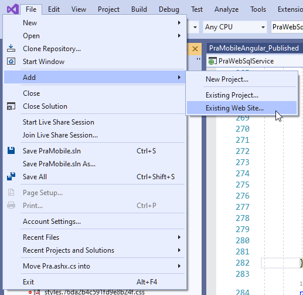

# Excluding Files and Folders in Visual Studio Web Site Project


This post is a self-reminder, so I can find this information in the future: I still use quite a few **Web Site Projects** in Visual Studio for very simple, all static sites. Most of my product sites, info pages and a host of small client side samples are all simple apps that don't require any fancy 'DevOps' deployment mechanism, and in these cases Web Deploy often offers a simple solution to quickly get content updated on live site.

For example, in my current requirement, I have a completely static Angular project that sits on its own dedicated static site and communicates with an external API endpoint. 

I don't even use Visual Studio for the Angular development ([WebStorm all the way](https://www.jetbrains.com/webstorm/)) but other parts of the project live in Visual Studio and deploy to a separate server. So the Web Site project is just one other project that's published. In this case the 'site' is the final output from an Angular  `ng build` command in it's own dedicated project folder, which is part of the larger Solution as a Web Site project.

Web Site projects and simple Web Deploy often make a good solution and Web Deploy is one of the easiest and quickest ways to publish from Visual Studio when you're not dealing with .NET code in a project.

> Yes I know - push button deploy is often frowned upon. But for many static sites like my product sites or as in this case a small static site project that is code managed and staged through other mechanisms often don't warrant a dev ops setup and for those types of scenarios push button Web Deploy still remains a good solution.

## Excluding files
One thing that invariably happens is that there is one or more **dynamic files in a project** that shouldn't be deployed to the server. They are needed to run the application locally (and on the server), but the file(s) is specific to the particular application installation. So they need to be excluded when the project is published and updated on an as needed basis for specific installations.

And of course I forget the syntax to do this every single time!

In this specific setup  the Angular application has a local configuration file `appConfiguration.json` that's dynamically loaded at runtime when the Angular application starts (via an `APP_INITIALIZER`) and holds site specific configuration settings so each deployed site will have its own copy and this file shouldn't be deployed. 

Web Site Projects store the Deployment information in a `App_Data/PublishProfiles` folder in a `.pubxml` file for each Publish Profile.


The specific `.pubxml` file settings that can be used to exclude files and folders are:

```xml
<Project>
    <ProjectGroup>
        <!-- Exclude Files -->
        <ExcludeFilesFromDeployment>appConfiguration.json;*.pubxml</ExcludeFilesFromDeployment>
        
        <!-- Exclude Folders -->
        <ExcludeFoldersFromDeployment>temp;otherfolder</ExcludeFoldersFromDeployment>
    </ProjectGroup>
</Project>
```

Simple enough.

Now when I publish the `appConfiguration.json` file is not published to the server. Simple solution - once you know the keys to set.

Problem solved.

## Wait, where are my Web Site Projects, Dude?
Several people asked about Web Site projects in Visual Studio as Microsoft has done a good job hiding this project type. The reason most people **think** it's no longer available is because **Web Site Projects are not shown on the Visual Studio Start Screen**. But they are still available in the main Visual Studio menu.

If you're starting Visual Studio from scratch you have to use `Continue without code`:


You can then use either **File -> Open -> Web Site** (when there's no solution open), or if you have an existing Solution **File -> Add -> Existing Web Site**:




## Can we use .NET SDK Projects? Sort of, not really?
While I was mucking around with this I was once again thinking about how to avoid Web Site Projects. These projects have many problems like not excluding folders like `node_modules` which can make client side projects maddeningly slow, and for not working in non-Visual Studio for Windows environments.

It would seem that a .NET SDK project could offer the same features for content files only. While on the surface Web Site Projects which don't need a project file at all seem simpler, the fact that you use the common format used for other projects  in an SDK project, plus all the nice filtering features that are not easily available in a Web Site project.

SDK projects have an easy way to specify what gets included and excluded, plus it's more familiar than the `.pubxml` syntax that I will never remember and not readily find when I'm looking for it in a search (maybe now with this post I'll at least know where to look )

It's possible to set up a *pseudo content project* like this:

```xml
<Project Sdk="Microsoft.NET.Sdk.Web">
  <PropertyGroup>
    <TargetFramework>netcoreapp3.1</TargetFramework>
    <EnableDefaultContentItems>false</EnableDefaultContentItems>
  </PropertyGroup>

  <!-- Include all files -->
  <ItemGroup>
    <None Update="**/*.*">
      <CopyToOutputDirectory>PreserveNewest</CopyToOutputDirectory>
    </None>
  </ItemGroup>

  <!-- add specific exclusions -->
  <ItemGroup>
    <None Update="appConfiguration.json">
      <CopyToOutputDirectory>Never</CopyToOutputDirectory>
    </None>
    <None Update="**/*.pubxml">
      <CopyToOutputDirectory>Never</CopyToOutputDirectory>
    </None>
    <None Update="node_modules/**/*.*">
      <CopyToOutputDirectory>Never</CopyToOutputDirectory>
    </None> 
  </ItemGroup>
</Project>
```

This **does work** but there are a couple of problems with SDK Projects in a static site scenario:

* Require an Entry Point (ie. `static void Main()`)
* Require a TargetFramework
* Produce binaries that can't be excluded

If you can live with extra deployed files (ie. the binaries) you can fix the first point by explicitly adding a `program.cs` file:

```cs
namespace PraMobile {
    public class PraMobileTemp
    {
        public static void Main(string[] args)  { }
    }
}
```

This makes the project build even though it literally does nothing. Unfortunately, it also creates a few small `.dll`,`.pdb` and `.exe` which do also get deployed and I can't see a way to exclude them via project file options. 

So that's the downside - you get junk on the server that you don't want there.

## Summary
It sure sure would be nice if there was a new style SDK project **that didn't have a compilation target**. With that we could finally get rid of Web Site projects and use the 'no target' project for content only projects and still get the 'project' features like publishing. But I bet that would be a hard sell for the project system, given the .NET moniker :

Today Web Site projects still work for this, but they don't fit well into .NET Core solutions and there still is no really good alternative.

I hope that's something Microsoft will address in the future as I find myself with lots of uses for these types of static file only content projects.

### Resources
* [Excluding Files and Folders from Web Deploy Deployment](https://docs.microsoft.com/en-us/aspnet/web-forms/overview/deployment/advanced-enterprise-web-deployment/excluding-files-and-folders-from-deployment)

<div style="margin-top: 30px;font-size: 0.8em;
            border-top: 1px solid #eee;padding-top: 8px;">
    
    this post created and published with the 
    <a href="https://markdownmonster.west-wind.com" 
       target="top">Markdown Monster Editor</a> 
</div>