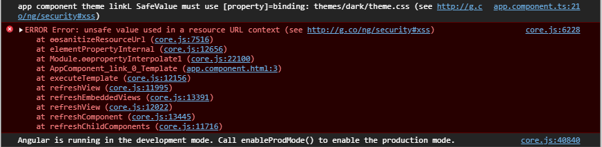

# Injecting a dynamic CSS Resource into an Angular Component
Ran into a sticking point in one of my Angular apps I'm working on where we're using user defined theming. Basically the user can specify a theme as part of their configuration and themes can potentially be located in a custom theme folder that is added after the application is deployed. In a nutshell - runtime configuration of a site. 

Angular supports adding style sheets in a number of (not very obvious) ways. Heck it's difficult to figure out which order style sheets get loaded and a lot of reshuffling has to happen to get things to load in the right order.

## Dynamic Loading
On top of that this scenario of dynamically loading a style sheet is not really obvious... Because Angular is a transpiled/compiled and style sheets like all other resources tend to be 'compiled into the application' the built in style inclusion mechanisms aren't much help here.


So my hacky solution initially was to add a style link into the main `app.component.html` file. Do the following with a hard coded theme name (dark) **works just fine**:

```html
<link href="/themes/dark/theme.css" rel="stylesheet"/>
```

But now taking that same theme name and making it dynamic unfortunately does not work. **Neither of the following two examples work**:

```html
<link [href]="/themes/{{appModel.configuration.theme}}/theme.css" rel="stylesheet"  *ngIf="appModel.configuration.theme" />
```

or

```html
<link [href]="themeLink" rel="stylesheet"  *ngIf="themeLink" />
```

Both result in an error in the page:



> unsafe value used in a resource URL context

## Sanitizing the URL
Angular is trying to be helpful here by checking for a possible XSS attack vector where a dynamic value or potential user input can be used to create a new link, which is fair. If user input is used it's possible to create malicious links here.

In this case **I know** where the theme is coming from in the configuration which application configured on the server.

The way around this is to use the `DomSanitizer` class and the `bypassSecurityTrustResourceUrl()` which is responsible for providing 'validated' links to a component.

To make this work:

* Use `SafeResourceUrl` for the link value type
* Create the resource URL with `bypassSecurityTrustResourceUrl()`

Here's what this looks like:


```ts
import {DomSanitizer, SafeResourceUrl, Title} from '@angular/platform-browser';
import {AppModel} from "./shared/configuration/AppModel";

@Component({
  selector: 'app-root',
  templateUrl: './app.component.html',
  styleUrls: [],
})
export class AppComponent {

  themeLink:SafeResourceUrl;

  constructor(public appModel:AppModel, private sanitizer:DomSanitizer)
  {
    if (appModel.configuration.theme)
    {
      this.themeLink = this.sanitizer.bypassSecurityTrustResourceUrl("themes/" + appModel.configuration.theme + "/theme.css");
    }
  }
  ...
}  
```

I can now use the theme URL like this, as I showed earlier:


```html
<link [href]="themeLink" rel="stylesheet"  *ngIf="themeLink" />
```

and the theme stylesheet link is applied into the page. 

## Is there a better way?
This still feels pretty ugly though. I'd rather **not** inject a stylesheet link into the page like this but this seems to be the only way to get this to work. 

Maybe there is a cleaner way to dynamically pull in a URL at runtime using code only?

In the meantime this works and that's good enough for me.

## Resources

* [StackOverflow Question and Answer by ConnorsFan ](https://stackoverflow.com/questions/63004044/how-to-inject-a-css-stylesheet-at-runtime-in-an-angular-component)


