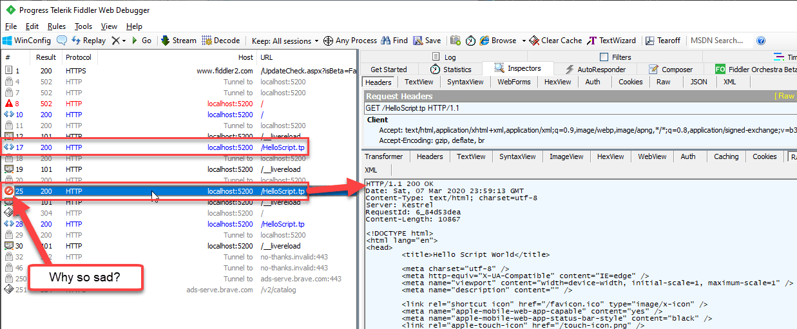
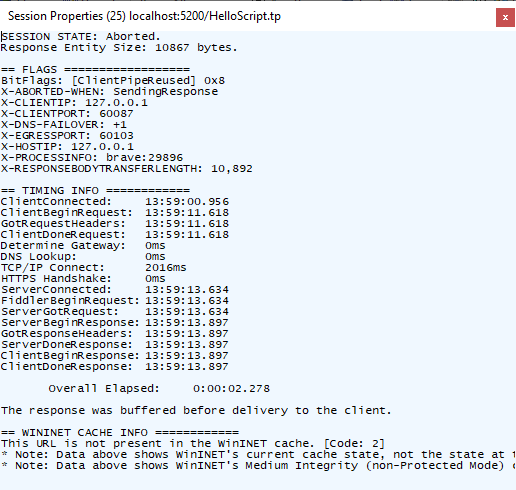
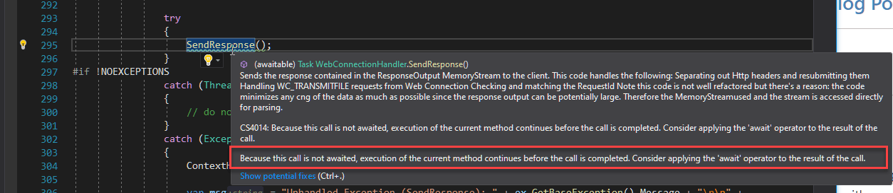
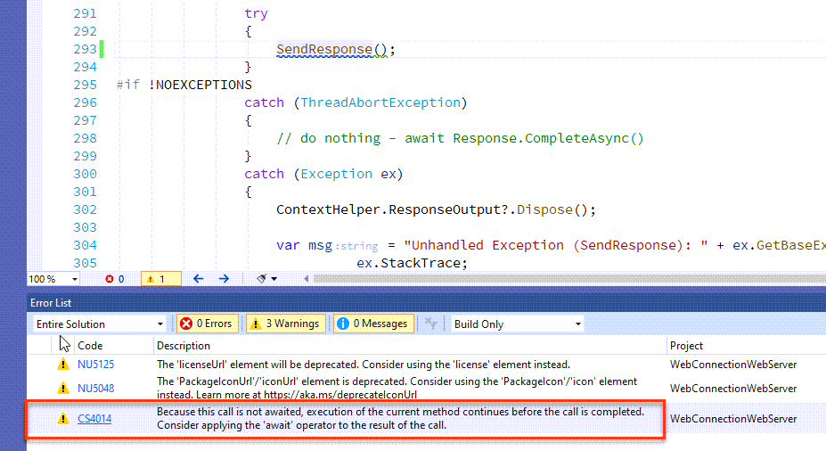

# Don't get burned by missing await Calls for Async Code in ASP.NET Core Middleware

This post falls into the category of stupid developer mistakes that are difficult to track down. In this post I'll discuss a nasty bug I ran into with my code, and which I totally misdiagnosed at first. It refers to an intermittent failure of HTTP requests in a custom middleware component where I would get HTTP errors **even though the actual response apparently was received properly**.

Check out this request trace in Fiddler:



Notice that the response code is a `200` response, but yet it shows with an error icon next to it. Per [Eric Lawrence](https://twitter.com/ericlaw) (the original author of Fiddler) I also checked the Session properties:



which seems to suggest that the response was aborted (`X-ABORTED-WHEN`). 

In the browser this page renders... blank. It comes up as a **totally white page** - not as an error, just blank. This happens both with and without Fiddler attached.

Looking at the actual response output in Fiddler, it looks like the HTML output is all there and matches the content length generated on the server. And yes, I logged the actual content size sent to the client and it matches the `Content-Length` header the client sees in Fiddler.

What... the... heck???

As you can imagine, it took a while and a lot of false starts to find the culprit. Apparently ASP.NET Core is cutting the connection before the final output is sent, even though it appears that all bytes have been received per Fiddler.

And... even worse: **it works most of the time - it only fails occasionally** on the same pages, creating the exact same content. Most of the times it works, sometimes it doesn't. A timing issue most likely... Lovely!

### (a)Wait for me!
It turns out that in this application I failed to call an output generation method with an `await` statement.

The response writing method in question looks like this:

```cs
 public async Task SendResponse()
 {  
     // pick up response data, add headers, re-route file transfers etc.
     ...
    
     // eventually writes manipulated bytes into the output stream
     await Response.Body.WriteAsync(msResponseOutput.ToArray(),
                    (int) ContentPosition,
                    (int) msResponseOutput.Length - (int) ContentPosition);
 }
 ```

And the method **should** then be called like this:

```cs
await  SendResponse();    // internally eventually does `await Response.WriteAsync(outputBytes)`
```

But because this is legacy code that was moved from an old HttpHandler I forgot to add the  `await` in this call and left it as it originally was:

```cs
SendResponse();   // sometimes no workey
```

This is perfectly valid C# code, although in this case not correct in terms of behavior.

**And that right there is the culprit for the intermittent failures.**

I had this code running for some time on .NET Core 2.1 without issues even without the `await` in place, but in .NET Core 3.1 the intermittent errors kept cropping up. .NET Core 3.1 and later is more strict with its async output generation as requests go through the `IHttpFeatures` pipeline rather than to direct `Response` output which seems to exacerbate the problem.

In most cases the latter code actually works fine, and only **occasionally** would the code fail with the odd errors described above. 

This appears to be a timing issue - it works when the writing completes before ASP.NET shuts down the actual connection, or it fails if the entire response has not been written. Note that no error appears in the ASP.NET application if the latter occurs - it fails silently.


### But Rick - don't you look at Warnings?
Fair question. 

Chances are your Visual Studio, Rider and OmniSharp development environments/tools all should flag this call:

```cs
SendResponse();   // sometimes no workey
```

with a **warning in that async call is called without awaiting the result**. And they did. Now that I know where to look,  I could see the warning at the scene of the crime:



or in the warning list:



So the tooling can help avoid this error and in most cases that's probably a pretty obvious catch. 

In my defense (ha!), I missed this because it's a legacy project that has been ported from a classic ASP.NET `HttpHandler` to an ASP.NET Core middleware component. Because this code is ancient there are tons of `[Obsolete]`, documentation and unused variable warnings etc. and the `SendResponse()` await warning was simply lost in the shuffle of a nearly 200 warnings. I've since fixed that (as you can see in the screen shot above), but it looked quite different before when I was trying to track down the bug.

This was made even more insidious by the fact that the original code in .NET Core 2.1 worked just fine even without the `await` call, meaning this error cropped up a year or so after I had originally ported the code and had been running it successfully for that long.

That'll teach me to clean up even legacy code warnings or at least slog through huge numbers of warnings for that one critical one. Right...

### Off Topic: Async Cascade
I mentioned that this project was a port of an old, old `HttpHandler` moved from a classic ASP.NET application server. This process was surprisingly easy to work through with easily 90%+ of the code migrating straight across even though it includes a ton of legacy technology (COM) integration.

The one thing that didn't 'just work' was the async requirement of ASP.NET Core's output generation. The old code - which originally was written for .NET 1.1 and then moved through generations of .NET through 4.5+ - didn't use async output, so all the code at the middleware API 'seam' needed to be changed to async. It's not too difficult to do but it's a thankless task: Just when you think *"I've got them all!"* there will be another async method you need to convert. And another, and another :smile:

Initially there was one method that required Async access (`SendResponse()`) but then it turned out that the cascade required every single method that touched the HTTP output had to be made async as well as all the methods that call them. 90% of the original HttpHandler code ported without changes **except** for the changes around async conversion.

And that's precisely where this error above was introduced. As I went through and updated calls I missed that one which ironically was the most important one through which most of the output in this middleware flows. 

### The Moral of the Story
The moral of this story is this: Make sure your Async methods are actually called asynchronously especially if it deals with ASP.NET Core Response output. Without it, the code might work - or, it might not! It depending on timing of the async code running making for some really crazy inconsistent errors. Chances are if you screw this up, your IDE will catch this as a warning and hopefully you won't have the error clusterf*ck that I had to obscure the error.

The second moral is directed at myself: Clean up your code, even if it's ported legacy code. I ended up doing this in this project after I figured out the problem and realized that a little housekeeping would have probably saved me a few hours of troubleshooting trying to track down exactly what was happening... well, next time I'll be wiser, right? <small>*(maybe)*</small>

<div style="margin-top: 30px;font-size: 0.8em;
            border-top: 1px solid #eee;padding-top: 8px;">
    
    this post created and published with the 
    <a href="https://markdownmonster.west-wind.com" 
       target="top">Markdown Monster Editor</a> 
</div>