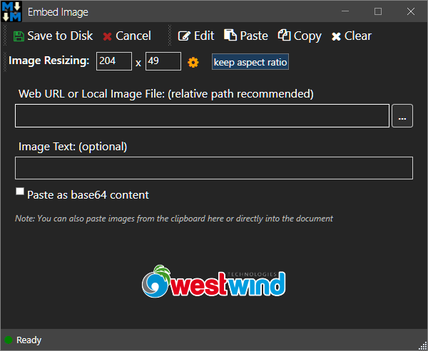

# Wrestling with Clipboard Images in WPF


Getting images from the clipboard correctly in WPF - or heck in general in Windows - is hard if you need it to be consistent and accurate. The Windows clipboard is based on ancient Windows APIs and the way many things on the clipboard are formatted by default is pure insanity. If you need a torturous example just try to use copy and paste HTML content to and from the clipboard :scream:

Images by comparison are not quite as bad, but man there are challenges there as well. 

The problem with image retrieval from the clipboard is that there's no single standard format.  Rather applications that push images onto the clipboard just blast a load of different image formats onto the clipboard leaving a client application guessing of which image type to use. Worse even amongst those formats provided the actual image content may vary depending on the application that pushed the image onto the clipboard. And - in the process of grabbing the image you may loose image quality or more commonly - transparency. To top things off the WPF `Clipboard.GetImage()` method simply doesn't work at all with Clipboard images from some applications.

Confusing right?

### Hating on Windows.System.Clipboard.GetImage()
Specifically in WPF `Windows.System.Clipboard.GetImage()` fails with some common image formats, most prominently [SnagIt from Techsmith](https://techsmith.com/snagit) and classic Windows Paint. There are probably more but those are two that I use and have noticed don't work. If you try to load an image using `Clipboard.GetImage()` in WPF you'll get some weird Frankenstein Bitmap source that seems to have the right size and some sort of bitmap data, but it's not actually a valid image and fails to display anything in the Image control's `Source` property. Other applications, however work fine.

In MM the image dialog automatically picks up clipboard images when the dialog is activated:

  
<small>**Figure 1** - A transparent image captured from the clipboard when it works. Empty when it doesn't: *"Where's my image, dude?"*.</small>

In the figure it worked - the copied image from a Web browser displays. But when the image comes from SnagIt for example, it doesn't work and the image control is blank.

This is a known WPF bug that has been around forever and was never fixed (like so many things in WPF) and there are workarounds that I'll get to in a minute.

### Image Formats
But before we talk about some of the failure scenarios and details, I think it's important to talk about Clipboard image formats. When an application puts images onto the clipboard, it tends to put them on there in multiple formats so that various client applications and old tools and applications can work and use the image content as well as more modern applications. In fact, even if you use `Clipboard.SetImage()` with a bitmapsource or bitmap (for the WinForms version), the image actually ends up being placed with several image formats.

At the end of the day images on the clipboard are bitmaps, but the default formats provided and how they are supported by different applications that paste images to the clipboard, is nothing short of confusing.

I came to this problem - once again - in my [Markdown Monster](https://markdownmonster.west-wind.com) application, which has a number of ways in which you can paste images from the clipboard into Markdown document content:

* An image dialog that picks up images from the clipboard by default and displays in an Image control
* Pasting images into open documents at the cursor position
* Pasting images into the Azure Blob Storage Addin for publishing and linking (ImageSource)

All of these mechanisms need to get image data from the clipboard. Take a look at all the image formats that you get when you capture a pasted image. The following are the image formats that end up on the clipboard when copying an image from MS Word for example:

```txt
 - Art::GVML ClipFormat
 - GIF
 - EnhancedMetafile
 - System.Drawing.Imaging.Metafile
 - MetaFilePict
 - Bitmap
 - System.Drawing.Bitmap
 - System.Windows.Media.Imaging.BitmapSource
 - PNG
 - JFIF
 - Object Descriptor
 - Art::GVML ClipFormat
 - GIF
 - EnhancedMetafile
 - System.Drawing.Imaging.Metafile
 - MetaFilePict
 - Bitmap
 - System.Drawing.Bitmap
 - System.Windows.Media.Imaging.BitmapSource
 - PNG
 - JFIF
 - Object Descriptor
```

Holy crap that's a lot of formats! In this case using the `PNG` format is probably the best choice. Then take a look at what SnagIt sends:

```txt
 - DeviceIndependentBitmap
 - Bitmap
 - System.Drawing.Bitmap
 - System.Windows.Media.Imaging.BitmapSource
 - Format17
 - {A87846A4-38CA-4be3-BDF1-71EF821EF333}
 - DeviceIndependentBitmap
 - Bitmap
 - System.Drawing.Bitmap
 - System.Windows.Media.Imaging.BitmapSource
 - Format17
 - {A87846A4-38CA-4be3-BDF1-71EF821EF333}
```

Completely different list, although there are obviously common formats. For extra confusion: `Clipboard.GetImage()` works with the MS Word formats, but fails miserably with the SnagIt formats. :cry:

The SnagIt list is much shorter list and there's no `PNG` format for example. Here the `System.Drawing.Bitmap` can be used to retrieve the image or the Windows Forms `Clipboard.GetImage()` work, but the WPF `Clipboard.GetImage()` does not. 

You get the idea. Each application has different types and even among the image types there are variations.

### What's wrong with System.Windows.Clipboard.GetImage()
Retrieving images from the clipboard is not quite as easy as using `System.Windows.Clipboard.GetImage()` or even `System.Windows.Forms.Clipboard.GetImage()`. While the **WinForms version always gets an image**, it does not support transparency. The WPF version using `System.Windows.Clipboard.GetImage()` supports transparency just fine, but it doesn't work with all image types from all applications.

This means sometimes these functions are what should be used and at yet other times a different format has to be used.

### Getting Clipboard Images
Let's start out with the obvious: It's pretty easy to get image data using the WPF `System.Windows.Clipboard.GetImage()` API which retrieves a BitmapSource that can then be assigned to any image source:

```cs
BitmapSource src =  var src = System.Windows.Clipboard.GetImage();
ImageControl1.Source = src;
```

#### BitmapSource - Seriously?
There are a number of problems with this heavy handed API. 

For one, it returns a high level UI object, a `BitmapSource` specifically, which is a wrapper around an image but one that doesn't actually expose the raw image directly. While an image source sounds like a great idea for showing images in the WPF UI as you can directly assign it, it's terrible for a Clipboard API because **there are many use cases that need to retrieve images directly into raw data**.  

For example in Markdown Monster I need to capture images from the clipboard and save them directly to disk, for pasting into Markdown documents and then displaying the images in the HTML previewer. There's no `ImageSource` involved in that process. But if I want to use only the WPF API, I now have to capture to `ImageSource` and then use a non-built-in conversion routine that to convert the Bitmap source to a Bitmap that can be saved as raw image data.

That said, it's not too complicated to convert a bitmap but it's insane to think that BitmapSource (or some other WPF API) doesn't include a way to convert a BitmapSource to Bitmap. :angry: 

    

Luckily it's not too hard to create a conversion routine like this:

```cs
public static Bitmap BitmapSourceToBitmap(BitmapSource source)
{
    if (source == null)
        return null;

    var pixelFormat = PixelFormat.Format32bppArgb;  //Bgr32 equiv default
    if (source.Format == PixelFormats.Bgr24)
        pixelFormat = PixelFormat.Format24bppRgb;
    else if(source.Format == PixelFormats.Pbgra32)
        pixelFormat = PixelFormat.Format32bppPArgb;
    else if(source.Format == PixelFormats.Prgba64)
        pixelFormat = PixelFormat.Format64bppPArgb;
    
    Bitmap bmp = new Bitmap(
        source.PixelWidth,
        source.PixelHeight,
        pixelFormat);

    BitmapData data = bmp.LockBits(
        new Rectangle(Point.Empty, bmp.Size),
        ImageLockMode.WriteOnly,
        pixelFormat);

    source.CopyPixels(
        Int32Rect.Empty,
        data.Scan0,
        data.Height * data.Stride,
        data.Stride);

    bmp.UnlockBits(data);

    return bmp;
}
```

And just for good measure here's the reverse functionality that converts a Bitmap to a BitmapSource:

```cs
[DllImport("gdi32.dll")]
[return: MarshalAs(UnmanagedType.Bool)]
internal static extern bool DeleteObject(IntPtr hObject);

public static BitmapSource BitmapToBitmapSource(Bitmap bmp)
{
    var hBitmap = bmp.GetHbitmap();
    var imageSource = Imaging.CreateBitmapSourceFromHBitmap(hBitmap, IntPtr.Zero,
        System.Windows.Int32Rect.Empty,
        System.Windows.Media.Imaging.BitmapSizeOptions.FromEmptyOptions());
    DeleteObject(hBitmap);
    return imageSource;
}
```        

It works, but it takes extra code to run, extra memory etc. and in a case where you need to work with raw bitmaps rather than image sources, all of that is overhead.

### Clipboard.GetImage() isn't reliable
The more serious problem with `System.Windows.Clipboard.GetImage()` is that it's not reliable across all image types. In Markdown Monster I've had all sorts of issues with images loaded through this function coming back 'blank'. The image off the clipboard has the right pixel count and even has what appears to be binary data, but the image that comes back is invalid and displays as blank image either on an image source control or even if you save the file and then display it in an image viewer. Note the image is not totally corrupt as the image viewer will not fail with the image and the Image Control won't crash as it often does with invalid images, but it also won't display.

For me the two main examples of image types don't work with `System.Windows.Clipboard.GetImage()`are  [SnagIt](https://www.techsmith.com/screen-capture.html) and classic Windows Paint.  Not exactly obscure applications and I can certainly live without Paint, but SnagIt is extremely important in my workflow.

### What about Windows.Forms.Clipboard.GetImage()
So the WPF version of `Clipboard.GetImage()` is not super reliable, but it's possible to use  `Windows.Forms.Clipboard.GetImage()` instead. This version of `Clipboard.GetImage()` returns a Bitmap object and, most importantly it's reliable. It works with all image types.

Lots of people abhor the fact that you have to add `System.Windows.Forms` to a WPF applications, but seriously that's hardly a burden. If you're building a reasonably sized WPF application chances are there are other things from `System.Windows.Forms` are going to be required. Personally I don't have a problem with adding `System.Windows.Forms` into a WPF application.

The good news is that this works reliably. 

But... there's bad news too:The Windows Forms version **doesn't respect transparency** of images. 

Depending on your application this may or may not matter. In fact, in Markdown Monster I've for the longest time used the Windows Forms clipboard. If you're dealing almost exclusively with screen shots or camera images which are always rectangular, transparency isn't an issue. But if you need to paste clip art images, logos etc. transparency is a pretty big deal. And for a generic tool like Markdown Monster not really optional.

As I mentioned I've been using the Windows.Forms clipboard for a long while but every few weeks a new issue shows up in my bug issue tracker to let me know that "Hey, images are not transparent when pasted from the clipboard." Yeah, I know... :sunglasses:

If your application needs to generically accept images, maintaining transparency is pretty important.

### What to do?
So trade offs it is: I can get reliable image pasting with Windows Forms Clipboard, but no transparency. Or I can get transparency and unreliable image pasting that won't work from some applications.

For example, until recently Markdown Monster used the `Windows.Forms` clipboard for reliability. But due to occasional bug reports that transparency wasn't working for pasted images and I switched to the WPF clipboard. Then I started getting bug reports that images pasted from SnagIt weren't working. 

Damned if I do, damned if I don't...

### Low Level Image Conversions?
If you do any sort of search of WPF Clipboard and images you are likely to find a ton of different solutions that claim to reliably retrieve images from the clipboard.

One of the better ones is this old one from Thomas Levesque:

[Paste an image from the clipboard (bug in Clipboard.GetImage)](https://thomaslevesque.com/2009/02/05/wpf-paste-an-image-from-the-clipboard/) which aims at the same problem I'm describing here. Thomas' approach is the low level bit copy that copies the raw HBITMAP into a memory image.

Unfortunately this solution too, doesn't address transparency properly.

There are other solutions out there (like [this one](https://stackoverflow.com/questions/30727343/fast-converting-bitmap-to-bitmapsource-wpf))  that handle the transparency, but then have other color profile issues. In short, none of the solutions I've looked at and tweaked solve the clipboard image retrieval reliably and I'm not about to trade one incomplete solution with another unless the solution is generic and reliable.

### Image Formats - again!
As mentioned earlier, the key to perhaps somewhat better support might be bypassing `GetImage()` and instead directly retrieving the raw image form using `Clipboard.GetDataObject()`. This lets you get the raw image format. 

It's also possible to query all the supported image formats with `Clipboard.GetFormats()` which I used to retrieve the list of all the supported image formats and then attempt to glean some patterns from the formats. Using the 'patterns' I can selectively use different ways to pull things from the clipboard. It's hacky as hell to do this, but this has solved at least some of my Clipboard image issues.

To do this I capture the image formats for a number of image types from different apps using this code:

```cs
var dataObject = Clipboard.GetDataObject();

var formats = dataObject.GetFormats(true);
if (formats == null || formats.Length == 0)
    return null;

foreach (var f in formats)
    Debug.WriteLine(" - " + f.ToString());
```            

To give you an idea what that looks like for various image formats some applications are generating:

**Windows Alt/Ctl Print Screen**

```txt
 - Bitmap
 - System.Drawing.Bitmap
 - System.Windows.Media.Imaging.BitmapSource
 - DeviceIndependentBitmap
 - Format17
```

**Windows Clipping Tool**

```txt
 - Bitmap
 - System.Drawing.Bitmap
 - System.Windows.Media.Imaging.BitmapSource
 - DeviceIndependentBitmap
 - Format17
 - Bitmap
 - System.Drawing.Bitmap
 - System.Windows.Media.Imaging.BitmapSource
 - DeviceIndependentBitmap
 - Format17
``` 

**WPF Clipboard.SetImage()**

```txt
 - Bitmap
 - System.Drawing.Bitmap
 - System.Windows.Media.Imaging.BitmapSource
 - Bitmap
 - System.Drawing.Bitmap
 - System.Windows.Media.Imaging.BitmapSource
```

**Chromium Browser (Edge and Chrome):**

```txt
 - Bitmap
 - System.Drawing.Bitmap
 - System.Windows.Media.Imaging.BitmapSource
 - HTML Format
 - DeviceIndependentBitmap
 - Format17
```

**FireFox:**

```txt
 - HTML Format
 - text/_moz_htmlinfo
 - text/_moz_htmlcontext
 - application/x-moz-file-promise-url
 - application/x-moz-file-promise-dest-filename
 - FileDrop
 - FileNameW
 - FileName
 - Preferred DropEffect
 - application/x-moz-nativeimage
 - Format17
 - DeviceIndependentBitmap
 - text/html
 - HTML Format
 - text/_moz_htmlinfo
 - text/_moz_htmlcontext
 - application/x-moz-file-promise-url
 - application/x-moz-file-promise-dest-filename
 - FileDrop
 - FileNameW
 - FileName
 - Preferred DropEffect
 - application/x-moz-nativeimage
 - Format17
 - DeviceIndependentBitmap
```


**Paint .NET:**

```txt
 - PaintDotNet.Rendering.MaskedSurface
 - PNG
 - Format17
 - DeviceIndependentBitmap
 - Bitmap
 - System.Drawing.Bitmap
 - System.Windows.Media.Imaging.BitmapSource
```

**Copied image from MS Word:**

```txt
 - Art::GVML ClipFormat
 - GIF
 - EnhancedMetafile
 - System.Drawing.Imaging.Metafile
 - MetaFilePict
 - Bitmap
 - System.Drawing.Bitmap
 - System.Windows.Media.Imaging.BitmapSource
 - PNG
 - JFIF
 - Object Descriptor
 - Art::GVML ClipFormat
 - GIF
 - EnhancedMetafile
 - System.Drawing.Imaging.Metafile
 - MetaFilePict
 - Bitmap
 - System.Drawing.Bitmap
 - System.Windows.Media.Imaging.BitmapSource
 - PNG
 - JFIF
 - Object Descriptor
```

The following two are examples of formats that **don't work with `System.Windows.Clipboard.GetImage()`:

**SnagIt** (doesn't work with ImageSource)

```txt
 - DeviceIndependentBitmap
 - Bitmap
 - System.Drawing.Bitmap
 - System.Windows.Media.Imaging.BitmapSource
 - Format17
 - {A87846A4-38CA-4be3-BDF1-71EF821EF333}
 - DeviceIndependentBitmap
 - Bitmap
 - System.Drawing.Bitmap
 - System.Windows.Media.Imaging.BitmapSource
 - Format17
 - {A87846A4-38CA-4be3-BDF1-71EF821EF333}
```

**Paint** (doesn't work with ImageSource)

```txt
 - Embed Source
 - Object Descriptor
 - MetaFilePict
 - DeviceIndependentBitmap
 - Embed Source
 - Object Descriptor
 - MetaFilePict
 - DeviceIndependentBitmap
 - Embed Source
 - Object Descriptor
 - MetaFilePict
 - DeviceIndependentBitmap
```

Yup that's a lot of different image formats and it all seems pretty random. 

### Taking a stab at 'Curating' Image Formats
After playing around with this a bit, I could come up with a few 'patterns' that actually make it possible to use different image retrieval mechanisms depending on the incoming image format. 

This is also not 100% foolproof and can easily break if image formats change, but it certainly works for quite the few common failure scenarios that affect me personally and I've had error reports for. And it will always fall back to the Windows Forms one as a last resort which always works, so at least you always get an image. Transparency is the thing that may not work if an image type bypasses these patterns.

### Common Clipboard Sources
The first thing is to identify the common use cases of where clipboard images come from in a typical document work flow that I use in Markdown Monster:

* Browser Images
* Windows Screen Capture (alt/ctrl prscn)
* Windows Snipping Tool
* Windows Photo app Copy to Clipboard 
* SnagIt
* Other Image Capture tools? (not tested)
* Common image Editors - like Paint.NET

For these scenarios I was able to pick out a few patterns:

1. The `PNG` format if provided works reliably for retrieving transparent Bitmaps   
PNG images can be read directly as PNG byte data and read into a `Bitmap` object. Only works for a few applications like Paint.NET and Word as this is not an official format and so few applications post this format. If this was supported more universally this would be ideal - easy to detect, easy to convert, supports high resolutions and transparency. 

2. Chromium Browsers and Windows Clipboard Captures always have `Bitmap` as the first entry   
Works with WPF's `Clipboard.GetImage()` and supports transparency. WPF applications that `Clipboard.SetImage()` also fall in this category. Basically the rule that if `Bitmap` is the first entry in the image format list it appears the WPF clipboard works including transparency (assuming the source application provided an image with transparency) - might be coincidence but it works for these common apps.

3. Firefox has custom `moz-` Image types  
Works with WPF's `Clipboard.GetImage()` and supports transparency.

4. System.Drawing.Bitmap   
If this type is present we can convert directly into a Bitmap, but transparency is lost.

5. If all else fails   
If all else fails fall back to `System.Windows.Clipboard.GetImage()` which works reliably but  transparency is lost.


This list might be adjusted but this seems to cover the most common scenarios people use. I'd say copying from browsers and using the Windows clip tools or SnagIt are probably the most common scenarios that I've heard about, but of course there are lots of other combinations. If you use another app, it would be good to add to the list of formats above but it's likely it'll catch into one of the buckets.

### Implementing the Curated List Clipboard Helper
Alright so here are the hacky helpers that I use that use the image format 'patterns' to decide how to retrieve the image from the clipboard. Given the list above I updated my `ClipboardHelper.GetImage()` method to incorporate the above logic.

Here's what the `ClipboardHelper.GetImage()` function looks like:

```cs
/// <summary>
/// Returns an image from the clipboard and capture exception
/// </summary>
/// <returns>Bitmap captured or null</returns>
public static Bitmap GetImage()
{
    try
    {
        var dataObject = Clipboard.GetDataObject();

        var formats = dataObject.GetFormats(true);
        if (formats == null || formats.Length == 0)
            return null;
        foreach (var f in formats)
            Debug.WriteLine(" - " + f.ToString());

        var first = formats[0];

        if (formats.Contains("PNG"))
        {
            Debug.WriteLine("PNG");

            using (MemoryStream ms = (MemoryStream) dataObject.GetData("PNG"))
            {
                ms.Position = 0;
                return (Bitmap) new Bitmap(ms);
            }
        }
        // Guess at Chromium and Moz Web Browsers which can just use WPF's formatting
        else if (first == DataFormats.Bitmap || formats.Contains("text/_moz_htmlinfo"))
        {
            Debug.WriteLine("First == Bitmap");

            var src = System.Windows.Clipboard.GetImage();
            return WindowUtilities.BitmapSourceToBitmap(src);
        }
        else if (formats.Contains("System.Drawing.Bitmap")) // (first == DataFormats.Dib)
        {
            Debug.WriteLine("System.Drawing.Bitmap");
            var bitmap = (Bitmap) dataObject.GetData("System.Drawing.Bitmap");
            return bitmap;
        }
        
        return System.Windows.Forms.Clipboard.GetImage() as Bitmap;
    }
    catch
    {
        return null;
    }
}
```

There's also a `Clipboard.GetImageSource()` which uses a roundabout way to first retrieve a bitmap, converts the bitmap and then assigns the bitmap to an image source. If it's a type we guess works with WPF then the WPF `CLipboard.GetImage()` method is used directly. For everything else the bitmap retrieval and conversion is done instead. This is to ensure that the image can be converted and sidesteps the error where an image is not displayed in the image control if copied from Paint or SnagIt.

```cs
/// <summary>
/// Returns an image source from the clipboard if available
/// </summary>
/// <returns>image source or null</returns>
public static ImageSource GetImageSource()
{
    if (!Clipboard.ContainsImage())
        return null;

    var dataObject = Clipboard.GetDataObject();
    var formats = dataObject.GetFormats(true);
    var first = formats[0];

    // native image format should work with native WPF Clipboard.GetImage()
    if (first == DataFormats.Bitmap ||
        formats.Contains("text/_moz_htmlinfo") /* firefox check */)
    {
        return System.Windows.Clipboard.GetImage();
    }

    // retrieve image first then convert to image source
    // to avoid those image types that don't work with WPF GetImage()
    using (var bmp = GetImage())
    {
        // couldn't convert image
        if (bmp == null)
            return null;

        return WindowUtilities.BitmapToBitmapSource(bmp);
    }
}
```

Note that transparency is respected only for the `PNG` and `Bitmap` and `FireFox`  options (the first three). Anything else falls through to retrieving the raw Bitmap or using the Windows Forms clipboard (which technically should never happen) and will not support transparency.

SnagIt is an interesting one. SnagIt does a shitty job with transparency even though it's images support transparency via image markup and composition, SnagIt doesn't actually push transparent images onto the clipboard. The only way to get transparent images out of SnagIt is to save to file first, then add the image from the file. I have an issue open with SnagIt's support on this but there was a lot of pushback on fixing this (typical Techsmith support response: "*nah not interested in fixing an issue*").

This seems to work fairly well and works with the most common image formats. And for unknowns you're likely to end up in the fallback solutions that may not get transparency but at least the image is retrieved and available. For those cases, saving from the other source to disk first is likely a solution to preserve transparency.

### Summary
Phew - that's a lot of crap to go through for something that should just work out of the box. Whether you use this approach or even one of the low level bit conversion solutions, it's crazy that the WPF clipboard doesn't work reliably with all image types. I'm sure Microsoft blames this on other applications not following some standard exactly because a bit or the other is reversed, but since it works with WinForms that's a pretty thin excuse. This should really be fixed in the framework which can't be that hard. Based on the amount of questions and work-arounds out there this would alleviate a lot of pain and yak shaving effort.

Given that full framework is done in 4.8, we'll never see this fixed for WPF full framework, and I wouldn't hold my breath even for this getting fixed into the .NET Core version, but hey we can pretend there's hope in this world after all :laugh:

Until then (or when hell freezes over :smile:) this solution I outlined here is hacky, but it works and if necessary it's fairly easy to tweak for additional applications/types. For now this works well enough and maybe some of you might find this useful as well. In fact, you might find the full [ClipboardHelper](https://github.com/RickStrahl/MarkdownMonster/blob/master/MarkdownMonster/_Classes/Utilities/ClipboardHelper.cs) class useful - it also has code for the dreaded HTML retrieval I started this ranty post off with... Enjoy.

Onwards and upwards...

### Resources

[WPF Clipboard Helper Class on Github (Markdown Monster)](https://github.com/RickStrahl/MarkdownMonster/blob/master/MarkdownMonster/_Classes/Utilities/ClipboardHelper.cs)

<div style="margin-top: 30px;font-size: 0.8em;
            border-top: 1px solid #eee;padding-top: 8px;">
    
    this post created and published with the 
    <a href="https://markdownmonster.west-wind.com" 
       target="top">Markdown Monster Editor</a> 
</div>