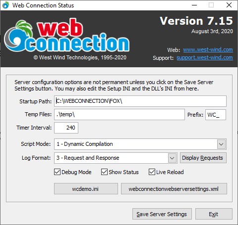
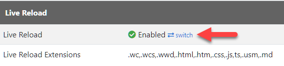
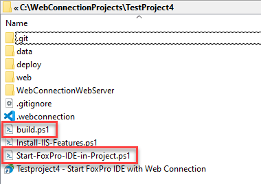

# Web Connection 7.15 Release Notes

We've just released an update to Web Connection. Version 7.15 is a maintenance release that brings a handful of new features and fixes a few small issues. The changes in this release center around logging improvements with a new way to specify log formats and a new Request Viewer that makes it easier to examine requests while debugging applications.

### Log Format Changes
Web Connection's logging infrastructure dates back to the very beginning of Web Connection 25 years ago. If logging is turned on Web Connection logs request into a log table that holds log information. In the past the information captured in the log table was pretty sparse, initially supporting only the request basics: The URL, IP Address, Referring URL etc. Back in the beginning no request data was captured. Sometime much later a second mode was added - via a compiler switch - that allowed for more extensive logging that would capture the entire request. Even then that log format did not capture the response.

In addition to logging Web Connection also has supported **Save Request Files** which captures the complete **last request** in a couple of text files. You could look at the last - and only the last request - by using the **Display Request** button on the status form.

With this release these two features now have merged into one. Specifically the two old settings, the  `WWC_EXTENDED_LOGGING_FORMAT` compiler switch and the `SaveRequestFiles` configuration swich have now migrated to a single setting called `LogFormat` (in `MyApp.ini`) which can be accessed via `Server.oConfig.nLogFormat`.

LogFormat supports the following values now:

- **0 - No Logging** - No log data is generated except on errors
- **1 - Minimal Request** - Only the request URL is logged
- **2 - Full Request** - The URL and Server Variables and Form Data is logged
- **3 - Request and Response** - The Url, Server Variables and Form Data and the Response is logged

The setting can be set in `MyApp.ini`, in code or via the updated Server UI:

This means the setting can now be changed at runtime for a server instance or with a restart for all instances after saving in the `MyApp.ini` file. This is obviously a lot more flexible than the old compiler switch which at the time was implemented as an after thought and done that way to prevent any breaking changes. But it was obviously not very flexible as changing the limited log format.

The old **Save Request Files** checkbox and **Display Request** buttons have been ursurped by this new interface. You can now change the logging format to **3 - Request and Response** and be able to capture all requests with this info and you can look at the last few requests when clicking on **Display Requests**.

### Updated Request Viewer
When you click on **Display Requests** you get to the updated Request Viewer which lets you look at a specified number of the last requests. Unlike the old **Display Request** behavior you get a list of recent requests to choose from so you're not stuck with just the very last request.

There's a new Request Info page that shows some summary information about the active request. On errors the error information is also displayed.

The other three tabs look pretty much like they did before although there options to open the HTTP response and Formatted Request in external editors for easier reading (for me those open in VS Code which is the default editor for HTML and INI files).

Here's the Response page:

and the Formatted Request Page:

You can now navigate through the old requests. Error requests are flagged with a `*` at the end so you can easily see those with error information displayed on the Request Info tab.

These two changes - the new log format and the new Request viewer - greatly simplify on how you think about logs I hope with a single setting that needs to be updated.

> #### @icon-info-circle  Log Format Recommendations
> Logging request and response data can take enormous amounts of space and very easily overrun FoxPro's file limits especially if you log both request and response. For this reason you need pay attention how much data is getting logged and keep an eye on the log file size. Make sure you either clear the log regularily or back it up if you need to keep log data in the longer term.
>
> In production, it's recommended that you limit your logging to no logging or minimal logging **unless you have a specific need** to look closer at requests due to an application error or security issue that you need to track down. In other words, turn extended logging on when you need it, but don't use it on a regular basis.
> 
> For development on the other hand using full request and response logging is quite useful as it allows you to look at a history of requests easily while you're working on and debugging the application. Just make sure 

### Updated Status Form
While working on the logging improvements the Status form also got some updates. Since the **Save Requests** and **Display Request** buttons where removed the form is a lot simpler now. I've also removed the Clear Log functionality and the old log browser. These items are available via the Web interface and the old form with its ugly browse Window really wasn't very useful anyway as it didn't show all the request data. Some of that slack has been taken up by the Request viewer which provides much more useful request information, but doesn't even try to show the entire log - you pick your snapshot size of the last requests you want to see. 

The new status form looks like this now:

The one new thing (besides the removed options) is the **Live Reload Checkbox** which now lets you visually toggle the server side live reload behavior that triggers Web Connection server restarts when server side source files like `.prg`, `.vcx`, `.ini` are changed. This setting is used in conjunction with the module level **Live Reload Flag** which can be set on the Module Admin Page.

### Live Reload Documentation Updates
Speaking of Live Reload: Live Reload is a newish feature in Web Connection that lets you see markup and code changes updated in the browser **as soon as you you make them** without having to explicitly refresh pages in the browser. This is a relatively new feature in Web Connection (as of 7.10+) and it's something that I continue to highlight because **it's been such a big productivity improvement for the work I do with Web Connection** and think everybody should be taking advantage of it!

I've updated the [Live Reload documentation](https://webconnection.west-wind.com/docs/_5tc1eqg6e.htm) (and [here](https://webconnection.west-wind.com/docs/_5hm1e6kmv.htm)) in the Web Connection docs, and also created a short screen capture video that demonstrates what working with Live Reload looks like in an actual project (this message board in fact):

This walk through demonstrates:

* Web Connection Script page changes (page just reloads)
* CSS Changes (page just reloads)
* FoxPro Server Code Change (server restarts, page reloads)
* Fixing a FoxPro Code Error

Again - it's incredibly productive, so if you're on Web Connection 7.10 or later be sure to check out the live reload functionality.

### Cookie Policy Updates
The last release added a new `wwCookie` class that can be used to set more HTTP Cookie options that was previously possible. This release sets the `SameSite=Strict` policy by default on cookies that are created as that's becoming a requirement for browsers unless an explict server policy is set. SameSite forces cookies to be set for the local site only, so cookies can't be highjacked by iFrames or resource links like images. The browser provides the cookie only to the same site that created the cookie.

This should help with DevTools warnings which show a dire warning that cookies are not same site. In the future these errors will cause cookies to not be set, so this is a vital fix. It's still possible to explicitly specify a different cookie SameSite policy, but it has to be explicitly set.

This change affects both manual cookies you create as well as `wwSession` cookies.

### Fixed: JSON Date Rounding Errors
This release also fixes a small but significant bug with JSON parsing that has been present in `wwJsonSerializer` since the very beginning. This subtle bug showed itself by serializing dates with slightly off values that would not come back the same in Round Trip serialization. It's a very subtle bug because **most** dates work fine, but some dates fail.

IOW, if you serialized some original date values to JSON then deserialized them back into a datetime value the time would be slightly off by one second due to a rounding error. It's an insidious bug that was fixed, and if you're interested in all the nitty gritty details, check out the blog post:

* [FoxPro Date Rounding Errors in COM and .NET](https://www.west-wind.com/wconnect/weblog/ShowEntry.blog?id=961)

### Change over to Build.ps1 from Build.bat for Project Packaging Script
This is a really small change: Updated the Web Connection packaging build script to use Powershell to create a more generic script that is more portable. The build script packages the EXE, INI, dependent DLLs, a cleaned up Web folder (minus compiled files) and the data folder to provide a single zip file. Requires a 7Zip installation.

### Start-FoxPro-IDE-in-Project.ps1 Script 
To make it easier to generically launch the Web Connection development environment for a project the new project now generates a `Start-FoxPro-IDE-in-Project.ps1` Powershell script. This is in addition to the shortcut which also works in the project folder, but breaks if the project is moved. The Powershell script always works as it can use relative paths, rather than the required full paths in the Shortcut. You can just *Run with Powershell* to launch your project in the FoxPro IDE.

Here's what a new project's root folder looks like now:

Notice the `build.ps1` and the `Start-FoxPro-IDE-inProject.ps1` files as well as the shortcut. The short cut is easier as you can just double click it, but it's tied to the specific location where the project was created. If the project gets moved, the shortcut breaks, but the Powershell script still works.

I always recommend using these shortcuts to start as they ensure that the Foxpro paths are set up properly as they insure the `config.fpw` from the `Deploy` folder is used to set paths to the Web Connection libraries and whatever other paths you've set up.

### Breaking Changes in 7.15
There are a couple of small breaking changes in 7.15. They're not really changes, but rather file updates that are required.

* **Must update wwDotnetBridge.dll**  
wwDotnetBridge has some important fixes and a few additional helpers that are used by some of the libraries - specifically `wwJsonSerializer` which break when used with the older DLL.

* **wwRequestLog Structure Changes**   
The `wwRequestLog` has a few changes in fields so if you're using FoxPro tables, **delete the `wwRequestLog` table** and let it recreate. For SQL Server remove the table and use the Console SQL Log Table creation Wizard to let it recreate or use the `Westwind.sql` template script on an existing database.

* **Recommended: Set the `LogFormat`**  
As discussed above the new `LogFormat` property is used to control logging. The default format is `1 - Minimal Request` which is fine. But for development it's often useful to set this to `3 - Request and Response` so you can easily review requests and the output generated while debugging.

### Summary
Overall 7.15 is a minor update. There are no code changes required and the only 'breaking' changes are updates to `wwDotnetBridge.dll` and making sure the `wwRequestLog` table is deleted and recreated with an updated structure.

The new Logging format and Request viewer should make settings much easier to control especially since you can now switch formats simply by setting the LogFormat configuration setting. The new Request Viewer is going to make it much easier to debug requests. I find this feature especially useful for REST services where it's often useful to see exactly what data is incoming from the server.

Enjoy...