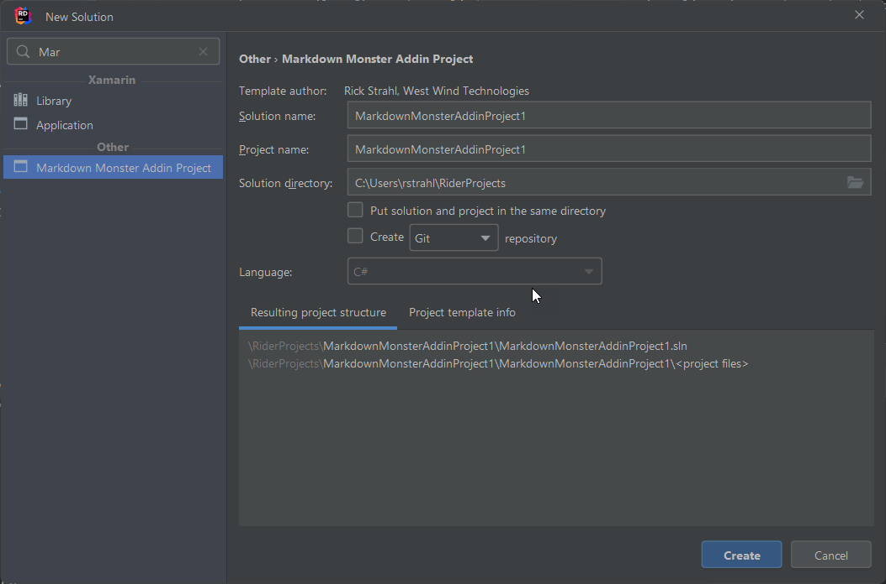

# Creating Custom .NET Project Types with .NET CLI Project Templates


I recently updated my [Visual Studio template for creating Markdown Monster addins](https://marketplace.visualstudio.com/items?itemname=rickstrahl.markdownmonsteraddinproject) in order to support the newer .NET SDK style projects, which are easier to work with and provide a 'ready-to-run' [Markdown Monster Addin project](https://markdownmonster.west-wind.com/docs/_4ne0s0qoi.htm) which was not quite possible with the older project type and a project template.

Visual Studio templates are nice when you're using Visual Studio as you can easily install an extension from the Visual Studio Gallery. Easy, but... these days not every .NET developer is using Visual Studio anymore, even when building a Windows specific solution like a Markdown Monster Addin. 

Creating anything for the Visual Studio Extension system also is a royal pain in the ass: While creating a basic project template is simple enough (you can just export a project to a template), customizing the template to support generic naming and custom output paths and debugging, testing and then wrapping the template into a VSIX in order to publish to the MarketPlace is an exercise in hellish frustration.

## dotnet new: Sanity returns
Thankfully, more recently Microsoft has introduced new project formats and alongside with them a newer and decidedly simpler mechanism for distributing project templates via the `dotnet new` templating experience. The new command line (CLI) tooling that allows performing many tasks like building, restoring, creating, publishing etc. via the `dotnet` CLI is easy and works for any development environment.

Although this tooling was introduced primarily to support .NET Core, you can also use it on full framework projects, as long as the project uses the new .NET SDK format and so it would also work for my Markdown Monster addin project template which requires full .NET Framework 4.7.2.

### Custom Templates
The new project system also supports a straight forward mechanism for creating your own Item or Project templates that work from the command line and therefore can be used with any development environment. It's maybe not quite as smooth as installing an extension from the Visual Studio Marketplace, but command line syntax for installing custom templates and then creating new projects is only a few easily typed commands.

You can also create your own templates and easily publish and share them via NuGet. They are easy to create: You create a template project that contains all the files you want to be contained in your template, and wrap around a project folder hierarchy and add a small metadata file that describes your template.

The wrapped template - or several of them - can then be bundled up into a NuGet package that can be published and shared on the NuGet Repository and can be installed via `dotnet new -i <package-name>`.

While this is process is not vastly different from the process for Visual Studio Templates, the syntax and metadata used, plus the debug and run cycle is much more manageable. For example, you can simply update your template by reinstalling it and re-running the template. Templates can be installed from online NuGet packages, local NuGet packages, or a local folder. This makes it quick and easy to make changes to a template, test it out again and get it perfect.  When done publishing to NuGet for sharing your template with the world is just a few more simple commands away.

## Creating a Project Template
Creating a new project template is pretty straight forward but it does involve a few manual steps of creating folders and creating project and template metadata files. 

At a high level you need to create:

* A top level Template Packaging Project
* A template folder that contains your project files
* A meta data file that describes the template

The top level project acts as the container for one or more templates and is used to package the templates into a NuGet package. The actual template contains all of your files and the metadata file describes the template, and allows you to customize the files with template expansions when the project is created, so you can customize the project name and class and namespaces of the new project.

The explicit steps are a bit more involved as you end up creating a nested folder hierarchy along with some specifically formatted project and meta data files and I'll take you through these steps next.

Here are the specific steps in summary

* Create a working project and make sure it works
* Create a new folder
* Create the top level template container `.csproj` file (paste text from below)
* Inside of the project folder add a `templates` folder
* Inside the `templates` folder create a new folder for your specific template  
(you can create multiple templates into a single template pack)
* Inside of the custom template folder add a `.template.config` folder
* Create a `template.json` that provides template metadata
* Optionally add a square `icon.png` for the icon to display in Visual Studio
* Optionally use `sourceName` to replace file and class names and namespaces

The project structure is always the same save for your custom project files. To make this easier to visualize here's what a typical project layout looks like in this case for my `MarkdownMonsterAddinProject` template:

  
<small>**Figure 1** - A ready to build template project</small>

The root folder holds only the package project and associated icon. The nested `templates` folder holds one or more child project templates that can be packaged into the single NuGet package.

The actual template folder then contains a `.template.config` folder with a `template.json` file that contains the specific template's meta data.

### Creating the Folder Structure
The best way to start is to create the folder structure. To demonstrate, I'm going to go through this with my MarkdownMonster addin so the naming reflects that.

At the top level create a folder that matches your template name - think of that as your 'solution' folder: A container for your template project.  I used `MarkdownMonsterAddinTemplate` for the name. This folder only contains the `.csproj` file and an optional icon for the NuGet package.

### The top level Container Project File
Next we'll need to set up the container project file. This file is mostly generic and can just be copied as it with a few replacements. Its sole purpose is to act as a container of meta data for the NuGet package. This project doesn't have specific information about any of the contained templates.

The content project is a standard SDK project with a `<PackageType>Template</PackageType>` and looks like this:

```xml
<Project Sdk="Microsoft.NET.Sdk">

  <PropertyGroup>
    <PackageType>Template</PackageType>
    <PackageVersion>1.0</PackageVersion>
    <PackageId>MarkdownMonster.AddinProject.Template</PackageId>
    <Title>Markdown Monster Addin Project Template</Title>
    <Authors>Rick Strahl</Authors>
    <Description>Project Template that creates a Markdown Monster Addin that can be customized.</Description>
    <TargetFramework>netstandard2.0</TargetFramework>

    <IncludeContentInPack>true</IncludeContentInPack>
    <IncludeBuildOutput>false</IncludeBuildOutput>
    <ContentTargetFolders>content</ContentTargetFolders>
  </PropertyGroup>
  <PropertyGroup>
    <GeneratePackageOnBuild>True</GeneratePackageOnBuild>
    <PackageOutputPath>./nupkg</PackageOutputPath>    

    <PackageTags>markdown-monster;markdown;wpf;documentation</PackageTags>
    <PackageCopyright>Rick Strahl, West Wind Technologies 2020</PackageCopyright>
    <PackageIcon>icon.png</PackageIcon>
    <PackageProjectUrl>https://github.com/RickStrahl/MarkdownMonsterAddinProjectTemplate</PackageProjectUrl>
  </PropertyGroup>

  <ItemGroup>
    <Content Include="templates\**\*" Exclude="templates\**\bin\**;templates\**\obj\**" />
    <Compile Remove="**\*" />
  </ItemGroup>

  <ItemGroup>
    <None Include="icon.png" Pack="true" PackagePath="" />
  </ItemGroup>

</Project>
```

This is all boilerplate except for the names and icon. This project is a **content project** (`<includeBuildOutput>false</includeBuildOutput>`) that's simply a container for the NuGet package.

The key items that are specific to getting the package built:

* `<PackageType>Template</PackageType>`    
marks this as a template project
* `<GeneratePackageOnBuild>true</GeneratePackageOnBuild>`   
makes sure that `dotnet build` creates a package
* `<PackageOutputPath>.\nupkg</PackageOutput>`  
a specific path where the `.nupkg` is generated


### Setting up the Template Project Folders
Next you need to create the actual Project Template folder that contains one or more projects.

To do this create this folder structure:

```text
MarkdownMonsterAddinTemplate
-- templates
   -- MarkdownMonsterAddinProject
      -- templates
         -- template.json
         -- icon.png
      -- $safeprojectname$.csproj          
      -- Addin.cs
      -- ... more files
```

where `MarkdownMonsterAddinProject` contains your specific project files. The project folder should contain all the files you want to ship with your template. If you look in **Figure 1** you can see I have the required `.csproj` file, a couple of C# files (`Addin.cs` and `AddinConfiguration.cs`) plus a whole bunch of extra related resource files: A couple of images (an icon, screen shot and logo), a custom addin version file and a license file. Anything goes here: I even include binary 7Zip files in there, so that the addin can be packaged into a `.zip` file for publishing in the MM addin repository. All of these files are specific to my custom project type, so your project template is going to look very different than mine here.

You can add multiple project templates here too: You could add another folder at the same level as the `MarkdownMonsterAddinProject` and that project type also installs when the template is installed.

Notice that the project file uses `$safeprojectname$.csproj` for the filename - this is project specific too and that value will be replaced based on a replaceable value that gets created in the `template.json` file described in the next section.

### Create the Meta Data template.json File
Each template includes meta data via a `.templates/template.json` in the template's project folder. `template.json` describes the template and optionally provides for some replacement values you can use to replace values in both the content of text files as well as for file names.

Here's what my `templates.json` looks like:

```json
{
  "$schema": "http://json.schemastore.org/template",
  "author": "Rick Strahl, West Wind Technologies",
  "classifications": ["common", "library", "markdown-monster", "WPF"],
  "identity": "MarkdownMonsterAddin.Project",
  "name": "Markdown Monster Addin Project",
  "shortName": "markdownmonsteraddin", 
  "tags": {
    "language": "C#",
    "type": "project"
  },
  "sourceName": "$safeprojectname$",      // replace w/ project name or -n val
  "defaultName": "MarkdownMonsterAddin"   // Visual Studio default display name
}
```

Most of these are pretty obvious as they describe the template. The `identity` is a unique Id that identifies the addin, but the `shortname` is what displays in the `dotnet new` list of project types - the latter is the one you want to name carefully since that's what end users see.

### Customizing Template Content and File Names with `sourceName` and `symbols`
One thing that almost any generic template has to do, is to customize the name of the of the generated output file names and some of the content for things like class name(s) and namespaces. 

For example, in Markdown Monster's Addin Template I want the main class name to match the name of the project that user selected. If my project's name is `MySweetAddin`,  I want to change the main class name to `public class MySweetAddin` as well as the namespace. I also want the main addin file to be renamed to `MySweetAddin.cs` and the configuration file to `MySweetAddinConfigurat.cs`.

There are two ways you can customize templates using:

* The built-in `sourceName` Property
* The custom `symbols` Collection


#### The `sourceName` Property
```json
"sourceName": "$safeprojectname$";
```

The not so obvious `sourceName` property can be used to replace a token value with the name of the project that is generated when the project is created. 

To keep with the `MySweetAddin` example from before, all instances of text `$safeprojectname$` are replaced with `MySweetAddin` in the content of any of the text files. It also replaces filenames - so `$safeprojectname$.csproj` gets renamed to `MySweetAddin.csproj`, which indirectly controls the name of the output assembly as `MySweetAddin.dll`.

To give you an idea what replacement values in a source file look like here is my `Addin.cs` class file with replacements for `$safeprojectname$`:

  
<small>**Figure 2** - you can replace the project name using the `sourceName` configuration</small>

> **Note:** I'm using `$safeprojectname$` as my replacement value merely out of convenience because that's what the old Visual Studio extension used. The string doesn't have to have the `$` at the beginning and end - it can be any string that gets replaced. Microsoft's examples often use namespaces, but I find that not a good choice because you're likely to use this value for your main class, file name and probably part of the name for secondary files and namespaces. I do recommend you use some sort of delimiter just to make it obvious that you're looking at a replaceable value in your template.


Note that project name used for `sourceName` replacement is **determined by the project name created** with  `dotnet new` or `dotnet new -n <projectName>`:

```ps
# Project name is MySweetAddin based on **source folder**
c:\temp\MySweetAddin> dotnet new

# Project is MySweetAddin via **-n** parameter
c:\temp\projects\test> dotnet new -n MySweetAddin
```

#### Custom Symbol Mappings
The `sourceName` property is most likely all that you need, but if you need to pass additional parameters for expansion or behavior you can do so via the `symbols` setting. This key is a collection of 'parameters' that can be applied as replacement values similar to the way that `sourceName` works, except that you get to specify the names.

Here's a custom `-c|--company` parameter you can pass for example:

```json
"symbols": {
    "company": {
      "type": "parameter",
      "defaultValue": "Your Company",
      "replaces": "$company$"
    }
  }
```

This replaces any occurrence of `$company$` with whatever is passed via the `-c` command line:

```ps
dotnet new markdownmonsteraddin -c "West Wind Technologies"
```

In the example below the `$company$` value in the `author` key is replaced with `West Wind Technologies`.

```json
{
  "id": "$safeprojectname$",
  "name": "$safeprojectname$",
  "summary": "Description of $safeprojectname$ in a short paragraph",
  "description": "Describe $safeprojectname$ with a long description",    
  "version": "0.01",
  "minVersion": "1.70",
  
  "author": "© $company$",   // <---- Company replaced with West Wind Technologies
  
  "updated": "2020-10-01T12:00:00Z"
}
```

Now we have all the bits and pieces in place and we should be able to build our new project.

## Building and Publishing the Project
To build a project is very simple now. From the root project's folder (or from within Visual Studio or other IDE) just build your project:

```ps
dotnet build
```

This creates a NuGet Package in the `.\nupkg` folder (or whatever you specified as your output folder) that you can distribute. But... before you do that you probably want to test the project and see how it works. Once you install, most likely you'll discover a few things that aren't set up quite right and you'll go back and forth a few times fixing small issues with your template to get it just right.

### Trying out your Template Locally
The good news is that unlike Visual Studio extensions it's super easy to install, update and uninstall project/item templates using the `dotnet new` command. 

You can also install your project template from:

* **A NuGet package from NuGet.org**  
`dotnet new -i <package-id>`
* **A local NuGet Package from a folder**  
`dotnet new -i <path-to-nuget-package>`
* **A Project Folder**  
`dotnet new -i <path-to-project-template-folder>`

For initial testing the easiest is usually to use your project template folder, which in my example here is the path to the `MarkdownMonsterAddinProject` folder in **Figure 1**.

To test the addin:

```ps
# Install template from local folder
dotnet new -i "<project-path>\templates\MarkdownMonsterAddinProject"

# create a new project folder
md \projects\MySweetAddin
cd \projects\MySweetAddin

# create a new project
dotnet new -n MySweetAddin -c "West Wind Technologies"

# Open project in IDE (VS Code here, but you can use Visual Studio)
code .
```

If you install your template and you find out that it's not working quite right, you can simply fix the template in your project and then re-run the `dotnet new -i` command to re-install the template from the folder. You can then simply delete the contents of the generated project folder and re-run the install:

```ps
# assuming you're still in the MySweetAddin folder
remove-item *.* -f -recurse

# reinstall the template
dotnet new -i "<project-path>\templates\MarkdownMonsterAddinProject"

# create the project again
dotnet new -n MySweetAddin -c "West Wind Technologies"
code .
```

Rinse and repeat until you get it right!

### Building the NuGet Package
Once you have the project template working the way you want it you can package it up and create a NuGet package and optionally publish it on NuGet.org.

```ps
# From the top level Project Folder
dotnet build -c Release
```

Here's what the NuGet package looks like in the excellent [Package Explorer](https://github.com/NuGetPackageExplorer/NuGetPackageExplorer) tool:

  
<small>**Figure 3** - The compiled template as a NuGet package in NuGet Package Explorer</small>

### Publishing to NuGet
If you want to share your project template you can build the NuGet package and push it to NuGet. To do this you can use the Package Explorer and simply click on the Publish button after you've set up your NuGet account and have configured your NuGet Publish Id.

Alternately you can use a publish script like this:

```ps
if (test-path ./nupkg) {
    remove-item ./nupkg -Force -Recurse
}   

dotnet build -c Release

$filename = gci "./nupkg/*.nupkg" | sort LastWriteTime | select -last 1 | select -ExpandProperty "Name"
$len = $filename.length

if ($len -gt 0) {
    Write-Host "Signing... $filename"
    nuget sign  ".\nupkg\$filename"   -CertificateSubject "West Wind Technologies" -timestamper " http://timestamp.comodoca.com"
       
    # nuget setapikey <key> -source nuget.org
       
    nuget push  ".\nupkg\$filename" -source nuget.org
}
```

Here's the package, published on NuGet:

  
<small>**Figure 4** - The published package on NuGet</small>

### Installing and Running from NuGet
Once the package has been published you can now install it from NuGet.org by simply running:

```ps
# install/update the project template
dotnet new -i MarkdownMonster.AddinProject.Template

# Create the new project
md \projects\MySweetAddin
cd \projects\MySweetAddin
dotnet new markdownmonsteraddin -n MySweetAddin -c "West Wind Technologies"

# Open in editor
code .

# should just work!
dotnet build -c Release

# Run Markdown Monster with the addin installed
mm
```

If all went well and I did my job testing, the project should just compile and in this case just run. And sure enough, here's what it looks like installing and running the addin:

  
<small>**Figure 5** - Putting it all together: Installing, creating, building and running the project template</small>

Cool. One nice thing about the new .NET SDK templates is that they can be customized easily to work generically so I've been able to make this template work so it installs the addin in the default addin location and 'just works out of the box'. 

Sweet!

### What about Visual Studio?
You can of course also open this generated project in Visual Studio; you don't need to compile or run from the command line as I'm doing here. 

To open the project in Visual Studio:

* Open the project folder
* Click on the `.csproj` file
* Save a solution file

Here's what the generated folder and Visual Studio look like when the project is loaded there:

  
<small>**Figure 6** - Opening the new project in Visual Studio</small>


## Visual Studio Extension or Dotnet New Template
In this article I've gone into detail on how to create a project template with the `dotnet new` SDK tooling and it's pretty easy to create these templates. Compared to creating a Visual Studio addin the process of the project template creation is much simpler and much more maintainable. It's easier to create the templates, much, much easier to test and update them, and the format layouts are straight-forward so that coming back to them after a few months won't be a shock. By comparison Visual Studio Project Template Extensions are a bit painful, especially the VSIX creation process.

The big benefit of a Visual Studio Extension is discoverability and ease of installation in Visual Studio. Using the Visual Studio Marketplace is very easy and quick - although you do have to restart Visual Studio these days to install new extensions.

dotnet new templates unfortunately do not show up in Visual Studio's New Project dialog (yet), so you're pretty much relegated to using the `dotnet new` command line to create projects. Since that's a one time deal that's probably not a big deal. 

On the plus side, unlike Visual Studio project templates, you can use `dotnet new` templates for any other IDE, so they work with Visual Studio, Rider and any OmniSharp based environment. 

For example, [JetBrains Rider](https://www.jetbrains.com/rider/) picks up my new template in the **New Solution** dialog:

  
<small>**Figure 7** - JetBrains Rider shows `dotnet new` templates in its *New Solution* dialog</small>

### Dotnet New Templates in Visual Studio
`dotnet new` installed templates are also available in Visual Studio, but they don't show up in the Extensions Manager, so you have to know what you're looking for to use it by searching for the project type.

  
<small>**Figure 8** - Selecting a dotnet new template is still a bit rough</small>

This dialog has seen a lot of improvements since I originally wrote this post. Now you can:

* Add an icon `icon.png` in the `templates.config` folder to show an icon
* Parameters are now prompted for

In short you can easily use the template in Visual Studio, but you have to know how it's there as there's no UI to discover installed templates.

## Summary
Creating project templates can be very productive for certain scenarios. In my scenario of allowing users to easily create new Addins for Markdown Monster, I certainly want to make that process as easy as possible. Nothing sucks more than trying to get stuck before you ever get your first bit of code to run. Project templates make it possible to create a new project that's ready to run with just a few dotnet CLI commands which is awesome.

Compared to the Visual Studio project template and VSIX process, the new `dotnet new` template based approach is much simpler, works with any type of development IDE and is much more flexible in terms of maintaining the template. It's also vastly easier to test, debug and rebuild templates during the template creation process.

For the time being I'll publish both project templates for the Visual Studio VSIX and the `dotnet new tooling`. I'm curious what people prefer. I suspect anybody using Visual Studio probably would prefer the Extension manager for installation over jumping out to the command line, but even if you do, it's literally 2 short CLI commands to create a new project which is hardly difficult. 

I think going forward, the .NET Template system is going to be the way to go, but for the time being I guess I'll have both the Visual Studio Extension and the `dotnet new` template in place. At least until MS breaks VSIX again. :smile:

## Resources

* [Official Microsoft .NET CLI Project Template Documentation](https://docs.microsoft.com/en-us/dotnet/core/tutorials/cli-templates-create-project-template)
* [.NET CLI Project Guidelines for Visual Studio display](https://github.com/sayedihashimi/template-sample)
* [Markdown Monster Addin Project Template on GitHub](https://github.com/RickStrahl/MarkdownMonsterAddinProjectTemplate/tree/master/DotnetNewTemplate)
* [Markdown Monster Addin .NET CLI Project Template on NuGet](https://www.nuget.org/packages/MarkdownMonster.AddinProject.Template/)
* [Creating Markdown Monster Addins Documentation](https://markdownmonster.west-wind.com/docs/_4ne0s0qoi.htm)
* [Sayed Hasimi's updated dotnet tool Guidance](https://github.com/sayedihashimi/template-sample)

<div style="margin-top: 30px;font-size: 0.8em;
            border-top: 1px solid #eee;padding-top: 8px;">
    
    this post created and published with the 
    <a href="https://markdownmonster.west-wind.com" 
       target="top">Markdown Monster Editor</a> 
</div>