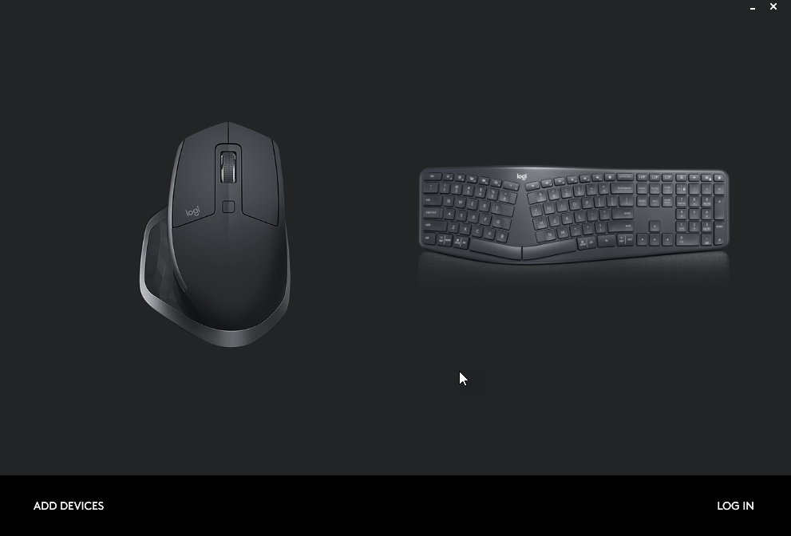

# PC and Mac with single Mouse and Keyboard Setup on Dual 4k Screens

A little while back I posted a couple of pictures of my new desk setup using both a Windows Laptop (a 2019 Dell XPS) and a Macbook Pro (2016) along with two 4k displays. I'm also using a single Logitech Mouse and Keyboard combination to control both machines and quite a few people were asking about how this works. So I decided to write a quick review of my setup here to give a few more details that are hard to give in a Twitter conversation.

## Living in Windows and Mac
I have several machines that I use including my main Dell and Mac laptops. There's another low end Windows Laptop and a [Dell NUC device](https://amzn.to/2H9c7tQ) I run a dedicated Linux instance on.

I use the Mac for a few things on a regular basis. I record music frequently and often using Logic Pro X on the Mac. I also use the Mac for any mobile development that involves iOS, since it's simply easier to do that natively on the Mac than using some sort of Windows to Mac or iOS bridge. And more recently just to get out of the comfort zone I've decided to just use the Mac for regular .NET development as well, just to do something a little different.

## One Screen for each Machine 
A few weeks ago I decided that between all of these machines that I have and use it's probably a good idea to have a second monitor for these other non-primary devices. While the Mac certainly has a decent laptop screen, switching from my Windows 40" 4K display to a MacBook screen is quite a shock. And the Linux NUC of course doesn't have a screen at all so in the past I had to swap cables which is a pain in the ass.

I have had a [Philips 40" 4k Screen](https://weblog.west-wind.com/posts/2015/Nov/23/Going-Big-40-Glorious-inches-of-4k-with-the-Philips-BDM4065UC) since 2015 and it's one of the best tech investements in terms of utility. Being able to run **4K at 100% resolution** was a game changer in terms of screen real estate for so many things. Development obviously as any sort of dev environment regardless of Web or Desktop requires running so many different applications at the same time. Especially in these days of using Live Reload having browser, debug tools as well as a development environment with your server side code open and being able to see it all on a single screen is awesome.

Another awesome use of a 4K screen at 100% is using audio recording software as I often do. Check out this Audio DAW setup (using the now free [Cakewalk on Windows by BandLab](https://www.bandlab.com/products/cakewalk) in this case):

I can see 15 tracks plus the mixing console, including expanded panels, and even one or two effects plugins at the same time. This is pretty awesome especially when mixing down songs.

## Another 4k Screen
So I decided to finally give in and buy another 4K screen and I decided on buying a slightly smaller 32" screen instead of another 40 incher.  I picked up a [LG 32" 4K screen (32UL500-W)](https://amzn.to/3iX7IYg) from Amazon and hooked that up to the Mac and it works great there.  

Why 32" instead of 40"? **40 inches is perfect size** for me to use at 100% in terms of readability, but the large size of the screen is massive, both vertically and horizontally. Viewing the far left and right edges of the screen requires slight physical movement. So for the second screen I opted for a smaller screen to keep the field of vision a little more focused.

On the Mac this works just fine as the Mac's scaling using the smallest scale factor is still quite readable at 100%.

Here's Logic Pro X on the Mac with another audio project:

Lots of space there too.

Hooking up the monitor to Windows at 100% resolution text is borderline too small for me. It still works for me at 100%, but I definitely would want to bump document font sizes by a point or two for anything I spend a lot of time working on (ie. code or writing).

The LG is 5 years newer than the old Phillips and it shows. The color profile is nicer on the LG and the screen does a much better job syncing with any of the computers I threw at it - the Phillips can often take a few seconds trying to sync the signal while jumping around a bit.

I like the overall size of the 32" screen: Although definitely a little more cramped for size, the full size of the entire monitor definitely fits better into my field of view without having to move around physically, which is a bonus. Thinking about getting another one to replace the 40" screen eventually.

## Two is better than One
Ok, so I now have two screens and the setup looks something like this:

Both the Dell and Mac can be active at the same time. 

Originally I started out with two sets of Keyboards and Mouse. But it turns out there's actually a very nice way to use a single keyboard and mouse combo to control both machines.

## Logitech MX Master Mouse and Ergo Keyboard
At the same time that I bought the monitor I also picked up a new [Logitech Ergo K860 Keyboard](https://amzn.to/353KHOj) which unfortunately had been out of stock in most places so it took a while to get here so I was stuck with the dual keyboard/mouse setup which takes up a ton of deskspace.

I've already had the awesome [Logitech MX Master 2 mouse](https://amzn.to/351RIiO) (there's a [newer MX 3](https://amzn.to/2SYnWFR) out now) for some time. Great mouse.

## LogiTech Flow - Flow Mouse and Desktop across Machines
What's cool about these two devices is that you can use them on multiple machines easily. Both support Logitech software that lets you share a single unified USB adapter (or bluetooth) for both the keyboard and mouse. You can use a unifying adapter on both the PC and Mac and hook up to the same keyboard.

That alone lets me use the same keyboard and mouse on both machines.

But Logitech does one better: Using it's Flow software that you can use on Windows and Mac you can configure each device with an 'id' that you can use to switch the keyboard to work on each id. There physical buttons on the keyboard, and buttons on the button of the mouse that let you do this manually. I can basically set up each computer with its own numeric ID and then press the appropriate button to switch.

Here's the keyboard setup that lets you assign each machine to one of three numbers that map the buttons on the keyboard and mouse:

You basically configure each machine with its own id and at this point you can manually switch between them.

## Logitech Flow - Move the Cursor to Switch
But even better on the mouse you can configure **Easy Flow** which uses a software daemon to running on each connected machine. The daemon allows passing control to another machine by using software to automatically switch the active device Id buttons.

Once this software is configured on both machines you can now use the mouse to simply drag your mouse cursor across two (or more) screens to switch focus to the other machine!

I set mine up so it requires **Ctrl-Drag** rather than just dragging, because plain dragging caused to many false moves to the wrong machine when I didn't intend to. So now when I switch I simple drag the mouse with **Ctrl-Drag** onto the other screen to switch the keyboard and moust inputs.

How cool is that?

> In order for this to work both machines have to the on the same network - ie. the same WiFi network, or same wired connection.

The flow software has a few other cool tricks: It can also copy the clipboard from one machine to another. So I can paste something onto the Clipboard on Windows, drag my mouse cursor to the Mac and then pick up that same clipboard content on the Mac.

That's super useful, especially if you're going back and forth a lot as I do quite frequently.

## Other Solutions
There are other solutions for the multi-device keyboard and mouse usage. There are physical KVM switches as well as software solutions. I've used physical KVM switches in the past, and one advantage they can have is that you can also use a single monitor - if you get one that works with the resolution you use. My experience with KVM switches in the past has been dismal and it looks if you want to use it for 4k screens in particular the choices are both very limited and expensive.

Several people pointed out software solutions as well. 

There's also [Synergy](https://symless.com/synergy), which is similar to what the Easy Flow Logitech software does, but it's standalone so you're not bound by specific hardware. I've used this in the past and it works well too, but for me it's been a while. One advantage is that the software explicitly works with Linux, so if Linux is part of your machine cadre, Synergy might be a better choice then the Easy Flow software.

If you need to use mouse and keyboard with multiple Windows machines only, then [Mouse without Borders](https://www.microsoft.com/en-us/garage/wall-of-fame/mouse-without-borders/) from Microsoft Garage is an easy and free solution.   

## A few thoughts on the Logictech Ergo K860
I've been a long time user of a Microsoft Natural Ergonomic 4000 keyboard which looks like it's been discontinued by MS now. There's a successor in the [Microsoft Ergonomic Keyboard](https://amzn.to/31fMM8P), but judging from the reviews it's not a great follow up. My main beef with the 4000 over the years has been durability - due to the high humidity here in Hawaii, plus fairly hot, the keyboard palm rest starts flaking off the cheap paint. Also keys on that keyboard seem to either start popping off, or start getting less responsive after a time - max life I can get out of those keyboards has been ~2 years before they become unusable. I have a closet full of old ones that are starting to go :smile:

I've been looking at the [Logitec Ergo K860](https://amzn.to/3dAxYqj) for a couple of years, but at $125 it's a pricey bugger. Reviews for those coming from the Microsoft Natural 4000 were also mixed, so I was hesitant. The final trigger though that pushed me over the edge to give this keyboard a try has been the promise of having a single keyboard to control multiple machines. When I decided to get the second 4k Monitor the keyboard choice kind of made itself.

And that very feature alone is probably worth the price of admission to me, as it's made the transition between my two machines nearly seamless, which is a big timesaver.

Here's what the keyboard layout looks like:

The keyboard mostly does the right things for the layout. My main beef is that compared to the 4000 the various keyboard sections are really cramped together which causes me a lot of fat fingering the wrong support keys. Switching from the 4000 has not been very smooth for me. In fact, even now three weeks later I keep hitting the PrintScreen or Insert keys which sit next to the Back button. 

I expect at some point perhaps I'll get past this, but in the meantime I've used the Logitec Options software to disable the PrintScreen and Insert keys - take that!

The keyboard itself feels nice to type on. It's comfortable and the key travel is pretty nice for a butterfly style keyboard. It's not mechanical feeling like the 4000, but I think I actually prefer that. 

There are a few oddities with this keyboard: The function keys are kind of funky in that the split is the F6 key instead of the more traditional F5 key at the end of the first section, but that's easy to get used to.

The only beef I have really is that the various key sections are too close together and I'm fat fingering into the arrow or operational key clusters a lot more often. Still muscle memory from years on the 4000 I guess.

But otherwise I think this keyboard is a big win for me, and especially the Flow software part is awesome. Even without the flow across functionality on Linux - manually pressing the device buttons on the keyboard and mouse is easy enough.

## Summary
This has been a great setup so far. I've been running with it for almost a month and this is the first time I actually use the Mac a lot more for just regular day to day work. Because I can quickly jump back and forth on these machines and even copy text and images back and forth it almost feels like a single computer I'm working with.

Note: while the keyboard and mouse works on Ubuntu, the flow software doesn't exist there so on Linux you have to manually switch using the hardware id buttons. If Linux is one of your machines in a dual machine setup you'll want to do some more research before picking up the pricey mouse and keyboard combo for multi-device use. 

## Hardware

* [LG 32" 4K screen](https://amzn.to/3iX7IYg)
* [MX Master Mouse](https://amzn.to/3D3Nh74)
* [Logitech Ergo K860](https://amzn.to/353KHOj)
* [Dell NUC (NUC8i5BEH)](https://amzn.to/2H9c7tQ)
* [Synergy](https://symless.com/synergy)
* [Mouse without Border](https://www.microsoft.com/en-us/garage/wall-of-fame/mouse-without-borders/)