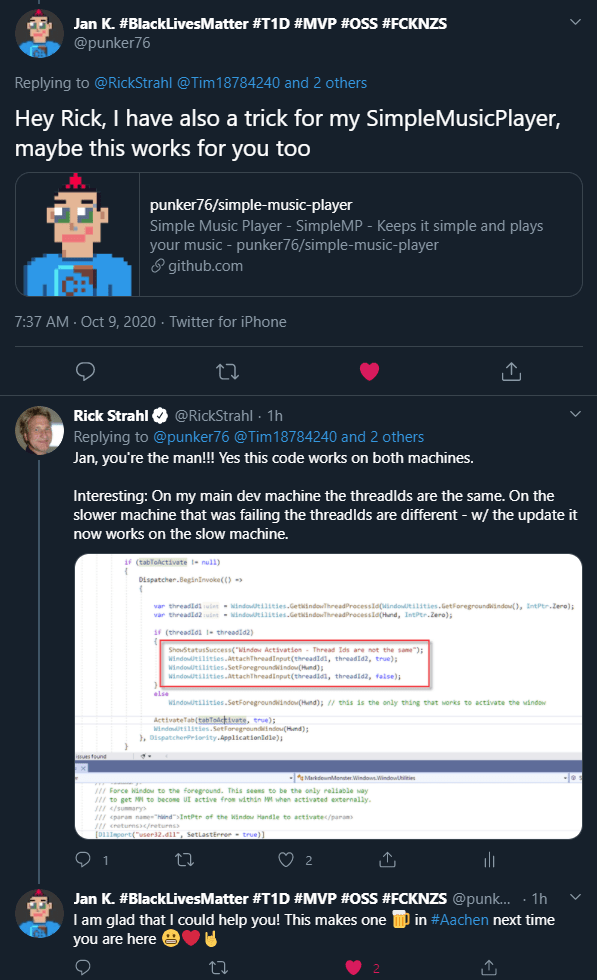

# Window Activation Headaches in WPF


A few days ago an [issue came up in the Markdown Monster repository](https://github.com/RickStrahl/MarkdownMonster/issues/705) on what I at first thought was an odd bug report, stating that Markdown Monster wouldn't activate properly when opening files from Explorer. More specifically, [Markdown Monster](https://markdownmonster.west-wind.com) typically runs as a singleton application where a single instance hosts many documents, and the specific issue was that opening a new document from Explorer or the Shell would not properly focus the editor on the new document when MM was already running.

I had never noticed this problem, since I tend to use the Folder Browser to open windows, or in many instances actually use the mouse to open and implicitly focus the window before starting to type. If I'm already using a mouse it feels natural to click into the editor, so I totally missed this incorrect behavior.

So, I ended up experimenting and sure enough the bug report was totally valid - any activation from Explorer with the keyboard or mouse would activate MM, and although the MM window would pop to the top and the cursor properly shows up in the editor, the editor actually didn't have focus. Instead **any keystrokes typed ended up going into Explorer** not into the editor! Yikes.

## Activating and Focusing a Form in WPF
Focusing a WPF form shouldn't be difficult, but it turns out that in some scenarios, where the active application needs to bring itself into top level focus when it's not already active is a bit tricky.

In the above bug report the first thing I noticed in my own code is that I didn't actually have activation code. I used focus on the editor only, but I didn't activate the window. So, I added the following:

```cs
Dispatcher.InvokeAsync(()=> { 
    // added these
    Activate();
    Focus();
       
    // this sets focus to the editor
    ActivateTab(tabToActivate, setFocus: true);
}, DispatcherPriority.ApplicationIdle);
```

These are the typical commands you'd use to focus and activate the window, plus focus a specific control (which happens in `ActivateTab()` which sets focus to the content in the WebBrowser control).

Unfortunately that code turned out to **do a whole lot of nothing** when Markdown Monster is already running and a document is loaded from Explorer or the Shell. The behavior didn't change - MM comes to the top, editor looks focused, but keyboard input doesn't go into MM. Crap - no low hanging fruit here.

## Activation Complication
Markdown Monster happens to have a fairly complex activation scheme because it is singleton application. Documents launched from the shell first launch the `MarkdownMonster.exe`, but if an instance is already running it forwards the command arguments - via named pipes - to the already running MM instance and the new instance immediately exits after sending the arguments.

The already running instance runs a named pipe server listening for messages which are received on a separate thread, which then calls the same command line opening logic that's used when launching an initial MM instance. The difference is that the named pipe call originates on a different, non-UI thread, which is marshaled through a `Dispatcher` which in theory should alleviate any threading issues. 

It turns out the Dispatcher marshaling is not entirely doing what it's supposed to. More on that in a minute, but first I had to isolate the problem.

There are two issues here: The indirect invocation runs into Windows issues of 'focus-stealing' because the app being activated through the shell is not the one that's actually setting the focus. So while a newly launched instance of MM works correctly (same exe as launched from shell), the forwarded call to the existing instance (not the same exe launched from shell) does not.

The other issue is that although the code in the existing instance gets fired and I am using a Dispatcher, the Dispatcher is not completely marshaling the entire Windows execution context to properly activate the window.

## Baseline - Checking basic Behavior
Because of the activation complexities in MM, I set up a clean WPF test application with a timer - which also fires events on separate threads to see if that would properly activate a control:

```csharp
public partial class MainWindow : Window
{
    private Timer timer;

    public MainWindow()
    {
        InitializeComponent();

        // set text to hwnd so we can copy it
        txtHwnd.Text = new WindowInteropHelper(this).EnsureHandle().ToString("x");

        timer = new Timer((p) =>
        {
            Dispatcher.Invoke(() =>
            {
                Activate();
                Focus();
                txtHwnd.Focus();
            });
        },null, 10000, 10000);
    }
}
```

Based on what I saw in my MM code, I didn't expect this to work, **but surprisingly that works just fine**. I can see the test window activating every 10 seconds and any input typed then goes into the text box as I would have expected even if I focus some other window before the timer tick.

So it works in this simple scenario, but in MM - not so much. 

Yup - clear as mud.

## Take 1 - Using SetForegroundWindow()
After trying a lot of different combinations of `Activate()`, `Focus()`, various `Dispatcher` nesting modes, I found  that **nothing WPF native worked** to bring MM to the front and get it focused. To even get it to the front I had use `Topmost` setting it to `true` and then turning it off with a `Dispatcher` in a separate cycle. And even with that I **still would get no focus** on the window. Yuk!

Desperate I decided to use Windows API calls instead. To be sure I tested this out in [LinqPad](https://www.linqpad.net/) first: 

```cs
void Main()
{
	var hwnd = FindWindow(IntPtr.Zero,"WindowActivationHeadachesInWpf.md  - Markdown Monster 1.24.10.10 ");
	hwnd.Dump();  // make sure we got a match
	SetForegroundWindow(hwnd);
}

[DllImport("user32.dll", SetLastError = true)]
public static extern IntPtr SetForegroundWindow(IntPtr hWnd);

[DllImport("user32.dll", EntryPoint = "FindWindow", SetLastError = true)]
public static extern IntPtr FindWindow(IntPtr ZeroOnly, string lpWindowName);
```

and that worked! Using the code in LinqPad I was able to activate MM and get the cursor focus into the editor. Promising!

So then I plugged that code into my `Dispatcher` call:

```cs
if (tabToActivate != null)
{
    Dispatcher.InvokeAsync(() =>
    {
        WindowUtilities.SetForegroundWindow(IntPtr.Zero, Hwnd);
        ActivateTab(tabToActivate, true);
    }, DispatcherPriority.ApplicationIdle);
}
```

...and **surprisingly that too worked**. Problem solved, right?

## Not so fast: Works on My Machine!
Although the `SetForegroundWindow()` code worked on my machine, it turns out the customer that submitted the original bug report tried it and it didn't work for him.

So we went back and forth - I took a screen cast to show it working. He took a screen cast showing it **not** working. I tried it on my 3 machines in my office. End Result: It worked on 2 of the 3 but the 3rd one **failed consistently** just as the customer had described. Some head scratching ensued. 

Fabulous! Now we have actual machine differences. But what could account for these different behaviors?

## Windows Restrictions on Focus Stealing
In recent versions of Windows, Microsoft has added a 'feature' that disables windows from stealing focus from the active input application. I'd been aware of this but it took me a long while to put this together, because the 'focus stealing' (is it stealing if you steal from yourself?) on my machine wasn't happening. 

It was my one other machine and the customer's machine that didn't work. I also had a couple other people try this out (all developers) and their versions worked. My 1 failing machine is a lowly stock install Windows Home box I use for quick browsing or occasional movie viewing. So I suspect the fact that it works on my machine has something to do with having Windows developer features enabled, or running a beta insider preview perhaps. Heck maybe running as an Administrator vs. regular account might make a difference? Who knows...

In any case, the behavior is very different between the two, and `SetForegroundWindow` on the failing machine is returning an error code of 3 which generally means 'missing file' or 'not available'.

I was ready to give up on making this work...

## Solution: Thread Marshaling and AttachThreadInput
While I was going through all of this I posted a few of my travails on Twitter and several people posted useful suggestions, most of which I had already tried. However, one of them in particular from my good buddy and WPF Wizard [@punker76](https://twitter.com/punker76) of [MahApps.Metro fame](https://mahapps.com/), nailed the problem exactly:



In nutshell [Jan's code](https://github.com/punker76/simple-music-player/blob/1db921b7e1bc825ca88537f597029952339c585c/src/SimpleMusicPlayer/Core/WindowExtensions.cs#L115) checks to see if the window handle of the Window is the same as the active incoming window's handle, and if it's not forces the thread to the current window's thread using an obscure `AttachThreadInput` Windows API function.

I took Jan's code and created a reusable wrapper routine and added it to MM's [WindowUtilities class](https://github.com/RickStrahl/MarkdownMonster/blob/master/MarkdownMonster/Windows/Helpers/WindowUtilities.cs):

```cs
public static class WindowUtilities {
    
/// <summary>
/// Activates a WPF window even if the window is activated on a separate thread
/// </summary>
/// <param name="window"></param>
public static void ActivateWindow(Window window)
{
    var hwnd = WindowInteropHelper(window).EnsureHandle();

    var threadId1 = GetWindowThreadProcessId(GetForegroundWindow(), IntPtr.Zero);
    var threadId2 = GetWindowThreadProcessId(hwnd, IntPtr.Zero);

    if (threadId1 != threadId2)
    {
        AttachThreadInput(threadId1, threadId2, true);
        SetForegroundWindow(hwnd);
        AttachThreadInput(threadId1, threadId2, false);
    }
    else
      SetForegroundWindow(hwnd); 
}

[DllImport("user32.dll", SetLastError = true)]
public static extern IntPtr SetForegroundWindow(IntPtr hWnd);

[DllImport("user32.dll")]
public static extern uint GetWindowThreadProcessId(IntPtr hWnd, IntPtr ProcessId);

[DllImport("user32.dll")]
public static extern bool AttachThreadInput(uint idAttach, uint idAttachTo, bool fAttach);

}
```

Then in Markdown Monster's activation code:

```csharp
if (tabToActivate != null)
{
    Dispatcher.InvokeAsync(() =>
    {
        WindowUtilities.ActivateWindow(this);
        ActivateTab(tabToActivate, true);
    }, DispatcherPriority.ApplicationIdle);
}
```

**And that worked on all machines!**

For kicks I added some debug code when the threadIds don't match in the library code and then ran MM applications on my machine and on the machine that was not working (an older slower laptop). And sure enough: On my dev machine which worked fine before, the thread Ids were the same. But on the slow machine, the thread Ids were different. **By using `AttachThreadInput()`, the window now activates properly**. Yay!

I've never heard of [AttachThreadInput](https://docs.microsoft.com/en-us/windows/win32/api/winuser/nf-winuser-attachthreadinput) before, but apparently it acts like a thread marshaler, attaching one thread's message pump to another's which for reasons that I don't quite understand makes the window Activation work. Apparently this is a known workaround for the Windows 'focus-stealing' restrictions, according to a [Stackoverflow question](https://stackoverflow.com/questions/3772233/win32-setforegroundwindow-unreliable).

Again thanks to Jan for pointing me at this code snippet that ended up saving my day - especially since I was just about to give up on fixing this issue, chalking it up to Windows restrictions folly.

## Summary
Phew. Talk about taking the long way home on this! 

The bottom line is that setting focus to your already running application is not as easy as it looks in some cases where the operation is initiated from the non-Main UI thread. For most basic cases the core `Activate()` and `Focus()` Window methods are probably sufficient. If that doesn't work `SetForegroundWindow()` is more explicit and if your application is launched from some shell operation it'll have the rights to force focus and it will work. 

For those edge cases where the operation is initiated externally and marshaled into your application, the `AttachThreadInput()` solution is the only thing that appears to work. Since the code can be abstracted into a simple reusable function it's probably the one reusable solution you should stick into your UI helper library and use for all window activations.

## Resources

* [WindowUtilities class on GitHub](https://github.com/RickStrahl/MarkdownMonster/blob/master/MarkdownMonster/Windows/Helpers/WindowUtilities.cs)
* [Jan's original code in Simple Music Player](https://github.com/punker76/simple-music-player/blob/1db921b7e1bc825ca88537f597029952339c585c/src/SimpleMusicPlayer/Core/WindowExtensions.cs#L115)
* [AttachThreadInput Win API](https://docs.microsoft.com/en-us/windows/win32/api/winuser/nf-winuser-attachthreadinput)
* [SetForegroundWindow Win API](https://docs.microsoft.com/en-us/windows/win32/api/winuser/nf-winuser-setforegroundwindow)

<div style="margin-top: 30px;font-size: 0.8em;
            border-top: 1px solid #eee;padding-top: 8px;">
    
    this post created and published with the 
    <a href="https://markdownmonster.west-wind.com" 
       target="top">Markdown Monster Editor</a> 
</div>