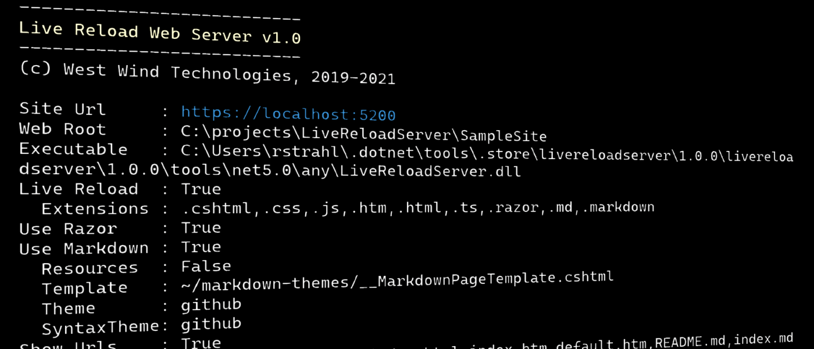
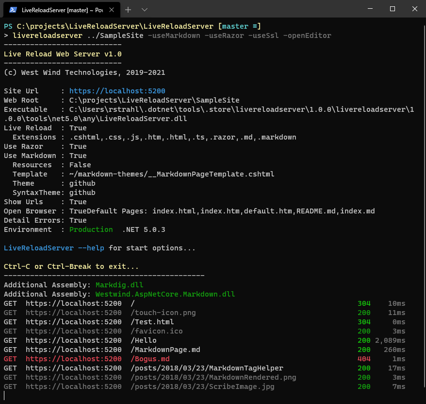

# LiveReloadServer - A .NET Core Based Generic Static Web Server with Live Reload



I just realized that I have never written about my local [Live Reload Web Server](https://github.com/RickStrahl/LiveReloadServer) tool, which is a local .NET Core based Web Server that you can run on your local machine, and which includes a number of very useful features:

* Local Web Server - point at a folder and go
* Built-in optional Live Reload Support
* Support for inline RazorPages
* Support for rendering Markdown Pages with Themes (including inline Razor syntax)
* Web Server Hosting support for WebPages like light sites
* Cross-Platform - Windows, Mac, Linux (using .NET SDK Tool)
* Globally installed and runnable as .NET Tool (cross platform) or Windows Executable

I bring this up now as I'm once again reminded how useful a local Web server is **for a wide variety of usage scenarios**, some of which might be unexpected. I'll get to that later, but for now here are some of the basics of what this server does.

## What is a Local Web Server For?
So why might you need a local Web Server? There are quite a few use cases

### Local Web Site Browsing
If you ever need to check out a Web site locally on your machine and quickly just want to 'run' a bunch of HTML pages or a SPA application without firing up a development environment - that's one use case that a local Web Server addresses. Since the tool is globally installed it's literally one command line command to launch the site and open a browser:

```ps
livereloadserver "~/OneDrive/Web Sites/anti-trust.rocks" -useRazor 
```

and a browser fires up and you're ready to browse the application. As you navigate the site you can see the pages that are hit in the console (optional):



You can point this server at:

* Purely static Web Sites
* SPA applications like an precompiled Angular, VueJs, React, Svelte etc. app
* Documentation sites that use Markdown Pages (with `-useMarkdown` flag)

This is useful if you need to quickly check out a static site or client side Web application. You may not need this everyday, but having a quick way to point at a folder of a site and fire it up in the browser without starting up a Dev environment can be quick and easy.

### LiveReload to Quickly Edit Static Web Sites Interactively
In addition, the server supports **Live Reload** which is great if you need to work on static Web sites. LiveReload detects changes to static files on disk, and when a change is detected automatically refreshes the browser.

This feature is nothing new if you've used client side development tools like the Angular, VueJs, React CLIs. But these tools are full dev environments that require some time to launch and have specific requirements for launching. LiveReloadServer use case involves just running the application quickly without setup - assuming it's self-contained Web content you are accessing.

Personally, I have tons of static Web sites or 'mostly' static Web sites that have a few dynamic features. There are many product Web sites (like https://markdownmonster.west-wind.com or https://anti-trust.rocks) for example. These sites aren't 'applications', but they literally are mostly text based content which are usually published with direct single file deploy to Web sites. IOW, they are very simple sites that are static and for these I don't need a full dev environment. Instead I can run the LiveReload server, plus Visual Studio Code, plus the Deploy addin, make quick changes to one file and immediately re-publish files. It's very quick and iterative.

For me personally this is a very common scenario - I manage around 20 different product Web sites and 90% of these site's content is static pages. I can run these pages with this local server and quickly make changes interactively. 

> To be clear this doesn't replace a full build process like the Angular/VueJs CLI/Web Server, or a server side framework like ASP.NET Core or RazorPages Web app. If you are building full blown applications you want to use the tools that are specifically designed for the framework you're using. But if you are creating what amounts to mostly static Web sites, using full development frameworks is serious overkill and this is where static content with some additional tooling like this LiveReloadServer comes in.

### Inline RazorPages Support and Web Hosting Support
By default the LiveReloadServer works only with static Web content: HTML, CSS, JavaScript text based content which is monitored for changes. 

#### Razor Syntax in .cshtml Files
But, you can also use .NET Code by adding the ability to create and execute RazorPages `.cshtml` pages as part of your Web content. The RazorPages that are loaded through the LiveReloadServer  **have to be self-contained** - they can't reference **source code** from external files as you can with a full ASP.NET Core application. IOW, all `@Razor` expression and block code has to live inside of the `.cshtml` file.

It's also possible to add libraries (as DLLs) by adding .NET Core DLLs into a special folder. LiveReloadServer adds these assemblies when it starts based on the startup path, which can then be referenced in Razor inline code.

Again, this isn't meant to replace a RazorPages ASP.NET Core Web application. While you can build some logic with this approach, I wouldn't go out and build my next Web point of sale application using this technology.

The goal of this Razor integration is to give you access to most of .NET's built features in your Web pages so you can do some simple things like embedding a dynamic date, making an HTTP request to lookup a version number or simply handle server side routing in an application. I'll show some examples of this later.

#### Deployed LiveReloadServer
The Razor support is really useful, but it requires support of a 'runtime' to actually make this work on a Web Server. To that end the LiveReloadServer can also be hosted as an ASP.NET Core server application on a Web site, like IIS.

The same requirements that a 'normal' ASP.NET Core application is required: You still have to have the proper .NET Core Runtime (5.x currently) installed, and you need to install the LiveReloadServer application on your server.

However, once these two requirements are met you can now point **many Web applications** at this simple runtime. IOW I can run my 20 Web sites agains the LiveReloadServer and deploy individual files, rather than installing 20 separate, full Web applications.

#### Addressing ASP.NET Core's Lack of Easy Deployment
So what problem does this solve? 

ASP.NET Core is crazy powerful, but deployment has taken a lot steps backwards in terms of ease of use. Focus in .NET Core's deployment model is purely on DevOps and deploying entire sites, which usually makes sense when you are deploying **Web Site Applications**.

But **Content Web Sites** are an entirely different animal. These sites consist mostly of static content that changes frequently and is often changed in minimal amounts. The last thing I want to do when making a change to my Markdown Monster home page is have to go and fire up a dev environment, build and then push 30mb of static content back to my Web site. Unlike applications, which tend to deploy only code and structured layout rather than content, Content Sites hold the actual site data in files that may or may not live elsewhere. Updating this content one by one is totally reasonable, and ASP.NET Core doesn't address that scenario well today.

So the LiveReloadServer attempts to bring back a simpler model that is just based on adding files to a folder and have it just work. Pages recompile, automatically as they are copied in.

## Markdown Support
Razor Support implies that the server can run .NET code and as an extension of this LiveReloadServer can also serve Markdown files as HTML. This is based on the [Westwind.AspNetCore.Markdown](https://github.com/RickStrahl/Westwind.AspNetCore.Markdown)


## Why another Local Web Server?
There are already many local Web Servers you can use. If you use NodeJs there are literally hundreds of local servers available. It's also not difficult to build a local Web Server quickly either in .NET or with Node.

But I find that quite frequently I need a local Web Server and by building this LiveReload Web Server I was able to package a number of features into a single easy to use and run package.

LiveReloadServer has the following features:

* Point and shoot: Point at a Web Root and go
* http and https support
* Local-only or remote access modes
* Built-in Live Reload for static and dynamic files
* Can serve self-contained Razor Pages
* Can serve Markdown Documents as HTML
* Hostable - can run on live Web site (IIS or other backend)

The server is built using .NET Core and uses .NET Core's hosting model. It's very quick to start and efficiently serves content. It's also possible to host the Web Server inside of a server application like IIS on Windows or something like nginX on Linux.
