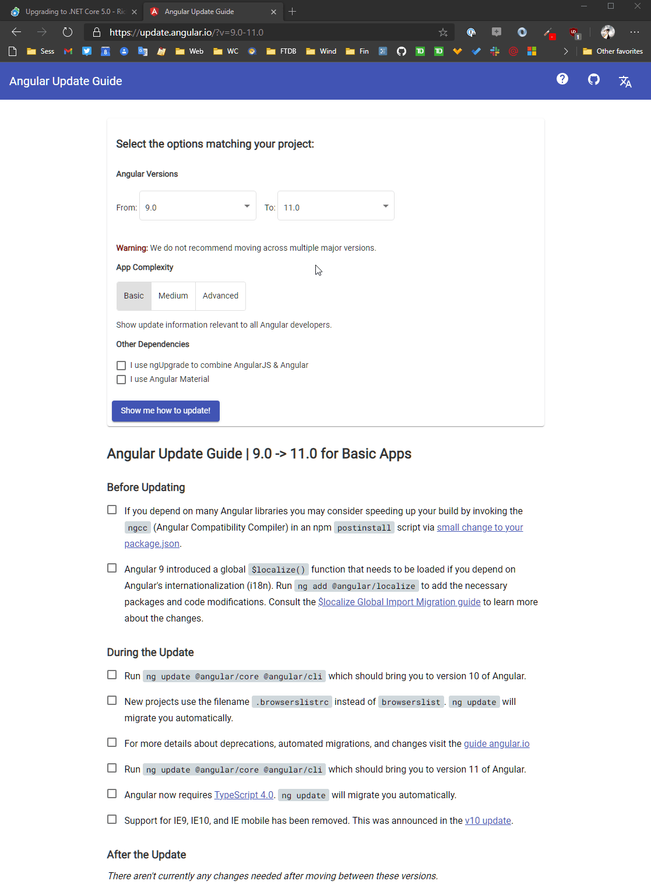

# Upgrading several of my Applications and Libraries to .NET 5.0


After .NET 5.0's release a couple of weeks ago, I went through all of my personal/company .NET Core 3.1 applications and upgraded them to .NET 5.0. In the past upgrades to major versions have been pretty painful or downright torturous, but with this update to .NET 5.0 (note that 5.0 drops the Core moniker) I'm happy to say that it's been the easiest migration of any major .NET version update that I can remember. 

It's not much of a blog post 'cause there's not much to report or much in the way of 'steps' to update :grin:. It just works! But... I'm going to provide some commentary in regards to this welcome change in new distributions.

## Easy Upgrades
All 3 Web applications and several .NET Core libraries updated with no code changes, other than removal of .NET Core 2.x specific code which I decided to stop supporting with these updates. Yeah you read that right: Literally there were no code changes other than changing the runtime targets and updating the Microsoft support libraries!

Check out this change log for my AlbumViewer sample app. It's a smallish app but gives an idea of what it looks like:

* [Update AlbumViewer to .NET 5.0 Changes](https://github.com/RickStrahl/AlbumViewerVNext/commit/14b6b6f9)

The main thing that needs to be changes is the `TargetFramework`:

```xml
<TargetFramework>net5.0</TargetFramework>
```

Plus updating any support libraries from Microsoft to the latest 5.x versions which I typically run through the NuGet Package Update manager.

Unlike previous version updates there were **no type changes** and **no changes to the startup configuration**. In past versions those have been a major points of contention for seemingly senseless name or namespace changes. But **not this time around**: For all of my Web projects **code just worked as is**.

To be clear, this doesn't mean **you** won't see any update requirements in your projects. There are a few things that have changed - .NET Core is a huge framework and there are a few breaking changes. But for common base installations and core features for me at least in 3 separate projects from small to medium large I literally walked off with no code changes which is a breath of fresh air compared to any previous updates I've done with these same applications!

Some of this has to do with the nature of .NET 5.0: .NET 5.0 feels like a consolidation version that consolidates features and framework structures into a more coherent whole and tweaks the core platform for performance. Most of the big framework feature changes happened in .NET Core 3.x and  most of those improvements in 5.0 are backwards compatible or entirely new functionality that don't break existing code. Additionally much of the focus in .NET 5.0 has been on performance enhancements for existing and core framework functionality which is yielding noticeably faster applications at runtime and faster startup times - and for once this is not just on paper as it's really noticeable in my projects in terms of startup and page refresh times. 

Kudos to Microsoft for hitting this upgrade cycle out of the park.  Apparently this was a design goal as hinted at by David Fowler so succinctly in a reply to my Tweet:


Thank you... Thank you very much (in my best Elvis voice).

## Angular 11 Too
Incidentally, the above application is a .NET REST Service fronted by an Angular front end application, and I also updated Angular to version 11 at the same time. As I was doing the .NET Core Update, the Angular 11 update went live exactly at the very minute I pushed my changes. I was literally refreshing the Angular home page and saw the Release Stable Version roll over to 11! What are the chances? Like the .NET Core Update the Angular 11 update also was a no-code-change update that took all of 15 minutes to update and get re-published (most of that was waiting for NPM to install the insane amount of CLI dependencies :angry:)

Kudos to Google to getting this right. To be fair Angular has been easy to update since version 8 for me with their `ng update` tooling making it very efficient to find and update the handful of changes that can't be auto-fixed. Their implementation of the update process is one that more framework vendors should take a close look at because it's a killer feature! I'm no longer afraid to upgrade my Angular apps even if I have to jump up 2 or 3 versions.

## Updates Shouldn't be Painful
Kudos to both Microsoft and Google for putting out new major releases without the upgrade pain. 

Both .NET Core and Angular have had a torturous past with major changes in version upgrades and lots of people - me included - bitching about those changes, especially since a whole lot of them seemed change for change's sake. *Because we can* is not a good strategy for framework design. But it looks like both companies have listened to the feedback and it reflects in the update strategies and again I applaud that. And I hope that more people do that too, to encourage that sort of thinking/planning going forward.

For perspective, in .NET Core every previous major version updates involved hard to track startup changes, arbitrary type-renamings and obsoleting of types that were introduced a mere version before. All of that reeked of bad design and unending pain to developers often taking up hours of time to update even simple applications which required creating new apps and comparing startup code line by line and re-mapping dependencies that had their names or namespaces changed. It was a real shit show and I said so on this blog on many occasions.

Angular has a similar history to that effect, although in Angular most of the painful upgrade changes had more to do with some major architecture changes. The Angular team addressed most of these upgrade types of issues with their phenomenal **Angular Update** (`ng update`) CLI tooling that points out major changes required and can in many cases make those changes for you. 

There's a Web site that shows steps:



and running the `ng update` tooling to update project dependencies and in some cases apply various linting rules to make some of the changes for you so you don't have to manually fix/replace code. 

The last upgrades since version 7 have been relatively quick and friction free although there often are still a handful of things to manually change. The latest Angular 11 update (from v10 in my case) for the above application however was literally a no code change update. Yay!

Here's the Angular 11 update although this commit also has a few small application changes in it:

* [Update AlbumViewer to Angular 11](https://github.com/RickStrahl/AlbumViewerVNext/commit/a17e8657)

## Framework Vendors: Make Upgrade Processing a Feature
The bottom line is that we as developers should hold Framework vendors feet to the fire to continue this sort of upgrade experience. Providing a smooth path to upgrade should be a core requirement for anything but completely new or revamped versions of a framework. 

Upgrades from v1 to v2 should not require endless updates and trying to hunt down arcane changed APIs or different libraries or if that's the case there should at least be very clear documentation or as Angular does some tooling that helps identify the likely update candidates. Angular's update tooling especially is an innovative approach that other vendors should take a very close look at as it provides huge value, especially in a fast changing JavaScript framework environment like Angular where framework updates now come every half a year. Nobody wants to spend a few hours every half year just to get a previously working application running on an updated framework!

## Other .NET Core Updates: Libraries
In addition to the 3 Web applications I updated, I also updated a handful of libraries that are published and shared on NuGet.

The story for those also was an encouraging and familiar one by now: None of the libraries required any code changes, other than changing the target framework and updating the core dependencies.

Here's the update log (with a few very minor additional changes) from my Westwind.AspNetCore.LiveReload component:

[.NET Core Update of Westwind.AspNetCore.LiveReload](https://github.com/RickStrahl/Westwind.AspnetCore.LiveReload/commit/6f55a5c6)

Again, main changes are adding the target framework:

```xml
<TargetFrameworks>net5.0;netcoreapp3.1</TargetFrameworks>
```

Fixing up any framework dependencies to the latest version (in this case there aren't any).
And removing some conditional .NET Core 2.x support.

## Removing Support for .NET Core 2.x
Most of my components are multi-targeted and up until this release I've been using `netcoreapp3.1;netcoreapp2.1` as targets. I've moved up those targets to `net5.0;netcoreapp3.1`. 

As a general rule I've been applying the support-the-last-major-version-with-backwards- compatibility rule. Anything older than 1 prior .NET version people can continue to use the older libraries that were current up to the release of the new one. This kind of matches the .NET Support policy which even now warns you when you target .NET Core 2.2 that this version is no longer supported. Yes - support cycles are getting much shorter than they used to be.

But for me the reason for dropping the .NET Core 2.x support specifically is because I wanted to get rid of the support code required to fix up `IHostingEnvironment` to `IWebHostEnvironment` which was one of those thoughtless type changes that Microsoft threw into the upgrade from 2.x to 3.x. Instead of keeping the base interface Microsoft decided to create brand new types and obsoleting the old type. I've [blogged about this issue](https://weblog.west-wind.com/posts/2020/Feb/26/Working-with-IWebHostEnvironment-and-IHostingEnvironment-in-dual-targeted-NET-Core-Projects) and how to get around it in a few ways.

This ended up resulting in crappy code like this:

```csharp
#if NETCORE2
                var env = provider.GetService<IHostingEnvironment>();
#else
                var env = provider.GetService<IWebHostEnvironment>();
#endif
```

To be fair, `IHostingEnvironment` still works in .NET 5.0 but it generates a warning. The LiveReload component only uses this in a single place, but in several others there are multiple places where this sort of code needs to be applied and it gets ugly quick. The [ previously mentioned post](https://weblog.west-wind.com/posts/2020/Feb/26/Working-with-IWebHostEnvironment-and-IHostingEnvironment-in-dual-targeted-NET-Core-Projects) has a few alternatives that make this cleaner if you have a lot of refs to IWebHostEnvironment but even then that's a pain to support long term.

Long story short I was happy to get rid of this and a couple of other v2 specific bracketed code blocks.

Going forward I'll review how far back framework support will reach. If there are no or  non-impactful changes required to cross-compile it's easy enough to add another target version to the `<TargetFrameworks>` element. I suspect, seeing how this version progressed and how we are getting to be in perhaps a little more stable place with .NET Core runtimes I suspect going forward is going to be much smoother sailing in terms of compatibility. I certainly hope so...

## Related Resources

* [Follow up post on what didn't go right: Watch out for .NET Core Runtime Bitness for IIS Installs](https://weblog.west-wind.com/posts/2020/Nov/25/Watch-out-for-NET-Core-Runtime-Bitness-for-IIS-Installs)

 <div style="margin-top: 30px;font-size: 0.8em;
            border-top: 1px solid #eee;padding-top: 8px;">
    
    this post created and published with the 
    <a href="https://markdownmonster.west-wind.com" 
       target="top">Markdown Monster Editor</a> 
</div>