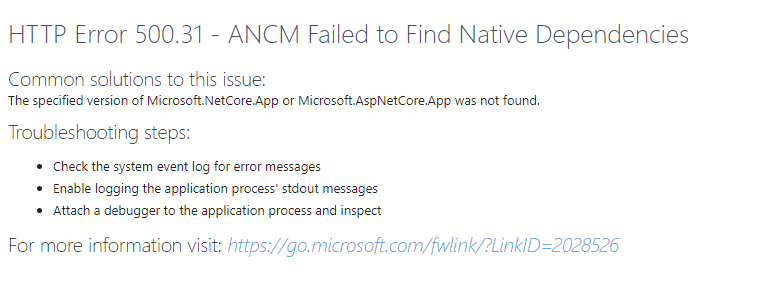
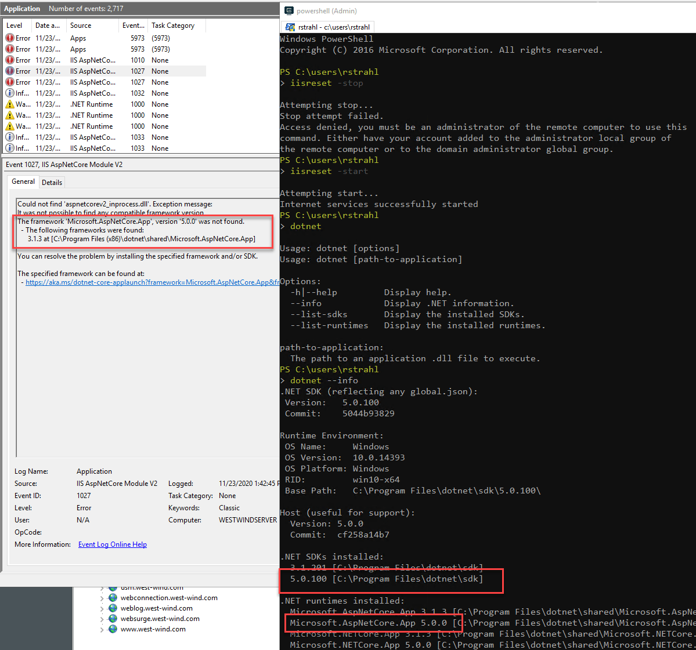
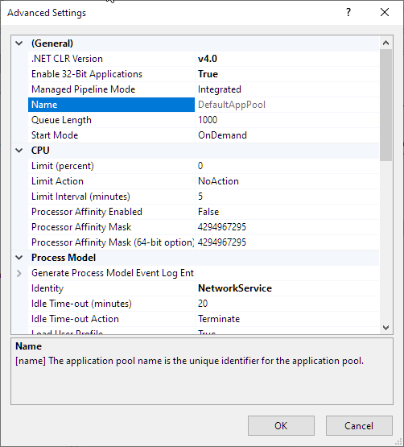
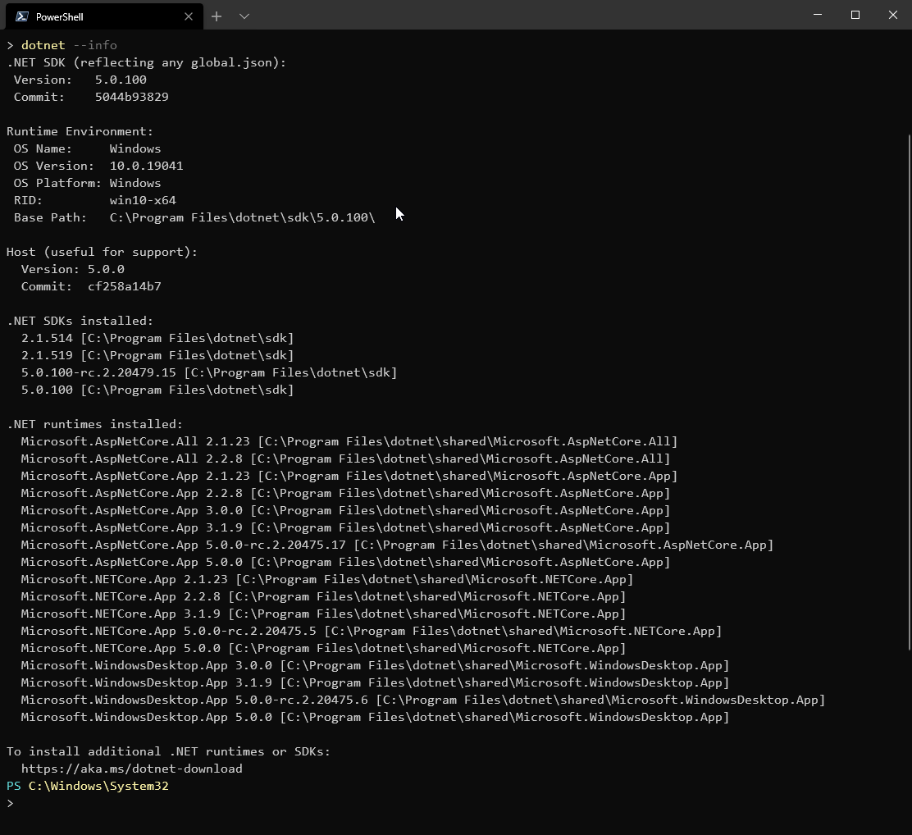

# Updating Watch out for .NET Core Runtime Bitness for IIS Installs


[In my last post](https://weblog.west-wind.com/posts/2020/Nov/24/Upgrading-to-NET-Core-50) I talked about upgrading several .NET Core applications to .NET Core 5.0 and how this process has been super easy and straight forward. I might even go as far as saying it was the easiest migration ever for a major .NET version. In this case coming from .NET Core 3.1,  I upgraded 3 separate Web applications, and got them published to my server with no code changes other than changing the `<TargetFramework>` and updating the Microsoft dependencies to their new .NET 5.0 versions. Pretty cool, how easy that was especially compared to the pain previous updates have been.

To update the applications and run them on my Windows Server, I installed only the .NET Core 5.0 SDK (not the best idea as I'll discuss) and then updated the applications and to my surprise, it all **just worked**. No muss, no fuss.

But... damn it, there always is a Chicken Butt... :grinning:

## Not all Sunshine and Roses: What Runtime?
So yesterday I upgraded another application that's not a 'standard' Web application. It's a generic server application on my live Windows Server based on my [LiveReload Web Server](https://github.com/RickStrahl/LiveReloadServer). Unlike the other applications this is not really a standalone Web application, but more of a Web 'Runtime' that can be used to host multiple Web sites from a single binary server instance installed.

This generic 'Web Runtime' is running on top of .NET Core that powers several separate Web sites from a single binary installation. In a nutshell there's one 'server runtime' install that's used by several Web sites from a single binary install folder. The generic runtime then handles the Web services out of a specific directory and it provides support for Markdown rendering and simple Razor Page Processing from this single generic runtime. The idea is that each Web site only contains content files - static pages, Markdown page and loose Razor Pages -  without having to update binary code on the server. This is a speciality scenario to run many of my mostly static content Web sites that need a few dynamic features.

What's nice about this is that I can treat the site like a static site where **I only update content and never update any binaries** which means I can update files very atomically without having to worry about keeping an application up to date. These site get done and then just run for ages and updates just update simple text content files.

For example, here's my recently published **Anti-Trust Music site** that runs this server runtime:

https://anti-trust.rocks

This has been working great with .NET Core 3.1. It works great for this type of mostly static content that can be updated quickly without having to 'publish an entire application' - in this case the 'application' is basically 2 Web pages with a ton of audio content and various support assets. 

I have several other content sites that use this same engine in a similar way. 

## How it Works and How My .NET 5.0 Install Broke it
For this to work this 'runtime' .NET Core application needs to be installed on the server and I recently upgraded this application to run on .NET Core 5.0. Today I decided to move it to the live Windows Server. I figured this would be quick considering that the other .NET Core 5.0 apps just worked when upgraded.

Since this isn't a typical Web application the install of this server involved shutting down the app and installing the new application files in an arbitrary folder on the server. Each Web site then references this application folder for its .NET Core startup folder with Command line parameters that point back to the Web site content folder.

In web.config this looks something like this:

```xml
<aspNetCore processPath="dotnet" hostingModel="inprocess" 
            arguments="..\LiveReloadServer\LiveReloadServer.dll">
        <environmentVariables>
          <environmentVariable name="ASPNET_ENVIRONMENT" value="Production" />
          <environmentVariable name="LIVERELOADSERVER_WEBROOT" value="\Webs\anti-trust.rocks" />
          <environmentVariable name="LIVERELOADSERVER_USERAZOR" value="True" />
          <environmentVariable name="LIVERELOADSERVER_USEMARKDOWN" value="True" />
          <environmentVariable name="LIVERELOADSERVER_USELIVERELOAD" value="False" />
        </environmentVariables>
</aspNetCore>
```

Fired it up and... drum rolll... it didn't work! :frowning:

### Runtime Failure: Missing Runtime?
Now this application had been running on the server under .NET Core 3.1 for some time and worked just fine powering several separate IIS Web sites. 

After the update to .NET Core 5.0 on the server however, the application failed with the lovely **ANCM Failure** error page:



ANCM refers the **ASP.NET Core Hosting Module** which is the IIS interface that bootstraps .NET Core and provides the interface between IIS and the in-process (or out-of-process) version of Kestrel that it interacts with.

You can run into these error pages when some sort of loading error occurs related to starting the application. This can be caused by a number of different things:

* An invalid path to the application entry assembly
* A missing runtime installation
* An error during the server's `Startup` code sequence

The ANCM logs any errors to the Windows Event Log and if you see an error message, that's where you should look to troubleshoot the error.

In my case the error relates to a missing runtime. The error information in the event log entry is quite good and provides a good amount of detail even if it's not immediately obvious what the actual problem is:



I was baffled by this message at first. I knew that I already had several ASP.NET Core 5.0 apps running on the server and so knew that .NET Core 5.0 was properly installed. Typing `dotnet --info` confirmed the .NET 5.0 install. So WTF? 

### IIS and Application Pool Bitness
The problem turns out to be: Application Pool Bitness. In this particular application I had the application pool set to the **Default Application Pool**, which on this machine that's hosting a few legacy applications, and it is set to 32 bit.



So what? Why would that matter? After all .NET Core supports both 32 bit and 64 bit, right? Well, the 32 bit Runtimes were not installed, because **I only installed the .NET Core SDK** which only installs one set of Runtimes for the specific bitness you choose during installation (typically x64).

The shitty part about this is that the `dotnet --info` tooling doesn't do a good job telling you which runtimes you're looking at, and more importantly doesn't have a good way to show you information on each type of bitness. `dotnet --info` only shows you info for whatever SDK you registered last:



The only thing that gives away you're dealing with the x64 SDK here is the `\Program Files\` folder vs. the `\Program Files (x86)\` folder. AFAIK, if have both SDKs installed I don't know of a way to run `dotnet --info` for x86 short of reinstalling the 32 bit SDK which then becomes the default. This really should be easier...

In any case, the failure here is running in 32 bit mode and the 32 bit runtime not being installed. This is because I **installed only the .NET Core SDK** but should have installed the **Windows Hosting Bundle** plus the SDK (only required if you actually need the SDK for extra build features or tooling).

Now this is definitely operator error on my part - several sub-optimal install choices on my part led to this:

* ASP.NET Core Application running in a shared AppPool with 10 other apps 
* The AppPool being set to 32 bit
* Me installing the SDK only on the server

There are two ways to fix this:

* Install the 32 bit runtime (or the Windows Hosting Bundle)
* Create a new 64 bit Application Pool for the new Application

I opted to do both actually mainly to ensure I got the latest version of the ASP.NET Core Hosting Module.

### ASP.NET Core Apps should run in their own AppPools
ASP.NET Core applications under IIS really should run in their own Application Pool. Why? Because you can only run a single .NET Core Application using the ASP.NET Core Hosting Module in any given application pool. You can mix a .NET Core app with other static sites or classic .NET apps, but only 1 ASP.NET Core app can run in any given Application Pool.

If you have multiple .NET Core applications, each will have to have a separate App Pool - only one of them would work otherwise. This includes my simple applications using this shared runtime server - even though they all share the same executable each Web site still needs a separate App Pool because effectively each site is running a separate .NET Core application.

### AppPools Bitness has to be matched by a matching .NET Core/ASP.NET Runtime
AppPools by default are set to 64 bit these days, but in my case it was set to 32 bit because I accidentally left the app running in my Default AppPool. For me, the simplest solution was to create a new application pool and leave the Application Pool at its 64 bit default setting and assign that to my Web site.

However, if you actually need a 32 bit Application Pool for your .NET Core application - which is pretty unlikely these days - and run your .NET Core application in it you need to make sure the 32 bit runtime gets installed.

### Always install the .NET Core Hosting Bundle!
As mentioned, I naively installed only the .NET Core 5.0 SDK thinking that it contains all I need to run applications on a Windows Server. The SDK includes a lot of stuff, but not everything that you need to host applications on a Windows Server. Specifically I was told that **the SDK does not install the ASP.NET Core Hosting Module** required to run .NET Core applications in IIS. It worked for me because I had a previous installation and it continued to use the old ANCM module. But for a new install it won't work at all. Even for this install it's probably a good idea to ensure the latest ANCM is used as it has performance and feature improvements over the 3.1 version.

The Hosting Bundle is the key and it's required in order to run ASP.NET Core on Windows as it provides:

* The latest IIS Core Hosting Module
* .NET Core 64 bit **and** 32 bit runtimes
* ASP.NET Core 64 bit **and** 32 bit runtimes

The SDK alone installs:

* .NET Core 64 bit (or 32 bit) runtime
* ASP.NET 64 bit (or 32 bit) runtime
* SDK tooling

So, on Windows Server to run an ASP.NET Core application **you should always install the .NET Core Hosting Bundle** first. Always! If you also need the .NET Core SDK on the server as I do to, you can **install the SDK after installing the .NET Core Hosting Bundle**.

## Summary
The moral of this story is simple: **Always install the .NET Core Hosting Bundle on a Windows Server**. Always, even if you install the SDK **afterwards**. The bundle has things that you can't get another way onto your server, which is kind of weak sauce. Seems the SDK easily could install the Hosting Module and this would be a much simpler process.

The confusion comes mainly in the form of feature overlap between a specific runtime install, an SDK install and the Hosting Bundle install. This is why I walked into this trap myself assuming *"Hey this giant SDK has everything I need in it"*. But it actually doesn't. You still need the Hosting Bundle for a proper install. 

The really sad part is that I went through this same failure scenario before on another server, and... forgot what I had previously figured out. This time I'm writing it down, so maybe that will help jog my memory for the next runtime install. Maybe it'll help you too...

<div style="margin-top: 30px;font-size: 0.8em;
            border-top: 1px solid #eee;padding-top: 8px;">
    
    this post created and published with the 
    <a href="https://markdownmonster.west-wind.com" 
       target="top">Markdown Monster Editor</a> 
</div>