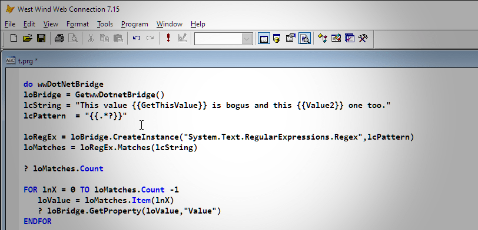
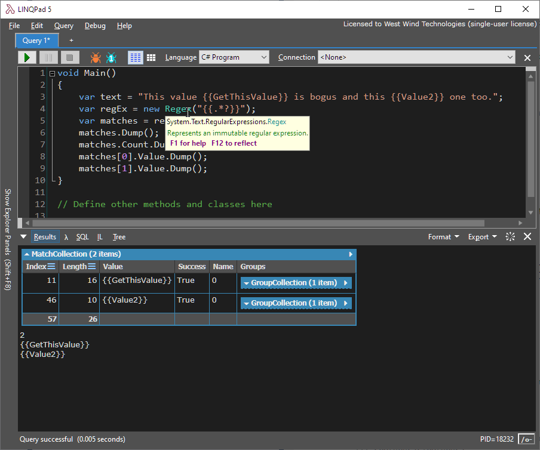
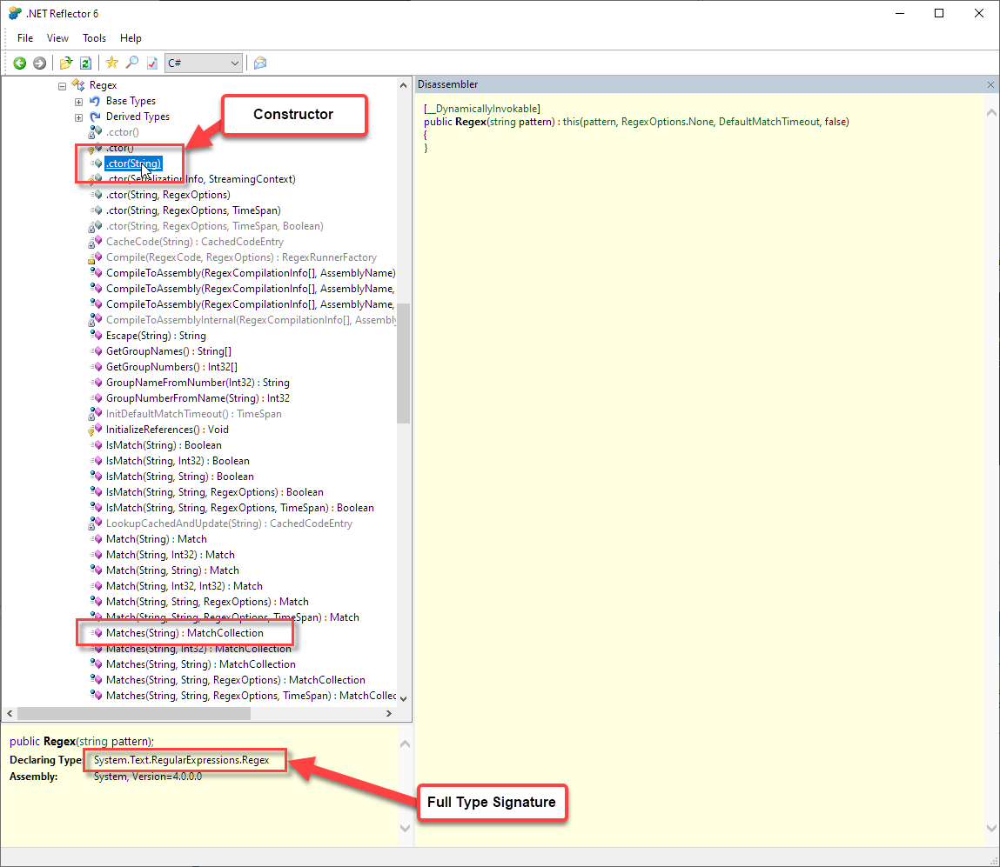

# Workflow for using wwDotnetBridge to call .NET Components



Today there was [a question on the message board](https://support.west-wind.com/Thread5WJ08LNV2.wwt#5WL02O9BB) on how to use [wwDotnetBridge](https://github.com/RickStrahl/wwDotnetBridge) to access the [.NET Regex](https://docs.microsoft.com/en-us/dotnet/api/system.text.regularexpressions.regex) classes. Although I've posted lots of information and a detailed white paper about how to use wwDotnetBridge in the past, if you've never done anything with .NET it can be daunting to use wwDotnetBridge as it requires that you understand at least some of how .NET works.

So in this post I'll take you through what I think is a sensible process of how to work a .NET problem from FoxPro.

## wwDotnetBridge
For those of you that don't know: [wwDotnetBridge](https://github.com/RickStrahl/wwDotnetBridge) lets you use .NET APIs/Components from FoxPro, without requiring you to register those components through COM. .NET provides access to a ton of useful functionality internally and there are a thousands of third party components for .NET that can all be integrated into FoxPro. And it can be done relatively easily using wwDotnetBridge.

.NET has a native mechanism for interfacing via COM with legacy technologies like FoxPro, using what's known as  **.NET COM Interop**. It uses a custom COM registration process for .NET components that can then be used as COM objects. In addition to providing all the base features that COM Interop provides, wwDotnet doesn't require COM registration and it provides access to many features that COM Interop natively doesn't support: unsupported types (long, generics, collections, struct, guid and many, many more) calling methods and constructors with overloaded parameters, accessing static properties and methods, accessing generic components. wwDotnetBridge can do everything that COM interop provides  but it provides **many features on top of COM Interop**. 

To be clear wwDotnetBridge also uses COM Interop to actually pass data and objects back and forth, but wwDotnetBridge instantiates types directly through .NET without requiring COM registration which provides more flexibility. It also provides .NET based tooling to provide an optional invocation layer that provides the functionality that doesn't work with direct COM Interop, which happens to be **quite a lot of functionality** especially with modern .NET code.

If you're new to wwDotnetBridge, please check out this introduction:

[Calling .NET Components from Visual FoxPro
with wwDotnetBridge](https://west-wind.com/presentations/wwdotnetbridge/wwDotnetBridge.pdf)

## Multiple Approaches
The main purpose of wwDotnetBrdige is to access .NET Components from FoxPro. This can mean using built-in .NET Framework features (like RegEx, SMTP Email, Zip compression, etc.) as well as accessing external .NET Components that are open source or from commercial third parties.

There are a couple of different ways you can interact with .NET when using an interop strategy, and it depends on how complex the code you are interfacing with is. 

The two main approaches are:

* **Direct access of .NET APIs with wwDotnetBridge**  
You can directly call into most .NET APIs directly using wwDotnetBridge. This works great for simple interface code where you need to make only a few .NET calls from FoxPro. But it can become cumbersome with lots of .NET code that needs to be accessed. The advantage of this approach is that it's self-contained - no extra DLL to distribute and you don't have to write any .NET code. 

* **Create a Wrapper .NET Component and call with wwDotnetBridge**   
For more complex code, you can create a small .NET class that provides an intermediate interface to .NET with the majority of the 'heavy lifting' code handled via more easily written native .NET code. You then call this small "Bridge Adapter" class from FoxPro using wwDotnetBridge. The advantage is that you're keeping the .NET centric code in .NET and only push inputs and results back and forth into FoxPro. As a bonus you can control the exact types that are passed back to FoxPro simplifying parameter and result type translations which can be tricky with native .NET types that can't be directly accessed in FoxPro. This is the preferred approach for complex logic that requires lots of .NET code access.

For any non-trivial code I actually would recommend the latter approach, especially if you have any sort of familiarity with .NET. It is much easier to create .NET code inside of .NET than in FoxPro. If you have a bunch of .NET functionality to call it'll also be much more efficient to do natively directly from .NET rather than than through repeated COM Interop calls.

But... for very simple tasks direct access is definitely an option. In this post I'll focus on the direct access approach, since that's what most people use wwDotnetBridge for.

## Direct .NET API Access with wwDotnetBridge
Direct .NET access via wwDotnetBridge means that you:

* Instantiate a type with wwDotnetBridge
* Receive a COM instance of a .NET Object
* You can call most methods and access properties directly (ie. `o.Method()`)
* For some props/methods you have to use `InvokeMethod()`, `GetProperty()` or `SetProperty()` to handle type translation

Alternately you can also access `static` methods or properties, via `InvokeStaticMethod()`, `GetStaticProperty()` or `SetStaticProperty()` which don't require a type instance but rather are executed on a static type definition.


### Game Plan - Check the code in .NET
Unless your code is extremely simple, and just a few lines of code, the first thing I recommend before you even start writing FoxPro code is test the code you're trying to access with .NET - in .NET! This helps with a number of issues:

* Identifying the **exact type names** you need to load
* Ensuring that the code works as intended in .NET
* See type information (props/method overloads/parameters)

In short having the code to reference in .NET will make it much easier to identify how it needs to be called from FoxPro. This is especially true if you don't know how .NET works because there are many idiosyncrasies in how types work and even more in how FoxPro can work with some of those types.

There are a couple of ways you can do this:

* Use [LinqPad](https://www.linqpad.net/) (get LinqPad5)
* Create a small .NET Project (Test projects work well)

I'll use LinqPad for the example here.

> When you download LinqPad make sure you get the version that supports **Full Framework (.NET 4.x)** rather than **.NET Core**. Most components you'll interface with on Windows from FoxPro are for  .NET 4.x.


#### LinqPad
LinqPad is an awesome little tool that provides immediate execution of .NET code without having to create a project. It's a little bit like the FoxPro command window that just lets you execute commands. Actually it's  an interactive editor with a compiler that lets you run code as a single block. It's more powerful than that, but it's great for testing out little snippets of code.

Here's some simple sample code that I'm using to work through the RegEx example mentioned at the start of this post:



Here's the code in case you want to try it out:

```csharp
var text = "This value {{GetThisValue}} is bogus and this {{Value2}} one too.";
var regEx = new Regex("{{.*?}}");
var matches = regEx.Matches(text);
matches.Dump();
matches.Count.Dump();
matches[0].Value.Dump();
matches[1].Value.Dump();
```

What's nice about using LinqPad (or a project in Visual Studio) is that you get IntelliSense and you can hover over a type or a method and see the full type information or method signature. In the screen shot above you can see me hover over the `Regex` type and it gives me the full type signature of `System.Text.RegularExpressions.Regex` which you need to use in a call to `CreateInstance()`.

### Reflector for Type Discovery
If LinqPad is too intimidating because you don't know any .NET code, you can use a simpler but less dynmamic approach of looking up the actual type and method signatures in a .NET *disassembler*. A disassembler basically lets you look at any .NET assembly, and it will give you detailed information on the types used, the method signatures and properties available.

In Web Connection and the Client Tools we ship an old version of .NET Reflector which provides this functionality in the `/tools/Reflector` directory.

When looking up the RegEx type in Reflector you'll see something like this:



Reflector shows you all the methods and properties of the class as well as the full type name which are typically the two things that you need. For methods you get detailed information on the parameter types that you need to pass.

### Translating to FoxPro
So, once we know what needs to be called, we need to translate the .NET RegEx code to FoxPro. 

The key items for calling this code with wwDotnetBridge are:

* Instantiating the `Regex` type
* Calling the `Matches()` method
* Iterating over the result collection

Because `Regex` is a built-in core framework class no assembly loading is required, so the code is as simple as this:

```foxpro
do wwDotNetBridge   && load lib
loBridge = GetwwDotnetBridge()

lcString = "This value {{GetThisValue}} is bogus and this {{Value2}} one too."
lcPattern  = "{{.*?}}"

*** Use full .NET Type Name (namespace.type)
loRegEx = loBridge.CreateInstance("System.Text.RegularExpressions.Regex",lcPattern)

*** This method can be called directly - Match Collection result
loMatches = loRegEx.Matches(lcString)

? loMatches.Count && 2

** 0 based collection
FOR lnX = 0 TO loMatches.Count -1
   loValue = loMatches.Item(lnX)
   
    *** Value is overloaded so we have to use indirect access
   ? loBridge.GetProperty(loValue,"Value")
ENDFOR
```

It happens to be that the Regex class was designed by Microsoft to be COM friendly, so a lot of the properties and methods work with direct access. So calling `Matches()` and accessing the `Count` property on the result collection happens to just work with the raw instance.

To get the individual items of the collection we have to use the `Item()` method rather than using `FOREACH` or using something like `loMatches[1]`. Note that the index is zero-based so the count starts at 0. Finally accessing `loMatch.Value` also requires indirect access using `GetProperty()`.

Some of this is obvious - others not so much, so there can be a bit of trial and error involved in determining whether you can access properties/method directly or whether you need to use the indirect methods.

As a general rule:

* Try direct access first
* If you get an error (unknown COM error most commonly or a type conversion error) then using indirect methods.

### More than One Way To Do Things
Regex has both an instance class as used above or you can use a static method.

The instance class allows you to create the RegEx expression once and reuse it as there is some overhead in parsing and compiling the RegEx class each time it's instantiated. With an instance you can save and effectively cache the RegEx expression to re-use at a later time (ideally by wrapping it into a class).

Static methods and properties are non-instance direct access members meaning that they have no state. Methods are fully self-contained, and members that hold data are stored in an internal singleton instance that effectively gives you **global state** in .NET. Static instance data persists for the lifetime of an application.

We can do the following in .NET which has the same exact behavior of the previous implementation by using the static `Regex.Matches()` method:

```csharp
// Static Regex.Matches() method
matches = Regex.Matches(text, "{{.*?}}");

matches.Dump();
matches.Count.Dump();
matches[0].Value.Dump();
matches[1].Value.Dump();
```

This uses a static instance of the Regex class, which means there's no type to instantiate. Rather you specify a type **name** and the method (or property) to access along with the parameters.

The difference between the first implementation and the second is simply that the first has state (the class instance) which you can reuse, while the second does not.

So what about the FoxPro code for for the static method? Here it is:

```foxpro
loMatches = loBridge.InvokeStaticMethod("System.Text.RegularExpressions.Regex","Matches", lcString, lcPattern)
? loMatches.Count

FOR lnX = 0 TO loMatches.Count -1
   loValue = loMatches.Item(lnX)
   ? loBridge.GetProperty(loValue,"Value")
ENDFOR
```

It's a little simpler than the first version. It's more compact, and the behavior is identical, but the instance version can potentially be cached by holding on to the instance and reusing it later.

You can use this same approach with other RegEx methods like `.Match()` or `.Replace()` for example. The same logic applies.

## Summary
So there you have it... a walk-through how to access simple .NET functionality using wwDotnetBridge. I've been very explicit here to demonstrate some of the thought process that can help make calling .NET code easier without having to guess at what you need to call or pass.

It's a little more work to fire up LinqPad or Reflector or even a full copy of Visual Studio. But I find almost every time I build wwDotnetBridge code in .NET I need to dig into the type structures to figure out exactly what I have to pass and so testing the code first in .NET  almost always makes this much easier.