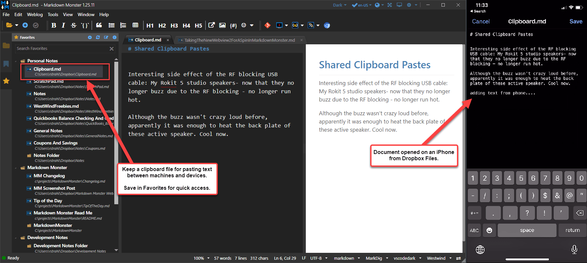

# Using DropBox as a Cross Device Clipboard

Tip of the day: Use a Clipboard file in DropBox or other shared service to share clipboard data between machines.

I use Markdown Monster and Favorites with a Markdown file to hold clips and then open the file on the phone in DropBox and copy text to clipboard.

Easy peasy!

You don't have to use Markdown Monster obviously - this will work with any editor and a file browser, but having favorites is definitely useful to keep track of files.

Favorites is one of my Favorite (ha) feature in Markdown Monster and I use to create 'notebooks' of notes.

Markdown Monster with Favorites has all but replaced my need for a dedicated note app like To-Do or OneNote for me. I just use Markdown files in a folder structure to accomplish the same in much easier to manage fashion (including easy Git archiving). 