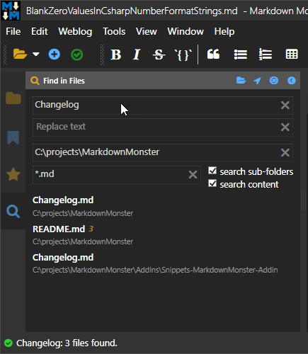

# Blank Zero Values in .NET Number Format Strings


The other day I was working in Markdown Monster - a WPF application - where I needed to display a list of matches from a directory search. The search supports searching the file content as well as file names, so the results would reflect how many search phrase matches there are for each matched file. But I wanted to display files that have 0 matches - ie. where only the file name matches but not any content - as an empty string rather than displaying `0`.

Without any sort of formatting the result from the search returns something like this:


The orange number is the number of matches inside of the file. Or if I run without the *search content* option:


which returns only files that match which means that all results have zero matches.

This works, but it sure would be much nicer to **not display 0 when there are no matches**.

What I want to end up with is this:



where I only show the number of contained matches when there are any, and empty when there are not (ie. it's a file name match only).

### Look Ma - No Code
There are many ways to skin this particular ~~cat~~ problem: You can use code to update the list, generate a result set that includes the string value to display as part of the model, or if you do this a lot create a custom binding extension. Which are all fine and appropriate solutions.

But... for me at least it's such a common occurrence that this should be doable without having to create some customized model or code, right?

Turns out there is! And it's new to me (or I forgot if I did know). 

There is a custom number string formatting template that **allows you to specify the zero value** along with templates for positive and negative numbers with each template separated by a `;`. 

For example:

```csharp
int number = 0;
number.ToString("0;;' '");  // blank
```

The semi-colon separates the `positive;negative;zero` values and the formats that can be used for each section is very specific - either using  `0` or `##.##` style formatting for the number. 

The  positive and negative values can be left 'empty'. In the example above I'm leaving the negative value 'empty', buy you can leave both empty to get the default number behavior:

```csharp
int number = 0;
number.ToString(";;' '");  // blank
```

This postive/negative/zero format feature is not well known, nor well documented - it's mentioned in passing in the [Custom Numeric Format String documentation in the .NET docs](https://docs.microsoft.com/en-us/dotnet/standard/base-types/custom-numeric-format-strings#the-0-custom-specifier).

### The "0" Custom Format Specifier
You can use the `0` format string to specify custom formatting for numbers, including the ability to specify explicit **positive**, **negative** and **zero** values by separating each expression with the `;`.

> You can omit the negative value section if you want the same formatting as positive numbers with a negative sign placed either before or after depending on locale settings.

Unfortunately when you use the `;` separator you can't use standard formatting strings like `c` or `n2` or `x` etc. Instead you have to stick to `0` integer syntax or an explicit number format specified by `##.##` replacements in the string. If you're not using integers it takes some experimenting to find the right format, but for integers the `0` specifier works well.

Here are a few examples that demonstrate how this syntax works:

```csharp
// This works for integers -  blank
0.ToString("0;;' '").Dump();

// but will round non-integers - 12
(-12.224).ToString("0;;' '").Dump();

// Custom zero value - n/a
0.ToString("0;;'n/a'").Dump();

// Explicit format string is required -  -121.22 
121.22M.ToString("#.##;;' '").Dump();

// -122.22
(-121.22M).ToString("#.##;;' '").Dump();

// 1 - note no decimals 
1.00.ToString("#,###.##;;' '").Dump();

// 1.11
(1.11M).ToString("#,###.##;;' '").Dump();

// this works - blank
0.ToString("#.##;-#.##;' '").Dump();

// this doesn't work - n2
1.2M.ToString("n2;n2;' '").Dump();

// this works - blank  -  works only for 0, n2 for anything else
0.ToString("n2;n2;' '").Dump();
```

Here's what that looks like if you run the above code in [LinqPad](https://www.linqpad.net/):


As you can see there are two formats that you can use that work here:

* The `0` format specifier which works with Integers
* The `###.##` explicit number specifier

It appears that normal format string values like `c` or `n2` or `x` don't work so you have to be explicit. Docs don't mention this explicitly but it's unclear exactly what you can use. Looks like `0`, `#` and decimal and thousands separators.

### The 0 Format Specifier
The 0 format specifier works for integers and you can use:

```csharp

// displays blank

0.ToString("0;;' '").Dump();    // blank string
12.ToString("0;;' '").Dump();   // 12


// displays - 12
12.ToString("0;;' '").Dump();

// displays - n/a
0.ToString("0;;'n/a'").Dump();
```

The `0` specifier works only on **absolute integer** values: Any negative values or decimals are lost in the format operation, so you have to **explicitly** specify the second section, or leave it blank (which uses the same as the first section and pre-pends the minus sign).

So for integers the typical string would be:

```csharp
intVal.ToString("0;;' '").Dump();
```

You can also specify multiple `00` values which will left pad the number with zeros:

```csharp
// displays - 01
1.ToString("00;;'n/a'").Dump();

// displays - -01
(-1).ToString("00;00;;'n/a'").Dump();
```

Note that here I specify a custom value for the 'zero' value as `n/a` - any string can be used there.

### The `###.##` Format Specifier
If you're not using integers you'll have to specify a number format explicitly. Basically use `#,###.##` to specify  an explicit format string for left and right side of the decimal point. The template is smart enough to format smaller numbers in simple format - ie. if you pass `1` to the format above you'll get `1`, but if you pass `1.11` you get `1.11`.

In short you get some control but you don't get all the various formats that you normally use with `string.Format()`.

```csharp
// Explicit format string is required -  -121.22
121.22M.ToString("#.##;;' '").Dump();

// -122.22
(-121.22M).ToString("#.##;;' '").Dump();

// 1.11
(1.11M).ToString("#,###.##;;' '").Dump();

// 1
1.ToString("#,###.##;;' '").Dump();
```

### Applying to a WPF Binding FormatString
Ok, so now that I've figured out how to create an empty string from string format I can use it inside of my WPF application as as part of a binding expressions without requiring custom code.


```xml
<StackPanel Orientation="Horizontal">
    <TextBlock Text="{Binding FileOnly}" FontWeight="Medium" />

    <TextBlock Text="{Binding Matches.Count,StringFormat=0;;\'\'}" 
               Margin="5,2,0,0" FontSize="11" FontStyle="Italic" FontWeight="Bold" 
               Foreground="DarkGoldenrod"/>
</StackPanel>
```

And again here's what the result looks like:


In this list the `Changelog.md` files are file name search matches that don't have the search term contained inside of them so the count is `0`. With the binding `StringFormat` set this now renders a blank string.

```xml
<TextBlock Text="{Binding Matches.Count,StringFormat=0;;\'\'}"  />
```

Note that I can also use a different value like `file` to display instead of blank:

```xml
<TextBlock Text="{Binding Matches.Count,StringFormat=0 matches;;\'file\'}"  />
```
which looks like this:


and might be more appropriate.

### It's not for Everything
For simple scenarios like showing an empty string for explicit numbers on zero like in the example above, this all works very well, and it's a simple, non-intrusive way to display empty values. 

But for more complex situations a StringFormatter alone is not going to work. Even for example above where I show `3 matches`, this actually breaks with this simple model, because you would also need to display `1 match` for the singular, which you can't handle in a StringFormatter alone. Short of using `1 match(es)` and `3 match(es)` a StringFormatter breaks down even at this simplistic logic. For properly handling this scenario - or anything else that requires any sort of logic - you're back to using a custom Model value or a Binding Converter or custom code to display the value with this more complex logic. 

But for the simple use case as I'm using in my code of simply showing a number and hiding `0`, using a string format is much simpler and causes less code noise. Especially if I can remember that this ability exists :smile:

In the end it's choosing the right tool for the job at hand.

### Summary
I've been using .NET for a looooooong time and to this day I learn something new, even if it's an old feature that's been there since Day 1. I didn't know about this particular feature and maybe you didn't either...

But I'm sure I'll be using this more in the future - it's very useful to not have to create custom code just properly display empty numeric values. The syntax for this feature isn't one I'm likely to remember, but now at least I can find it quickly by coming back to this post...


<div style="margin-top: 30px;font-size: 0.8em;
            border-top: 1px solid #eee;padding-top: 8px;">
    
    this post created and published with the 
    <a href="https://markdownmonster.west-wind.com" 
       target="top">Markdown Monster Editor</a> 
</div>