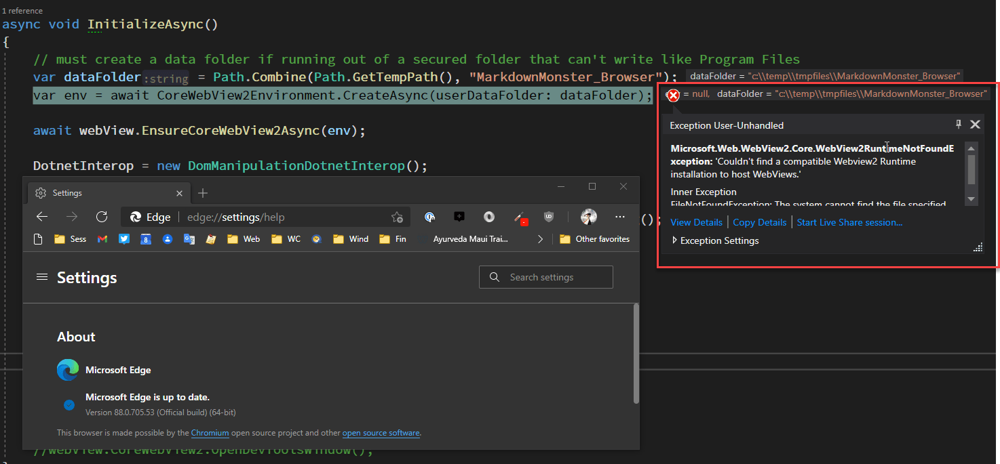

# Taking the new Chromium WebView2 Control for a Spin in .NET - Part 1


<small>

This is Part 1 of a 3 part post series:
* Part 1 - Taking the new Chromium WebView2 Control for a Spin in .NET
* [Part 2 - Chromium WebView2 Control and .NET to JavaScript Interop](https://weblog.west-wind.com/posts/2021/Jan/26/Chromium-WebView2-Control-and-NET-to-JavaScript-Interop-Part-2)
* Part 3 - Real World Integration and Lessons Learned *(coming soon)*

</small>


The Microsoft Edge `WebView2` control is a new Chromium based Web Browser control that aims to replace the Internet Explorer based [WebBrowser control](https://docs.microsoft.com/en-us/dotnet/api/system.windows.controls.webbrowser?view=net-5.0) that's commonly used in WPF and WinForms. Third party Chromium based controls (like [CefSharp](https://github.com/cefsharp/CefSharp)) have been available for a while, but for me these complex controls have been a struggle to integrate and operate efficiently and reliably in the past especially in WPF. So I was exited to hear that Microsoft was creating a WebView control in tandem with the new Edge Chromium browser that recently was released, even if these developments took a lot longer than originally anticipated.

The `WebView2` control is Microsoft's entry in this space and they are throwing their weight behind the Edge Chromium browser with application level features for C++, WinForms and WPF applications. Although the .NET bits are still in preview, performance and stability are very promising at this point.

After some initial experimenting with features and performance, I decided to integrate the `WebView2` initially in [Markdown Monster](https://markdownmonster.west-wind.com) as an optional preview browser addin to support Chromium rendering. While this process took some effort and finding out a lot about how the control works and what doesn't, overall the end result was very encouraging as I managed - with a bit of effort - to duplicate most of the interop functionality that the preview interface required. I'll talk about how I went about this integration and some of the challenges I ran into in Part 2. 

In this installment I'll talk about the control's features, and how to use the control to display content and how to get it installed with your applications. Part 2 focuses on interaction with content and .NET -> JavaScript interop integration.

> *Note that the `WebView2` is a very different control than the original `WebView` control, which existed briefly and was based on the classic Edge engine. The original `WebView` control is now obsolete and  longer supported.*

## Do you need the WebView2?
So coming from a `WebBrowser` control, the `WebView2` control seems like a shoo-in especially for new applications. It provides fast, modern rendering that's (optionally) always updated to the latest Chromium features, which is the browser engine that most mainstream browsers now all use for HTML rendering - the big exception being FireFox. 

Before we dive into the WebView, first a little history on where we are coming from...

### The old Internet Explorer based Web Browser Control
The [WebBrowser control](https://docs.microsoft.com/en-us/dotnet/api/system.windows.controls.webbrowser?view=net-5.0) in WPF and WinForms is a built in control, and although it's very old and based on Internet Explorer, it can render most HTML 5 content and many relatively modern JavaScript libraries.

For example, in Markdown Monster I use the IE WebBrowser control very effectively to render the JavaScript based editor and Web preview browsers and that just fine with excellent performance for example. Both of these web pages/applications are fairly complex, and use JavaScript to .NET Interop and the old control actually works just fine for both of these scenarios.

But, where the old control starts failing is **for content that uses modern JavaScript that is ES2015 or newer** which the IE JavaScript engine doesn't support. This used to be no big deal because until very recently even most Chromium browsers hadn't implemented many ES2015 features. But as these features have become common in browsers, the tide is slowly turning and more and more JavaScript libraries are now embracing the new JavaScript features which Internet Explorer has never and will never support. 

The writing's on the wall - eventually most newer JavaScript content won't run in the old `WebBrowser` control.

Still, if your application only renders common HTML5 content - especially if you're appliocation generates it - and doesn't rely on ES2015+ features you can continue to use the WebBrowser control as a low impact solution to displaying HTML content. If the WebBrowser control works with your content, it's much easier to distribute in your application than the WebView2 control.

### WebView2 to the Rescue?
The `WebView2` control (and also others like CefSharp) solves the modern feature problems because it provides:

* A Chromium based Web browser control
* Evergreen Chromium features that are always up to date

Chromium is the open source core engine used in most modern Web Browsers - Chrome, Edge (Chromium), Brave, Vivaldi, Opera and many other small browsers all use the same core Chromium based browser engine in their desktop browsers. And now you too can easily use it in your .NET Desktop applications. And the **WebView2 uses that very same base Chromium Browser engine** plus some Edge specific shell embellishments.

Like the WebBrowser control, the WebView2 works both in .NET Framework (which is what I'm using in MM) and for .NET Core 3.x and 5.0.

On the downside, the **`WebView2` requires a separate WebView2 Browser Runtime that has to be explicitly installed on a target machine**. Even if the new Microsoft Edge Chromium browser is already installed on the machine, a `WebView2` Runtime has to be separately installed. You as the application developer has to make sure it gets onto a target machine. This means either bloating your installation, or downloading and installing as part of your installation or application startup, none of which are pleasant solutions.

There are also significant differences and a few complications getting host/control interop to work. Having worked with an application that has deep Web Browser integration, switching to the WebView2 control brought up a few issues:

* Much more limited host->JavaScript interopability
* No Keyboard forwarding from browser to the host container
* Some (pre-release) instability around interop calls (mostly back to .NET)

I'll talk more about these specific issues in Part 2. It's not clear whether some of these are just related to the pre-release blues, or whether they are by design. Discussions on some of these topics in the [Github Issues](https://github.com/MicrosoftEdge/WebView2Feedback/issues/196) are not always clear on direction.
  
### WebBrowser Control vs. WebView2
To summarize: Here's a comparison overview of pros and cons summary for the WebBrowser and WebView:

#### WebBrowser Control

**Pros**

* Works with most HTML 5 content
* Native controls for WPF/WinForms
* Low resource usage
* Excellent performance
* Built-in - no additional files to distribute
* Excellent interop support

**Cons** 

* No JavaScript ES2015+ Support
* No support for newer CSS features (post CSS 3.0)
* Dev Tools not available
* Very difficult to debug HTML/JavaScript content

#### WebView Control

**Pros**

* Supports latest Features
* Excellent performance
* Evergreen browser support (updates to latest)
* Easy debugging using Browser DevTools

**Cons**

* Requires a runtime installation
* High memory usage of Chromium Processes
* Setting up Interop takes some work
* Interop type limitations (JSON messages required)
* No Browser -> Host Accellerator Key Mapping
* Some pre-release Interop quirks

## Using the WebView2 Control
Let's take a look on how to use the `WebView2` control. I'll use WPF here, but usage in Windows Forms is going to be similar other than the control host embedding. 

Using the control involves a few steps:

* Ensure the WebView2 Runtime is installed
* Add the `Microsoft.Web.WebView2` NuGet Package
* Add the WebView Control to your Form, UserControl or other Container Control
* Set up the WebView Environment during Startup
* Set the `webView.Source` property to navigate
* Or use `webView.NavigateToString()` to display HTML content from string


### The WebView2 Runtime
Before you can use the `WebView2` control you need to make sure the WebView Runtime is installed. This runtime is separate from the Microsoft Edge browser, and can in theory run completely independent of Edge and if Edge is not installed at all.

This means you have to either:

* Install using a [Runtime Installer](https://developer.microsoft.com/en-us/microsoft-edge/webview2/) (launch from an App Install or App Startup)
* Or [install an Edge Canary Preview Build](https://www.microsoftedgeinsider.com/en-us/download)
* Distribute the unpacked runtime with your app

At the end of the article I'll discuss some strategies for distributing the runtime with your application. But for now, for experimenting just install the Runtime or Canary build to play with the control.

### Add the NuGet Package to your Project
The `WebView2` .NET integration that provides the WPF and WinForm controls, is shipped as a NuGet package that you can add to your WPF or WinForms project.  The NuGet Package supports both WPF and WinForms versions of the control so regardless which you use and **it works both in Full .NET Framework (NETFX) as well as .NET Core**.

To install the package:

```ps
> Install-Package Microsoft.Web.WebView2
```

I'll use WPF here to demonstrate but the process in WinForms will be similar except for adding the control to the Form/UserControl/Container - the control interface is the same.

### Add to your Form or Container
Once in your project the control shows up in the Control toolbox and you can drag it into the WPF or WinForms designer onto your form/user control/container. 

In WPF the result looks like this if you want to do it with XAML only:

```xml
<Window
	xmlns:wv2="clr-namespace:Microsoft.Web.WebView2.Wpf;assembly=Microsoft.Web.WebView2.Wpf"
/>
...
<DockPanel x:Name="DockWrapper" Grid.Row="2" Panel.ZIndex="2" >
	
    <wv2:WebView2 Name="webView"  Visibility="Collapsed" 
                  Source="{Binding Url}"
    />
</DockPanel>
```

### Initializing the WebBrowser
Next we need to initialize the WebView by explicitly setting up the WebView environment. 

The WebView environment controls all the related browser state that is typically stored on disk as a folder structure containing things like cookies, browser history, localstorage etc. The key thing is to ensure that this folder is created somewhere where the application has rights to write files. By default the folder is off application root folder, which may not actually have rights to write data if it sits in say `\Program Files\My App`. 

So it's important to specify a specific folder that has read/write/create access so files and folders can be created and written. If the folder doesn't exist it's automatically created during the control initialization. If it does exist the existing data is re-used, so that the environment data persists across multiple browser control launches.

I use an application named temp folder sub-folder for example `c:\temp\tmpFiles\MarkdownMonster_Browser`. Here's what that looks like in the configuration code:

```csharp
// called from Window Constructor after InitializeComponent()
// note: the `async void` signature is required for environment init
async void InitializeAsync()
{
   // must create a data folder if running out of a secured folder that can't write like Program Files
   var env = await  CoreWebView2Environment.CreateAsync(userDataFolder: 	Path.Combine(Path.GetTempPath(),"MarkdownMonster_Browser"));
   await webView.EnsureCoreWebView2Async(env);

   if (Model.Options.AutoOpenDevTools)
       webView.CoreWebView2.OpenDevToolsWindow();
   
   // Almost always need this event for something    
   webView.NavigationCompleted += WebView_NavigationCompleted;
   
   // set the initial URL
   webView.Source = new Uri("https://test.editor/editor.htm");
}

private void WebView_NavigationCompleted(object sender, Microsoft.Web.WebView2.Core.CoreWebView2NavigationCompletedEventArgs e)
{
    if (e.IsSuccess)
        Model.Url = webView.Source.ToString();

    if (firstload)
    {
        firstload = false;
        webView.Visibility = Visibility.Visible;
    }
}
```

This `InitializeAsync()` method is a method I created and call from the non-async form constructor:

```csharp
// in ctor
_ = InitializeAsync()
```

This gives me a method with an async signature even though the method is actually not initiated of an initial async request, but rather is of the fire and forget variety. But it gives me

- so during initial startup. I have other code in there to interact with the environment, like creating interop objects, setting up message events to send data back and forth and so on.

### Common Navigation and Content Events
As you'd expect the WebView2 browser has a full compliment of events, but I want to highlight 3 of the more common events that you need to work with, especially if you interact with the content inside of the browser control:

* **NavigationStarting** - useful for intercepting and re-routing links and resources
* **NavigationCompleted** - useful for initializing Interop components and interaction with DOM
* **CoreWebView2.DOMContentLoaded** - determines when the document is ready for inteaction
* **ContentLoading** - potentially taking over content

#### Navigation Completed and DOMContentLoaded
Probably the most common events you need to capture have to do with determining when a new page has been loaded and when the DOM is ready to be accessed. `NavigationCompleted` and (in the latest previews of WV2) `CoreWebView2.DOMContentLoaded` which serves similar but slightly differently timed notification in the Web page load cycle.

`NavigationCompleted` fires once the main page has been navigated meaning the URL is established and the document has started loading. This is good place to hook up things like Interop objects and potentially set up interop operations. In most cases this event also works as a DOM ready handler even though `CoreWebView2.DOMContentLoaded` is more specifically designed for that scenario.

The difference between the two is one of timing in that `DOMContentLoaded` fires once the main page document has completed loading and has been parsed (but resources like CSS/async Script/images may have not loaded yet). `NavigationCompleted` fires basically as the document **starts** loading. 

`DOMContentLoaded` has been added only in recent previews ( .720+), so I've been using `NavigationCompleted` for all my document and interop intitialization since that's all that was available and that has worked just fine. However, going forward with v.720 and later it's probably safer to `CoreWebView2.DOMContentLoaded` to ensure the document is fully loaded. 

> I'll continue to use `NavigationCompleted` in these examples here, because that's the only thing that available in the current downloadable release WebView2 Runtime.

The following example from MM demonstrates calling an initialization JavaScript function that initializes the preview browser in MM for example:

```csharp
private async void WebBrowser_NavigationCompleted(object sender, CoreWebView2NavigationCompletedEventArgs e)
{
    DotnetInterop = new WebViewPreviewDotnetInterop(Model, WebBrowser);
    JsInterop = DotnetInterop.JsInterop;

    // Make Dotnet Interop available in loaded document
    WebBrowser.CoreWebView2.AddHostObjectToScript("mm", DotnetInterop);

    // Call JavaScript method to initialize previewer using above object
    await JsInterop.InitializeInterop();
}
```

There are many additional operational and shell events on the `WebView2` control, and many more document centric events that map to HTML DOM events on the `CoreWebView2` control. I'll talk more about these in Part2.

UI and Browser shell events as well that you can trap, but the above 3 events are critical for working with browser navigation and accessing browser content from .NET.

### Navigating the WebView
At this point the WebView is ready for navigation and there are a few ways you can do that now:

* Set or bind the `.Source`  Property
* Call `.NavigateToString()`

#### Source Property Assignment and Binding

The `webView.Source` property is of type `Uri`, so in code:

```cs
// online url
webView.Source = new Uri("https://markdownmonster.west-wind.com");

// local url
webView.Source = new Uri(Path.Combine(Environment.CurrentDirectory, "Editor/editor.htm"));
```

Or you can bind a string from a Model

```cs
public class MainWindowModel : INotifyPropertyChanged
{

	public string Url
	{
	    get { return _Url; }
	    set
	    {
	        if (value == _Url) return;
	        _Url = value;
	        OnPropertyChanged(nameof(Url));
	    }
	}
	private string _Url = "about:blank";
}

...
// assign model value as string for binding
this.Model.Url = Path.Combine(Environment.CurrentDirectory, "Editor/editor.htm");
```

and then bind the Url:

```xml
<wv2:WebView2 Name="webView" Source="{Binding Url}" />
```                  

Using a string tends to be more convenient as you also bind the value into a text box.

My example page is a subset of the Markdown Monster editor because it has a rich object model that I can interact with for some of the examples here. 

Here's what the rendered sample form looks like:


Url navigation will open the page from the specified local file and all resources are rendered in related format.

#### String Navigation
You can also navigate the browser directly to string content. This work best if the content to render is fully self contained and doesn't have external references to related resources.

You can specify a full HTML document or a fragment like this:

```csharp
private void NavigateToString_Click(object sender, RoutedEventArgs e)
{

    // To map related content use webView.CoreWebView2.SetVirtualHostNameToFolderMapping()
    // to map a domain name to a path that's part of the installation folder.
    webView.NavigateToString(@"<h1>String Navigation</h1>
<p>
This content generated to display as a string.
</p>
<p>
This works only if you have self-contained content, or you link Web Resources or you explicitly implement
</p>
");

}
```

The render behavior is the same as you'd see in an actual browser - a fragment basically gets an emtpy `<html><body>` wrapper around the document.

But be aware that in order to render strings you either need **a self-contained HTML document that has no external links and references** or that uses **external HTTP URLs for external links and references**. This means Web based `https://` links in its simplest form.

#### Tip: Domain to Folder Mapping 
One of the most common use cases for using a Web control in a desktop application is to use generated content from local files, or map a local folder and treat it as a 'web site' in the browser.

To help with linking **local file resources**, the `CoreWebView2` API includes a thoughtful mechanism to **map a folder to a virtual domain name**:

```csharp
// During initialization
wwebView.CoreWebView2.SetVirtualHostNameToFolderMapping(
                    "test.editor", "Editor",
                    CoreWebView2HostResourceAccessKind.Allow);
```

This allows you to assign a local folder to a domain name, which you can then use as a base URL for referenced resources or links.

Once you've set up this domain to folder mapping you can now use a 'real' URL to navigate to a page that lives in the `Editor` folder relative to the application's startup folder. Using the `test.editor` virtual domain you can then navigate like this:

```csharp
webView.Url = new Uri("https://test.editor/editor.html");
```

The document loaded then appears to load from that domain and all relative links also load from that virtual domain.
  
But more importantly once the virtual mapping exists you can reference resources in the mapped folder from within any HTML document. For example to link a related image you can use:

```html

```

This works both in a document loaded from the same domain or for a file loaded from a local file or another domain. 

This is obviously very useful if you're rendering content from a string, but it also works if you are rendering HTML templates to local files and then load them into the browser. It also works to mix local content into Web content without running into browser security zone issues. 

Note that you can specify the CORS access rules for the resource - although I was only to get this to work with `CoreWebView2HostResourceAccessKind.Allow` - anything else would refuse to load the resource.

Kudos to Microsoft for this feature! This is pretty thoughtful and powerful and I plan on using that in the future once I upgrade my code base to the WebView2. I can foresee mapping multiple file locations (templates and resources for example) locally out of different folders and more importantly treating all content in the browser as HTTP content. Nice!

## WebView2 Runtime Installation Options
As mentioned at the beginning, Runtime installation is a concern with the WebView2 control because there's no guarantee that a WebView2 runtime is installed - even if the latest version of Microsoft Edge is installed.  A separate WebView2 runtime is required and it has to be explicitly installed on a machine and the runtimes are large at about a 100 meg footprint.

If you run an application that has a `WebView2` control and you don't have the WebView2 Runtime installed you get this runtime error:



Notice that this error occurs even though Edge is installed - you need a separate WebView2 Runtime that is installed either explicitly or as part of an Edge Canary install.

Not only do you need to have **a** runtime installed, but you have to have the right version that is compatible with the control/library that you are using. The runtimes are backwards compatible so you need a **current or newer version of the Runtime** relative to the SDK/Controls.

What this means is that you have to ensure that library and the runtimes stay in sync over updates of your application. It also means that you probably want to check as part of your application that you have a runtime installed that is compatible with your controls ([see example below](#in-app-checks-and-installation)).


### Downloading the Runtimes
Before you can worry about installing you need to be able to get the runtimes installed even on your dev machine. The runtimes are available for download from  here:

[Microsoft Edge WebView2 Download Page](https://developer.microsoft.com/en-us/microsoft-edge/webview2/)

There are three different download options. 

* **Evergreen Bootstrapper** (~2mb)  
A relatively small executable that checks for the latest version of the runtime and downloads the full runtime and installs it. It needs an Internet connection to work. The bootstrapper is small at ~2mb, so you can add it to your application's installer or ship it as part of an application and invoke it at runtime. Evergreen means the browser installed is always the latest version.

* **Evergreen Full Installer**  (~80mb)  
Same as the bootstrapper above except the installer files are self-contained in the installer, so no Internet connection is required. This installer is obviously much larger and not so easily packaged with an (otherwise small) application.

* **Fixed Version** (~120mb)  
This package contains all the files needed that you can ship with your application and install side by side with your application, either in a sub-folder or somewhere else. This allows you to make a fully self-contained application with the runtime pre-installed.

> #### @icon-info-circle Canary Build Preview WebView2 Runtimes
> You can also 'get' a WebView2 runtime by installing any of the Edge Canary Previews builds which include the latest `WebView2` Runtime. **If you install both Canary and an explicit runtime**, the installed WebView2 Runtime takes precedence over the Canary WV2 runtime. The only way to get preview runtimes installed is by running Canary Builds.

#### Installing with an Installer
One approach you can take is to distribute your application with one of the two EverGreen installers as part of your Installation program. You can launch the installer as part of your setup program and let it check whether a runtime is already installed and update it if the version is newer.

When you start your application you need to specify where the WebViewRuntime files can be found and where the User Environment is stored for common browser state like cookies, localstorage, user profiles etc. If you don't specify a location for the latter, the WebView environment folder is created as sub-folder of the application's start directory. If you're installing into `Program Files` that'll be a problem because the current user likely won't have write access in the `Program Files` file tree.

So you'll want to make sure that during startup you specify a WebView2 Runtime Environment location:

```CS
 var env = await CoreWebView2Environment.CreateAsync(
    browserExecutableFolder: <locationOfRuntime>,
    userDataFolder: <locationOfSavedState>
);
```

The `userDataFolder` ends up containing things like browser history, cookies, local browser storage etc. - things that the browser stores as part of a session. The folder is reused if it exists, and if deleted it automatically re-creates itself. The `browserExecutable` folder is optional but it lets you point at a specific runtime in a folder. By default (if not set or set to `null`) the system installed runtime is used (if any). And again, the Edge install does not contain a WebView2 Runtime so you can't point at that folder.

If you're installing via an Install program you can distribute the runtime installer as part of your application and then fire the installer.

For Markdown Monster I use [Inno Setup](https://jrsoftware.org/isinfo.php) and in order to install the WebView2 runtime as part of the install I can add the following to the `[Files]` and `[Run]` sections:

```text
[Files]
Source: ".\MicrosoftEdgeWebview2Setup.exe"; DestDir: "{tmp}"; Flags: deleteafterinstall

[Run]
Filename: "{tmp}\MicrosoftEdgeWebview2Setup.exe";
```

I use the Web Bootstrapper, which runs on every install, but only installs a runtime if a newer one is available.

#### In-App Checks and Installation
In Markdown Monster currently the WebView2 support is an optional feature that's distributed as a built-in addin. By default the addin is disabled so by default the application doesn't use the WebView2 control (yet).

So rather than forcing users to install a runtime they may not actually use, I delay install the runtime when users activate the addin or start using the WebView2 control. I can do this by checking for an installed version and comparing it to active WebView2 runtime assembly version (the build number specificially) and if the build number of the assembly is newer force a download.

If the version check fails I display a dialog that prompts the user to download and install the runtime:


The application performs the following steps:

* Compares WebView assembly version vs. the CoreWebView2 version
* If installed and newer continue
* If not installed or older show the dialog box
* Let the user install the runtime

The following code demonstrates how to compare the WebView2 library assembly version vs the installed CoreWebView2 runtime that's installed, displaying the dialog if needed and taking the user to the download and install page.

```csharp
private bool IsWebViewVersionInstalled(bool showDownloadUi = false)
{
    string versionNo = null;
    Version asmVersion = null;
    Version ver = null;

    try
    {
        versionNo = CoreWebView2Environment.GetAvailableBrowserVersionString();

        // strip off 'canary' or 'stable' verison
        versionNo = StringUtils.ExtractString(versionNo, "", " ", allowMissingEndDelimiter: true)?.Trim();
        ver = new Version(versionNo);

        asmVersion = typeof(CoreWebView2Environment).Assembly.GetName().Version;

        if (ver.Build >= asmVersion.Build)
            return true;
    }
    catch {}

    IsActive = false;

    if (!showDownloadUi)
        return false;


    var form = new BrowserMessageBox() {
        Owner = mmApp.Model.Window,
        Width = 600,
        Height= 440,
        Title="WebView Runtime Installation",
    };

    form.Dispatcher.Invoke(() => form.Icon = new ImageSourceConverter()
        .ConvertFromString("pack://application:,,,/WebViewPreviewerAddin;component/icon_32.png") as ImageSource);

    var markdown = $@"
### WebView Runtime not installed or out of Date
The Microsoft Edge WebView Runtime is
{ ( !string.IsNullOrEmpty(versionNo) ?
        "out of date\n\nYour Build: " + ver.Build +
        "   -   Required Build: " + asmVersion.Build :
        "not installed")  }.

In order to use the Chromium preview you need to install this runtime by downloading from the [Microsoft Download Site](https://developer.microsoft.com/en-us/microsoft-edge/webview2/).

**Do you want to download and install the Edge WebView Runtime?**

*<small>clicking **Yes** sends you to the Microsoft download site.  
choose the **Evergreen Bootstrapper** download.</small>*";

        form.ClearButtons();
        var yesButton = form.AddButton("Yes", FontAwesomeIcon.CheckCircle, Brushes.Green);
        yesButton.Width = 90;
        var noButton = form.AddButton("No", FontAwesomeIcon.TimesCircle, Brushes.Firebrick);
        noButton.Width = 90;
        form.ShowMarkdown(markdown);
    

        form.ShowDialog();
        if (form.ButtonResult == yesButton)
        {
            mmFileUtils.OpenBrowser("https://developer.microsoft.com/en-us/microsoft-edge/webview2/");
        }

        return false;
}
```

This code is called by the startup and toggle routines:

```csharp
// addin loader of Preview Browser
public override IPreviewBrowser GetPreviewBrowserUserControl()
{
    if (!IsActive || !IsWebViewVersionInstalled())
        return null;  // use the default IE control
    
    return new WebViewPreviewControl();
}

// toggle between IE and WebPreview2
public override void OnExecute(object sender)
{
    if (Model.Window == null || !IsWebViewVersionInstalled(true))
        return;

    IsActive = !IsActive;
    Model.Window.LoadPreviewBrowser();

    if (IsActive)
        Model.Window.ShowStatusSuccess("Switched to Chromium based Preview Browser.");
    else
        Model.Window.ShowStatusSuccess("Switched to Internet Explorer based Preview Browser.");
}        
```

And that's it - this works great to install the runtime at the point of use and that's what I currently run in Markdown Monster. Once the time comes to switch all Web interfaces to the WebView2 I probably switch to the installer approach as that ensures the application can start without a secondary install on startup. 

## Summary
The new `WebView2` control provides a nice Chromium based browser experience for .NET (and C++) application on Windows using the same Chromium engine that is used by Microsoft Edge. Microsoft is building out a complete API for interacting with this control. 

The control is very easy to use and easily integrated with .NET and in my case WPF. It works well, and even though the .NET implementations are officially still in pre-release the control has been very reliable and performance has been excellence. In fact, other than obvious developer errors on my part I have yet to see the WebView2 crash or cause any runtime issues, which frankly is surprising as even the WebBrowser control will crash from time to time.

This is exciting because over the years I've tried to use other Chromium based libraries and have found a number of stability and performance issues that ultimately made me stick with the WebBrowser control. With this control the integration so far has been smooth. I've integrated it into production in Markdown Monster so it's getting a lot of use and so far I don't see any problems with the control showing up in logs or user error reports. Yay!

It's not all roses and rainbows though - there are still a few rough edges. Runtime installation is a pain at the moment, with confusing installation options, and the fact that a runtime needs to be installed at all, even if a full Microsoft Edge install exists. There are also a few  interop issues and the keyboard mapping from control to host which has me holding off implementing the editor portion of Markdown Monster using the WebView2. I'll talk more about Interop and some of these related issues in Part 2 of this article.

This concludes Part 1 of this article which is an overview of features and basic behavior. In Part 2 - to be released shortly - I'll take a look at interacting with content in the WebView2 and using .NET and JavaScript to interop between the host and Web Browser interfaces. 

## Resources

* [Part 2 - Chromium WebView2 Control and .NET to JavaScript Interop](https://weblog.west-wind.com/posts/2021/Jan/26/Chromium-WebView2-Control-and-NET-to-JavaScript-Interop-Part-2)
* [My WPF WebView Playground Sample](https://github.com/RickStrahl/WpfWebView2Playground)
* [WebView2 Runtime Installation Page](https://developer.microsoft.com/en-us/microsoft-edge/webview2/)
* [Edge Canary Installs](https://www.microsoftedgeinsider.com/en-us/download)
* [WebView2 Feedback Repo on GitHub](https://github.com/MicrosoftEdge/WebView2Feedback/issues/)
* [Markdown Monster WebView2 Addin](https://github.com/RickStrahl/MarkdownMonster/tree/master/AddIns/WebViewPreviewerAddin)


<div style="margin-top: 30px;font-size: 0.8em;
            border-top: 1px solid #eee;padding-top: 8px;">
    
    this post created and published with the 
    <a href="https://markdownmonster.west-wind.com" 
       target="top">Markdown Monster Editor</a> 
</div>