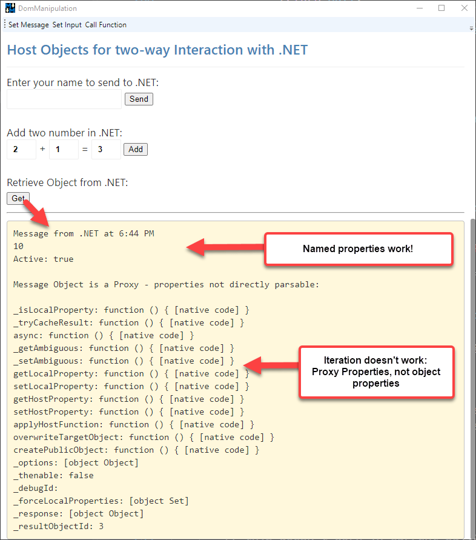

# [Chromium WebView2 Control](https://docs.microsoft.com/en-us/microsoft-edge/webview2/) and .NET to JavaScript Interop - Part 2


<small>

This is Part 2 of a 3 part post series:
* [Part 1 - Taking the new Chromium WebView2 Control for a Spin in .NET](https://weblog.west-wind.com/posts/2021/Jan/14/Taking-the-new-Chromium-WebView2-Control-for-a-Spin-in-NET-Part-1)
* Part 2 - Chromium WebView2 Control and .NET to JavaScript Interop
* Part 3 - Real World Integration and Lessons Learned *(coming soon)*

</small>

[In Part 1 of this article](https://weblog.west-wind.com/posts/2021/Jan/14/Taking-the-new-Chromium-WebView2-Control-for-a-Spin-in-NET-Part-1) I talked about the basics of using the `WebView2` control in a WPF application by dropping the control on a form, setting the browser environment and using the `.Source` property or `.NavigateToString()` to set the content of the browser.

In this installment I'll talk about how to interact with the WebView's rendered HTML page for basic manipulation of the HTML DOM in a rendered page, as well as calling JavaScript code in the loaded HTML document from .NET and calling back from the JavaScript code into .NET code.

## Accessing the HTML DOM and Manipulating Content
If you've used the old IE WebBrowser control before, you're familiar the `webBrowser.Document` property which allowed direct access to the HTML DOM via .NET API wrapped around the IE COM object interfaces. It allowed for deep interaction with the loaded HTML page, using a .NET API.

Unfortunately, **the `WebView2` control has no direct interface to the DOM**. Instead you need to use a **string based scripting function** to essentially evaluate a statement or block of statements of JavaScript code.

Currently `ExecuteScriptAsync()` is the only way to interact with the loaded document.

### A quick Review of WebView2 Initialization
To keep this post somewhat self-contained, here's a quick review of how to use the control and initialize it in a .NET application (for more detail [see Part1](https://weblog.west-wind.com/posts/2021/Jan/14/Taking-the-new-Chromium-WebView2-Control-for-a-Spin-in-NET-Part-1)):

* Ensure the WebView2 Runtime is installed
* Add the `Microsoft.Web.WebView2` NuGet Package
* Add the WebView Control to your Form, UserControl or other Container Control
* Set up the WebView Environment during Startup
* Set the `webView.Source` property to navigate
* Or use `webView.NavigateToString()` to display HTML content from string

To put the control into a WPF Window:

```xml
<Window
	xmlns:wv2="clr-namespace:Microsoft.Web.WebView2.Wpf;assembly=Microsoft.Web.WebView2.Wpf"
/>
...
<DockPanel x:Name="DockWrapper" Grid.Row="2" Panel.ZIndex="2" >
	
    <wv2:WebView2 Name="webView"  Visibility="Collapsed" 
                  Source="{Binding Url}"
    />
</DockPanel>
```

And to initialize:

```csharp
// WPF Window
public DomManipulation()
{
    InitializeComponent();

    // get notified when page has loaded
    webView.NavigationCompleted += WebView_NavigationCompleted;
    
    // force to async initialization
    InitializeAsync();
}

async void InitializeAsync()
{
    // must create a data folder if running out of a secured folder that can't write like Program Files
    var path = System.IO.Path.Combine(System.IO.Path.GetTempPath(),"MarkdownMonster_Browser");
    var env = await  CoreWebView2Environment.CreateAsync(userDataFolder: path);
    
    // NOTE: this waits until the first page is navigated - then continues
    //       executing the next line of code!
    await webView.EnsureCoreWebView2Async(env);

    // Optional: Map a folder from the Executable Folder to a virtual domain
    // NOTE: This requires a Canary preview currently (.720+)
    webView.CoreWebView2.SetVirtualHostNameToFolderMapping(
        "test.editor", "HtmlSample",
        CoreWebView2HostResourceAccessKind.Allow);
	
    // You can then navigate the file from disk with the domain
    webView.Source = new Uri(@"https://test.editor/index.html"); 
	
    webView.CoreWebView2.OpenDevToolsWindow();
}
```

This example initializes the WebView2 control by specifying the location for browser state and then initializes the control, maps a folder and then navigates to a URL.

The code maps a local folder to a *virtual domain name* (which is optional) which allows navigating a local folder as if it were a WebSite. 

> Using a *virtual domain* has a number of advantages over using `file:///c:/folder/index.html` style syntax:
> 
> * You can run XHR requests in JavaScript code
> * You don't run into zone security issues
> * Pages behave as a Web app would, not file based one

That said, you can still navigate to a file Uri on disk too:

```csharp
webView.Source = new Uri(Path.Combine(Environment.CurrentDirectory,"HtmlSample\\index.html"));
```

### Make sure the Document is Loaded!
Once you've navigated the document, it loads **asynchronously**. If you plan on interacting with the DOM or call into JavaScript code, you have to make sure the document is loaded before you start interacting with the document.

To do this you have to either:

* **Load the page and interact with it later**  
UI interactions that occur after the document have fully loaded don't need any special attention, unless load is really slow. You can just load and let the UI delay ensure that the page is loaded before you interact with it.

* **Interact with the Page at Load Time**  
If however you need to modify the document, or pass data into it **on startup**, you need to ensure that the page has loaded before you can interact with it. There are events to tell you when the document is ready for interaction.

Two events exist to notify you when the page is done loading:

* NavigationCompleted
* CoreWebView2.DOMContentLoaded <small>*(not available yet in release SDK)*</small>

For current SDK and Control release only `NavigationCompleted` is available. Using `WebView.NavigationCompleted` event you can ensure the document is loaded:

```csharp
public DomManipulation()
{
    InitializeComponent();
    webView.NavigationCompleted += WebView_NavigationCompleted;
    ...
    
    InitializeAsync();
}

private async void WebView_NavigationCompleted(object sender, CoreWebView2NavigationCompletedEventArgs e)
{
    // Now it's safe to interact with the DOM
    var msg = "Hello from a newly loaded .NET window.";
    await webView.ExecuteScriptAsync($"document.getElementById('Notice').innerText = '{msg}';");
}
```

In the future with WebView2 SDK (721+) a new event `CoreWebView2.DOMContentLoaded` is available:

```csharp
webView.CoreWebView2.DOMContentLoaded += CoreWebView2_DOMContentLoaded;
```

Once available I would recommend `DOMContentLoaded` as it more specifically ensures that the document has in fact loaded. However, out of necessity I've been using `NavigationCompleted` to date and that has worked without problems.

### Using ExecuteScriptAsync to manipulate the DOM
In the code snippet above you can see a simple example of `ExecuteScriptAsync()` fired during document startup. That code basically inserts some text into an element in the live HTML DOM.

The signature of `ExecuteScriptAsync()` looks like this:

```csharp
public Task<string> ExecuteStringAsync(string scriptToExecute)
```

Note that **this method only accepts a single string parameter** which must hold the code to execute as well as any 'data' passed. That's the messy part: Making sure that parameters and data values are encoded properly into a string value, when passed from .NET to JavaScript.

This is a pain, especially if you have to write more than a single statement. Yuk! :poop:

But, as bad as this 'API' interface is, it's functional and has good performance. In [Markdown Monster](https://markdownmonster.west-wind.com) I do a fair bit of interaction between .NET and JavaScript and using this limited API gets the job done, even if it's awkward. I'll also show some ways to mitigate the messiness of Interop calls in Part 3 via some abstractions.

**The method returns an optional string result** for any functions or script code that returns a value or object. You can only return values that are JSON serializable - you can't return a function for example. Functions or script that return no value, return null and you can just ignore the result.

> @icon-warning **Important:** Any result values are returned as **JSON encoded strings**. 

So if you call JavaScript function that returns a complex value or even a string it'll be JSON encoded and you have decode it.

The result type is of `Task<string>` which means the method is always called **asynchronously** and expects `await` or `Task` handling. If sequence matters make sure you use `await` or `Task` continuation blocks to ensure things execute in the correct order. If you don't use `await` or `Task` continuations, there's no guarantee that methods will execute or complete in the same order started.

There are a couple of common scenarios where `ExecuteScritpAsync()` is used:

* Interacting with DOM Directly
* Calling into global JavaScript code

### Accessing DOM Content
The most basic scenario is directly interacting with the already loaded document and the only way we can do this is via `ExecuteScriptAsync()`.

The following examples come from the `HtmlSample` page, which has a few buttons that operate on the document and pokes values into the page:


Here are some of the DOM access operations:

#### During Page Load
*modifying DOM content*

```csharp
private async void WebView_NavigationCompleted(object sender, CoreWebView2NavigationCompletedEventArgs e)
{
    // Now it's safe to interact with the DOM after load
    var msg = "Hello from a newly loaded .NET window.";
    await webView.ExecuteScriptAsync($"document.getElementById('Notice').innerText = '{msg}';");
}
```

This example, simply assigns some text to a DOM element.

#### From a button Click
*interacting with a form and clicking a button*

```csharp
private async void SetInput_Click(object sender, RoutedEventArgs e)
{
    // You can run multiple commands one after the other
    var script = "document.getElementById('txtName').value = 'Dotnetter';";
    await webView.ExecuteScriptAsync(script);

    script = "document.getElementById('btnSayHello').click();";
    await webView.ExecuteScriptAsync(script);
}        
```

This example assigns a value to the textbox and then simulates a click on the button. Note that I'm running 2 operations as two separate script operations. If you do this, make sure you use `await` or a `Task` continuation to make sure the commands run in the correct order and complete one after the other. Without the `await` both run simultaneously which in this case may produce the wrong result (ie. click happening before the value is set).

The above code is contrived of course and you can simplify it by running it as a single script operation instead:

```csharp
private async void SetInput_Click(object sender, RoutedEventArgs e)
{
    // alternately you can also combine the operations into a single
    // multi-command script that executes all at once
    var script =@"document.getElementById('txtName').value = 'Dotnetter';
                 document.getElementById('btnSayHello').click();";
    await webView.ExecuteScriptAsync(script);
}
```

## Interoperating between .NET and JavaScript
The previous section gives you some idea how the .NET -> JavaScript interaction works using `ExecuteScriptAsync()` which is the only way to call into the Document and JavaScript code. In this section I'll expand on this concept and then also show how you can do the reverse and call from JavaScript into .NET

### Calling a JavaScript Global Function from .NET
The process for calling JavaScript code directly is not very different from invoking the DOM manipulation code I used in the previous section. 

The difference is that here I'll call **global JavaScript** code of the page by accessing global functions or any other **global** object. Objects have to be in global scope to be accessible by `ExecuteScriptAsync()`.

If you control the content of the page you're interacting with, or you are generating it as part of your application, one way to reduce the messiness of `ExecuteScriptAsync()` string formatting is to consolidate multiple JavaScript operations as JavaScript functions or helpers inside of the JavaScript document. So rather than screwing around with scripting the JavaScript from .NET with complex string encoding, you can create a wrapper function in JavaScript and call that with a parameter which can be a simple value, or a complex object serialized as JSON.

Keeping with the simplistic HTML page from above, I can use a **global** JavaScript function in the HTML page like this:

```html
<script>
    var $btn = document.getElementById("btnSayHello");
    $btn.addEventListener("click",(ev)=> ShowMessage());

    // global function - callable with ExecuteScriptAsync
    function showMessage(txt) {
        var $notice = document.getElementById("Notice");
        if(!txt)
            txt = document.getElementById("txtName").value;
        else
            document.getElementById("txtName").value = txt;

        
        var text =  "Hello " + txt + ". Time is: " + new Date().toLocaleTimeString();
        $notice.innerText = text;

        return text ;
    }
</script>
```

To call that from .NET:

```csharp
private async void CallFunction_Click(object sender, RoutedEventArgs e)
{
    // If possible the better way to do this is create a function in the page
    // and execute that to combine commands.
    //
    // it'll be easier to debug and easier to pass a single context to
    // instead of passing the same context information to many commands
    var msg = "Hello Mr. .NET Interop";

    // data needs to be encoded as JSON to embed as string
    msg = JsonSerializationUtils.Serialize(msg);

    var script = $"showMessage({msg})";
    
    string text = await webView.ExecuteScriptAsync(script);

    // Important: Results are serialized JSON - including string results
    text = JsonSerializationUtils.Deserialize<string>(text);

    MessageBox.Show(text);
}
```

Again, contrived example here, but imagine you're running a bit more code to manipulate the document and you can see that the code calling from .NET is a lot simpler making a single function call as opposed to multiple JavaScript commands running in the JavaScript function in the doucment. You remove the bulk of the data encoding, plus you gain the ability to debug the code, which is impossible with scripted code passed in via `ExecuteScriptAsync()`.

The main operation is:

```csharp
string jsonResult = await webView.ExecuteScriptAsync($"ShowMessage({msg})");
```

One important thing to note is that the 'data' passed and retrieved **has to be JSON encoded**. For values embedded, JSON creates strings that are recognizable by JavaScript as values. This applies even to simple values like strings which can contain characters that need to be encoded in order to be used as a string literal in JavaScript. Likewise objects can be encoded as JSON values that can be evaluated. This applies both to parameters you pass to function calls as well as data assignments which all have to be literal values if you inject them from .NET using strings.

Likewise any result that comes back from the JavaScript call - the final `text` message that is displayed and returned - **is returned as a JSON encoded value**. In this case it's a string. If you don't deserialize the string you'd get the `\n\n` in the string instead of the linebreaks:


So it's vitally important to **always deserialize** any results that comes back from the `ExecuteScriptAsync()`.

If the idea of calling many global function is abhorrent to you, you can also reduce global functionality down into one global object map that holds all the other global functions or data in JavaScript:

```html
<script>
// one global object to consolidate many operations
window.page = {
    data: { ... },
    msg: "My hair's on fire!",
	showMessage: function() { ... }
}
</script>
```

Then:

```csharp
await ExecuteScript("page.msg = 'My hair\'s still on fire in .NET';" + 
                    "page.showMessage('hello crazy world');");
```

### Calling .NET Code from JavaScript
You can also call .NET code from JavaScript in the WebView2. There are two mechanisms available to do this:

* **`WebMessageReceived` event**  
This is a string based message API that allows you to essentially push raw string messages into .NET via an event. It's up to the event handler to decide what to do with the incoming string and how to parse it. With a little bit of infrastructure code, you can build a messaging solution that routes actions to specific methods in an Interop class for example.

* **Host Objects passed into JavaScript**  
You can use a function to pass a .NET object into JavaScript and expose it to script code via well known host object that JavaScript code can call. This allows more control as you can set property values and call functions directly, although what you can pass as parameters is limited.

#### Using the WebMessageReceived - one way Messaging into .NET
The `CoreWebView2.WebMessageReceived` event can be used to send one-way messages into .NET from JavaScript. It's a simple messaging API that basically allows you to pass a string to .NET, but there's no way to return anything back to JavaScript using this API.

In it's simplest form you can use `postMessage()` in JavaScript like this:

```javascript
window.page = {
    sendMessage: function (action, data) {
        window.chrome.webview.postMessage('Hello .NET from JavaScript');
    }
```    

You can pass either a string or an object/value to `postMessage()`. In .NET I can pick up this message using the `WebMessageReceived` event handler. If you pass a non-string value/object, it's serialized into JSON and you can retrieve it using `e.WebMessageAsJson`. Strings can be retrieved with `e.TryGetWebMessageAsString()` in .NET. I find this confusing as this is ambiguous - when is a string JSON or just a string? For this reason **I always use strings and explicitly JSON encode and decode** on each end.

The most basic syntax looks like this:

```csharp
// to hook up in ctor or InitializeAysnc()
webView.WebMessageReceived += WebView_WebMessageReceived;

// to handle
private void WebView_WebMessageReceived(object sender, CoreWebView2WebMessageReceivedEventArgs e)
{
	// retrieve raw message (passed as string in JS)
    var string = e.TryGetWebMessageAsString();
    
    // or get a serialized object (passed as object/value in JS)
    // var json = e.WebMessageAsJson;    
    
    // ... do something with the string
}
```

More realistically though you'd want to handle multiple operations and need to differentiate message types and to do this I personally like to send a JSON message object in the following format:

```javascript
window.page = {
    sendMessage: function (action, data) {
        var msgObject = { 
        	action: action, 
        	data: data 
        };
        var json = JSON.stringify(msgObject);
        window.chrome.webview.postMessage(json);
    }
```    

By separating the data and the message 'action' I can pick out the action, and based on that 'route' the request to an appropriate handler. By using JSON explicitly when creating the message and receiving it, I can sidestep the confusing auto-JSON conversion that works differently for strings and non-string values. By always passing a JSON string I **know** that the message is always a JSON string and always will have an `action` associated with it.

With that I can pick up messages and route them based on the action:

```csharp
private void WebView_WebMessageReceived(object sender, CoreWebView2WebMessageReceivedEventArgs e)
{
    var json = e.TryGetWebMessageAsString();  // always a JSON string
    if (string.IsNullOrEmpty(json))
        return;

    // retrieve just the action out of the JSON
    var action = WebMessage.ParseAction(json) ?? string.Empty;

    // route and handle messages
    if (action == "showMessage")
    {
        var msg = WebMessage<string>.Parse(json);
        MessageBox.Show(this, msg.Data, "WPF Message from JavaScript",
            MessageBoxButton.OK, MessageBoxImage.Information);
    }
    else if (action == "updateEditor") 
    {
       // ... do something else
    }
    else 
    {
        MessageBox.Show(this, 
            "Message sent from JavaScript without an action:\n\n" + 
            json, "WPF Message from JavaScript",
            MessageBoxButton.OK, MessageBoxImage.Information);
    }
}
```

> If you only need to send messages that are one-way from JS into .NET, and you don't need to retrieve result values, this simple mechanism is the preferred way to call back into .NET according to [a Microsoft response](https://github.com/MicrosoftEdge/WebView2Feedback/issues/823#issuecomment-763252756). Although it requires serialization to pass data back and forth the mechanism is quite efficient and the COM based messaging we'll discuss next actually uses this same mechanism for the message transport with additional COM overhead.

Using this message based approach allows for quite a bit of flexibility - in fact you could easily route messages, to method calls in an object via reflection for easy message to method mapping for example.

The drawback of this feature is that it's one-way - you can't return a value back after the .NET code has run, so the only way for the .NET code to let JavaScript know it's done is to call back into the document using `ExecuteScriptAsync()` in a separate Interop call.

#### Using WebView2 Host Objects - two-way messaging into .NET
The other approach to calling into .NET from JavaScript is to use **Host Objects**, which is a mechanism that allows you to proxy .NET objects into the WebView control, where they can be accessed to pass data to and receive data back from .NET.

This approach is closer to what we could do in the old IE WebBrowser control where you pretty much could pass any object into the DOM via a JavaScript call, and you could attach it as you needed to.

You explicitly specify that you want to share an object in JavaScript when the control is loaded or each time the control refreshes (if necessary). 

Start by creating a class in .NET:

```csharp
public class DomManipulationDotnetInterop
{
    public string Name { get; set; } = "Rick";
    public string Message { get; set; } = "Hello {0} from .NET. Time is: {1}";

    public string SayHello(string name)
    {
        string msg = string.Format(Message, name, DateTime.Now.ToString("t"));

        MessageBox.Show( msg, "WPF Message from JavaScript",
                        MessageBoxButton.OK, MessageBoxImage.Information);
        return msg;
    }
}
```

Then in the application startup you can share an instance of it:

```csharp
// in ctor if it doesn't change for each page, or in `NavigationCompleted`
DotnetInterop = new DomManipulationDotnetInterop();
webView.CoreWebView2.AddHostObjectToScript("dotnet", DotnetInterop);
```

This now exposes the host object in JavaScript and can be accessed via:

* **window.chrome.webview.hostObjects.dotnet**
* **window.chrome.webview.hostObjects.sync.dotnet**

In JavaScript code:

```javascript
// async - requires that .NET Method is async
var msg = window.chrome.webview.hostObjects.dotnet.SayHello("Rick")
				.then( function(msg) { alert(msg); }, 
                       function() { alert('failed'); })

// sync
var msg = window.chrome.webview.hostObjects.sync.dotnet.SayHello("Rick")
alert(msg);
```

> #### @icon-warning Don't Cache Host Objects
> In current previews it's not recommended to cache a host objects beyond a single JavaScript closure context. Caching the objects caused me various problems where the host object would fail and disconnect with very weird behavior when there were overlapping calls to the host object. Make sure you always reload from the base `hostObjects` instance which ensures a safe instance. 

There are two 'versions' of the exposed host object: An async and sync one. The recommendation is to use async whenever possible, but you can also make sync calls. 

Unfortunately **there are currently problems with async calls into .NET that return values**. Basically if you call a .NET `async` method that returns a value, the value returned is not passed back to JavaScript. However, you can create a sync method in .NET and return a value fine, and you can call the sync method from JavaScript asynchronously (use `async/await` or a `Promise`). Currently this is a known issue, but not clear whether this will get fixed in the future or be marked as 'by design'.

> #### @icon-warning Async Result Problems
> In the current version there [seem to be problems with async calls that return values](https://github.com/MicrosoftEdge/WebView2Feedback/issues/822) - I've not been able to get JavaScript `await` or Promise results to return me a value. I can get the .NET code to fire, but the results don't seem to make it back into JavaScript. 

Due to these problems I've been using the following approach:

* **Async signatures for any methods that don't return a value**  
This works for fire and forget requests as well as async requests where you need to `await` for completion, but not a for a result value. Whether you use `async` should be dictated whether the method does anything that requires async operation.

* **Sync signatures for any methods that return a value**  
Sync signatures always work both for sync and async calls from JavaScript. Only sync methods work for returning a value back to JavaScript.

For now this is by design, but this may get fixed in the future. For now it's probably best to implement all JavaScript called methods in .NET as sync methods unless it doesn't return a value or it explicitly needs async access.

#### Passing Objects to JavaScript
The good news is that you can pass simple objects back from .NET into JavaScript and access those objects in JavaScript code. If the object values can serialize you should be able to access the properties directly in JavaScript.

Here's a simplistic example. In CSharp create a message object and method on the Interop object that can return it:


```csharp
public class MessageInfo
{
    public string Message { get; set; } = "Test Message";

    public string Type { get; set; } = "Information";

    public int Number { get; set; } = 10;

    public bool IsActive {get; set; } = true;
}

public class DomManipulationDotnetInterop
{
    // ...
    
    public MessageInfo GetMessageInfo()
    {
        return new MessageInfo()
        {
            Message = $"Message from .NET at {DateTime.Now:t}"
        };
    }
}
```

Then in JavaScript you can retrieve this object like this:

```javascript
getMessageInfo: function() {
    var msgObject = window.chrome.webview.hostObjects.sync.dotnet.GetMessageInfo();

    document.getElementById('MessageInfo').innerHTML =
        msgObject.Message +
        "<br/>" +
        msgObject.Number +
        "<br/>" +
        "Active: " +
        msgObject.IsActive +
}
```

The JavaScript message receives this object and you can access the simple properties on this object. You can also nest objects, but there are serialization limitations here so not everything will work. Try to stick to simple types that can be translated easily into JSON as that's what the proxy uses to marshal the values.

Note that the object you get back in `msgObject` is **not a standard JavaScript object**, but rather a **proxy object**. So while you can access the properties by name or indexer as shown above, you can't iterate over them.
  
Here's a modified version that demonstrates:

```javascript
getMessageInfo: function() {
    var msgObject = window.chrome.webview.hostObjects.sync.dotnet.GetMessageInfo();

    // note object cannot be parsed - It's a proxy!
    var msg = "";
    for(var prop in msgObject) {
         msg += prop +
         ": " + msgObject[prop] +
             "<br />";
     }
    msg = "Message Object is a Proxy - properties can't be iterated:<br/><br/>" + msg;

    document.getElementById('MessageInfo').innerHTML =
        msgObject.Message +   // direct access works
        "<br/>" +
        msgObject.Number +
        "<br/>" +
        "Active: " +
        msgObject["IsActive"] +   // Property  Indexer works
        "<br/ ><br />" +
        msg;
}
```

Notice the `for` loop iterates over the properties to get a list of properties. But this does not give `Message`, `Number`, `IsActive` etc. but rather Proxy properties:



#### Passing Objects to .NET
Unfortunately passing data back to .NET is not as flexible and only provides superficial object support, as you can only pass string (or no) parameters to .NET methods.

This means you can't officially pass objects, or even more than a single parameter! You can only send what can be represented as a string.

The following .NET signatures cannot be called from JavaScript directly:

```csharp
// does not work
public string PassMessageInfo(MessageInfo msg)
{
    MessageInfo msgInfo = $"{msg.Message} {msg.Type} {msg.Number} {msg.Inactive}"
    return msgInfo;
}
```

```javascript
// does not work 
public string PassMessageInfo(string message, string type, int number)
{
    return $"{message} {type} {number}  ";
}
```

Both fail with **No such interface supported** when passing an object, or individual parameters for each of the values.

The only option that works here, is to pass a single string parameter which can be JSON object. For anything but single string parameters JSON is the parameter of choice.

In .NET you can set up the called method like this:

```csharp
public string PassMessageInfo(string jsonMessageInfo)
{
    var msg = JsonSerializationUtils.Deserialize<MessageInfo>(jsonMessageInfo);
    string message = $"{msg.Message} {msg.Type} {msg.Number} {msg.IsActive}";
    return message;
}
```

And you call it like it from JavaScript:

```javascript
passMessageInfo: function () {
    var msgObject = {
        Message: "Hello from JavaScript",
        Type: "Warning",
        Number: 20,
        IsActive: true
    };

    var json = JSON.stringify(msgObject);
    var msg = window.chrome.webview.hostObjects.sync.dotnet.PassMessageInfo(json);
    document.getElementById("ReturnedMessageInfoString").innerText = msg;
}
```

This is tedious to do, but for me personally not a huge issue as callbacks from JavaScript into .NET tend to be few, while calls from .NET into JavaScript which are more common and better supported via Host Objects are much more common.


## Summary
Phew - lot of information here packed into Part 2 for Interop between .NET and the document and JavaScript code and vice versa. There are a lot of options, and unfortunately quite a few unexpected and inconsistent ways that the various interop APIs behave. I hope this article can serve as an introductory reference for what works, although I expect that some of these interface may end up changing to be more flexible with time. Remember although there are 'release' versions out there, the .NET WPF and WinForms control interfaces and .NET SDK part are still in preview.

Basic document interaction and calling of JavaScript functions is supported via `ExecuteScriptAsync()` and while this string based API can be a messy, it's highly functional and allows for a lot of flexibility in calling all sorts of logic in the HTML document and JavaScript. I've been integrating this functionality in two of my applications with very good results and performance is surprisingly good even with the manual JSON serialization.

For accessing .NET from JavaScript you have several options including using the message based, one-way `WebMessageReceived` event handler that allows simple message based string messages to be passed from JavaScript to .NET. **Host Objects** allow exposing .NET objects to JavaScript to provide data sharing and for JavaScript code to call into .NET code with relative ease. There are some tricky issues to deal with still regarding `sync`  and `async` access, but these issues are likely related to the preview status of the WebView2 control. You also have to deal with limitations of how data can be passed to .NET only via a single string parameter - most likely requiring JSON serialization to pass more extensive data between JavaScript and .NET. It's less of a limitation as just an unexpected inconsistency.

All in all these APIs are simple enough to use and although there are still some preview issues to deal with, I've found the interfaces to perform very well and work reliably for what is currently supported. Unfortunately it's not clear what features will still improve in the future as the documentation for Interop currently is minimal. The road map is not very clear. This post summarizes some of my experiments to figure out what works and what doesn't as trial and error seems to be the only way to figure some of the behaviors out as I go.

This concludes part 2 of this post series about the WebView2 control about Interaction and Interop. In part 3 I'll look at a real world example of how I integrated the WebView control into Markdown Monster and how I abstracted the Interop features to make it easier to call both into JavaScript and .NET.

## Resources
* [Part 1 - Using the WebView2 Control in .NET](https://weblog.west-wind.com/posts/2021/Jan/14/Taking-the-new-Chromium-WebView2-Control-for-a-Spin-in-NET-Part-1)
* [My WPF WebView Playground Sample](https://github.com/RickStrahl/WpfWebView2Playground)
* [WebView2 Runtime Installation Page](https://developer.microsoft.com/en-us/microsoft-edge/webview2/)
* [Edge Canary Installs](https://www.microsoftedgeinsider.com/en-us/download)
* [WebView2 Feedback Repo on GitHub](https://github.com/MicrosoftEdge/WebView2Feedback/issues/)

<div style="margin-top: 30px;font-size: 0.8em;
            border-top: 1px solid #eee;padding-top: 8px;">
    
    this post created and published with the 
    <a href="https://markdownmonster.west-wind.com" 
       target="top">Markdown Monster Editor</a> 
</div>