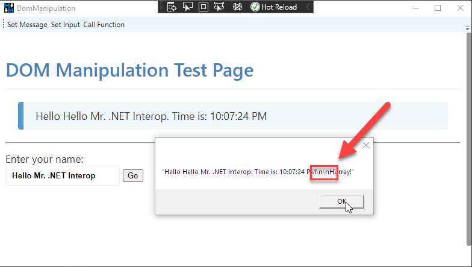
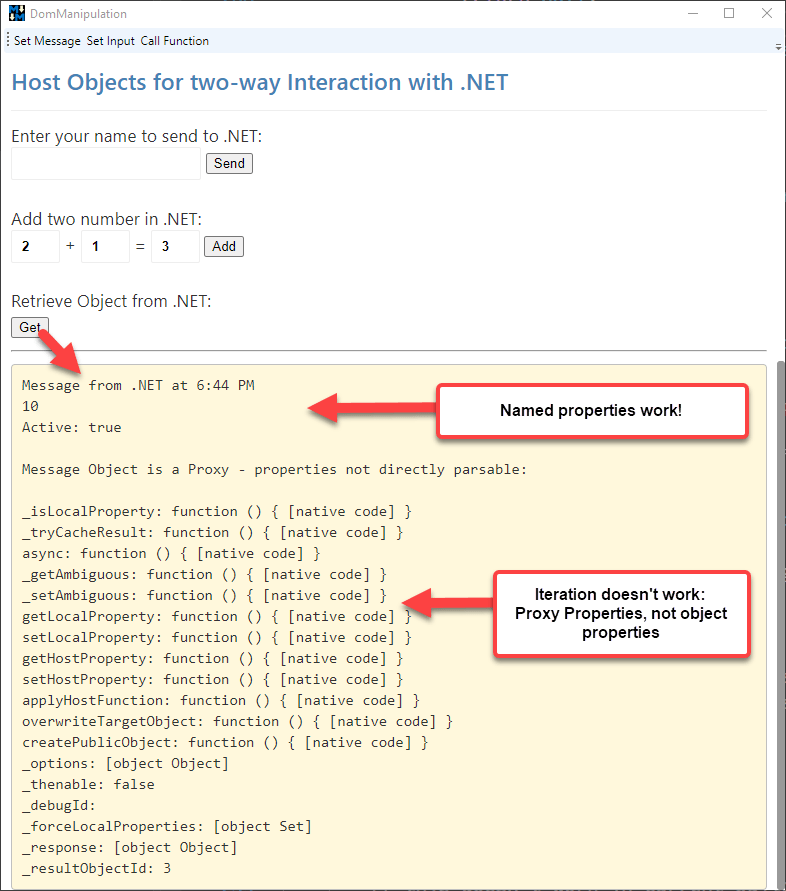

# Interacting with the Chromium WebView2 Control from .NET - Part 2

[In Part 1 of this article](https://weblog.west-wind.com/posts/2021/Jan/14/Taking-the-new-Chromium-WebView2-Control-for-a-Spin-in-NET-Part-1) I talked about the basics of using the `WebView2` control in a WPF application by dropping the control on a form, setting the browser environment and using the `.Source` property or `.NavigateToString()` to set the content of the browser.

In this installment I'll talk about how to interact with the WebView's rendered HTML page for basic manipulation on of the HTML DOM in a rendered page, as well as calling JavaScript code in the loaded HTML document and calling back from the JavaScript code into .NET code.

## Accessing the HTML DOM and Manipulating Content
If you've used the old IE WebBrowser control before, you're familiar the `webBrowser.Document` property which allowed direct access to the HTML DOM via .NET API wrapped around the IE COM object interfaces. It allowed for deep interaction with the loaded HTML page, using a .NET API.

Unfortunately, **the `WebView2` control has no direct interface to the DOM**. Instead you need to use a **string based scripting function - `ExecuteScriptAsync()` - to essentially evaluate a statement or block of statements** of JavaScript code.**

Currently `ExecuteScriptAsync()` is the only way to interact with the loaded document.

### A quick Review of WebView2 Intialization
To keep this post somewhat self-contained, here's a quick review of how to use the control and initialize it in a .NET application (for more detail [see Part1](https://weblog.west-wind.com/posts/2021/Jan/14/Taking-the-new-Chromium-WebView2-Control-for-a-Spin-in-NET-Part-1)):

* Ensure the WebView2 Runtime is installed
* Add the `Microsoft.Web.WebView2` NuGet Package
* Add the WebView Control to your Form, UserControl or other Container Control
* Set up the WebView Environment during Startup
* Set the `webView.Source` property to navigate
* Or use `webView.NavigateToString()` to display HTML content from string

To put the control into a WPF Window:

```xml
<Window
	xmlns:wv2="clr-namespace:Microsoft.Web.WebView2.Wpf;assembly=Microsoft.Web.WebView2.Wpf"
/>
...
<DockPanel x:Name="DockWrapper" Grid.Row="2" Panel.ZIndex="2" >
	
    <wv2:WebView2 Name="webView"  Visibility="Collapsed" 
                  Source="{Binding Url}"
    />
</DockPanel>
```

And to initialize:

```csharp
// WPF Window
public DomManipulation()
{
    InitializeComponent();

    // get notified when page has loaded
    webView.NavigationCompleted += WebView_NavigationCompleted;
    
    // force to async initialization
    InitializeAsync();
}

async void InitializeAsync()
{
    // must create a data folder if running out of a secured folder that can't write like Program Files
    var env = await  CoreWebView2Environment.CreateAsync(userDataFolder: System.IO.Path.Combine(System.IO.Path.GetTempPath(),"MarkdownMonster_Browser"));
    await webView.EnsureCoreWebView2Async(env);

    // Optional: Map a folder from the Executable Folder to a virtual domain
    // NOTE: This requires a Canary preview currently (.720+)
    webView.CoreWebView2.SetVirtualHostNameToFolderMapping(
        "test.editor", "HtmlSample",
        CoreWebView2HostResourceAccessKind.Allow);
	
	// You can then navigate the file from disk with the domain
	webView.Source = new Uri(@"https://test.editor/index.html"); 
	
    webView.CoreWebView2.OpenDevToolsWindow();
}
```

This example initializes the WebView2 control by specifying the location for browser state and then initializes the control, maps a folder and then navigates to a URL.

The code maps a local folder to a *virtual domain name* (which is optional) which allows navigating a local folder as if it were a WebSite. 

> Using a *virtual domain* has a number of advantages over using `file:///c:/folder/index.html` style syntax:
> 
> * You can run XHR requests in JavaScript code
> * You don't run into zone security issues
> * Pages behaves as a Web app would, not file based one

You can also directly reference a file on disk as a file Uri, so this works too:

```csharp
webView.Source = new Uri(Path.Combine(Environment.CurrentDirectory,"HtmlSample\\index.html"));
```
### Make sure the Document is Loaded!
Once you've navigated the document, it loads asynchronously and if you plan on interacting with the DOM document, you have to make sure the document is loaded before you start accessing content in the document.

To do this you have to either:

* **Load the page and interact with it later**  
UI interactions that occur after the document have fully loaded don't need any special attention, unless load is really slow. You can just load and fire away in your UI events like button clicks, selections etc.

* **Interact with the Page at Load Time**  
If however you need to modify the document, or pass data into it on startup, you need to ensure that page has loaded before you can interact with it and you can events to tell you when the document is ready for interaction.

There are two events that notify you when the page is done loading:

* NavigationCompleted
* CoreWebView2.DOMContentLoaded <small>*(not available in release SDK yet)*</small>

For current SDK and Control release only `NavigationCompleted` is available. `DOMContentLoaded` is brand new, and only available in preview releases so for now you shouldn't use it but I mention it because going forward this likely will be the appropriate API to use for accurate document completion.

Using `WebView.NavigationCompleted` event you can ensure the document is loaded:

```csharp
public DomManipulation()
{
    InitializeComponent();
    webView.NavigationCompleted += WebView_NavigationCompleted;
    ...
    
    InitializeAsync();
}

private async void WebView_NavigationCompleted(object sender, CoreWebView2NavigationCompletedEventArgs e)
{
    // Now it's safe to interact with the DOM after load
    var msg = "Hello from a newly loaded .NET window.";
    await webView.ExecuteScriptAsync($"document.getElementById('Notice').innerText = '{msg}';");
}
```

In the future with WebView2 SDK (722+) a new event `CoreWebView2.DOMContentLoaded` is available:

```csharp
webView.CoreWebView2.DOMContentLoaded += CoreWebView2_DOMContentLoaded;
```

Once available I would recommend `DOMContentLoaded` as it more specifically ensures that the document has in fact loaded. However, out of necessity I've been using `NavigationCompleted` to date and that has worked without problems.

### Using ExecuteScriptAsync to manipulate the DOM
In the code snippet above you can see a simple example of `ExecuteScriptAsync()` fired during document startup. That code basically inserts some text into the live HTML DOM.

`ExecuteScriptAsync()` is the method you need to use to interact with the DOM document in any way. The signature looks like this:

```csharp
public Task<string> ExecuteStringAsync(string scriptToExecute)
```

Note that **this method only accepts a single string parameter** which must hold the code to execute as well as any 'data' passed. That's the messy part: Making sure that parameters are encoded properly into a string value, when passed from .NET to JavaScript.

This is a pain, especially if you have to write more than a single statement. Yuk! :poop: But, as bad as this 'API' interface is, it's functional and has good performance. In Markdown Monster I do a fair bit of interaction between .NET and JavaScript and using this limited API gets the job done even if it's awkward. I'll also show some ways to mitigate the messiness later on in the post.

**The method returns an optional string result** for any functions or values accessed that return a value or `null` for functions that don't return a value. Result values are returned JSON encoded strings. So if you call JavaScript function that returns a complex value or even a string it'll be JSON encoded.

The result is `Task<string>` which means the method is always called asynchronously and expects `await` or `Task` handling. If sequence matters make sure you use `await` or `Task` continuation blocks to ensure things execute in the correct order. If you don't use `await` or `Task` continuations, there's no guarantee that methods will execute or complete in the same order started.

There are a few scenarios where `ExecuteScritpAsync()` can be used:

* Interacting with DOM Directly
* Calling into global JavaScript code

### Accessing DOM Content
The most basic scenario is directly interacting with the already loaded document and the only way we can do this is via `ExecuteScriptAsync()`.

The following examples come from the `HtmlSample` page, which has a few buttons that operate on the document and pokes values into the page:


Here are some of the DOM access operations:

#### During Page Load
*modifying DOM content*

```csharp
private async void WebView_NavigationCompleted(object sender, CoreWebView2NavigationCompletedEventArgs e)
{
    // Now it's safe to interact with the DOM after load
    var msg = "Hello from a newly loaded .NET window.";
    await webView.ExecuteScriptAsync($"document.getElementById('Notice').innerText = '{msg}';");
}
```

This example, simply assigns some text to a DOM element.

#### From a button Click
*interacting with a form and clicking a button*

```csharp
private async void SetInput_Click(object sender, RoutedEventArgs e)
{
    // You can run multiple commands one after the other
    var script = "document.getElementById('txtName').value = 'Dotnetter';";
    await webView.ExecuteScriptAsync(script);

    script = "document.getElementById('btnSayHello').click();";
    await webView.ExecuteScriptAsync(script);
}        
```

This example assigns a value to the textbox and then simulates a click on the button. Note that I'm running 2 operations as two separate script operations. If you do this, make sure you use `await` or a `Task` continuation to make sure the commands run in the correct order and complete one after the other. Without the `await` both run simultaneously which in this case may produce the wrong result (ie. click happening before the value is set).

The above code is contrived of course and you can simplify it by running it as a single script operation instead:

```csharp
private async void SetInput_Click(object sender, RoutedEventArgs e)
{
    // alternately you can also combine the operations into a single
    // multi-command script that executes all at once
    var script =@"document.getElementById('txtName').value = 'Dotnetter';
                 document.getElementById('btnSayHello').click();";
    await webView.ExecuteScriptAsync(script);
}
```

## Interoperating between .NET and JavaScript
The previous section gives you some idea how the .NET -> JavaScript interaction works using `ExecuteScriptAsycn()` which is the only way to call into the Document and JavaScript code. In this section I'll expand on this concept and then also show how you can do the reverse and call from JavaScript into .NET

### Calling a JavaScript Global Function from .NET
The process for calling JavaScript code directly is not very different from invoking the DOM manipulation code I used in the previous section. 

The difference is that here I'll call **global JavaScript** code of the page by accessing global functions or any other **global** object that is exposed and so can be referenced by `ExecuteScriptAsync()`. The key is that anything you call from `ExecuteScriptAsync()` **has to be global** in order for that interop call to access it!

If you control the content of the page you're interacting with, or you are generating it as part of your application, one way to reduce the messiness of the `ExecuteScriptAsync()` string formatting is to consolidate any JavaScript script code from .NET into a function in the host page. So rather than screwing around with scripting the JavaScript from .NET with complex string encoding create a wrapper function in JavaScript and call that with a simple function call that receives one set of parameters or an object.

Keeping with the simplistic HTML page from above, I can use a **global** function in the HTML page like this:

```html
<script>
    var $btn = document.getElementById("btnSayHello");
    $btn.addEventListener("click",(ev)=> ShowMessage());

    // global function - callable with ExecuteScriptAsync
    function showMessage(txt) {
        var $notice = document.getElementById("Notice");
        if(!txt)
            txt = document.getElementById("txtName").value;
        else
            document.getElementById("txtName").value = txt;

        
        var text =  "Hello " + txt + ". Time is: " + new Date().toLocaleTimeString();
        $notice.innerText = text;

        return text ;
    }
</script>
```

And call that from .NET:

```csharp
private async void CallFunction_Click(object sender, RoutedEventArgs e)
{
    // If possible the better way to do this is create a function in the page
    // and execute that to combine commands.
    //
    // it'll be easier to debug and easier to pass a single context to
    // instead of passing the same context information to many commands
    var msg = "Hello Mr. .NET Interop";

    // data needs to be encoded as JSON to embed as string
    msg = JsonSerializationUtils.Serialize(msg);

    var script = $"showMessage({msg})";
    
    string text = await webView.ExecuteScriptAsync(script);

    // Important: Results are serialized JSON - including string results
    text = JsonSerializationUtils.Deserialize<string>(text);

    MessageBox.Show(text);
}
```

Again, contrived example here, but imagine you're running a bit more code to manipulate the document and you can see that the code calling from .NET is a lot simpler making a single function call as opposed to many JavaScript commands and data encoded as a string.

The main operation is:

```csharp
string jsonResult = await webView.ExecuteScriptAsync($"ShowMessage({msg})");
```

One important thing to note is that the 'data' passed and retrieved needs to be JSON encoded. For values embedded, JSON creates strings that are recognizable by JavaScript as values. For example if the `msg` parameter contained a `\` or `"` or a linefeed, the msg would break the JavaScript because the string wouldn't be valid. But by JSON encoding the string is encoded with the appropriate escape chars.

Likewise any result that comes back from the JavaScript call - the final `text` message that is displayed and returned - is returned as a JSON encoded value. In this case it's a string. If you don't deserialize the string you'd get the `\n\n` in the string instead of the linebreaks:



So it's important to **always deserialize** any results that come back from the `ExecuteScriptAsync()` call so that the value - the string in this case - is properly decoded and displays the line breaks properly.

If the idea of calling one or more global function is abhorrent to you, you can also reduce functionality down into one global object map that holds all the other global functions or data in JavaScript:

```html
<script>
// one global object to consolidate many operations
window.page = {
    data: { ... },
    msg: "My hair's on fire!",
	showMessage: function() { ... }
}
</script>
```

Then:

```csharp
await ExecuteScript("page.msg = 'My hair\'s still on fire in .NET';" + 
                    "page.showMessage('hello crazy world');");
```

### Calling .NET Code from JavaScript
You can also call .NET code from JavaScript in the WebView2. There are two mechanisms available to do this:

* **`WebMessageReceived` event**  
This is a string based message API that allows you to essentially push raw string messages into .NET via an event. It's up to the event handler to decide what to do with the incoming and how to parse it. With a little bit of infrastructure code, you can build a messaging solution that routes actions to specific methods in an Interop class for example.

* **Host Objects passed into JavaScript**  
You can use a function to pass a .NET object into JavaScript and expose it to script code via well known host object that JavaScript code can call. This allows more control as you can set property values and call functions directly, although what you can pass as parameters is limited.

#### Using the WebMessageReceived - one way Messaging into .NET
The `CoreWebView2.WebMessageReceived` event can be used to send one-way messages into .NET from JavaScript. It's a simple messaging API that basically allows you to pass a string to .NET, but there's no way to return anything back to JavaScript using this API.

In it's simplest form you can use `postMessage()` like this:

```javascript
window.page = {
    sendMessage: function (action, data) {
        window.chrome.webview.postMessage('Hello .NET from JavaScript');
    }
```    

You can pass either a string or an object/value to `postMessage()`. In .NET I can pick up this message using the `WebMessageReceived` event handler. If you pass a non-string value/object, it's serialized into JSON and you can retrieve it using `e.WebMessageAsJson`. Strings can be retrieved with `e.TryGetWebMessageAsString()` in .NET.

The most basic syntax looks like this:

```csharp
// to hook up in ctor or InitializeAysnc()
webView.WebMessageReceived += WebView_WebMessageReceived;

// to handle
private void WebView_WebMessageReceived(object sender, CoreWebView2WebMessageReceivedEventArgs e)
{
	// retrieve raw message (passed as string in JS)
    var string = e.TryGetWebMessageAsString();
    
    // or get a serialized object (passed as object/value in JS)
    // var json = e.WebMessageAsJson;    
    
    // ... do something with the string
}
```

More realistically though you'd want to handle multiple operations and need to differentiate message types and to do this I personally like to send a JSON message object in the following format:

```javascript
window.page = {
    sendMessage: function (action, data) {
        var msgObject = { 
        	action: action, 
        	data: data 
        };
        var json = JSON.stringify(msgObject);
        window.chrome.webview.postMessage(json);
    }
```    

By separating the data and the message 'id' I can pick out the id, and based on that 'route' the request to an appropriate handler. By using JSON explicitly I can sidestep the confusing auto-JSON conversion that works differently for strings and non-string values. By always passing a JSON string I **know** that the message is always a string and always will have an `action` associated with it.

With that I can pick up messages and route them based on the action:

```csharp
private void WebView_WebMessageReceived(object sender, CoreWebView2WebMessageReceivedEventArgs e)
{
    var json = e.TryGetWebMessageAsString();  // always a JSON string
    if (string.IsNullOrEmpty(json))
        return;

    // retrieve just the action out of the JSON
    var action = WebMessage.ParseAction(json) ?? string.Empty;

    // route and handle messages
    if (action == "showMessage")
    {
        var msg = WebMessage<string>.Parse(json);
        MessageBox.Show(this, msg.Data, "WPF Message from JavaScript",
            MessageBoxButton.OK, MessageBoxImage.Information);
    }
    else if (action == "updateEditor") 
    {
       // ... do something else
    }
    else 
    {
        MessageBox.Show(this, 
            "Message sent from JavaScript without an action:\n\n" + 
            json, "WPF Message from JavaScript",
            MessageBoxButton.OK, MessageBoxImage.Information);
    }
}
```

> If you only need to send messages that are one-way from JS into .NET, and you don't need to retrieve result values, this simple mechanism is the preferred way to call back into .NET according to [a Microsoft response](https://github.com/MicrosoftEdge/WebView2Feedback/issues/823#issuecomment-763252756). Although it requires serialization to pass data back and forth the mechanism is quite efficient and the COM based messaging we'll discuss next actually uses this same mechanism for the message transport with additional COM overhead.

Using this message based approach allows for quite a bit of flexibility - in fact you could easily route messages, to method calls in an object via reflection for easy message to method mapping for example.

#### Using WebView2 Host Objects - two-way messaging into .NET
The other approach to calling into .NET from JavaScript is to use **Host Objects**, which is a mechanism that allows you to proxy .NET objects into the WebView control, where they can be accessed to pass data to and receive data back from .NET.

This approach is closer to what we could do in the old IE WebBrowser control where you pretty much could pass any object into the DOM via a JavaScript call, and you could attach it as you needed to.

You explicitly specify that you want to share an object in JavaScript when the control is loaded or each time the control refreshes (if necessary). 

Start by creating an object in .NET:

```csharp

public class DomManipulationDotnetInterop
{
    public string Name { get; set; } = "Rick";
    public string Message { get; set; } = "Hello {0} from .NET. Time is: {1}";

    public string SayHello(string name)
    {
        string msg = string.Format(Message, name, DateTime.Now.ToString("t"));

        MessageBox.Show( msg, "WPF Message from JavaScript",
                        MessageBoxButton.OK, MessageBoxImage.Information);
        return msg;
    }
}
```

Then in the application startup you can share this object:

```csharp
// in ctor if it doesn't change for each page, or in `NavigationCompleted`
DotnetInterop = new DomManipulationDotnetInterop();
webView.CoreWebView2.AddHostObjectToScript("dotnet", DotnetInterop);
```

This now exposes the host object in JavaScript and can be accessed via:

```javascript
// async - requires that .NET Method is async
window.chrome.webview.hostObjects.dotnet;
var msg = window.chrome.webview.hostObjects.dotnet.SayHello("Rick")
				.then( function(msg) { alert(msg); }, 
                       function() { alert('failed'); })

// sync
window.chrome.webview.hostObjects.sync.dotnet;
var msg = window.chrome.webview.hostObjects.sync.dotnet.SayHello("Rick")
alert(msg);
```

> #### @icon-warning Don't Cache Host Objects
> In current previews it's not recommended to cache a host objects beyond a single JavaScript closure context.  In current versions, caching the objects caused me various problems where the host object would fail and disconnect with very weird behavior after the disconnect. Make sure you always reload from the base `hostObjects` instance for now! 


There are two 'versions' - the first one is async and sync. The recommendation is to use async whenever possible, but you can also make sync calls. Unfortunately there are currently problems with async calls into .NET that return values. Sync calls work fine though.


> #### @icon-warning Async Result Problems
> In the current version there seem to be lots of problems with async calls that return values - I've not been able to get JavaScript `await` or Promise results to return me a value. I can get the .NET code to fire, but the results don't seem to make it back into JavaScript.

Due to these problems I've been using the following approach:

* **Async signatures for any methods that don't return a value**  
This works for fire and forget requests as well as async requests where you need to wait for completion, but not a for a result value.

* **Sync signatures for any methods that return a value**
Sync signatures always work, and for now are required for anything that returns you a result value.

This is likely a bug that'll get fixed in future runtime releases but for now make sure you test async calls and make sure they return values correctly. If they don't use sync methods and calls - for now.

#### Passing Objects to JavaScript
The good news is that in the latest runtime, you can now pass simple objects back from .NET into JavaScript and access those objects in JavaScript code. If the object values can serialize you should be able to access the properties.

Here's a simplistic example. In CSharp create a message object and method on the Interop object that can return it:


```csharp
public class MessageInfo
{
    public string Message { get; set; } = "Test Message";

    public string Type { get; set; } = "Information";

    public int Number { get; set; } = 10;

    public bool IsActive {get; set; } = true;
}

public class DomManipulationDotnetInterop
{
    // ...
    
    public MessageInfo GetMessageInfo()
    {
        return new MessageInfo()
        {
            Message = $"Message from .NET at {DateTime.Now:t}"
        };
    }
}
```

Then in JavaScript you can retrieve this object like this:

```javascript
getMessageInfo: function() {
    var msgObject = window.chrome.webview.hostObjects.sync.dotnet.GetMessageInfo();

    document.getElementById('MessageInfo').innerHTML =
        msgObject.Message +
        "<br/>" +
        msgObject.Number +
        "<br/>" +
        "Active: " +
        msgObject.IsActive +
}
```

The JavaScript message receives this object and you can access the simple properties on this object. You can also nest objects, but there are serialization limitations here so not everything will work. Try to stick to simple types that can be translated easily into JSON as that's what the proxy uses to marshal the values.

Note that the object you get back in `msgObject` is not a standard JavaScript object, but rather a proxy object. So while you can access the properties by name as shown above, iterating over the properties does not work.
  
Here's a modified version that demonstrates:

```javascript
getMessageInfo: function() {
    var msgObject = window.chrome.webview.hostObjects.sync.dotnet.GetMessageInfo();

    // note object cannot be parsed - It's a proxy!
    var msg = "";
    for(var prop in msgObject) {
         msg += prop +
         ": " + msgObject[prop] +
             "<br />";
     }
    msg = "Message Object is a Proxy - properties can't be iterated:<br/><br/>" + msg;

    document.getElementById('MessageInfo').innerHTML =
        msgObject.Message +   // direct access works
        "<br/>" +
        msgObject.Number +
        "<br/>" +
        "Active: " +
        msgObject["IsActive"] +   // Property  Indexer works
        "<br/ ><br />" +
        msg;
}
```

Notice the `for` loop iterates over the properties to get a list of properties. But this does not give `Message`, `Number`, `IsActive` etc. but rather Proxy properties:



#### Passing Objects to .NET
Unfortunately passing data back to .NET is not as flexible and only provides superficial support for this functionality as you can only pass string (or no) parameters to .NET methods.

This means you can't officially pass objects, or even more than a single parameter!

The following .NET signatures cannot be called from JavaScript directly:

```csharp
// does not work
public string PassMessageInfo(MessageInfo msg)
{
    MessageInfo msgInfo = $"{msg.Message} {msg.Type} {msg.Number} {msg.Inactive}"
    return msgInfo;
}
```

```javascript
// does not work 
public string PassMessageInfo(string message, string type, int number)
{
    return $"{message} {type} {number}  ";
}
```

Both fail with **No such interface supported** when passing an object, or individual parameters for each of the values.

The only option that works here, is to pass a single string parameter which can be JSON object. For anything but single string parameters JSON is the parameter of choice.

In .NET you can set up the called method like this:

```csharp
public string PassMessageInfo(string jsonMessageInfo)
{
    var msg = JsonSerializationUtils.Deserialize<MessageInfo>(jsonMessageInfo);
    string message = $"{msg.Message} {msg.Type} {msg.Number} {msg.IsActive}";
    return message;
}
```

And you call it like this from JavaScript:

```javascript
passMessageInfo: function () {
    var msgObject = {
        Message: "Hello from JavaScript",
        Type: "Warning",
        Number: 20,
        IsActive: true
    };

    var json = JSON.stringify(msgObject);
    var msg = window.chrome.webview.hostObjects.sync.dotnet.PassMessageInfo(json);
    document.getElementById("ReturnedMessageInfoString").innerText = msg;
}
```

This is tedious to do, but for me personally not a huge issue as callbacks from JavaScript into .NET tend to be few, while calls from .NET into JavaScript which are more common and better supported via Host Objects.


## Summary
Phew - lot of information here packed into Part2 for doing Interop between .NET and the document and calling JavaScript code from .NET and .NET code from JavaScript. 

Basic document interaction and calling of JavaScript functions is supported via `ExecuteScriptAsync()` and while this string based API can be a messy, it's highly functional and allows for a lot of flexibility in calling all sorts of logic in the HTML document and JavaScript. I've been integrating this functionality in two of my applications with very good results and performance is surprisingly good even with the serialization involved.

For accessing .NET from JavaScript you have several options including using the message based, one-way `WebMessageReceived` event handler that allows simple message based string messages to be passed from JavaScript to .NET. **Host Objects** allow exposing .NET objects to JavaScript to provide data sharing and for JavaScript code to call into .NET code with relative ease. There are some tricky issues to deal with still regarding `sync`  and `async` access, but these issues are likely related to the preview status of the WebView2 control. You also have to deal with limitations of how data can be passed to .NET only via a single string parameter - most likely requiring JSON serialization to pass more extensive data between JavaScript and .NET.

All in all these APIs are simple enough to use and although there are still some preview issues to deal with I've found the interfaces to perform very well and work reliably for the interfaces that are currently supported. Unfortunately it's not clear what features will still improve in the future as the documentation for Interop currently is minimal. This post describes some of my experiments to figure out what works and what doesn't.

This concludes part 2 of this post series about the WebView2 control about Interaction and Interop. In part 3 I'll look at a real world example of how I integrated the WebView control into Markdown Monster and how I abstracted the Interop features to make it easier to call both into JavaScript and .NET.


## .NET Code Interacting with the Web Browser
So at this point you know the basics on how to put a control up and navigate it for content which is going to cover a large swath of applications.  Now lets take a brief look at how you can interact with content in the browser by:

* Making calls into JavaScript from .NET
* Calling back into .NET from JavaScript

The Web Browser control provides a number of mechanisms for interacting with the browser and basically executing code in it. You can also pass a previously registered .NET object into the document once the document has loaded to call back into .NET components.

In this section I'll look at the basic semantics of doing this - In my real world Markdown Monster integration walk through I'll talk about some wrappers that I use to make this process a little easier and more portable across different types of browser implementations via a few small abstractions.

Let's start with the basics.

### Calling into JavaScript
The most common thing you're likely to do is to manipulate the content or interact with code inside of the browser document. It's possible to do this with any HTML page potentially as you can basically execute code in the browser using the global namespace. As long as you can somehow reference the document or anything loaded in the document you can - with some convoluted string formatting - execute that code from .NET. 

You do this via the WebView's `ExecuteScriptAsync()` method which simply executes any globally accessible code. The code scope is essentially the same as what you can access from the Developer Console in the running document.

> In order to execute code in the browser you need to be able to access **global scope objects/functions**. Browser APIs are global, but if you're interacting with JavaScript code make sure there's a `window` reference to get to it!

The simplest example is calling a built-in function like  `window.alert()` which looks like this:


```csharp
private async void HelloWorld_Click(object sender, RoutedEventArgs e)
{
    // Simplest thing you can do - execute script on global scope
    await webView.ExecuteScriptAsync($"window.alert('Hello from .NET. Time is: {DateTime.Now.ToString("HH:mm:ss")}.')");
}
```

Although a string based API is pretty cumbersome to write as code, it *can* handle any kind of content. Combined with JSON serialization for objects and values (more on this later) you can pass complex data objects and long string data to JavaScript with relative ease.

`ExecuteScriptAsync()` returns a `string` result which is the result from the called JavaScript function serialized as JSON. We'll look at an example in the next section.

Another important point: All calls to execute script are **async**. 

#### A little more realistic Example
The screen shot above is my play-around-with application which is the stripped down text editor I use in Markdown Monster running in the HTML page. It gives me a realistic way to try some actual interop operations I'd use in my app, as well as ways to call back into .NET.  I apologize for the crappy UI and messy interface - it's just my playground with some semi-realistic code I'm working on but you can download and play around with that as well as the Markdown Monster WebView2 Addin I'll talk about later that provides a real-world example.

So, to give you a better idea on what you can do with this type of interop lets look at anexample with the editor. If you look at the sample form you'll notice the **Set Content** and **Get Content** Toolbar buttons on the form. They can be used to:

* Get the current Markdown document text from the editor
* Set a static string of Markdown text and performs a modification tasks on the text

The editor is a JavaScript component, and I have a large application wrapper around common tasks which is exposed in a single global variable called `window.textEditor`:

```js
var te = window.textEditor = {
   // many API functions
}
```

In short this allows me to access the Editor API using `ExecuteScriptAsync()`. To get the document's content I can use the `textEditor` variable to get access to my application's Editor API and call the `getvalue()` function:

```csharp
private async void GetContent_Click(object sender, RoutedEventArgs e)
{
    var cmd = "textEditor.getvalue()";
    var json = await webView.ExecuteScriptAsync(cmd);
    var markdown = JsonSerializationUtils.Deserialize<string>(json);

    MessageBox.Show(this, markdown, "Editor Content");
}
```

Again, notice the call has to be async - it will fail if you call it without an `await/Task` even if you don't access the result value.

The method result is always `string` or `null` and the result is a JSON result. In this case it's the editor's current content **as a JSON string** and because it's JSON I have to deserialize it first.

The button click handler to set the content is similar:

```csharp
private async void SetContent_Click(object sender, RoutedEventArgs e)
{
     webView.CoreWebView2.ExecuteScriptAsync("textEditor.setvalue('# Hello World')");
}
```

That works, but it's not quite as simple as that.  What if the passed parameter text contains quotes or line breaks for example? The content passed actually would have to be JSON encoded to work in string format.

So:

```csharp
private async void SetContent_Click(object sender, RoutedEventArgs e)
{
    var markdown = @"# New Markdown text

This text is inserted from .NET into this document.
and this is **bold**.

Quotes: double - "" and single '

* Line 1
* Line 2    
";

    var cmd = "textEditor.setvalue(" + JsonSerializationUtils.Serialize(markdown) + ")";
    webView.CoreWebView2.ExecuteScriptAsync(cmd);
}            
```

The idea is that basically you have to serialize every parameter. Messy but it works.

#### Making JavaScript Interop calls Easier
To make this process a little easier I use a JavaScript helper that wraps calls lets me a use a slightly easier syntax like:

```csharp
string result = JsInterop.CallMethod<string>("getvalue");
JsInterop.CallMethod("setvalue",markdown);
```

The helper automatically helps the parameter and result value serialization so that I can use a simpler more natural interface.

Here's what the wrapper looks like:

```csharp
public class JavaScriptInterop
{
    private WebView2 WebView { get; }

    // instantiated during page load after webView is initialized
    public JavaScriptInterop(WebView2 webView)
    {
        WebView = webView;
    }
    
    public async Task<TResult> CallMethod<TResult>(string method, params object[] parameters)
    {
        StringBuilder sb = new StringBuilder();
        sb.Append("textEditor." + method + "(");

        if (parameters != null)
        {
            for (var index = 0; index < parameters.Length; index++)
            {
                object parm = parameters[index];
                var jsonParm = JsonSerializationUtils.Serialize(parm);
                sb.Append(jsonParm);
                if (index < parameters.Length - 1)
                    sb.Append(",");
            }
        }
        sb.Append(")");

        var cmd = sb.ToString();
        string result = await WebView.CoreWebView2.ExecuteScriptAsync(cmd);
        
        Type resultType = typeof(TResult);
        return (TResult) JsonSerializationUtils.Deserialize(result, resultType, true);
    }

    public async Task CallMethod(string method, params object[] parameters)
    {
        StringBuilder sb = new StringBuilder();
        sb.Append("textEditor." + method + "(");

        if (parameters != null)
        {
            for (var index = 0; index < parameters.Length; index++)
            {
                object parm = parameters[index];
                var jsonParm = JsonSerializationUtils.Serialize(parm);
                sb.Append(jsonParm);
                if (index < parameters.Length - 1)
                    sb.Append(",");
            }
        }
        sb.Append(")");

        await WebView.CoreWebView2.ExecuteScriptAsync(sb.ToString());
    }
}    
```

Notice that this is **not totally generic** - I use `sb.Append("textEditor." + method + "(")` to explicitly route any method calls to my global `textEditor` JavaScript instance and any functions are executed on that object. You leave that blank and only use a function call for global functions or point at your own custom object.

In a real application I'd add every interop function - ie. `SetContent(string md)` and `GetContent()` - as a method on this class rather than calling the `Execute()` methods directly from application code.

We should note that passing data to JavaScript in this fashion is essentially **pass by value**. You can't pass a reference. Anything you want to send has to be serialized. You can pass objects, but in my experience this has been sketchy - I'd recommend that you pass only simple parameters and if you explicitly need to pass a larger object or array, use a JSON string parameter type and deserialize it explicitly in the target JavaScript function.

#### Scripting for Apples
Calling into JavaScript from .NET is a very common use case and it's something that's very different from how things worked in the old WebBrowser control. The scripting is required in order **to interact with any part of the document**. So even making a simple change to a document HTML setting or value on the page requires `ExecuteScriptAsync()`:

```cs
await webView.ExecuteScriptAsync("document.getElementById('txtName').value = 'rick'");
```

In the old Web Browser control you could use the .NET Interop browser object to do this sort of thing - there's no such thing in the WebView2 control, so you have to use the scripting interface. Note you can execute multiple commands via `;` separation and return a value from the script you provide - it behaves like an embedded script block.

> Any invalid code in `ExecuteScriptAsync()` will fail without proper error information and no easy way to examine values or logic at runtime so if possible you'll want to minimize the code you execute in a single `ExecuteScriptAsync()` call. 
>
> If you control the content you are rendering in the WebView control, my suggestion is to always place script code into the page or external JavaScript file with some way to globally access the functionality. As shown above, this will be easier to execute and test and use with the Developer Tools to debug if necessary. 

### Calling back to .NET from JavaScript
Calling into JavaScript or script code from .NET is pretty common for a hybrid application. Calling back from JavaScript into .NET is probably a bit less common but is also supported. 

There are a number of mechanisms available.

* A `postMessage()` interface that lets you send messages to the host container
* A Host object that can be made accessible (via COM) on the WebView client instance

Out of these two I much prefer the latter approach, which is more RPC style, vs the message based approach of the former.

#### The postMessage() Interface
This basic interface allows you to post a message from client JavaScript code to the .NET host using code like the following:

```js
function Callback(method) {       
  var parms = [];
  if (arguments.length > 1) {
      for(var i = 1; i < arguments.length; i++)
          parms[i-1] = arguments[i];
  }
        
  var json = JSON.stringify( { method: 'showMessage', parameters: parms } );
  window.chrome.webview.postMessage(json);        
}
```

For this to be useful you have to set up a messaging strategy that includes information on what data to send to the host. In this case I have a method name, and parameters to execute.

On the Host side you can capture the `WebMessageReceived` event to capture the text sent from the client.

```csharp
private void CoreWebView2_WebMessageReceived(object sender, Microsoft.Web.WebView2.Core.CoreWebView2WebMessageReceivedEventArgs e)
{
    var text = e.TryGetWebMessageAsString();

    var callbackJson = JsonSerializationUtils.Deserialize<JsonCallbackObject>(text);
    if (callbackJson.Method == "showMessage")
    {
        MessageBox.Show(callbackJson.Parameters[0] + "\r\n" + text, "WPF Window");
    }
}
...
[DebuggerDisplay("JsonCallback: {Method}")]
public class JsonCallbackObject
{
    public string Method { get; set; }

    public List<object> Parameters { get; } = new List<object>();
}
```

The idea is that you can potentially send many messages and you then route each message to a specific operation using the parameters sent from the JavaScript client.

This could be expanded to automatically map the callbackJson object to an invocation handler that executes methods on a known object.

While this message based approach works, and is probably quite efficient, it feels a bit cumbersome and unnatural, especially compared to the ability to pass an object into the browser directly for access as I show next.

#### Registering a HostObject into JavaScript
The other approach is to register a .NET object and make it directly available in JavaScript via a **registered Host Object**.

To do this you'll want to:

* Create an lightweight class specifically to receive callbacks
* Mark it as `[ComVisible]` and `[ClassInterface(ClassInterfaceType.AutoDual)]`
* Register the object into the page when it's loaded
* In JavaScript reference with `window.chrome.webview.hostObjects.objName`
* Call your method (sync or async)

First you'll need an object that gets registered. You can use any object, but since this object is marshalled over COM you want to make this thing as light-weight as you can. I prefer to only add methods to this object. You'll probably also want to pass in a **private** reference to your Model or Window and the JavaScript interop object in order to be able to actually do something useful - just make sure to keep those bigger objects internal to the implementation so they don't leak into the COM interface.


```cs
[ClassInterface(ClassInterfaceType.AutoDual)]
[ComVisible(true)]
public class DotnetInterop
{
    // var res = window.chrome.webview.hostObjects.mm.HelloWorld('rick');
    // alert(res);
    public async Task<string> HelloWorld(string name)
    {
        await Task.Delay(300);
        return $"Hello Async World, {name}!   - Message: {Message.Message}";
    }
    
    // var res = window.chrome.webview.hostObjects.sync.mm.HelloWorldSync('rick');
    // alert(res);
    public string HelloWorldSync(string name)
    {
        Thread.Sleep(300);
        return $"Hello Sync World, {name}!   - Message: {Message.Message}";
    }
}
```

Once you have this object you need to register it with the WebView during initialization:

```cs
DotnetInterop = new DotnetInterop();   // on Model or Window

// add the object as `mm` to the WebView
webView.CoreWebView2.AddHostObjectToScript("mm", Interop);
```

Once this has been done the object now becomes available as part of the host object which can be referenced inside of the JavaScript:

```js
// async call - not the HelloWorldAsync() version currently won't work (bug)
//              call is executed asynchronously from JavaScript but executes sync in .NET
var res = await window.chrome.webview.hostObjects.mm.HelloWorldSync('rick');

// explicit synchronous call - use the `.sync` sub-object
var res = window.chrome.webview.hostObjects.sync.mm.HelloWorldSync('rick');
```

You can pass simple parameters to the host - so string, number, bool, dates and that works. It's also possible to pass objects to .NET this way but you'll need to use Reflection to peel out the values. `dynamic` doesn't appear to work. 

Personally I try and avoid complex parameters if possible or pass a JSON serialized string instead for complex data.

In the example form you can click the **Hello JS World** button to test this which will:

* Fire toolbar handler which calls `ExecuteScriptAsync()` in .NET
* Executes `callHelloWorldDotnet()` function in JavaScript
* Calls the .NET host object to retrieve HelloWorld message from .NET
* The retrieved text is displayed in JavaScript

Let's start with the JavaScript function that is called from the .NET button handler:

```js
async function callHelloWorldDotnet(name) {
    // .NET object reference (async)
    var msg = await window.chrome.webview.hostObjects.mm.HelloWorldSync(name);
    alert(msg);
}
```

Here's the .NET Button handler code that calls it:

```csharp
private async void HelloWorldFromJavaScript_Click(object sender, RoutedEventArgs e)
{
    await webView.ExecuteScriptAsync(  
       $"callHelloWorldDotnet('Mr. JavaScript')");
}
```

And here is the .NET Callback handler method on the `DotnetInterop` object:

```csharp
public string HelloWorldSync(string name)
{
    var res = $"Hello Sync World, {name}! - Message: 'This text was retrieved from .NET and shown here in JavaScript.'\n" +
              "Button click in .NET -> JavaScript Function calls Hello World in .NET -> Returns message to JavaScript";
    return res;
}
```

Again, for now I'm calling the **sync** version because the async version doesn't seem to work in the current build. 

To be very clear: The JavaScript code calling uses async code, but the .NET call is synchronous.

#### Interop Strategy
As you can see there are quite a few options for interacting with the Web browser using Interop. 

**JavaScript Interop from .NET**

* Use `.ExecuteScriptAsync()`
* Access global objects/functions

**.NET Callbacks from JavaScript**

* Use `.postMessage()` API
* Use registered Host objects

For both scenarios I recommend that you create wrappers around outbound and inbound objects. For the JavaScript calls I showed the `JavaScriptInterop` object abstraction that makes it easier to call functions in JavaScript from .NET I recommend you add methods for each call that performance the appropriate `CallMethod()` call to let the application make simple method calls.

Likewise for the callback to .NET scenario, regardless of whether you use a postMessage or Host object, I recommend wrapping each callback into a method in a specific interop class. If you use Host Objects you have to do this anyway, but even if you use `postMessage()` it's a good idea to use a unified wrapper to house all your methods by routing all incoming messages into single object that handles the messages and routes them to internal methods for processing.

Why all this? It'll make it much easier to switch to some other browser technology if you need to. In Markdown Monster I'm now on my third browser implementation and having these object abstractions makes it much easier to swap technologies by basically replacing a few worker methods that implement call invocations and routing.


## Real World Experiment
Ok enough of this 
Markdown Monster WebView Chromium Previewer Addin

## Problems

### Parameters need to be passed as string or object

For example, here's a method that expects an `int` and `bool` parameter. 

However, the following does not work:

```csharp
public void gotoLine(int editorLine, bool noRefresh)
```

but it does if parameters are converted to object.

```csharp
public void gotoLine(object editorLine, object noRefresh)
```

It looks like the control can work with string parameters, but it doesn't do well with other types and you'll either have to pass them using `object` parameters or pass a string with JSON data.

### Using JSON for Complex Data
The IE control was very easy to work with when it came to interop - you could define objects in JavaScript and call these objects easily from .NET using natural parameter syntax and even simple object structures. The reverse also worked easily: You could pass an object to a JavaScript function, and store the object in the document, and then call methods and set properties on that object using JavaScript. In both directions that just worked. 

With the `WebView2` this doesn't work the same way and requires some pretty funky workarounds. JavaScript execution from .NET involves calling an `ExecuteScript()` method on an Interop object and this method only takes a single string parameter that holds an expression that is 'executed' on the document.

While it does allow you to call code in JavaScript it's pretty ugly:

```csharp
await WebBrowser.CoreWebView2.ExecuteScriptAsync(codeToExecute);
```

The tricky part with this is if you need to parse parameters you need to properly encode them. 

I created some helpers to facilitate this using a `CallMethod()` method in an interop object:

```csharp
/// <summary>
/// Calls a method with simple parameters: String, number, boolean
/// This version returns no results.
/// </summary>
/// <param name="method"></param>
/// <param name="parameters"></param>
/// <returns></returns>
public async Task CallMethod(string method, params object[] parameters)
{
    StringBuilder sb = new StringBuilder();
    sb.Append(method + "(");

    if (parameters != null)
    {
        for (var index = 0; index < parameters.Length; index++)
        {
            object parm = parameters[index];
            var jsonParm = JsonSerializationUtils.Serialize(parm);
            sb.Append(jsonParm);
            if (index < parameters.Length - 1)
                sb.Append(",");
        }
    }
    sb.Append(")");

    await WebBrowser.CoreWebView2.ExecuteScriptAsync(sb.ToString());
}
```

So I can use something like this from C# code:

```csharp
string selText = await JsInterop.CallMethod("getSelection");
JsInterInterop.CallMethod("setSelection","**" + selText + "**", true);
```

Both of these calls are encoded into the appropriate `ExecuteScriptAsync()` string values with the parameters properly JavaScript encoded (using JSON strings).

It works but it's tedious as heck and easy to make mistakes with.

## Problem Child
So now we come to the trade-off part of using this control. It's clearly the way forward for Microsoft and Web Content rendering, but there are a few prices to pay:

* Memory Usage is high due to Chromium Engine
* Currently Runtime Installs are required 
* Environment control is very limited


### Runtime Installs are Required
This is probably the biggest problem with this control - it requires explicit runtime support - it's not enough to just have Microsoft Edge Chromium installed and an additional WebView runtime has to be installed.

Runtimes can be installed from here:

https://developer.microsoft.com/en-us/microsoft-edge/webview2/

The runtimes are not small (the global runtime installer is an 80mb download, while the local installable runtime is a 120mb cab file). So not something you really want to ship with 1k or 2k .NET application.

In Markdown Monster I'm side stepping shipping the runtime by checking for an installed version and if not found, directing users to download and install the runtime, then re-try. That works but yeah, that's ugly.

#### Runtime Versions are a Pain
It gets worse though: You can't just use any runtime. The runtime **has to be of the same version or larger than the installed runtime your code is binding to** which happens to be the NuGet Packages Build number.

Not only do you need to check for whether it's installed but also check for the version and potentially install a newer version. 

What this amounts to is back to fucking DLL hell. Leave it to the Windows folks to bring that back.

It sure would be nice if there was a true evergreen mode where you could just be OK with whatever version of the control is installed. But no the runtime has to be specifically matched to the library version or higher. It's not clear whether that's a function of the library -> Runtime binding or the Chromium version. 

Either way this is big downside to this control as it requires very large,  extra components to install that a typical non-developer is not likely to have already installed.

Booo!

#### Checking and Downloading
In Markdown Monster I have a check routine that checks whether the runtime is installed.

If it isn't installed I prompt the user to download and install the WebView runtime. Since the runtimes are very large (80-120mb) I don't want to ship it as part of the stock download. Rather I let people install it if it's not there or out of date:


```csharp
private bool IsWebViewVersionInstalled(bool showDownloadUi = false)
{
    string versionNo = null;
    Version asmVersion = null;
    Version ver = null;

    try
    {
        versionNo = CoreWebView2Environment.GetAvailableBrowserVersionString();

        // strip off 'canary' or 'stable' verison
        versionNo = StringUtils.ExtractString(versionNo, "", " ", allowMissingEndDelimiter: true)?.Trim();
        ver = new Version(versionNo);

        asmVersion = typeof(CoreWebView2Environment).Assembly.GetName().Version;

        if (ver.Build >= asmVersion.Build)
            return true;
    }
    catch {}

    IsActive = false;

    if (!showDownloadUi)
        return false;


    var form = new BrowserMessageBox() {
        Owner = mmApp.Model.Window,
        Width = 600,
        Height= 440,
        Title="WebView Runtime Installation",
    };

    form.Dispatcher.Invoke(() => form.Icon = new ImageSourceConverter()
        .ConvertFromString("pack://application:,,,/WebViewPreviewerAddin;component/icon_32.png") as ImageSource);

    var markdown = $@"
### WebView Runtime not installed or out of Date
The Microsoft Edge WebView Runtime is
{ ( !string.IsNullOrEmpty(versionNo) ?
        "out of date\n\nYour Build: " + ver.Build +
        "   -   Required Build: " + asmVersion.Build :
        "not installed")  }.

In order to use the Chromium preview you need to install this runtime by downloading from the [Microsoft Download Site](https://developer.microsoft.com/en-us/microsoft-edge/webview2/).

**Do you want to download and install the Edge WebView Runtime?**

*<small>clicking **Yes** sends you to the Microsoft download site.  
choose the **Evergreen Bootstrapper** download.</small>*";

        form.ClearButtons();
        var yesButton = form.AddButton("Yes", FontAwesomeIcon.CheckCircle, Brushes.Green);
        yesButton.Width = 90;
        var noButton = form.AddButton("No", FontAwesomeIcon.TimesCircle, Brushes.Firebrick);
        noButton.Width = 90;
        form.ShowMarkdown(markdown);
    

        form.ShowDialog();
        if (form.ButtonResult == yesButton)
        {
            mmFileUtils.OpenBrowser("https://developer.microsoft.com/en-us/microsoft-edge/webview2/");
        }

        return false;
}
```

which is then called by the startup and toggle routines:

```csharp
// addin loader of Preview Browser
public override IPreviewBrowser GetPreviewBrowserUserControl()
{
    if (!IsActive || !IsWebViewVersionInstalled())
        return null;  // use the default IE control
    
    return new WebViewPreviewControl();
}

// toggle between IE and WebPreview2
public override void OnExecute(object sender)
{
    if (Model.Window == null || !IsWebViewVersionInstalled(true))
        return;

    IsActive = !IsActive;
    Model.Window.LoadPreviewBrowser();

    if (IsActive)
        Model.Window.ShowStatusSuccess("Switched to Chromium based Preview Browser.");
    else
        Model.Window.ShowStatusSuccess("Switched to Internet Explorer based Preview Browser.");
}        
```

<div style="margin-top: 30px;font-size: 0.8em;
            border-top: 1px solid #eee;padding-top: 8px;">
    
    this post created and published with the 
    <a href="https://markdownmonster.west-wind.com" 
       target="top">Markdown Monster Editor</a> 
</div>

### WebView Runtime Setup Installation
If you want to install the runtime as part of a setup there are number of options too. You can install:

1. A small bootstrapper that downloads and installs (1.2mb)
2. Evergreen full runtime installation (~80mb)
3. Specific version runtime installation (~120mb)

For #2 and #3 you unpack the runtime files and ship them as part of your application installation folders. You can then specify where the application can find the runtime:

```CS
 var env = await CoreWebView2Environment.CreateAsync(
    browserExecutableFolder: <locationOfRuntime>
);
```

For the #1 bootstrapper EXE, you can execute the EXE as part of an installation process or as part of an application startup process (for portable installs).

For Markdown Monster I use [Inno Setup](https://jrsoftware.org/isinfo.php) and in order to install the WebView2 runtime as part of the install I can add the following to the `[Files]` and `[Run]` sections:

```text
[Files]
Source: ".\MicrosoftEdgeWebview2Setup.exe"; DestDir: "{tmp}"; Flags: deleteafterinstall

[Run]
Filename: "{tmp}\MicrosoftEdgeWebview2Setup.exe";
```

I use the Web Bootstrapper which runs and checks to see what's installed and downloads the latest evergreen version. In Markdown Monster I check version before the WebView (which is at this point an optional component) is activated to ensure a valid version is available and if not send users to the download page to install the latest WebView Runtime. An alternative is to bundle and launch the bootstrapper as part of the installation process and run it each time when application is installed or updated.

Note that exactly how the bootstrapper works may change in the future. For now it looks like the installer downloads and installs or updates to the latest version of the WebView2 runtime and installs it machine wide.

### WPF Airspace: No go
Like the old WebBrowser control the `WebView2` control is a windowed control and **does not respect WPF AirSpace** (z-ordering), so you can't stack controls on top of the `WebView2` control. The WebView always renders topmost in the container it's defined in. 

So in the following example where a button is placed on top of the control:

```xml
 <DockPanel x:Name="DockWrapper" Grid.Row="2" Panel.ZIndex="2" >
    <wv2:WebView2 Name="webView"  Visibility="Collapsed" 
                  AccessKeyManager.AccessKeyPressed="webView_AccessKeyPressed"
                  KeyDown="webView_KeyDown"
                  KeyUp="webView_KeyUp"
                  Source="{Binding Url}"
    />
    
</DockPanel>

<!-- doesn't show  WebView blots it out -->
<Button Grid.Row="2" Panel.ZIndex="10" Width="200" Height="32">Test Button</Button>
```

The button simply doesn't show up as the WebView overlays it. 

### Startup Visibility
Another issue is that on control startup the control renders a gray content **before any other content can load**. In the screen capture below I have a green background on my form with a maximized control and yet 


The workaround for this is to hide the control during load and make it visible only after the control is about to render actual content.

```xml
<wv2:WebView2 Name="webView"  Visibility="Collapsed" />
```

Then in the `NavigationCompleted` handler:

```csharp
 private void WebView_NavigationCompleted(object sender, Microsoft.Web.WebView2.Core.CoreWebView2NavigationCompletedEventArgs e)
{
  
    if (e.IsSuccess)
        Model.Url = webView.Source.ToString();

    if (firstload)
    {
        firstload = false;
        webView.Visibility = Visibility.Visible;
    }
}
```

This delays displaying the control as long as possible and bypasses the initially slow initialization phase. By the time the navigation has occurred the control is ready to display content which avoids the 'gray flash'.

### WebView and Memory: It's not LightWeight
The WebView2 control is a big ass memory hog. Check out this memory view for an MM instance with 2 documents open:


Using the old IE WebBrowser control MM would run roughly around 20mb for smallish docs and maybe somewhere around 100mb for many sizable documents open at the same time. The WebView does that old max memory usage as a bare minimum.

That's not surprising though - if you check Chrome, Edge, Brave etc. and look at their memory usage it's similar - it's an artifact of the Chromium Web Browser engine that uses available memory liberally. With some experimenting and opening a bunch of documents in MM I was unfortunately able to get it use 500mb of memory. Holy shit...

I'm not sure what to do about that - that's just a price to pay for using Chromium as a rendering engine I guess.


## Resources

* [WebView2 Runtime Installation Page](https://developer.microsoft.com/en-us/microsoft-edge/webview2/)
* [Edge Canary Installs](https://www.microsoftedgeinsider.com/en-us/download)
* [WebView2 Feedback Repo on GitHub](https://github.com/MicrosoftEdge/WebView2Feedback/issues/)