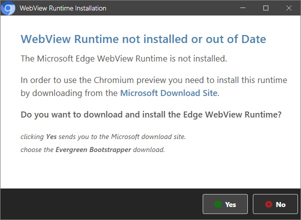

# Integrating the WebView2 Control into the Markdown Monster WPF Application - Part 3


<small>

This is Part 3 of a 3 part post series:

* [Part 1 - Taking the new Chromium WebView2 Control for a Spin in .NET](https://weblog.west-wind.com/posts/2021/Jan/14/Taking-the-new-Chromium-WebView2-Control-for-a-Spin-in-NET-Part-1)
* [Part 2 - Chromium WebView2 Control and .NET to JavaScript Interop](https://weblog.west-wind.com/posts/2021/Jan/26/Chromium-WebView2-Control-and-NET-to-JavaScript-Interop-Part-2)
* **Part 3 - Real World Integration and Lessons Learned**

</small>


[In Part 1 of this article](https://weblog.west-wind.com/posts/2021/Jan/14/Taking-the-new-Chromium-WebView2-Control-for-a-Spin-in-NET-Part-1) I talked about the basics of using the `WebView2` control in a WPF application by dropping the control on a form, setting the browser environment and using the `.Source` property or `.NavigateToString()` to set the content of the browser. In [Part 2 ](https://weblog.west-wind.com/posts/2021/Jan/26/Chromium-WebView2-Control-and-NET-to-JavaScript-Interop-Part-2) I talked about how to interact with content in the control and interop between .NET and JavaScript using `ExecuteScriptAsync()` to call into JavaScript code from .NET, and using **HostObjects** into .NET from JavaScript. 

In Part 3 I want to talk about a few best practices and some real world issues that I encountered when using the Web Browser control in [Markdown Monster](https://markdownmonster.west-wind.com). I'm writing this article quite a bit after the previous ones, and since then I've migrated Markdown Monster now completely over to use WebView2 control from the IE WebBrowser control, which has isolated a few common patterns and dos and donts.

Let's jump in.

## Markdown Monster and HTML Content
For background, Markdown Monster is a Windows WPF application. It's a Markdown editor which includes a live preview, and it heavily uses Web content both for the actual editor interface as well as the Previewer. For the initial WebView2 integration I'll talk about in this post, I started with the previewer interface (the right panel in banner figure) which is a live preview of the rendered Markdown. 

The interaction for the HTML in the previewer is frequently updated based on code triggers in the editor, and requires quite a bit of interaction with JavaScript operations for syncing the editor content to the rendered HTML preview, popping WPF UI, and a few other things. In other words even though the output displayed is just plain HTML, there's a lot more going on that meets the eye at first glance.

### Structuring HTML Page Interop
As mentioned in the previous installments, plain rendering of HTML with the WebView2 is pretty straight forward:

* Drop the WebView control onto a form or Container
* Make sure the control gets initialized during page load
* Set the `Source` property to navigate

If you plan to interop with the page you'll also need to:

* Handle `NavigationCompleted` before interacting with the document
* Use `ExecuteScriptAsync()` to call into JavaScript
* Use **Host Objects** or `WebMessageReceived` events to call .NET functionality from JavaScript


But if you want to interact with the document either by direct DOM manipulation or by calling JavaScript from .NET or calling .NET from JavaScript, the process gets more involved quickly. In Part 2 I talked extensively about interop between .NET and JavaScript in both directions, so if haven't been following along I recommend you read that first as it discusses the basic Interop concepts for the WebView. I'll use those same concepts here in the code samples but I won't explain all the base details which I covered in Part 2.


## .NET Code Interacting with the Web Browser
So at this point you know the basics on how to put a control up and navigate it for content which is going to cover a large swath of applications.  Now lets take a brief look at how you can interact with content in the browser by:

* Making calls into JavaScript from .NET
* Calling back into .NET from JavaScript

The Web Browser control provides a number of mechanisms for interacting with the browser and basically executing code in it. You can also pass a previously registered .NET object into the document once the document has loaded to call back into .NET components.

In this section I'll look at the basic semantics of doing this - In my real world Markdown Monster integration walk through I'll talk about some wrappers that I use to make this process a little easier and more portable across different types of browser implementations via a few small abstractions.

Let's start with the basics.

### Calling into JavaScript
The most common thing you're likely to do is to manipulate the content or interact with code inside of the browser document. It's possible to do this with any HTML page potentially as you can basically execute code in the browser using the global namespace. As long as you can somehow reference the document or anything loaded in the document you can - with some convoluted string formatting - execute that code from .NET. 

You do this via the WebView's `ExecuteScriptAsync()` method which simply executes any globally accessible code. The code scope is essentially the same as what you can access from the Developer Console in the running document.

> In order to execute code in the browser you need to be able to access **global scope objects/functions**. Browser APIs are global, but if you're interacting with JavaScript code make sure there's a `window` reference to get to it!

The simplest example is calling a built-in function like  `window.alert()` which looks like this:


```csharp
private async void HelloWorld_Click(object sender, RoutedEventArgs e)
{
    // Simplest thing you can do - execute script on global scope
    await webView.ExecuteScriptAsync($"window.alert('Hello from .NET. Time is: {DateTime.Now.ToString("HH:mm:ss")}.')");
}
```

Although a string based API is pretty cumbersome to write as code, it *can* handle any kind of content. Combined with JSON serialization for objects and values (more on this later) you can pass complex data objects and long string data to JavaScript with relative ease.

`ExecuteScriptAsync()` returns a `string` result which is the result from the called JavaScript function serialized as JSON. We'll look at an example in the next section.

Another important point: All calls to execute script are **async**. 

#### A little more realistic Example
The screen shot above is my play-around-with application which is the stripped down text editor I use in Markdown Monster running in the HTML page. It gives me a realistic way to try some actual interop operations I'd use in my app, as well as ways to call back into .NET.  I apologize for the crappy UI and messy interface - it's just my playground with some semi-realistic code I'm working on but you can download and play around with that as well as the Markdown Monster WebView2 Addin I'll talk about later that provides a real-world example.

So, to give you a better idea on what you can do with this type of interop lets look at anexample with the editor. If you look at the sample form you'll notice the **Set Content** and **Get Content** Toolbar buttons on the form. They can be used to:

* Get the current Markdown document text from the editor
* Set a static string of Markdown text and performs a modification tasks on the text

The editor is a JavaScript component, and I have a large application wrapper around common tasks which is exposed in a single global variable called `window.textEditor`:

```js
var te = window.textEditor = {
   // many API functions
}
```

In short this allows me to access the Editor API using `ExecuteScriptAsync()`. To get the document's content I can use the `textEditor` variable to get access to my application's Editor API and call the `getvalue()` function:

```csharp
private async void GetContent_Click(object sender, RoutedEventArgs e)
{
    var cmd = "textEditor.getvalue()";
    var json = await webView.ExecuteScriptAsync(cmd);
    var markdown = JsonSerializationUtils.Deserialize<string>(json);

    MessageBox.Show(this, markdown, "Editor Content");
}
```

Again, notice the call has to be async - it will fail if you call it without an `await/Task` even if you don't access the result value.

The method result is always `string` or `null` and the result is a JSON result. In this case it's the editor's current content **as a JSON string** and because it's JSON I have to deserialize it first.

The button click handler to set the content is similar:

```csharp
private async void SetContent_Click(object sender, RoutedEventArgs e)
{
     webView.CoreWebView2.ExecuteScriptAsync("textEditor.setvalue('# Hello World')");
}
```

That works, but it's not quite as simple as that.  What if the passed parameter text contains quotes or line breaks for example? The content passed actually would have to be JSON encoded to work in string format.

So:

```csharp
private async void SetContent_Click(object sender, RoutedEventArgs e)
{
    var markdown = @"# New Markdown text

This text is inserted from .NET into this document.
and this is **bold**.

Quotes: double - "" and single '

* Line 1
* Line 2    
";

    var cmd = "textEditor.setvalue(" + JsonSerializationUtils.Serialize(markdown) + ")";
    webView.CoreWebView2.ExecuteScriptAsync(cmd);
}            
```

The idea is that basically you have to serialize every parameter. Messy but it works.

#### Making JavaScript Interop calls Easier
To make this process a little easier I use a JavaScript helper that wraps calls lets me a use a slightly easier syntax like:

```csharp
string result = JsInterop.CallMethod<string>("getvalue");
JsInterop.CallMethod("setvalue",markdown);
```

The helper automatically helps the parameter and result value serialization so that I can use a simpler more natural interface.

Here's what the wrapper looks like:

```csharp
public class JavaScriptInterop
{
    private WebView2 WebView { get; }

    // instantiated during page load after webView is initialized
    public JavaScriptInterop(WebView2 webView)
    {
        WebView = webView;
    }
    
    public async Task<TResult> CallMethod<TResult>(string method, params object[] parameters)
    {
        StringBuilder sb = new StringBuilder();
        sb.Append("textEditor." + method + "(");

        if (parameters != null)
        {
            for (var index = 0; index < parameters.Length; index++)
            {
                object parm = parameters[index];
                var jsonParm = JsonSerializationUtils.Serialize(parm);
                sb.Append(jsonParm);
                if (index < parameters.Length - 1)
                    sb.Append(",");
            }
        }
        sb.Append(")");

        var cmd = sb.ToString();
        string result = await WebView.CoreWebView2.ExecuteScriptAsync(cmd);
        
        Type resultType = typeof(TResult);
        return (TResult) JsonSerializationUtils.Deserialize(result, resultType, true);
    }

    public async Task CallMethod(string method, params object[] parameters)
    {
        StringBuilder sb = new StringBuilder();
        sb.Append("textEditor." + method + "(");

        if (parameters != null)
        {
            for (var index = 0; index < parameters.Length; index++)
            {
                object parm = parameters[index];
                var jsonParm = JsonSerializationUtils.Serialize(parm);
                sb.Append(jsonParm);
                if (index < parameters.Length - 1)
                    sb.Append(",");
            }
        }
        sb.Append(")");

        await WebView.CoreWebView2.ExecuteScriptAsync(sb.ToString());
    }
}    
```

Notice that this is **not totally generic** - I use `sb.Append("textEditor." + method + "(")` to explicitly route any method calls to my global `textEditor` JavaScript instance and any functions are executed on that object. You leave that blank and only use a function call for global functions or point at your own custom object.

In a real application I'd add every interop function - ie. `SetContent(string md)` and `GetContent()` - as a method on this class rather than calling the `Execute()` methods directly from application code.

We should note that passing data to JavaScript in this fashion is essentially **pass by value**. You can't pass a reference. Anything you want to send has to be serialized. You can pass objects, but in my experience this has been sketchy - I'd recommend that you pass only simple parameters and if you explicitly need to pass a larger object or array, use a JSON string parameter type and deserialize it explicitly in the target JavaScript function.

#### Scripting for Apples
Calling into JavaScript from .NET is a very common use case and it's something that's very different from how things worked in the old WebBrowser control. The scripting is required in order **to interact with any part of the document**. So even making a simple change to a document HTML setting or value on the page requires `ExecuteScriptAsync()`:

```cs
await webView.ExecuteScriptAsync("document.getElementById('txtName').value = 'rick'");
```

In the old Web Browser control you could use the .NET Interop browser object to do this sort of thing - there's no such thing in the WebView2 control, so you have to use the scripting interface. Note you can execute multiple commands via `;` separation and return a value from the script you provide - it behaves like an embedded script block.

> Any invalid code in `ExecuteScriptAsync()` will fail without proper error information and no easy way to examine values or logic at runtime so if possible you'll want to minimize the code you execute in a single `ExecuteScriptAsync()` call. 
>
> If you control the content you are rendering in the WebView control, my suggestion is to always place script code into the page or external JavaScript file with some way to globally access the functionality. As shown above, this will be easier to execute and test and use with the Developer Tools to debug if necessary. 

### Calling back to .NET from JavaScript
Calling into JavaScript or script code from .NET is pretty common for a hybrid application. Calling back from JavaScript into .NET is probably a bit less common but is also supported. 

There are a number of mechanisms available.

* A `postMessage()` interface that lets you send messages to the host container
* A Host object that can be made accessible (via COM) on the WebView client instance

Out of these two I much prefer the latter approach, which is more RPC style, vs the message based approach of the former.

#### The postMessage() Interface
This basic interface allows you to post a message from client JavaScript code to the .NET host using code like the following:

```js
function Callback(method) {       
  var parms = [];
  if (arguments.length > 1) {
      for(var i = 1; i < arguments.length; i++)
          parms[i-1] = arguments[i];
  }
        
  var json = JSON.stringify( { method: 'showMessage', parameters: parms } );
  window.chrome.webview.postMessage(json);        
}
```

For this to be useful you have to set up a messaging strategy that includes information on what data to send to the host. In this case I have a method name, and parameters to execute.

On the Host side you can capture the `WebMessageReceived` event to capture the text sent from the client.

```csharp
private void CoreWebView2_WebMessageReceived(object sender, Microsoft.Web.WebView2.Core.CoreWebView2WebMessageReceivedEventArgs e)
{
    var text = e.TryGetWebMessageAsString();

    var callbackJson = JsonSerializationUtils.Deserialize<JsonCallbackObject>(text);
    if (callbackJson.Method == "showMessage")
    {
        MessageBox.Show(callbackJson.Parameters[0] + "\r\n" + text, "WPF Window");
    }
}
...
[DebuggerDisplay("JsonCallback: {Method}")]
public class JsonCallbackObject
{
    public string Method { get; set; }

    public List<object> Parameters { get; } = new List<object>();
}
```

The idea is that you can potentially send many messages and you then route each message to a specific operation using the parameters sent from the JavaScript client.

This could be expanded to automatically map the callbackJson object to an invocation handler that executes methods on a known object.

While this message based approach works, and is probably quite efficient, it feels a bit cumbersome and unnatural, especially compared to the ability to pass an object into the browser directly for access as I show next.

#### Registering a HostObject into JavaScript
The other approach is to register a .NET object and make it directly available in JavaScript via a **registered Host Object**.

To do this you'll want to:

* Create an lightweight class specifically to receive callbacks
* Mark it as `[ComVisible]` and `[ClassInterface(ClassInterfaceType.AutoDual)]`
* Register the object into the page when it's loaded
* In JavaScript reference with `window.chrome.webview.hostObjects.objName`
* Call your method (sync or async)

First you'll need an object that gets registered. You can use any object, but since this object is marshalled over COM you want to make this thing as light-weight as you can. I prefer to only add methods to this object. You'll probably also want to pass in a **private** reference to your Model or Window and the JavaScript interop object in order to be able to actually do something useful - just make sure to keep those bigger objects internal to the implementation so they don't leak into the COM interface.


```cs
[ClassInterface(ClassInterfaceType.AutoDual)]
[ComVisible(true)]
public class DotnetInterop
{
    // var res = window.chrome.webview.hostObjects.mm.HelloWorld('rick');
    // alert(res);
    public async Task<string> HelloWorld(string name)
    {
        await Task.Delay(300);
        return $"Hello Async World, {name}!   - Message: {Message.Message}";
    }
    
    // var res = window.chrome.webview.hostObjects.sync.mm.HelloWorldSync('rick');
    // alert(res);
    public string HelloWorldSync(string name)
    {
        Thread.Sleep(300);
        return $"Hello Sync World, {name}!   - Message: {Message.Message}";
    }
}
```

Once you have this object you need to register it with the WebView during initialization:

```cs
DotnetInterop = new DotnetInterop();   // on Model or Window

// add the object as `mm` to the WebView
webView.CoreWebView2.AddHostObjectToScript("mm", Interop);
```

Once this has been done the object now becomes available as part of the host object which can be referenced inside of the JavaScript:

```js
// async call - not the HelloWorldAsync() version currently won't work (bug)
//              call is executed asynchronously from JavaScript but executes sync in .NET
var res = await window.chrome.webview.hostObjects.mm.HelloWorldSync('rick');

// explicit synchronous call - use the `.sync` sub-object
var res = window.chrome.webview.hostObjects.sync.mm.HelloWorldSync('rick');
```

You can pass simple parameters to the host - so string, number, bool, dates and that works. It's also possible to pass objects to .NET this way but you'll need to use Reflection to peel out the values. `dynamic` doesn't appear to work. 

Personally I try and avoid complex parameters if possible or pass a JSON serialized string instead for complex data.

In the example form you can click the **Hello JS World** button to test this which will:

* Fire toolbar handler which calls `ExecuteScriptAsync()` in .NET
* Executes `callHelloWorldDotnet()` function in JavaScript
* Calls the .NET host object to retrieve HelloWorld message from .NET
* The retrieved text is displayed in JavaScript

Let's start with the JavaScript function that is called from the .NET button handler:

```js
async function callHelloWorldDotnet(name) {
    // .NET object reference (async)
    var msg = await window.chrome.webview.hostObjects.mm.HelloWorldSync(name);
    alert(msg);
}
```

Here's the .NET Button handler code that calls it:

```csharp
private async void HelloWorldFromJavaScript_Click(object sender, RoutedEventArgs e)
{
    await webView.ExecuteScriptAsync(  
       $"callHelloWorldDotnet('Mr. JavaScript')");
}
```

And here is the .NET Callback handler method on the `DotnetInterop` object:

```csharp
public string HelloWorldSync(string name)
{
    var res = $"Hello Sync World, {name}! - Message: 'This text was retrieved from .NET and shown here in JavaScript.'\n" +
              "Button click in .NET -> JavaScript Function calls Hello World in .NET -> Returns message to JavaScript";
    return res;
}
```

Again, for now I'm calling the **sync** version because the async version doesn't seem to work in the current build. 

To be very clear: The JavaScript code calling uses async code, but the .NET call is synchronous.

#### Interop Strategy
As you can see there are quite a few options for interacting with the Web browser using Interop. 

**JavaScript Interop from .NET**

* Use `.ExecuteScriptAsync()`
* Access global objects/functions

**.NET Callbacks from JavaScript**

* Use `.postMessage()` API
* Use registered Host objects

For both scenarios I recommend that you create wrappers around outbound and inbound objects. For the JavaScript calls I showed the `JavaScriptInterop` object abstraction that makes it easier to call functions in JavaScript from .NET I recommend you add methods for each call that performance the appropriate `CallMethod()` call to let the application make simple method calls.

Likewise for the callback to .NET scenario, regardless of whether you use a postMessage or Host object, I recommend wrapping each callback into a method in a specific interop class. If you use Host Objects you have to do this anyway, but even if you use `postMessage()` it's a good idea to use a unified wrapper to house all your methods by routing all incoming messages into single object that handles the messages and routes them to internal methods for processing.

Why all this? It'll make it much easier to switch to some other browser technology if you need to. In Markdown Monster I'm now on my third browser implementation and having these object abstractions makes it much easier to swap technologies by basically replacing a few worker methods that implement call invocations and routing.


## Real World Experiment
Ok enough of this 
Markdown Monster WebView Chromium Previewer Addin

## Problems

### Parameters need to be passed as string or object

For example, here's a method that expects an `int` and `bool` parameter. 

However, the following does not work:

```csharp
public void gotoLine(int editorLine, bool noRefresh)
```

but it does if parameters are converted to object.

```csharp
public void gotoLine(object editorLine, object noRefresh)
```

It looks like the control can work with string parameters, but it doesn't do well with other types and you'll either have to pass them using `object` parameters or pass a string with JSON data.

### Using JSON for Complex Data
The IE control was very easy to work with when it came to interop - you could define objects in JavaScript and call these objects easily from .NET using natural parameter syntax and even simple object structures. The reverse also worked easily: You could pass an object to a JavaScript function, and store the object in the document, and then call methods and set properties on that object using JavaScript. In both directions that just worked. 

With the `WebView2` this doesn't work the same way and requires some pretty funky workarounds. JavaScript execution from .NET involves calling an `ExecuteScript()` method on an Interop object and this method only takes a single string parameter that holds an expression that is 'executed' on the document.

While it does allow you to call code in JavaScript it's pretty ugly:

```csharp
await WebBrowser.CoreWebView2.ExecuteScriptAsync(codeToExecute);
```

The tricky part with this is if you need to parse parameters you need to properly encode them. 

I created some helpers to facilitate this using a `CallMethod()` method in an interop object:

```csharp
/// <summary>
/// Calls a method with simple parameters: String, number, boolean
/// This version returns no results.
/// </summary>
/// <param name="method"></param>
/// <param name="parameters"></param>
/// <returns></returns>
public async Task CallMethod(string method, params object[] parameters)
{
    StringBuilder sb = new StringBuilder();
    sb.Append(method + "(");

    if (parameters != null)
    {
        for (var index = 0; index < parameters.Length; index++)
        {
            object parm = parameters[index];
            var jsonParm = JsonSerializationUtils.Serialize(parm);
            sb.Append(jsonParm);
            if (index < parameters.Length - 1)
                sb.Append(",");
        }
    }
    sb.Append(")");

    await WebBrowser.CoreWebView2.ExecuteScriptAsync(sb.ToString());
}
```

So I can use something like this from C# code:

```csharp
string selText = await JsInterop.CallMethod("getSelection");
JsInterInterop.CallMethod("setSelection","**" + selText + "**", true);
```

Both of these calls are encoded into the appropriate `ExecuteScriptAsync()` string values with the parameters properly JavaScript encoded (using JSON strings).

It works but it's tedious as heck and easy to make mistakes with.

## Problem Child
So now we come to the trade-off part of using this control. It's clearly the way forward for Microsoft and Web Content rendering, but there are a few prices to pay:

* Memory Usage is high due to Chromium Engine
* Currently Runtime Installs are required 
* Environment control is very limited


### Runtime Installs are Required
This is probably the biggest problem with this control - it requires explicit runtime support - it's not enough to just have Microsoft Edge Chromium installed and an additional WebView runtime has to be installed.

Runtimes can be installed from here:

https://developer.microsoft.com/en-us/microsoft-edge/webview2/

The runtimes are not small (the global runtime installer is an 80mb download, while the local installable runtime is a 120mb cab file). So not something you really want to ship with 1k or 2k .NET application.

In Markdown Monster I'm side stepping shipping the runtime by checking for an installed version and if not found, directing users to download and install the runtime, then re-try. That works but yeah, that's ugly.

#### Runtime Versions are a Pain
It gets worse though: You can't just use any runtime. The runtime **has to be of the same version or larger than the installed runtime your code is binding to** which happens to be the NuGet Packages Build number.

Not only do you need to check for whether it's installed but also check for the version and potentially install a newer version. 

What this amounts to is back to fucking DLL hell. Leave it to the Windows folks to bring that back.

It sure would be nice if there was a true evergreen mode where you could just be OK with whatever version of the control is installed. But no the runtime has to be specifically matched to the library version or higher. It's not clear whether that's a function of the library -> Runtime binding or the Chromium version. 

Either way this is big downside to this control as it requires very large,  extra components to install that a typical non-developer is not likely to have already installed.

Booo!

#### Checking and Downloading
In Markdown Monster I have a check routine that checks whether the runtime is installed.

If it isn't installed I prompt the user to download and install the WebView runtime. Since the runtimes are very large (80-120mb) I don't want to ship it as part of the stock download. Rather I let people install it if it's not there or out of date:



```csharp
private bool IsWebViewVersionInstalled(bool showDownloadUi = false)
{
    string versionNo = null;
    Version asmVersion = null;
    Version ver = null;

    try
    {
        versionNo = CoreWebView2Environment.GetAvailableBrowserVersionString();

        // strip off 'canary' or 'stable' verison
        versionNo = StringUtils.ExtractString(versionNo, "", " ", allowMissingEndDelimiter: true)?.Trim();
        ver = new Version(versionNo);

        asmVersion = typeof(CoreWebView2Environment).Assembly.GetName().Version;

        if (ver.Build >= asmVersion.Build)
            return true;
    }
    catch {}

    IsActive = false;

    if (!showDownloadUi)
        return false;


    var form = new BrowserMessageBox() {
        Owner = mmApp.Model.Window,
        Width = 600,
        Height= 440,
        Title="WebView Runtime Installation",
    };

    form.Dispatcher.Invoke(() => form.Icon = new ImageSourceConverter()
        .ConvertFromString("pack://application:,,,/WebViewPreviewerAddin;component/icon_32.png") as ImageSource);

    var markdown = $@"
### WebView Runtime not installed or out of Date
The Microsoft Edge WebView Runtime is
{ ( !string.IsNullOrEmpty(versionNo) ?
        "out of date\n\nYour Build: " + ver.Build +
        "   -   Required Build: " + asmVersion.Build :
        "not installed")  }.

In order to use the Chromium preview you need to install this runtime by downloading from the [Microsoft Download Site](https://developer.microsoft.com/en-us/microsoft-edge/webview2/).

**Do you want to download and install the Edge WebView Runtime?**

*<small>clicking **Yes** sends you to the Microsoft download site.  
choose the **Evergreen Bootstrapper** download.</small>*";

        form.ClearButtons();
        var yesButton = form.AddButton("Yes", FontAwesomeIcon.CheckCircle, Brushes.Green);
        yesButton.Width = 90;
        var noButton = form.AddButton("No", FontAwesomeIcon.TimesCircle, Brushes.Firebrick);
        noButton.Width = 90;
        form.ShowMarkdown(markdown);
    

        form.ShowDialog();
        if (form.ButtonResult == yesButton)
        {
            mmFileUtils.OpenBrowser("https://developer.microsoft.com/en-us/microsoft-edge/webview2/");
        }

        return false;
}
```

which is then called by the startup and toggle routines:

```csharp
// addin loader of Preview Browser
public override IPreviewBrowser GetPreviewBrowserUserControl()
{
    if (!IsActive || !IsWebViewVersionInstalled())
        return null;  // use the default IE control
    
    return new WebViewPreviewControl();
}

// toggle between IE and WebPreview2
public override void OnExecute(object sender)
{
    if (Model.Window == null || !IsWebViewVersionInstalled(true))
        return;

    IsActive = !IsActive;
    Model.Window.LoadPreviewBrowser();

    if (IsActive)
        Model.Window.ShowStatusSuccess("Switched to Chromium based Preview Browser.");
    else
        Model.Window.ShowStatusSuccess("Switched to Internet Explorer based Preview Browser.");
}        
```

<div style="margin-top: 30px;font-size: 0.8em;
            border-top: 1px solid #eee;padding-top: 8px;">
    
    this post created and published with the 
    <a href="https://markdownmonster.west-wind.com" 
       target="top">Markdown Monster Editor</a> 
</div>

### WebView Runtime Setup Installation
If you want to install the runtime as part of a setup there are number of options too. You can install:

1. A small bootstrapper that downloads and installs (1.2mb)
2. Evergreen full runtime installation (~80mb)
3. Specific version runtime installation (~120mb)

For #2 and #3 you unpack the runtime files and ship them as part of your application installation folders. You can then specify where the application can find the runtime:

```CS
 var env = await CoreWebView2Environment.CreateAsync(
    browserExecutableFolder: <locationOfRuntime>
);
```

For the #1 bootstrapper EXE, you can execute the EXE as part of an installation process or as part of an application startup process (for portable installs).

For Markdown Monster I use [Inno Setup](https://jrsoftware.org/isinfo.php) and in order to install the WebView2 runtime as part of the install I can add the following to the `[Files]` and `[Run]` sections:

```text
[Files]
Source: ".\MicrosoftEdgeWebview2Setup.exe"; DestDir: "{tmp}"; Flags: deleteafterinstall

[Run]
Filename: "{tmp}\MicrosoftEdgeWebview2Setup.exe";
```

I use the Web Bootstrapper which runs and checks to see what's installed and downloads the latest evergreen version. In Markdown Monster I check version before the WebView (which is at this point an optional component) is activated to ensure a valid version is available and if not send users to the download page to install the latest WebView Runtime. An alternative is to bundle and launch the bootstrapper as part of the installation process and run it each time when application is installed or updated.

Note that exactly how the bootstrapper works may change in the future. For now it looks like the installer downloads and installs or updates to the latest version of the WebView2 runtime and installs it machine wide.

### WPF Airspace: No go
Like the old WebBrowser control the `WebView2` control is a windowed control and **does not respect WPF AirSpace** (z-ordering), so you can't stack controls on top of the `WebView2` control. The WebView always renders topmost in the container it's defined in. 

So in the following example where a button is placed on top of the control:

```xml
 <DockPanel x:Name="DockWrapper" Grid.Row="2" Panel.ZIndex="2" >
    <wv2:WebView2 Name="webView"  Visibility="Collapsed" 
                  AccessKeyManager.AccessKeyPressed="webView_AccessKeyPressed"
                  KeyDown="webView_KeyDown"
                  KeyUp="webView_KeyUp"
                  Source="{Binding Url}"
    />
    
</DockPanel>

<!-- doesn't show  WebView blots it out -->
<Button Grid.Row="2" Panel.ZIndex="10" Width="200" Height="32">Test Button</Button>
```

The button simply doesn't show up as the WebView overlays it. 

### Startup Visibility
Another issue is that on control startup the control renders a gray content **before any other content can load**. In the screen capture below I have a green background on my form with a maximized control and yet 


The workaround for this is to hide the control during load and make it visible only after the control is about to render actual content.

```xml
<wv2:WebView2 Name="webView"  Visibility="Collapsed" />
```

Then in the `NavigationCompleted` handler:

```csharp
 private void WebView_NavigationCompleted(object sender, Microsoft.Web.WebView2.Core.CoreWebView2NavigationCompletedEventArgs e)
{
  
    if (e.IsSuccess)
        Model.Url = webView.Source.ToString();

    if (firstload)
    {
        firstload = false;
        webView.Visibility = Visibility.Visible;
    }
}
```

This delays displaying the control as long as possible and bypasses the initially slow initialization phase. By the time the navigation has occurred the control is ready to display content which avoids the 'gray flash'.

### WebView and Memory: It's not LightWeight
The WebView2 control is a big ass memory hog. Check out this memory view for an MM instance with 2 documents open:


Using the old IE WebBrowser control MM would run roughly around 20mb for smallish docs and maybe somewhere around 100mb for many sizable documents open at the same time. The WebView does that old max memory usage as a bare minimum.

That's not surprising though - if you check Chrome, Edge, Brave etc. and look at their memory usage it's similar - it's an artifact of the Chromium Web Browser engine that uses available memory liberally. With some experimenting and opening a bunch of documents in MM I was unfortunately able to get it use 500mb of memory. Holy shit...

I'm not sure what to do about that - that's just a price to pay for using Chromium as a rendering engine I guess.


## Resources

* [WebView2 Runtime Installation Page](https://developer.microsoft.com/en-us/microsoft-edge/webview2/)
* [Edge Canary Installs](https://www.microsoftedgeinsider.com/en-us/download)
* [WebView2 Feedback Repo on GitHub](https://github.com/MicrosoftEdge/WebView2Feedback/issues/)