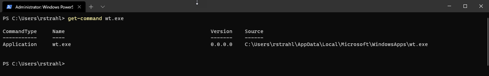
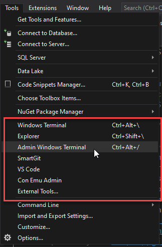
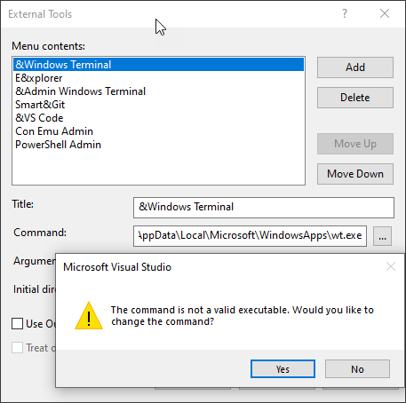
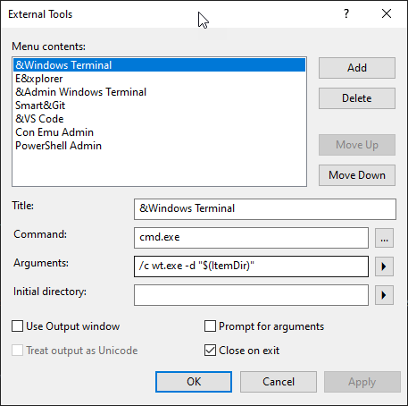
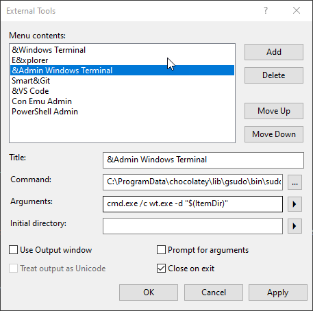

# Opening an Admin Windows Terminal Window from Visual Studio

This isn't the first time I've talked about this, and probably won't be the last, but for my work in Visual Studio I often need an Admin Windows terminal window. I need it for a couple of build tasks - Chocolatey installs of an admin install and for a funky certificate that doesn't want to work from the User certificate store. Long story short for one of my builds - Markdown Monster in particular - I need to run the terminal as an admin.

I use a bunch of External Commands in Visual Studio (and also in Rider and WebStorm) to execute external tasks and tie them to menu hotkeys (ie. Alt-T-A, Alt-T-W, Alt-T-G etc.):

### Launching Windows Terminal From Visual Studio External Tools
Windows Terminal is a tricky tool to launch on External Tools, because the main executable `wt.exe` is an alias that launches the real binary. I can find the binary here:

But if I try to launch that in Visual Studio I get:

Not really sure what the problem is, but it has something to do how Visual Studio launches executables. You can't just use the global `wt.exe` without a path (as you can with say `explorer.exe` or `cmd.exe`, so I have to provide the full path. But even the full path fails when the command is actually run. Hrmph! 😢

#### Windows Terminal Non-Admin
The workaround for this is to use **indirect invocation** by using Powershell or Cmd to launch it in which case the alias works and the path is no longer required.

Here's what this looks like:

**Title**
`&Windows Terminal`

**Command**  
`cmd.exe`

**Arguments**  
`/c wt.exe -d "$(ItemDir)"`

And this works.

#### Windows Terminal Admin
To open an Admin Windows Terminal is more complicated. The same approach can be used but it's also necessary to elevate. I was thinking that PowerShell and `Execute-Process` with `-verb RunAs` would work, but I was unable to make that work. 

In the end the only way I could get this to work was by using a third part elevator tool. I used [GSudo from Chocolatey](https://chocolatey.org/packages/gsudo) and here's what that looks like:

**Title**  
&Admin Windows Terminal

**Command**
`C:\ProgramData\chocolatey\lib\gsudo\bin\sudo.exe`

**Arguments**
`cmd.exe /c wt.exe -d "$(ItemDir)"`

This works but it does pop up an extra Command Window for the elevation box first. When the final instance of Windows Terminal loads that window then goes away. 

### Summary
Launching Windows Terminal from other applications is more hassle than it should be. This is due in part to the fact that Windows Terminal is actually a Window Store app and `wt.exe` is not a proper launch EXE but merely a small alias launcher. I've also had problems with this in [Markdown Monster](https://markdownmonster.west-wind.com) trying to launch a shell from there. In MM too, I ended up using a command shell to launch `wt.exe` and that works, but this is ugly as heck. However it works and gets the job done.

It would be really nice if Windows Terminal could include a way to internally launch as Admin via a `-RunAs` or `-Verb RunAs` switch to provide an elevated launcher, but currently that's not possible as far as I know.

In the meantime the intermediate launching with cmd seems to work, although the for elevation and intermediary tool like GSudo is required.

Hope somebody finds this useful. I'm sure I will next time I need to set up a new machine :smile:...

    
    this post created and published with the 
    <a href="https://markdownmonster.west-wind.com" 
       target="top">Markdown Monster Editor</a> 

