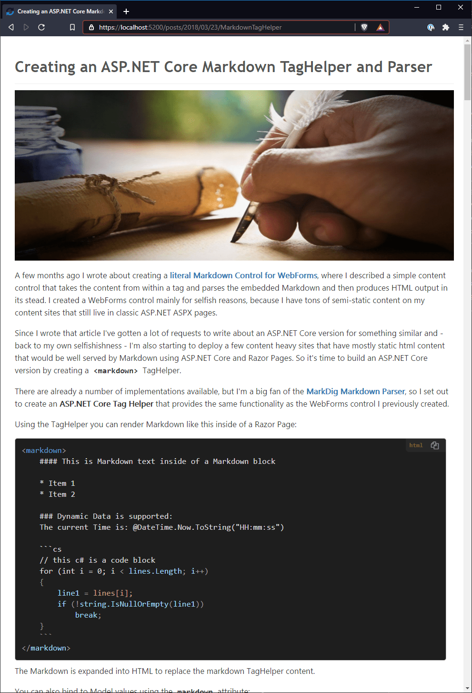
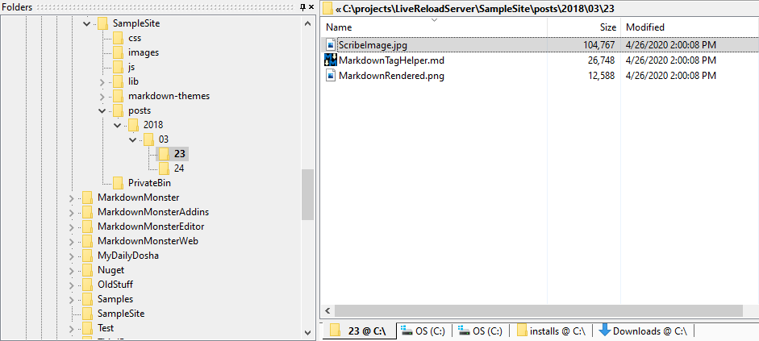
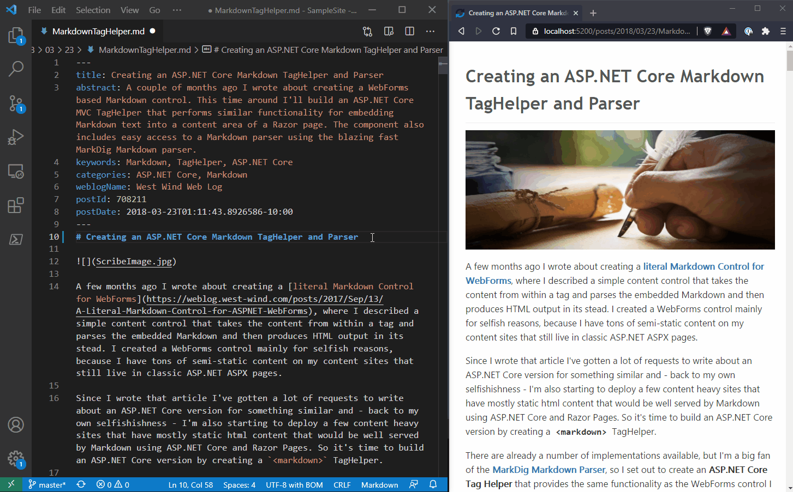

# LiveReloadServer - A Generic Static Web Server with Live Reload based on .NET


I've released an official `v1.0` of my [Live Reload Web Server](https://github.com/RickStrahl/LiveReloadServer) last week. It's a self-contained, command line executable, local Web Server that allows you to run arbitrary local folders as a static or optionally semi-dynamic Web site. The server comes with built-in Live Reload functionality, and also offers dynamic features for Markdown rendering and loose Razor Pages support very useful for content Web sites. 

LiveReload server is [open source with all code on Github](https://github.com/RickStrahl/LiveReloadServer) as are the components that drive much of its functionality. It's installable as a [Dotnet Tool](https://www.nuget.org/packages/LiveReloadServer/), [Chocolatey package](https://chocolatey.org/packages/LiveReloadWebServer) and [standalone Windows installer](https://github.com/RickStrahl/Westwind.AspnetCore.LiveReload/raw/master/LiveReloadServer/LiveReloadWebServer-SelfContained.zip). For cross-platform usage on Windows, Mac or Linux the Dotnet Tool can be used.

Although this command line tool has been around for nearly 2 years now, I just realized I've never actually posted about it before, only a few mentions as part of other posts. In light of the `v1.0` release, it's as good a time as any for an official post. 

## Local Web Server
A local Web Server isn't anything particularly new, nor very sexy, but to me at least, it's been a life saver in dealing with my many static content sites, some of my old JavaScript libraries and even with some of my hybrid desktop applications that use Web based content in the context of a desktop application using a WebBrowser/WebView2 control.

To give you an idea here an example of me using the `LiveReloadServer` to make changes on one of my *mostly static* (more on that later) local Web sites while making changes.


## What is LiveReloadServer?
**LiveReloadServer** is a practical, easy to install, easy to use, local, command line based Web Server geared to Web development tasks for static Web content. 

The server also includes some dynamic features like built-in themed Markdown rendering and standalone RazorPages support, but these dynamic features require runtime support when deployed, provided by .NET Core based server runtime.

Here's a highlight list of some of the features:

* Generic Static File Web Server you can launch in any folder
* Launch in target Web folder or with `LiveReloadServer <folder>`
* Built-in Live Reload functionality for change detection and browser refresh
* Razor Pages support for single-source Pages
* Markdown page rendering with themed HTML rendering
* Lets you run local SPA applications (Angular, VueJs, React etc.)
* Lets you run Blazor Applications (without full Live Reload support however)
* Hostable ASP.NET Core app that can be hosted by multiple sites from single install
* Cross Platform - Windows, Mac, Linux via Dotnet Tool
* Usability: Open Browser, open Editor on launch
* Available as: Dotnet Tool, Chocolatey Package, or Self-Contained (Windows) Download

So while it's yet another local Web Server you can see that it has a few unique features that might make it attractive for a number of different scenarios some of which I cover in this post.

## Installation
This tool is provided in a few different installable formats:

* **Dotnet Tool** <small>(cross platform)</small>  
  ```ps
  dotnet tool install -g LiveReloadServer
  ```
* **Chocolatey Install** <small>(Windows)</small>
  ```ps
  choco install LiveReloadWebServer
  ```
* **Self-contained Install** <small>(Windows)</small>  
  [Download Self-Contained Zip File](https://github.com/RickStrahl/LiveReloadServer/raw/master/LiveReloadWebServer-SelfContained.zip) <small>(unzip into a folder and run)</small>

> Note that the Dotnet Tool and Windows EXE installations have different executable names to avoid naming conflicts if both are installed:  
>
> * **LiveReloadServer** -  Dotnet Tool
> * **LiveReloadWebServer** - Windows Exe
>
> The preferred choice if the .NET SDK is present is use the Dotnet Tool and that's what use in the post.

## Starting the Server
Once installed, either Dotnet Tool or Chocolatey installs can run `LiveReloadServer` or `LiveReloadWebServer` anywhere from the command line as they are globally registered.

> Note on the Mac you may have to explicitly add the Dotnet Tools path to your global path in the ZSH Terminal in order to access Dotnet Tools globally. 
> ```bash
> # Add to ~/.zshrc
> export PATH="$PATH:$HOME/.dotnet/tools"
> ```

You can launch `LiveReloadServer` in the WebRoot path, or you can specify the path as the first argument. Any of the following work:

```ps
LiveReloadServer    # Launch in current folder
LiveReloadServer  "~/Web Sites/My Site"
LiveReloadServer --WebRoot "~/Web Sites/My Site"
```
Here's what the running server looks like:


There are quite a few command line switches you can set to enable or disable features like enabling and configuring RazorPages and Markdown execution, as well as some operational features that open the browser and an editor at the specified locations.

Here's a the command syntax:

```text
Static, Markdown and Razor Files Web Server with Live Reload for changed content.

Syntax:
-------
LiveReloadServer <webRootPath> <options>

--WebRoot                <webRootPath> - expands ~ and environment vars
--Port                   5200*
--Host                   0.0.0.0*|localhost|custom Ip - 0.0.0.0 allows external access
--UseSsl                 True|False*
--UseRazor               True|False*

--UseLiveReload          True*|False
--Extensions             ".cshtml,.css,.js,.htm,.html,.ts"*
--DefaultFiles           "index.html,default.htm"*

--ShowUrls               True|False*
--OpenBrowser            True*|False
--OpenEditor             True|False*
--EditorLaunchCommand    "code \"%1\""*
--DetailedErrors         True*|False
--Environment            Production*|Development

Razor Pages:
------------
--UseRazor              True|False*

Markdown Options:
-----------------
--UseMarkdown           True|False*
--CopyMarkdownResources True|False*
--MarkdownTemplate      ~/markdown-themes/__MarkdownTestmplatePage.cshtml*
--MarkdownTheme         github*|dharkan|medium|blackout|westwind
--MarkdownSyntaxTheme   github*|vs2015|vs|monokai|monokai-sublime|twilight

Configuration options can be specified in:

* Command Line options as shown above
* Logical Command Line Flags for true can be set like: -UseSsl or -UseRazor or -OpenBrowser
* Environment Variables with 'LIVERELOADSERVER_' prefix. Example: 'LIVERELOADSERVER_PORT'

Examples:
---------
LiveReloadServer "~/Web Sites/My Site" --port 5500 -useSsl -useRazor --openBrowser false

$env:LiveReloadServer_Port 5500
$env:LiveReloadServer_WebRoot c:\mySites\Site1\Web
LiveReloadServer
```

Note that by default `UseLiveReload` and `OpenBrowser` are on, and `UseRazor`, `UseMarkdown` and `OpenEditor` are off by default.

You can look at the [GitHub landing page](https://github.com/RickStrahl/LiveReloadServer), which has examples of how to make the most of the switches and how the Razor and Markdown features work.

[Live Reload Server Documentation](https://github.com/RickStrahl/LiveReloadServer)

In this post I want to spend some time talking about the why and some use cases that I use LiveReloadServer for.

## What is a Local Web Server For?
So why another local Web Server? A local Web Server isn't anything new. There are other local Web Servers and Live Reload tools that I've used for some time and while they work they have some limitations that I wanted to improve upon. 

### A better Mousetrap
This is quite subjective, but I've used both [http-server](https://github.com/http-party/http-server#readme) (and a few others) and [browsersync](https://www.browsersync.io/) for quite some time before I decided to create my own tool. `http-server` works fine, but it's only a Web server - and has no support for live reload. `browsersync` has Live Reload and can also serve as a plain Web Server, but I found it to be a bit on the flaky side for the Live Reload functionality.

Part of the reason for bitching about these inconveniences is that I've been spoiled by the Live Reload features in full CLI environments for the various SPA frameworks, as these work very well and consistently. But - those tools are tied to specific frameworks and are slow to start as they have to build the projects usually and don't just run but do a lot more. 

For example where a standalone server comes in handy I have quite a few VueJs 2.x applications that predate the Vue CLI. They are plain JavaScript applications that don't use a build process and so don't need (and can't even use) the Vue CLI. These work great with this Live Reload server and it makes it easy to iterate changes without using a CLI Web server.

### Fill an ASP.NET Core Hole
I also wanted a server with some **extra features** that picks up the slack that ASP.NET Core doesn't fill. I call this use case **Static Web Sites with Benefits** and it is similar to what classic ASP.NET ASPX pages or even more so ASP.NET WebPages filled. Namely the idea that you can just drop some files - Razor pages, or Markdown files - into a folder and get basic .NET functionality in your otherwise static HTML content. You can access all of .NET features out of the box, and optionally load additional assemblies to extend with external functionality.

ASP.NET Core doesn't really address this simple scenario - in order to use ASP.NET Core today you pretty much have to deploy an entire application that is pre-compiled and has to be published and deal with pain of in-place application replacement (two steps forward, one step back).

#### How does that work for me?
To give a specific example, in my business I have about 15 separate content sites I maintain currently. Most of them have been running on classic ASP.NET ASPX pages. None of them are what I would call 'applications' - they are content sites, but every one of them uses a handful of server features for tasks like:

* Retrieving version information
* Handling page routing
* Pulling other information from various services (stock quantity & prices/availability)
* Doing some simple calculations

For these things I've found this generic server very useful as a replacement for ASPX pages or WebPages before. So far I've migrated 3 of the sites and recently added a new one using this new server. All 4 of these sites now use a single generic server installation and I now basically have content sites where I can just push files up individually or in bulk.

#### Not meant to replace an Application!
To be clear, I'm not trying to position this as a feature replacement for ASP.NET Core applications, or even for what ASP.NET WebPages provided. The goal **is not** to provide a generic Web site engine that can replace a real application. 

If you have anything resembling real application logic that performs business tasks and database access etc., building and deploying a full ASP.NET Core app is more than justified. You get better tooling for coding and debugging, and you can use the full power of the framework.

Rather the goal of the LiveReloadServer is to provide a simple and generic way to publish a Web site that needs maybe handful of small dynamic server features in an otherwise mostly static content site. And if your site is 100% static and doesn't use the Razor or Markdown features, then no runtime at all is required of course.

At the end of the day if you use the dynamic features that require the server runtime, LiveReload is still an ASP.NET Core application and one way or another the LiveReloadServer application 'runtime' has to be installed on the server at least once.

To me this is still a huge win as I have a lot of small content sites and I can share this single runtime install across many sites and then installing only new content for each site. This keeps the content site completely separate from the ASP.NET Core bits which can be installed completely separately.

Azure or other hosted services are also supported, but in that scenario the LiveReload application needs to be installed per site with the content as each Azure Web site is essentially it's own isolated application, so there's less deployment benefit there.

### Built with .NET 
LiveReloadServer is a .NET ASP.NET Core server application that locally runs as standalone Console application, and optionally as a hosted server application as a Web server backend on IIS or other Web server.

As a user you shouldn't care whether it's .NET or NodeJs or the latest FleeFlumFo framework. But as a developer who's building this tool, and adding functionality I care because I want to be able to add features and enhancements using the tools I feel comfortable with. I also much prefer the way I can distribute my .NET based application compared to a Node application, for easy x-plat distribution as a Dotnet tool. I can have a Dotnet Tool, or locally installed self-contained application to provide this local server.

As a user it also allows you to add .NET assemblies to the execution environment so you can take advantage of your own external or third party features in your minimal .NET content.

Another selfish reason for this tool is this: I'd already built the much of the functionality  that LiveReload server uses as ASP.NET Core Middleware components: The [Westwind.AspNetCore.LiveReload](https://github.com/RickStrahl/Westwind.AspnetCore.LiveReload) component provides the live reload functionality, and the [Westwind.AspNetCore.Markdown](https://github.com/RickStrahl/Westwind.AspNetCore.Markdown) library provides the Markdown serving and embedding features. LiveReloadServer actually leverages those two libraries and internally has very little ASP.NET Core related logic which is simply leveraged from these two components. LiveReloadServer acts primarily as a hosting wrapper around existing features both of my components and some features that are built into ASP.NET Core.

And - because this is built around ASP.NET Core it uses the same infrastructure and tooling that I have already in place both on my local machines and on my servers. The Razor and Markdown support use the standard Razor language features to provide dynamic code execution and the - for Markdown - the ability to consistently create a master page template into which Markdown is embedded.

### Razor Pages Support
This server has basic Razor Pages support **with Pages that are self-contained in a single `.cshtml` file**. Because this is a generic server that performs runtime razor compilation, it doesn't support code-behind files or external source files that can be compiled into a 'project' - since there is no project. ASP.NET Core (optionally now) provides for runtime Razor compilation, but does not provide for generic runtime file compilation, so each page has to be fully self-contained. Pages are runtime compiled so you can update page content simply by copying in files.

The idea is simple: You can drop Razor pages into a folder and they just run, similar to the way you could drop an ASPX page into a folder and have it just work. Razor files sit side by side with static files (unlike default ASP.NET Core apps where RazorPages live in a `Pages` folder).

Razor code can utilize code from external libraries that can be explicitly loaded into a special folder from which any provided assemblies are loaded, which allows you to take advantage of external libraries.

### Markdown Support
The server also supports markdown rendering in two ways:

* Themed Markdown Page Rendering
* Inline Markdown Blocks and Expressions in Razor Pages

> Reminder: The Markdown features requires runtime support.

#### Themed Markdown Page Rendering
The server also includes Markdown support which lets you drop Markdown files into a folder and have them rendered as HTML using customizable themes. Several default themes are provided and the HTML page is based on a customizable template that can be overridden in the root folder if necessary. The default themes are similar to [Markdown Monster](https://markdownmonster.west-wind.com)'s default themes which include `Github`, `Dharkan`, `Blackout`, `Hipster` and more.
  
The following demonstrates dropping a blog post along with its image resources into a folder using the server using the `Dharkan` theme:



Notice that the post is formatted nicely using the Dharkhan theme. Code use syntax coloring based on a template setting.

The file was simply dropped into a folder structure like this along with the image resources displayed:



Like other static documents, you can also edit these Markdown documents and have Live Reload update them in the browser as you save changes:



#### Inline Markdown Rendering
You can also embed Markdown directly into HTML documents, which can make it much easier to type and maintain large blocks of HTML content in static content pages. For example, here's a small header block from the Markdown Monster Purchase page:

```html
<div id="MainContainer" class="background">
    <div id="ContentContainer" class="content" >
        
    <div class="row">
    <div class=" col-sm-2" style="padding: 37px 10px 1px">
        
    </div>
    <div class=" col-sm-10">
            
<markdown id="license" NormalizeWhiteSpace="true">
## Purchase Markdown Monster

Markdown Monster can be [downloaded](download.aspx) and evaluated for free. We also 
provide the [source code](https://github.com/RickStrahl/MarkdownMonster) 
in the open, but a reasonably priced license must be purchased for continued use. 
    
We offer individual and organizational licenses to purchase, as well as **free** licenses to contributors 
and certain developer organizations. Discounted licenses are available for some International locations for fair global pricing. 
For more licensing information, please check out [Licensing Information](#License) below.
    
**Thanks for playing fair**.
</markdown>

 </div>
</div>
```

This is just a small block of text for the example here, but I use the same approach with a 10 paragraph block in the same document. Much easier than managing HTML.

Finally you can also include Markdown expressions, Markdown from external files, and even loaded from a URL (like a GitHub URL) to inline larger Markdown maintained separately from the page.

## A few Use Cases

### Local Components Development Site
My first common usage scenario is for several of my older JavaScript libraries that I support and occasionally have to work with for bug fixes or updates. Some of these tools are old jQuery components that I still need to update sometimes due to issues coming in. Some of them are so old they even pre-date the first build tools like Grunt... yikes.

I can fire up these sites with LiveReloadServer and get live reload debugging and updating going:


It's a nice and simple way to fix issues interactively in my ancient libraries.

### Content Web Site
My most common use case though is for small content Web sites. These are typical 'landing page' Web sites consist of just a few pages typically. The following is my [Anti-Trust band Web site](https://anti-trust.rocks) which is a landing page for an album's worth of songs. This particular site uses a mixture of static content and the RazorPage processing to display a summary page and one dynamic page for each of the albums.

Here's what this looks like with LiveReloadServer running and editing the `index.html` main page, some CSS changes in `album.css` and finally making some changes to text and code in a Razor Page in `song.cshtml`.

I start with:

```ps
LiveReloadServer "~/OneDrive/Web Sites/anti-trust.rocks" -useRazor -openEditor
```

Local site comes up and I can start editing HTML, CSS and Razor content with Live Reload:


The index page is completely static HTML along with a little bit of JavaScript for handling the music player. Although this page in theory could use the same data that the `song.cshtml` uses, the index page can totally be a static page and that works fine.

The song page however needs a little bit of logic for:

* Routing
* Loading the song specific data from a JSON file
* Setting the HTML header meta data

Initially I was planning on using VueJs to handle all the content rendering which would have worked fine, except that this application requires routing which makes an otherwise simple, single page with embedded JSON data considerably more complicated than just a single page template. Once routing is needed there's additional configuration required at a higher level and you're back to building a SPA rather than just a 'page'.  A server page certainly is a lot easier to build in that scenario as you can keep everything within the context of a single `.cshtml` page.

Because of this, plus the SEO implications of client side pages, I ended up ditching the JavaScript approach and went with server rendered Razor pages instead.

For this type of site a server side approach seems a much better fit and that makes it a good fit for the LiveReloadServer. The logic is simple and can easily be self contained in a single `Song.cshtml` page for routing, songlist loading (and caching) and displaying the loaded content easily both in the HTML page headers and content for SEO friendly output.

Here's what that *'Static with Benefits'* functionality looks like:

```cs
@page "/{album}/{title?}"

@functions {
	public static AlbumData Album { get; set; } = new AlbumData();
    public static SongData song { get; set; }
    
    ...
}
@{
    var title = RouteData.Values["title"] as string;
    var rawTitle = title;
    title = title?.Replace("-", " ");
    string json = null;
    string fileName = null;
    string pageUrl = "https://anti-trust.rocks" + HttpContext.Request.Path;

    if (Album == null || Album.songs.Count < 1)
    {
        fileName = System.IO.Path.Combine(Host.WebRootPath, "album.json");
        json = await  System.IO.File.ReadAllTextAsync(fileName);

        Album = JsonSerializationUtils.DeserializeFromFile(fileName, typeof(AlbumData), false) as AlbumData;
    }

    song = Album.songs.FirstOrDefault(s => s.title.Equals(title, StringComparison.OrdinalIgnoreCase));
    if (song == null)
    {
        song = new SongData();
        song.title = "Song unavailable";
    }
    else if (!string.IsNullOrEmpty(song.lyrics) && song.lyrics.StartsWith("Anti-Trust "))
    {
        song.lyrics = await System.IO.File.ReadAllTextAsync(System.IO.Path.Combine(Host.WebRootPath, song.lyrics));
    }
}
```

It also allows for easy header handling of the meta tags with dynamic data:

```html
<meta property="og:title" content="@title - Anti-Trust" />
<meta property="og:description" content="@title (song) by Anti-Trust. Garage Punk Rock from Maui and Oakland with former members from Attitude Adjustment and Attitude." />
```    

as well as the embedded page content including Markdown rendering:

``` html
<div class="song-title">@song.title</div>
<div class="song-info">                
	@song.playTime - <small>@song.credits</small>
    ...	
</div>	
	
<pre class="lyrics">@Markdown.Parse(song.lyrics)</pre>
```

#### Deploying the Site
Since I'm using both Razor and Markdown functionality on this site I need to deploy this application using the LiveReloadServer as an ASP.NET Core app. In my case this is running on a self-hosted IIS that has a ton of other sites running on it. 

To deploy I need to:

* Copy the LiveReloadServer Runtime files into a folder
* Create the Static File Web site
* Ensure that the site `web.config` points at the LiveReload server files

The server folders now look like this:


In the Web site the `web.config` is then configured to point at the `..\LiveReloadServer\LiveReloadServer.dll` to run the application in the Static Web site's folder:


```xml
<system.webServer>
  <handlers>
    <add name="aspNetCore" path="*" verb="*" modules="AspNetCoreModuleV2"
         resourceType="Unspecified" />
  </handlers>
  
  <aspNetCore processPath="dotnet" hostingModel="inprocess" 
              arguments="..\LiveReloadServer\LiveReloadServer.dll"   <!-- THIS -->
              stdoutLogEnabled="false" stdoutLogFile=".\logs\stdout">
    <environmentVariables>
      <environmentVariable name="ASPNET_ENVIRONMENT" value="Development" />
      <environmentVariable name="LIVERELOADSERVER_WEBROOT" value="C:\WebSites\anti-trust.rocks" />
      <environmentVariable name="LIVERELOADSERVER_USERAZOR" value="True" />
      <environmentVariable name="LIVERELOADSERVER_USELIVERELOAD" value="false" />
    </environmentVariables>
  </aspNetCore>
</system.webServer>
```

As mentioned earlier I can share the Server Binaries for other Web sites which can also simply point at these binaries to use the same runtime and get their own instance. 

Once this is installed the `anti-trust.rocks` site can now receive new updated files both static as well as the Razor pages and the app automatically recompiles the updated Razor and Markdown files.

Sweet - the best of both worlds.

### Using Local Live Reload Server for a Hybrid WPF Application
The last example is an usual use case: I've been working on re-writing my [West Wind WebSurge](https://websurge.west-wind.com) Web Testing tool over the last couple of weeks. The tester has an HTML preview form that uses a WebView to display output from a rendered HTML template. The template renders a small base HTML document into which the data is loaded via Interop from the WPF host application, and VueJs that binds the data to the UI for display.

The application uses a template that normally is output into the compiled output folder (as `/Html`) and the request result is then rendered from the disk based template. It works, but this process is very tedious as any change requires recompilation of the project for the files to be sent to the output folder in which WebSurge is looking for the files.

Enter LiveReloadServer. In `#DEBUG` mode the application configures itself to go to `https://localhost:5200` which is the LiveReloadServer's Host address and process requests from that location. The end result is that I can now use Live Reload for my WPF rendered content:


       
One very cool feature in the new Edge `WebView2` control is that it has the ability to map virtual folders to a domain name, so I can treat a local folder as if it were a Web site. This makes it super easy to switch URLs **and** get the exact same behavior between files accessed directly through the file system or using a Web server as I'm doing when running through the LiveReloadServer. 

Here's what that conditional loader code looks like:

```cs
// Container User Control CTOR
public Previewer()
{
    InitializeComponent();

    webView.NavigationCompleted += WebView_NavigationCompleted;

#if DEBUG
    // Use development HTML folder so we can make changes to the running application and refresh
    // In production this will be the output folder which gets overwritten when re-compiled
    HtmlPagePath = @"C:\projects\WebSurge2\WebSurge\Html";   // local debug
    
    //Url = "https://websurge.app/Request.html";
    Url = "http://localhost:5200/Request.html";   // live reload server

    //webView.CoreWebView2.OpenDevToolsWindow();
#else
        HtmlPagePath = "Html";    //  relative to install folder
        
        // use a virtual folder to domain map defined in InitializeAsync()
        Url = @"https://websurge.app/Request.html";
#endif

    InitializeAsync();
}

async void InitializeAsync()
{
    // must create a data folder if running out of a secured folder that can't write like Program Files
    var env = await CoreWebView2Environment.CreateAsync(
        userDataFolder: Path.Combine(Path.GetTempPath(), "WebSurge_Browser"));

    // Note this waits until the first page is navigated!
    await webView.EnsureCoreWebView2Async(env);

    // Optional: Map a folder from the Executable Folder to a virtual domain
    // NOTE: This requires a Canary preview currently (.720+)
    webView.CoreWebView2.SetVirtualHostNameToFolderMapping(
        "websurge.app", this.HtmlPagePath,
        CoreWebView2HostResourceAccessKind.Allow);
}
```

Now during development the application uses the `localhost:5200` to load preview content, while in production it uses `https://websurge.app/Request.html` where `websurge.app` is a mapped virtual path set via the WebView's `SetVirtualHostNameToFolderMapping()`.

With the server loaded I now have a very interactive way to make changes to the HTML templates and the JavaScript code used to display the content and display inline request header editor. It's a big time-saver over the previous approach of re-compiling just to make a small HTML change.

## Summary
LiveReload server is a .NET Core based local Web Server that you can use to run your local static Web sites and take advantage of some of the built-in convenience features like LiveReload, auto-browser and editor open. If you need support for some dynamic server features, the server lets you also deploy as a server hosted solution that can provide the Razor and Markdown features to your application on a live server.

As you can see, I use this tool quite a lot and it's actually made it much, much easier to deal with small content sites of which I have so many. Before, with ASPX pages I usually would edit pages in Visual Studio and publish from there, but now the entire approach is more lightweight and I can usually manage everything in VS Code plus the Deploy addin to publish what I need (plus Git). With this in place, life is good and I don't dread making even small changes as I can quickly fire up LiveReload, automatically have my browser and editor open and just make the change and publish all less than a minute's time. Sweet.

Check it out - you might find this server useful as well. Even if you use it for nothing else as a static file server it's an easy and fast way to work with local Web content. Enjoy...


## Related Posts

* [Building a Live Reload Middleware Component for ASP.NET Core](https://weblog.west-wind.com/posts/2019/Jun/03/Building-Live-Reload-Middleware-for-ASPNET-Core)
* [Creating an ASP.NET Core Markdown TagHelper and Middleware](https://weblog.west-wind.com/posts/2018/Mar/23/Creating-an-ASPNET-Core-Markdown-TagHelper-and-Parser)
* [Using .NET Core Tools to Create Reusable and Shareable Tools & Apps](https://weblog.west-wind.com/posts/2020/Aug/05/Using-NET-Core-Tools-to-Create-Reusable-and-Shareable-Tools-Apps)

<div style="margin-top: 30px;font-size: 0.8em;
            border-top: 1px solid #eee;padding-top: 8px;">
    
    this post created and published with the 
    <a href="https://markdownmonster.west-wind.com" 
       target="top">Markdown Monster Editor</a> 
</div>