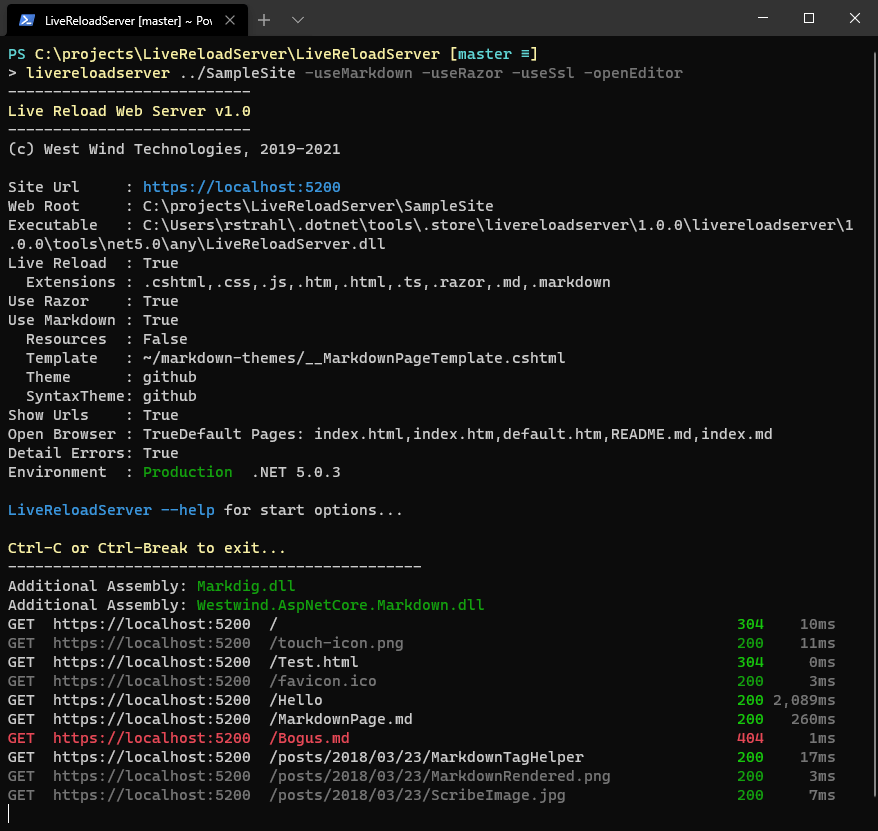

# LiveReloadServer - A .NET Core Based Generic Static Web Server with Live Reload


I've just released an official v1.0 of my [Live Reload Web Server](https://github.com/RickStrahl/LiveReloadServer). It's a local .NET Core based Web Server that you can run on your local machine, and which includes a number of very useful features.

I just realized I've never actually posted about it and in light of v1.0 it's  maybe time for an official post. A local Web Server isn't anything new, nor very sexy, but to me at least, it's a tool I've started to use quite a bit.

## What is LiveReloadServer?
**LiveReloadServer** is a self-contained, local, cross-platform, static file Web Server with automatic Live Reloading, Markdown rendering and loose Razor Pages support. It's a highly practical and easy to use local Web Server geared towards typical development tasks for local static Web sites and - for me at least - working on many client side component based libraries more interactively.

Officially here's a feature list:

This server supports:

* Generic Static File Web Server you can launch in any folder
* Launch with `LiveReloadServer <folder>`
* Built-in optional Live Reload functionality for change detection and browser refresh
* Self-contained Razor Pages support
* Themed Markdown page rendering support
* Run local SPA applications (Angular, VueJs, React etc.)
* Run Blazor Applications (without Live Reload support however)
* Hostable ASP.NET Core app that can be hosted by multiple sites from single install
* Cross Platform - Windows, Mac, Linux (dotnet tool only)
* Available as: Dotnet Tool, Chocolatey Package, or Self-Contained (Windows) Download


## Installing
This tool is provided in a few different installable formats:

* **Dotnet Tool** <small>(cross platform)</small>  
  ```ps
  dotnet tool -g install LiveReloadServer
  ```
* **Chocolatey Install** <small>(Windows)</small>
  ```ps
  choco install LiveReloadWebServer
  ```
* **Self-contained Install** <small>(Windows)</small>  
  [Download Self-Contained Zip File](https://github.com/RickStrahl/LiveReloadServer/blob/master/LiveReloadWebServer-SelfContained.zip) <small>(unzip into a folder and run)</small>

> Note that the Dotnet Tool and EXE installations have different executable names to avoid naming conflicts if both are installed:  
>
> * **LiveReloadServer** -  Dotnet Tool
> * **LiveReloadWebServer** - Windows Exe
>
> The preferred choice if the .NET SDK is present is use the Dotnet Tool and that's what use in the post.

## Starting the Server
Once installed, either Dotnet Tool or Chocolatey installs can run `LiveReloadServer` or `LiveReloadWebServer` anywhere from the command line.

> Note on the Mac you may have to explicitly add the Dotnet Tools path to your global path in the ZSH Terminal in order to access Dotnet Tools globally.
> ```bash
> # Add to ~/.zshrc
> export PATH="$PATH:$HOME/.dotnet/tools"
> ```

You can launch `LiveReloadServer` in the WebRoot path, or you can specify the path as the first argument. Any of the following work:

```ps
LiveReloadServer    # Launch in current folder
LiveReloadServer  "~/Web Sites/My Site"
LiveReloadServer --WebRoot "~/Web Sites/My Site"
```
Here's what the server looks like running:



There are quite a few command line switches you can set to enable or disable features like enabling RazorPages and  Markdown execution, open an editor or your browser on launch etc. Here's a the command syntax:

```text
Static, Markdown and Razor Files Web Server with Live Reload for changed content.

Syntax:
-------
LiveReloadServer <webRootPath> <options>

--WebRoot                <webRootPath> - expands ~ and environment vars
--Port                   5200*
--Host                   0.0.0.0*|localhost|custom Ip - 0.0.0.0 allows external access
--UseSsl                 True|False*
--UseRazor               True|False*

--UseLiveReload          True*|False
--Extensions             ".cshtml,.css,.js,.htm,.html,.ts"*
--DefaultFiles           "index.html,default.htm"*

--ShowUrls               True|False*
--OpenBrowser            True*|False
--OpenEditor             True|False*
--EditorLaunchCommand    "code \"%1\""*
--DetailedErrors         True*|False
--Environment            Production*|Development

Razor Pages:
------------
--UseRazor              True|False*

Markdown Options:
-----------------
--UseMarkdown           True|False*
--CopyMarkdownResources True|False*
--MarkdownTemplate      ~/markdown-themes/__MarkdownTestmplatePage.cshtml*
--MarkdownTheme         github*|dharkan|medium|blackout|westwind
--MarkdownSyntaxTheme   github*|vs2015|vs|monokai|monokai-sublime|twilight

Configuration options can be specified in:

* Command Line options as shown above
* Logical Command Line Flags for true can be set like: -UseSsl or -UseRazor or -OpenBrowser
* Environment Variables with 'LIVERELOADSERVER_' prefix. Example: 'LIVERELOADSERVER_PORT'

Examples:
---------
LiveReloadServer "~/Web Sites/My Site" --port 5500 -useSsl -useRazor --openBrowser false

$env:LiveReloadServer_Port 5500
$env:LiveReloadServer_WebRoot c:\mySites\Site1\Web
LiveReloadServer
```

Note that by default `UseLiveReload` and `OpenBrowser` are on, and `UseRazor` and `UseMarkdown` are off by default.

You can look at the GitHub landing page, which has examples of how to make the most of the switches and how the Razor and Markdown features work. I don't want to re-hash them in this post as it's pretty straight forward.

[Live Reload Server Documentation](https://github.com/RickStrahl/LiveReloadServer)

Rather in this post I want to spend some time talking about the why and some of the use cases that I use LiveReloadServer for and why I am excited about this little useful tool.

### Hosting the Server
LiveReloadServer is primarily meant as a local Web Server used for development work, but it can also be deployed as a hosted server. 

If you're using only working with truly static content files, you obviously don't need anything other than static site hosting. No need to deploy the server anywhere - just drop onto a Web site and you're good to go.

However, if you plan to take advantage of either the Razor or Markdown support, then you need to be able to host the site as an ASP.NET Core application.  The LiveReloadServer is just an ASP.NET Core application and can be installed into a central location and be re-used potentially by many Web sites. You can think of it as a generic runtime - each site gets a new instance of the same installed server application. This makes good sense if you are - like me - self-hosting a number of IIS Web Sites on your own server.

If you're hosting on a service like Azure, you have to deploy per instance and in that scenario I would recommend the standard approach of using an application folder for the LiveReload runtime (which is just an ASP.NET Core Web application) along with a standard wwwRoot folder for the content. The server can then be configured to find the application in the standard ASP.NET application and just use the current (wwwroot) folder for content. It works, but honestly in that scenario it might actually make more sense to just create a full RazorPages application and add the `Westwind.AspNetCore.LiveReload` and `Westwind.AspNetCore.Markdown` components (as needed) and just deploy the full application.

## What is a Local Web Server For?
So why another local Web Server? A local Web Server isn't anything new. There are other local Web Servers like [http-server](https://github.com/http-party/http-server#readme) or live reload tools like [browsersync](https://www.browsersync.io/) that do some of the things that LiveReloadServer does. Why did I reinvent the wheel? 

### A better Mousetrap
This is probably quite subjective, but I've used both `http-server` and `browser-sync` for quite some time before I created this tool. Both http-server works fine, but it's only a Web server - and has no support for live reload. `browsersync` has Live Reload but I found it always to be a bit on the flaky side. It'd work fine for a while but eventually the Web socket connection would break and requests would end up failing requiring a restart. Also, refreshes were fairly slow and occasionally file changes wouldn't trigger updates.

So yeah, I wanted something more reliable and all in one place and that was a big incentive. Part of the reason for this is that I've been spoiled by the live reload features in full CLI environments for the various SPA implementations as these worked quite nicely, but those are slow to start as they have to build the projects usually and don't just run but do a lot more. 

For example, I have quite a few VueJs 2.x applications that predate the Vue CLI. They are plain JavaScript applications that don't use a build process and so don't need the CLI. These work great with this Live Reload server and make it easy to build my applications as quickly as newer CLI applications.

### Built with .NET 
I know, I know as a user you shouldn't care whether it's .NET or NodeJs or FleeFlum framework. But as a developer that's building this tool and adding functionality I care because I want to be able to add features and enhancements using the tools I feel comfortable with. I also much prefer the way I can distribute my .NET based application compared to a Node application through NPM for easy x-plat distribution.

The other reason is this: I'd already built the much of the tooling that LiveReload server handles: The [Westwind.AspNetCore.LiveReload](https://github.com/RickStrahl/Westwind.AspnetCore.LiveReload) component provides the live reload functionality, and the [Westwind.AspNetCore.Markdown](https://github.com/RickStrahl/Westwind.AspNetCore.Markdown) library provides the Markdown serving and embedding features. In other words - I can leverage the tools I've already built in other places. As time goes on, other features may be added in a similar fashion.

And - because this is built around ASP.NET Core it uses the same infrastructure and tooling. The Razor and Markdown support use the standard Razor language features to provide dynamic code execution and the - for Markdown - the ability to consistently create a master page template into which Markdown is embedded. It's a great synergy and a great way to re-use and re-package existing technology.

### Inline RazorPages Support
While the main focus of this server is on static content, there's also generic support for small dynamic pages using Razor style `.cshtml` page support including the server side routing support (all courtesy of RazorPages). The server uses runtime compilation so you can drop simply pages into the server's content directory and those pages become immediately available, just like HTML content.

This is useful for what I call *Static Pages with Benefits* (SPWB). Often times I need to perform some very light dynamic tasks:

* Add date to a rendered page
* Retrieve a file from disk and read some 'data' out of it
* Retrieve a version number from a resource file and embed it into the page
* Add simple server side SEO friendly URL routing
* Log requests and statistics without using intrusive Online Analytics

These are not what I would call 'application' tasks but rather very simple operations that come up frequently. Very simple things, but that can't be easily accomplished server side without otherwise resorting to a full blown application - which seems like overkill.

The inline RazorPage support allows you to use RazorPages in this environment, but it only works with fully self-contained Razor pages where all the code has to be inline in a single self-contained page. There's no support for the Razor style code behind page compilation at runtime.

While pages have to be self-contained you can also add additional assemblies to be referenced by code in RazorPages via the assemblies (DLLS) that are placed in a special folder and checked for at server startup. This allows you to use external libraries.

### Markdown Rendering
Along similar lines you can also render and host Markdown documents using this server. In fact it's possible to render an entire site using only Markdown documents as long as you have some sort of index that lets you jump to the individual pages. And you can use and publish them the same way as loose Markdown files that can be updated and simply re-rendered as the application runs.

How many pages do you have on common content sites that are nothing more than a few blocks of simple text like an About page or a Policies and Service agreements etc. You can even easily use simple folder structures to publish blog posts from plain .md files on disk.

This can be incredibly useful for knowledge base sites where you can simply create or update documents in a folder structure without having to 'build' a site for every change. Instead you can do runtime evaluation.

This is similar to what site generators do, but rather than having to generate and republish you just render the content at runtime which allows for on the spot updates.

The goal here isn't to replace solutions like static site generators - those are great for more complex scenarios. If you're running a complex CMS and you have thousands of pages or publishing a federated Blog a static site generator is a much better approach. But for simple sites like my landing page projects that have maybe 5-10 pages I don't need a generator or republish content constantly to make tiny little changes.

### Harking back to Simpler Times
Part of the reason I'm so excited about this is that I really miss the simpler times when we used to be able just drop files into a Web site and it just all worked. Classic ASP.NET and ASP.NET WebPages both were built into IIS and you literally could drop a file into a site and it all just worked.

These days, it's all about DevOps, and publishing sites through complex build pipelines, running on Azure, blah blah blah. I don't disagree with the need for these processes for applications or even complex content sites.

But for many simple landing page sites that consist of maybe a handful of pages, all of that is incredible overkill and a waste of time and resources. It's simply easier to create the content locally, share and record it via a Git repo, and simply deploy the entire site or individual files as needed.

Why make life complicated when it's that easy and the simpler approach for a simple problem actually makes good sense?

### Server Hosting
Static content doesn't need anything special for hosting, but the Razor and Markdown features rely on runtime ASP.NET Core rendering support and do that a deployed application needs to still run an ASP.NET Server.

So how is this different than deploying an ASP.NET Core application?

If you're deploying a single site, then the process is no different:

* You still have to deploy the LiveReload Server and Register ASP.NET Core
* You still have to set up a Web site for static content (or all in one site)

But, because LiveReloadServer is essentially a runtime, the binaries are installed only once (or at least much less frequently as there are feature updates to the engine). Content however may be updated all the time. 

If you have multiple sites that need this functionality - nothing else needs to be installed. Rather any additional sites simply point at the same binary LiveReloadServer installation. This means one relatively small install for potentially many sites running on this engine.

## A few Use Cases


### Local Components Development Site
My first common usage scenario is for several of my older JavaScript libraries that I support and occasionally have to work with for bug fixes or updates. Some of these tools are old jquery components that yes I need to update sometimes due to issues coming in. Some of them are so old they even pre-date the first build tools like Grunt... yikes.

I can fire up these sites with LiveReloadServer and get live reload debugging and updating going:


Notice that I can get Live Reload to work for:

* Index.html and css for sample page 
* jquery-watcher.js (actual component) 
* Readme.md (with `-useMarkdown`)

It's a nice and simple way to get a quick feedback cycle to fix issues in my ancient libraries.

### Content Web Site
My most common one is for several small content Web sites. These are typical 'landing page' Web sites that have only a few pages at best. The following is my [Anti-Trust band Web site](https://anti-trust.rocks) which is a landing page for an album's worth of songs. This particular site uses a mixture of static content and the RazorPage processing to display a summary page and one dynamic page for each of the albums.

Here's what this looks like with LiveReloadServer running and editing the `index.html` main page, some CSS changes in `album.css` and finally making some changes to text and code in a Razor Page in `song.cshtml`.

I start with:

```ps
LiveReloadServer "~/OneDrive/Web Sites/anti-trust.rocks" -useRazor -openEditor
```

Local site comes up and I can start editing HTML, CSS and Razor content with Live Reload:


The index page is completely static HTML along with a little bit of JavaScript for handling the music player. Although this page in theory could use the same data that the `song.cshtml` uses, the index page can totally be a static page and that works fine.

The song page however needs a little bit of logic for:

* Routing
* Loading the song specific data from a JSON file
* Setting the HTML header meta data

Initially I was planning on using VueJs to handle all the content rendering which would have worked fine, except that this application requires routing which makes an otherwise simple, single with embedded JSON data considerably more complicated than just a simple template. Once routing is needed there's additional configuration required at a higher level and you're back to building a SPA rather than a 'page'. Because of this, plus the SEO implications of client side pages, I ended up ditching the JavaScript templatapproach and went with server rendered Razor pages instead.

For this type of app a server side approach seems a much better fit and sure and that makes it a good fit for the LiveReloadServer. It's a perfect fit because the logic is simple and can easily be self contained in a single `Song.cshtml` page for routing, songlist loading (and caching) and displaying the loaded content easily both in the headers and content for SEO friendly output.

Here's what that *'Static with Benefits'* functionality looks like:

```cs
@page "/{album}/{title?}"

@functions {
	public static AlbumData Album { get; set; } = new AlbumData();
    public static SongData song { get; set; }
    
    ...
}
@{
    var title = RouteData.Values["title"] as string;
    var rawTitle = title;
    title = title?.Replace("-", " ");
    string json = null;
    string fileName = null;
    string pageUrl = "https://anti-trust.rocks" + HttpContext.Request.Path;

    if (Album == null || Album.songs.Count < 1)
    {
        fileName = System.IO.Path.Combine(Host.WebRootPath, "album.json");
        json = await  System.IO.File.ReadAllTextAsync(fileName);

        Album = JsonSerializationUtils.DeserializeFromFile(fileName, typeof(AlbumData), false) as AlbumData;
    }

    song = Album.songs.FirstOrDefault(s => s.title.Equals(title, StringComparison.OrdinalIgnoreCase));
    if (song == null)
    {
        song = new SongData();
        song.title = "Song unavailable";
    }
    else if (!string.IsNullOrEmpty(song.lyrics) && song.lyrics.StartsWith("Anti-Trust "))
    {
        song.lyrics = await System.IO.File.ReadAllTextAsync(System.IO.Path.Combine(Host.WebRootPath, song.lyrics));
    }
}
```

It also allows for easy header handling of the meta tags with dynamic data:

```html
<meta property="og:title" content="@title - Anti-Trust" />
<meta property="og:description" content="@title (song) by Anti-Trust. Garage Punk Rock from Maui and Oakland with former members from Attitude Adjustment and Attitude." />
```    

as well as the embedded page content including Markdown rendering:

``` html
<div class="song-title">@song.title</div>
<div class="song-info">                
	@song.playTime - <small>@song.credits</small>
    ...	
</div>	
	
<pre class="lyrics">@Markdown(song.lyrics)</pre>
```

#### Deploying the Site
Since I'm using Razor and Markdown functionality on this site I need to deploy this application using the LiveReloadServer as an ASP.NET Core app. In my case this is running on a self-hosted IIS that has a ton of other sites running on it. 

To deploy I need to:

* Copy the LiveReloadServer Runtime files into a folder
* Create the Static File Web site
* Ensure that the site `web.config` points at the LiveReload server files

The server folders now look like this:


In the Web site the `web.config` is then configured to point at the `..\LiveReloadServer\LiveReloadServer.dll` to run the application in the Static Web site's folder:


```xml
<system.webServer>
  <handlers>
    <add name="aspNetCore" path="*" verb="*" modules="AspNetCoreModuleV2"
         resourceType="Unspecified" />
  </handlers>
  
  <aspNetCore processPath="dotnet" hostingModel="inprocess" 
              arguments="..\LiveReloadServer\LiveReloadServer.dll"   <!-- THIS -->
              stdoutLogEnabled="false" stdoutLogFile=".\logs\stdout">
    <environmentVariables>
      <environmentVariable name="ASPNET_ENVIRONMENT" value="Development" />
      <environmentVariable name="LIVERELOADSERVER_WEBROOT" value="C:\WebSites\anti-trust.rocks" />
      <environmentVariable name="LIVERELOADSERVER_USERAZOR" value="True" />
      <environmentVariable name="LIVERELOADSERVER_USELIVERELOAD" value="false" />
    </environmentVariables>
  </aspNetCore>
</system.webServer>
```

As mentioned earlier I can share the Server Binaries for other Web sites which can also simply point at these binaries to use the same runtime and get their own instance.

Once this is installed the `anti-trust.rocks` site can now receive new updated files both static as well as the Razor pages and the app automatically recompiles the updated files.

Sweet - the best of both worlds.

### Using Local Live Reload Server for a Hybrid WPF Application
The last example is an usual use case: I've been working on re-writing my [West Wind WebSurge](https://websurge.west-wind.com) Web Testing tool over the last couple of weeks. The tester has an HTML preview form that uses a WebView to display output from a rendered HTML template. The template renders a small base HTML document into which the data is loaded via Interop from the WPF host application, and VueJs that binds the data to the UI for display.

The application uses a template that normally is output into the compiled output folder (as `/Html`) and the request result is then rendered from the disk based template. It works, but this process is very tedious as any change requires recompilation of the project for the files to be sent to the output folder in which WebSurge is looking for the files.

Enter LiveReloadServer. In `#DEBUG` mode the application configures itself to go to `https://localhost:5200` which is the LiveReloadServer's Host address and process requests from that location. The end result is that I can now use Live Reload for my WPF rendered content:

<video src="https://video.twimg.com/tweet_video/EwWOHrNVkAAwDHB.mp4" 
       style="max-width: 100%"  autoplay />
       
       
One very cool feature in the new Edge `WebView2` control is that it has the ability to map virtual folders to a domain name, so I can treat a local folder as if it were a Web site. This makes it super easy to switch URLs **and** get the exact same behavior between files accessed directly through the file system or using a Web server as I'm doing when running through the LiveReloadServer. 

Here's what that conditional loader code looks like:

```cs
// Container User Control CTOR
public Previewer()
{
    InitializeComponent();

    webView.NavigationCompleted += WebView_NavigationCompleted;

#if DEBUG
    // Use development HTML folder so we can make changes to the running application and refresh
    // In production this will be the output folder which gets overwritten when re-compiled
    HtmlPagePath = @"C:\projects\WebSurge2\WebSurge\Html";   // local debug
    
    //Url = "https://websurge.app/Request.html";
    Url = "http://localhost:5200/Request.html";   // live reload server

    //webView.CoreWebView2.OpenDevToolsWindow();
#else
        HtmlPagePath = "Html";    //  relative to install folder
        
        // use a virtual folder to domain map defined in InitializeAsync()
        Url = @"https://websurge.app/Request.html";
#endif

    InitializeAsync();
}

async void InitializeAsync()
{
    // must create a data folder if running out of a secured folder that can't write like Program Files
    var env = await CoreWebView2Environment.CreateAsync(
        userDataFolder: Path.Combine(Path.GetTempPath(), "WebSurge_Browser"));

    // Note this waits until the first page is navigated!
    await webView.EnsureCoreWebView2Async(env);

    // Optional: Map a folder from the Executable Folder to a virtual domain
    // NOTE: This requires a Canary preview currently (.720+)
    webView.CoreWebView2.SetVirtualHostNameToFolderMapping(
        "websurge.app", this.HtmlPagePath,
        CoreWebView2HostResourceAccessKind.Allow);
}
```

Now during development the application uses the `localhost:5200` to load preview content, while in production it uses `https://websurge.app/Request.html` where `websurge.app` is a mapped virtual path set via the WebView's `SetVirtualHostNameToFolderMapping()`.

With the server loaded I now have a very interactive way to make changes to the HTML templates and the JavaScript code used to display the content and display inline request header editor. It's a big time-saver over the previous approach of re-compiling just to make a small HTML change.

## Summary