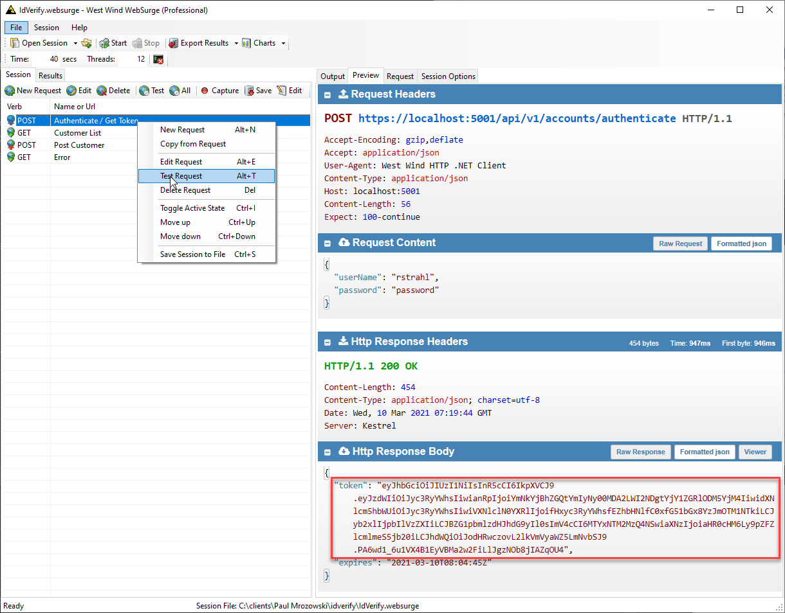
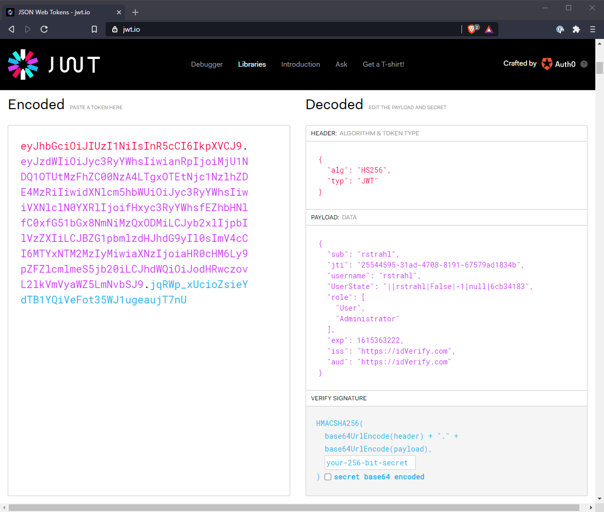
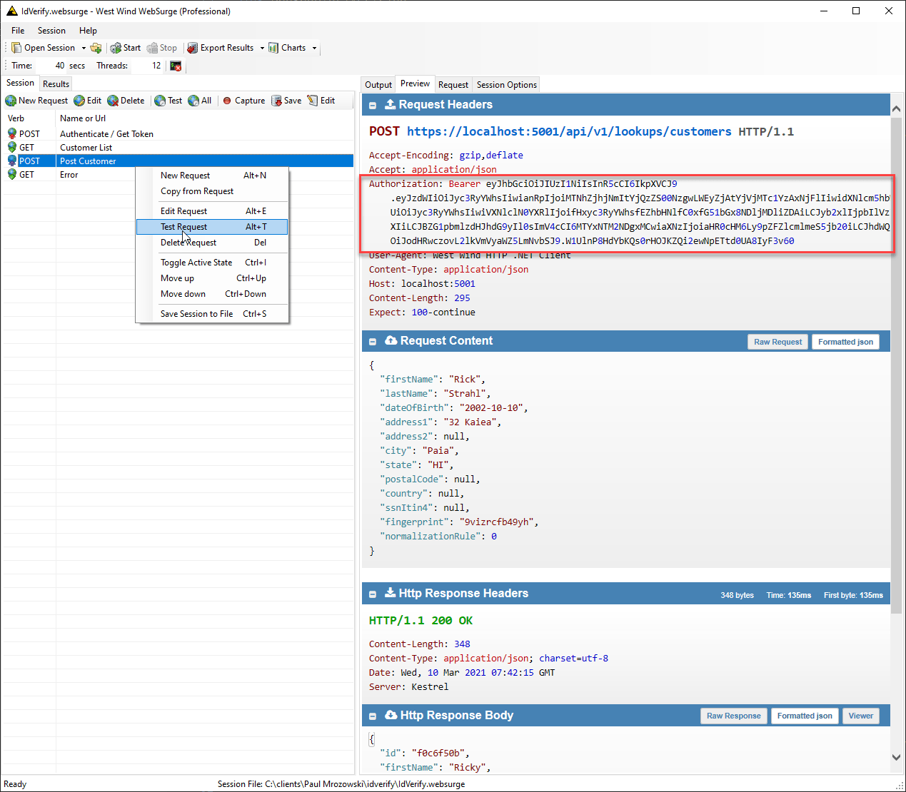

# Role based JWT Tokens in ASP.NET Core


Authentication and Authorization in ASP.NET Core continues to be the most fiddly component for configuration. It seems almost on every app I run into some sort of sticking point with Auth. Four versions in have brought three different authentication implementations and feature churn has also left a wave of out of date information in its wake. Today I got stuck in one of those Groundhog Day loops looking at outdated information with JWT Tokens for a Web API with Role based authorization. 

The current iteration of JWT Token setup in ASP.NET Core actually works very well, as long as you get the right incantations of config settings strung together. Part of the problem with Auth configuration is that most of settings have nothing to do with the problem at hand and deal with **protocol ceremony**. For example, setting Issuer and Audience seems totally arcane but it's part of the requirements for JWT Tokens and do need to be configured. Luckily there are only a few of those settings that are actually required and most of it is boilerplate.

I've not found this information all in one place, and today I barked up the wrong tree for a couple of hours in regards to Role authorization with JWT Tokens, where my app would validate non-role Authorizations, but not role based ones. So, now that I managed to get it all working, I'm writing it down so I can find it next time around.

In this post I specifically talk about:

* Authentication for an ASP.NET Core **Web API**
* Using JWT Tokens
* Using Role Based Authorization
* Using only low level features - **not using ASP.NET Core Identity**

## Configuration
Authentication and Authorization are provided as Middleware in ASP.NET Core and is traditional, you have to configure them in `.ConfigureServices()` and connect the middleware in `.Configure()`.

### Setting up JWT Authentication and Authorization
First step is to configure Authentication in `Startup.ConfigureServices()`. This is used to configure the JWT Token set up and add the required components to ASP.NET's processing pipeline:

```cs
// in ConfigureServices()

// config shown  for reference values
config.JwtToken.Issuer = "https://mysite.com";
config.JwtToken.Audience = "https://mysite.com";
config.JwtToken.SigningKey = "12345@4321";  //  some long id

// Configure Authentication
services.AddAuthentication( auth=>
{
    auth.DefaultAuthenticateScheme = JwtBearerDefaults.AuthenticationScheme;
    auth.DefaultChallengeScheme = JwtBearerDefaults.AuthenticationScheme;
})
.AddJwtBearer(options =>
{
    options.SaveToken = true;
    options.TokenValidationParameters = new TokenValidationParameters
    {
        ValidateIssuer = true,
        ValidIssuer = config.JwtToken.Issuer,
        ValidateAudience = true,
        ValidAudience = config.JwtToken.Audience,
        ValidateIssuerSigningKey = true,
        IssuerSigningKey = new SymmetricSecurityKey(Encoding.UTF8.GetBytes(config.JwtToken.SigningKey))
    };
}
```

JWT Authentication has a ton of settings, most of which are sufficiently cryptic that I'm pretty much just going to cut and paste them and fill in the values. Suffice it to say most of these concern setting up the protocol, and token wrapper.  Typically I store those values in my app's configuration settings so it gets pulled in via .NET's configuration provider and `.config` is that particular configuration instance.

**There's nothing Role specific** in this global configuration. All the role based related configuration happens when creating a token later on in the `Authenticate` endpoint.

### How Tokens and Hashing work
Before moving on here, let's review how token based authentication works and how these setup values fit into this scheme. 

The setup values above configure the token's common values and key used to sign the token. They provide identification markers to ensure that the token generated is unique. I consider these values a **base token wrapper**, and when you create a token you'll add your custom, **application specific claims** to the token typically right after you authenticate a user and provide the token back to the user or auth flow as part of a Web request.

The `IssuerSigningKey` is the most important part of this configuration, and it's used to hash the final token with the wrapper plus any claims added. The hash is used to validate the token's authenticity. Note while the generated token is encoded as base64, it is not by itself secure and the content can be decoded even on the client. To wit, you can take any JWT token and paste it into [JWT.io](https://jwt.io/) and decode the token's content.

The hash ensures that the token cannot be changed without breaking the token validity. When the token is sent with a request, it's validated by ASP.NET Core's JWToken middleware which first validates the hash against the token data and then applies the authentication/authorization based on the contained well-known authorization values. If the token has been changed by the client or some other entity in any way the hash won't validate and it's rejected outright. After that the username and role matching is applied in the authorization part of the middleware pipeline.

### Adding the Auth Middleware
Next we need to add the actual middleware for `.UseAuthentication()` and `app.UseAuthorization()` in `Startup.Configure`:

```cs
// in Startup.Configure()
app.UseHttpsRedirection();
app.UseRouting();

// *** These are the important ones - note order matters ***
app.UseAuthentication();
app.UseAuthorization();

app.UseStatusCodePages();
//app.UseDefaultFiles(); // so index.html is not required
//app.UseStaticFiles();

app.UseEndpoints(endpoints =>
{
    endpoints.MapControllers();
});
```

Note that order matters for Authentication and Authorization. These two need to be injected **after Routing** but before any **HTTP output generating middleware**, most importantly before `app.UseEndpoints()`.

## Authenticating Users using an Web API Endpoint
Next we need to authenticate a user within the application by asking for credentials, and then generating a token and returning it to the API client. 

This likely happens a **Controller Action Method** or **Middleware Endpoint Handler**. Here's what this looks like using a Controller Action Method:

```cs
[AllowAnonymous]
[HttpPost]
[Route("authenticate")]
public object Authenticate(AuthenticateRequestModel loginUser)
{
	// My application logic to validate the user
	// returns a user entity with Roles collection
    var bus = new AccountBusiness();
    var user = bus.AuthenticateUser(loginUser.Username, loginUser.Password);
    if (user == null)
        throw new ApiException("Invalid Login Credentials: " + bus.ErrorMessage, 401);

    var claims = new List<Claim>();
    claims.Add(new Claim("username",loginUser.Username));
    claims.Add(new Claim("displayname",loginUser.Name));
    
    // Add roles as multiple claims
    foreach(var role in user.Roles) 
    {
        claims.Add(new Claim(ClaimTypes.Role, role.Name));
    }
    // Optionally add other app specific claims as needed
    claims.Add(new Claim("UserState", UserState.ToString()));

    // create a new token with token helper and add our claim
    // from `Westwind.AspNetCore`  NuGet Package
    var token = JwtHelper.GetJwtToken(
        loginUser.Username,
        Configuration.JwtToken.SigningKey,
        Configuration.JwtToken.Issuer,
        Configuration.JwtToken.Audience,
        TimeSpan.FromMinutes(Configuration.JwtToken.TokenTimeoutMinutes),
        claims.ToArray());
    
    return new
    {
        token = new JwtSecurityTokenHandler().WriteToken(token),
        expires = token.ValidTo
    };
}
```

I'm using a `JWTHelper class` to actually generate a token so I don't have to remember this repetitive 'ceremony' in each application from the  [JwtHelper class dependency](https://github.com/RickStrahl/Westwind.AspNetCore/blob/master/Westwind.AspNetCore/Security/JwtHelper.cs). The code creates the token and extracts a string from it that's ready to be returned as a bearer token value. Here's the relevant code:

```cs
public class JwtHelper
{
    public static JwtSecurityToken GetJwtToken(
        string username,
        string signingKey,
        string issuer,
        string audience,
        TimeSpan expiration,
        Claim[] additionalClaims = null)
    {
        var claims = new[]
        {
            new Claim(JwtRegisteredClaimNames.Sub,username),
            // this guarantees the token is unique
            new Claim(JwtRegisteredClaimNames.Jti, Guid.NewGuid().ToString())
        };

        if (additionalClaims is object)
        {
            var claimList = new List<Claim>(claims);
            claimList.AddRange(additionalClaims);
            claims = claimList.ToArray();
        }

        var key = new SymmetricSecurityKey(Encoding.UTF8.GetBytes(uniqueKey));
        var creds = new SigningCredentials(key, SecurityAlgorithms.HmacSha256);

        return new JwtSecurityToken(
            issuer: issuer,
            audience: audience,
            expires: DateTime.UtcNow.Add(expiration),
            claims: claims,
            signingCredentials: creds
        );
    }
}
```

The `Authenticate()` controller code first uses an application specific business object to validate the user passed in as part of the API call (or Login form if you're doing HTML forms). If the user is valid, I create new claims that are packaged into the token. 

The tokens include the username and roles which is what's required for ASP.NET Core's authorization to work. I then can add some additional application specific claims if necessary like the display name and a custom `UserState` object in the example above. These claims travel with the token and can be retrieved later without having to access a backend to retrieve them again.

Finally the token is generated using `JwtHelper.GetJwtToken()` with the user id as the key a signing key, some site specific state and the actual claims. Finally you can turn the token into a string:

```cs
var tokenString = new JwtSecurityTokenHandler().WriteToken(token);
```

which can then be used by the client as a `Bearer ` token.

> Note that the `Authentication` method needs to be anonymously accessible if the `AccountController` is otherwise set to `[Authorize]`. make sure that the `Authenticate()` method has an `[AllowAnonymous]` attribute.

### Claims and Roles, Roles, Roles
ASP.NET Core uses Claims for authentication. Claims are pieces of data that you can store in the token that are carried with it and can be read from the token. For authorization Roles can be applied as Claims.

The correct syntax for adding Roles that ASP.NET Core recognizes for Authorization is in .NET Core 3.1 and 5.x is by adding multiple claims for each role:

```cs
// Add roles as multiple claims
foreach(var role in user.Roles) 
{
	claims.Add(new Claim(ClaimTypes.Role, role.Name));
	
	// these also work - and reduce token size
	// claims.Add(new Claim("roles", role.Name));
	// claims.Add(new Claim("role", role.Name));
}
```

### Invalidating a Token


### Accessing the JWT Token Generation API
So at this point I have an `Authenticate` API endpoint that I can retrieve a token from. Here's what this specific request looks like:



Username and password are passed in, and the token along with an expiration time is passed back. You can check out this token and see what it generated at `https://jwt.io`:



> Notice that the token is easily decoded by an external tool, totally unrelated to my application. This means the contained token data is not secure from prying eyes. However, the values in that token can't be changed and provided to the server application **unless the data is signed by the original Signing Key**. This prevents the token from being tampered with.

Once the token's been generated and sent to the client, the client can now use it in subsequent requests to add the appropriate `Authorization` header:

```http
Authorization: Bearer 1235*53213...
```

to outgoing requests.

## Securing the API
What's left now is to selectively or restrictively limit access to the API(s) by adding `[Authorize]` attributes either on controllers or endpoint methods. 

I can use one of the following or no attributes at all (for open access):

* Plain `[Authorize]` to let any authenticated user in
* Role based `[Authorize(Roles = "Administrator,ReportUser")]`
* Anonymous `[AllowAnonymous]` 

Note the attributes can be set on a Controller class, or Action method and they work hierarchically from the top down, so a class attribute applies to all action methods. This is where `[AllowAnonymous]` comes in handy to override the one or two requests that might need open access (like `Authenticate()` or `Logout()`).

To set up authorization for any authorized user, just use `[Authorize]`:

```cs
[Authorize]   // just require ANY authentication
[Route("/api/v1/lookups")]
public class IdLookupController : BaseApiController
```

In this scenario you likely need to do some additional validation of the user to ensure you have the **right** user for specific operations.

To set up up Role specific restrictions you can use the `Roles` parameter:

```cs
[Authorize(Roles = "Administrator")]
[HttpPost]
[Route("customers")]
public async Task<SaveResponseModel> SaveCustomer(IdvCustomer model)
```

Now only those that are part of the `Administrator` group have access. The List can use multiple roles using a comma delimited list ie. `"Administrator, ReportUser"`.
 
## Accessing Secured Endpoints with the Bearer Token
Now that the API is secured we have to pass the Bearer token with each request to authenticate. It looks like this:



And voila - I can now access the Administrator group protected POST operation.

And that completes the circle...

## Summary
Authentication and Authorization in ASP.NET Core has gotten a lot simpler in recent versions, but finding the right documentation for setting all the dials for JWT Token Authentication is still not very obvious. There's a lot of information about authentication and it's easy to get lost in the docs and end up on outdated information, because the behavior of Authentication has changed significantly throughout ASP.NET Core versions. If you're looking up additional information make sure it's for version 3.1 and later which is the latest as of now.

In this post I've addressed what works for 3.1 and 5.0. Mercifully 5.0 saw no further breaking changes to the Authentication/Authorization APIs.

As is often the case I'm writing this down for my own peace of mind so I have all the information in one place. Hopefully some of you'll find this useful as well.

<div style="margin-top: 30px;font-size: 0.8em;
            border-top: 1px solid #eee;padding-top: 8px;">
    
    this post created and published with the 
    <a href="https://markdownmonster.west-wind.com" 
       target="top">Markdown Monster Editor</a> 
</div>