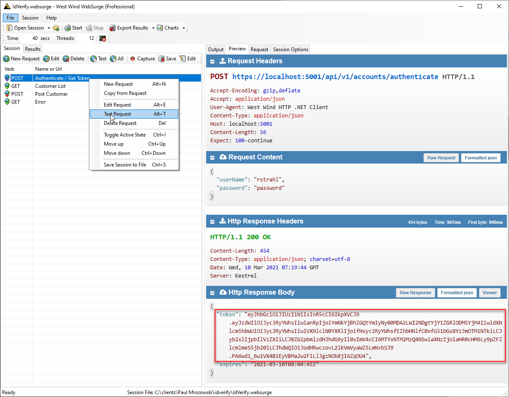
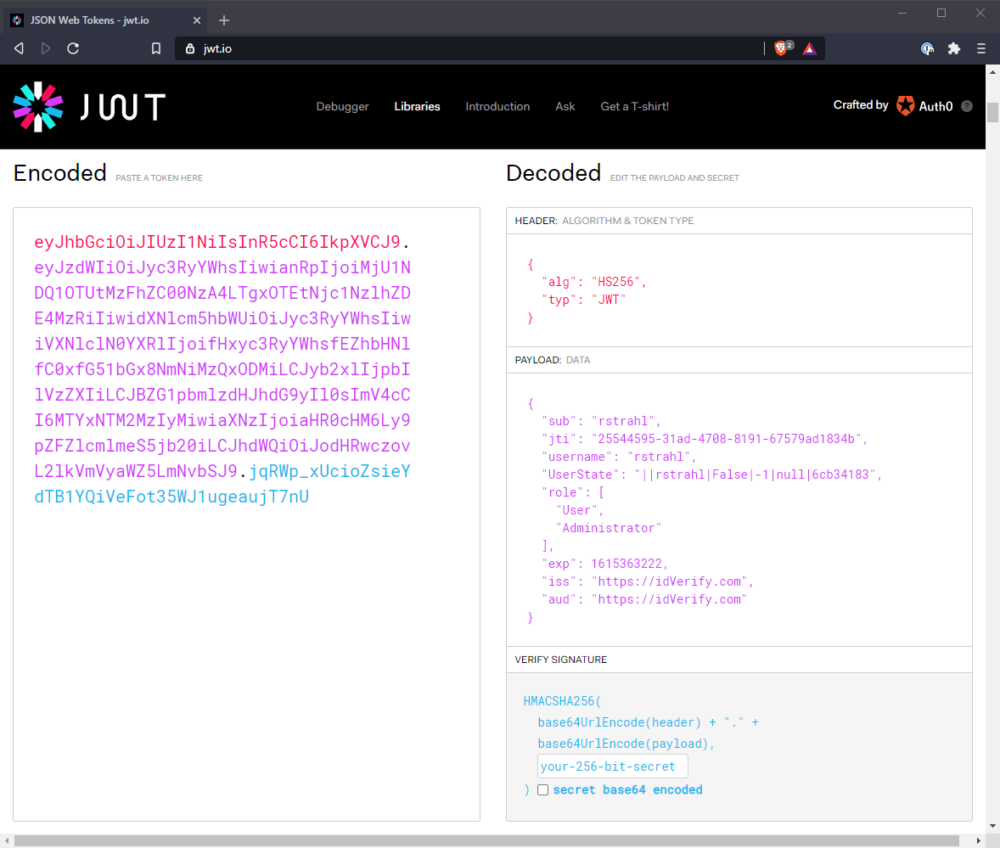
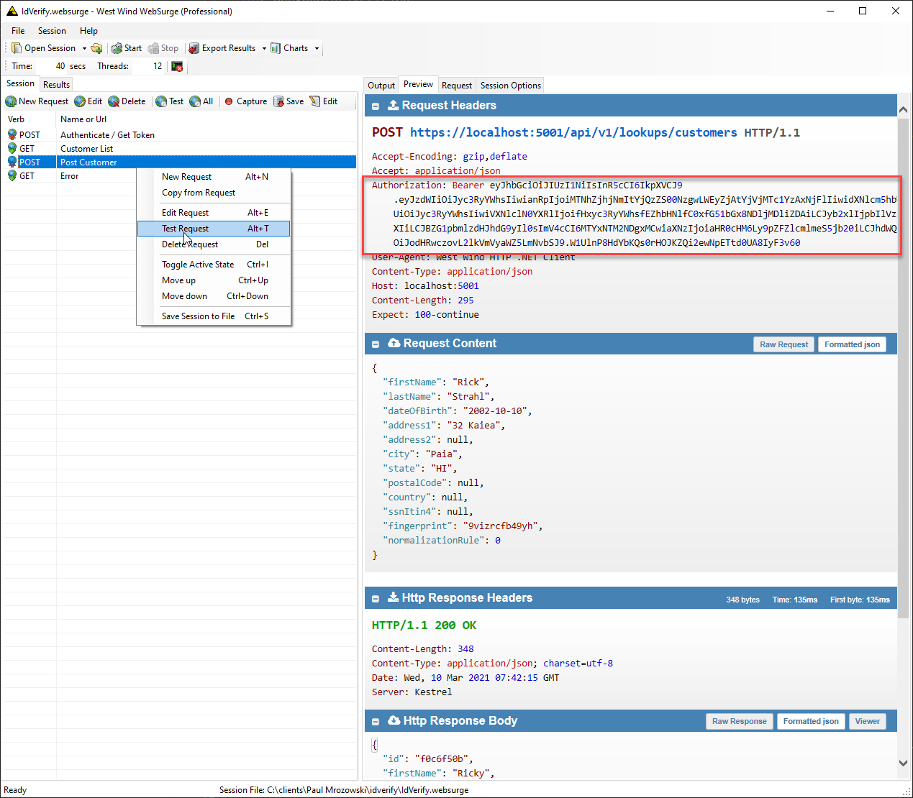

# Role based JWT Tokens in ASP.NET Core


Authentication and Authorization in ASP.NET Core continues to be the most fiddly component for configuration  and it seems almost on every app I run into some sort of sticking point with Auth. Four versions in have brought three different authentication implementations and this change has also left a wave of out of date information in its wake. Today I got stuck in one of those Groundhog Day loops looking at outdated information with JWT Tokens for a Web API with Role based authorization. Mostly due to impatience and not finding the right up to date documentation right away, 'cause - yes I'm too impatient sometimes - aren't we all?

The current iteration of JWT Token setup in ASP.NET Core actually works very well, as long as you get the right combinations of config settings strung together. Part of the problem with Auth configuration is that most of settings have nothing to do with the problem at hand and deal with ceremony. For example, setting Issuer and Audience seems totally arcane but it's part of the requirements for JWT Tokens and do need to be configured. Luckily there are only a few of those settings that are actually required.

I've not found this information all in one place, and today I barked up the wrong tree for a couple of hours in regards to Role authorization with JWT Tokens where my app would validate non-role Authorizations, but not role based ones. So, now that I managed to get it working I'm writing it down so I can find it next time around.

In this post I specifically talk about:

* Authentication for an ASP.NET Core Web API
* Using JWT Tokens
* Using Role Based Authorization
* Using only low level features - not using ASP.NET Core Identity

## Setting up JWT Authentication and Authorization
First step is to configure Authentication in `ConfigureServices()`. This is used to configure the JWT Token set up and add the required components to ASP.NET's processing pipeline:

```cs
// in ConfigureServices()

// config shown  for reference values
config.JwtToken.Issuer = "https://mysite.com";
config.JwtToken.Audience = "https://mysite.com";
config.JwtToken.SigningKey = "12345@4321";  //  some long id

// Configure Authentication
services.AddAuthentication( auth=>
{
    auth.DefaultAuthenticateScheme = JwtBearerDefaults.AuthenticationScheme;
    auth.DefaultChallengeScheme = JwtBearerDefaults.AuthenticationScheme;
})
.AddJwtBearer(options =>
{
    options.SaveToken = true;
    options.TokenValidationParameters = new TokenValidationParameters
    {
        ValidateIssuer = true,
        ValidIssuer = config.JwtToken.Issuer,
        ValidateAudience = true,
        ValidAudience = config.JwtToken.Audience,
        ValidateIssuerSigningKey = true,
        IssuerSigningKey = new SymmetricSecurityKey(Encoding.UTF8.GetBytes(config.JwtToken.SigningKey))
    };
}
```

JWT Authentication has a ton of settings, most of which are sufficiently cryptic that I'm pretty much just going to cut and paste them. Suffice it to say most of these concern setting up the protocol, and token wrapper.  

Note **there's nothing Role specific** in this global configuration. All the role based related configuration happens when creating a token later on in the `Authenticate` endpoint.

The values here configure the token's common values and key used to sign the token. The key is the most important part as it determines how the token can be unpacked and read by ASP.NET Core to authorize requests when requests come in.

Next we need to add the actual middleware for `.UseAuthentication()` and `app.UseAuthorization()` in `Startup.Configure`:

```cs
// in Startup.Configure()
app.UseHttpsRedirection();
app.UseRouting();

// *** These are the important ones - note order matters ***
app.UseAuthentication();
app.UseAuthorization();

app.UseStatusCodePages();
//app.UseDefaultFiles(); // so index.html is not required
//app.UseStaticFiles();

app.UseEndpoints(endpoints =>
{
    endpoints.MapControllers();
});
```

Note that order matters for Authentication and Authorization. These two need to be injected **after Routing** but before any **HTTP output generating middleware**, most importantly before `app.UseEndpoints()`.

## Authenticating Users in an API App
Next we need to authenticate a user within the application, and then generate a token and return it to the API client. 

This likely happens a Controller Action method or Middleware Endpoint Handler. I'm using a controller method here:

```cs
[AllowAnonymous]
[HttpPost]
[Route("authenticate")]
public object Authenticate(AuthenticateRequestModel loginUser)
{
	// My application logic to validate the user
    var bus = new AccountBusiness();
    var user = bus.AuthenticateUser(loginUser.Username, loginUser.Password);
    if (user == null)
        throw new ApiException("Invalid Login Credentials: " + bus.ErrorMessage, 401);

    var claims = new List<Claim>();
    claims.Add(new Claim("username",loginUser.Username));
    claims.Add(new Claim("displayname",loginUser.Name));
    
    // Add roles as multiple claims
    foreach(var role in user.Roles) 
    {
        claims.Add(new Claim(ClaimTypes.Role, role.Name));
    }
    // Optionally add other app specific claims as needed
    claims.Add(new Claim("UserState", UserState.ToString()));

    // create a new token with token helper and add our claim
    var token = JwtHelper.GetJwtToken(
        loginUser.Username,
        Configuration.JwtToken.SigningKey,
        Configuration.JwtToken.Issuer,
        Configuration.JwtToken.Audience,
        TimeSpan.FromMinutes(Configuration.JwtToken.TokenTimeoutMinutes),
        claims.ToArray());
    
    return new
    {
        token = new JwtSecurityTokenHandler().WriteToken(token),
        expires = token.ValidTo
    };
}
```

This code first uses an application specific business object to validate the user passed in as part of the API call (or Login form if you're doing HTML forms). If the user is valid, I create a new claims that are packaged into the token. These claims travel with the token and can be retrieved later without having to access a backend. It's useful for common things that display in the UI like display name, email address, as well as the user Id so a full user can be retrieved.

Finally the token is generated using `JwtHelper.GetJwtToken()` with the user id as the key a signing key, some site specific state and the actual claims. Finally you can turn the token into a string:

```cs
var tokenString = new JwtSecurityTokenHandler().WriteToken(token);
```

which can then be used by the client as a `Bearer ` token.

Note that your authentication method needs to be anonymously accessible so be if the `AccountController` is otherwise set to `[Authorize]` make sure that the `Authenticate()` method has an `[AllowAnonymous]` attribute so it can be accessed without being authenticated.

### Claims and Roles, Roles, Roles
ASP.NET Core uses Claims for authentication. Claims are pieces of data that you can store in the token that are carried with it and can be read from the token. For authorization Roles can be applied as Claims.

The reason I'm writing this post today is because I had a heck of a time getting the role Claims to work properly.  Not because it didn't work, but because I didn't find the correct syntax to use.   Maddeningly general `[Authentication]` without roles worked fine, but any attempt to get roles to work failed for me. **There is a lot of outdated information regarding JWT Authentication out there** and I was misled by outdated syntax using a single `roles` key with a comma delimited list of roles - which does not work!

The correct syntax for adding rows that ASP.NET Core recognizes for Authorization is in .NET Core 3.1 and 5.x is by adding multiple claims for each role:

```cs
// Add roles as multiple claims
foreach(var role in user.Roles) 
{
	claims.Add(new Claim(ClaimTypes.Role, role.Name));  // "roles" or "role" keys work too
}
```

And that works. It seems bloody obvious now, but I was tripped up by dated examples...

## Accessing the JWT Token Generation API
So at this point I have an `authenticate` API endpoint that I can retrieve a token from. Here's what this specific request looks like:



Username and password are passed in, and the token along with an expiration time is passed back. You can check out this token and see what it generated at `https://jwt.io`:



The client can now pick up the token and create the appropriate

```http
Authorization: Bearer 1235*53213...
```

header into the header of subsequent HTTP requests. Nice.

## Securing the API
What's left now is to selectively or restrictively limit access to the API(s) by adding `[Authorize]` attributes. 

I can use one of the following or no attributes at all (for open access):

* Plain `[Authorize]` to let any authenticated user in
* Role based `[Authorize(Roles = "Administrator,ReportUser")]`
* Anonymous `[AllowAnonymous]` 

Note the attributes can be set on a Controller class, or Action method and they work top down, so a class attribute applies to all action methods. This is where `[AllowAnonymous]` comes in handy to override the one or two requests that might need open access (like authentication and logging out for example).

To set up authorization for any authorized user, just use `[Authorize]`:

```cs
[Authorize]   // just require ANY authentication
[Route("/api/v1/lookups")]
public class IdLookupController : BaseApiController
```

In this scenario you likely need to do some additional validation of the user to ensure you have the **right** user for specific operations.

To set up up Role specific restrictions you can use the `Roles` parameter:

```cs
[Authorize(Rules = "Administrator")]
[HttpPost]
[Route("customers")]
public async Task<SaveResponseModel> SaveCustomer(IdvCustomer model)
```

Now only those that are part of the `Administrator` group have access. The List can use multiple roles using a comma delimited list ie. `"Administrator, ReportUser"`.
 
## Sending Requests with the Bearer Token
Now that the API is secured we have to pass the Bearer token with each request to authenticate. It looks like this:



And voila - I can now access the Administrator group protected POST operation.

And that completes the circle...

## Summary
Authentication and Authorization in ASP.NET Core has gotten a lot simpler in recent versions, but finding the right documentation for setting all the dials for JWT Token Authentication is still not very obvious. There's a lot of information about authentication and it's easy to get lost in the docs and end up on outdated information, because the behavior of Authentication has changed significantly throughout ASP.NET Core versions.

In this post I've addressed what works for 3.1 and 5.0 (so far). Mercifully 5.0 saw no further breaking changes to the Authentication/Authorization APIs.

As is often the case I'm writing this down for my own peace of mind so I have all the information in one place. Hopefully some of you'll find this useful as well.

<div style="margin-top: 30px;font-size: 0.8em;
            border-top: 1px solid #eee;padding-top: 8px;">
    
    this post created and published with the 
    <a href="https://markdownmonster.west-wind.com" 
       target="top">Markdown Monster Editor</a> 
</div>