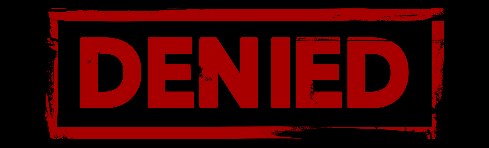
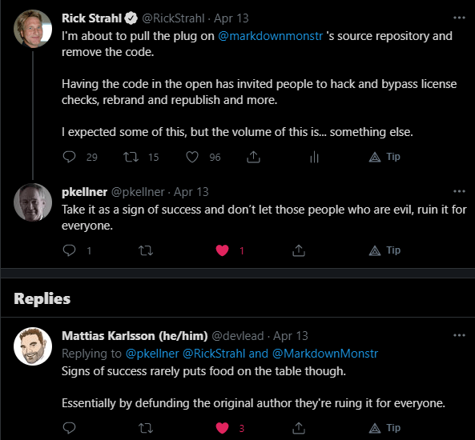

# Taking down the Markdown Monster Source Code

With a heavy heart and a lot of hand wringing, I decided last week to take down the [Markdown Monster](https://markdownmonster.west-wind.com) source code from the public GitHub repository due to rampant license abuses.

The GitHub repository is still there and will continue to be there. You can still download Markdown Monster installers and access the Chocolatey, Snap and WinGet packages. Issues will continue to be processed and fixed and new versions will be forthcoming. **Markdown Monster is not dead!**

But the source code out in the open is now a thing of the past and only [available by explicit request in a private repository](https://markdownmonster.west-wind.com/purchase#SourceCode).

In this post I'll talk about the reasons for this action as well as offer some of my thoughts on the state of software today. You can take the latter with a grain of salt, but the discussion of the hows and whys of having source code in the open and how it didn't work out for me might be useful to others who are thinking about doing something similar.

### A History of Markdown Monster as a Product
Markdown Monster is a Windows based Markdown Editor and Weblog Publisher that provides a ton of functionality around the basic process of Markdown editing. It sounds simple enough, but to do Markdown right and provide a productive workflow for writing, there are a lot of things that you can do to make the process easier and Markdown Monster is my take on doing that. What started as a fairly minimal editor has transformed in a multi-functional application, that still provides a simple user experience while providing many sophisticated addon features. You can check out the features either on the [Markdown Monster site](https://markdownmonster.west-wind.com) or on the [GitHub repository](https://github.com/RickStrahl/MarkdownMonster).

Markdown Monster started very modestly but has grown both in feature scope as well as popularity. 

The project is not and never was a FOSS (Free Open Source) project. But it did have source code on GitHub out in the open, and uses a commercial license that requires a license purchase or use one of several avenues related to supporting the project to get a free license. Free licenses are offered to contributors (both code as well as feedback, help with tracking down bugs, or any other valuable support of Markdown Monster up to our discretion) as well to various developer programs and organizations. Discounted licenses are available depending on international locations.

When I started with Markdown Monster it was a very small project and licensing was mostly  an afterthought, but as time went on the product grew in sophistication, and today it is used by more than a thousand people every day on average. Supporting and updating Markdown Monster has become much more than just a small side project that I can work on for a few hours a week between adding new features, fixing bugs and fielding support for issues, feature requests and other minutiae.

From the very beginning I was pretty clear in my vision to **not make this a free product**. I have plenty of true FOSS open source projects where all code is open and free to use, but when it comes to building what ended up being a commercial  product as a one-man shop developer, the effort involved in development and support goes beyond what I can afford to just give away in time and effort, even in light of free competition from other editors that have big corporate backing or from small tools that are much less feature rich.

> **For me I was never about giving Markdown Monster away for free. If you don't like it - use something else!**

### Early Days
Initially - before there was a lot more interest - this dual distribution worked out well. Many people registered and played by the licensing rules. The source code got picked up in Forks and there also were a fair amount of small contributions in those early days. 

The ratio between usage and registrations was reasonable at first. And **thank you to all of you that did register** - I really appreciate that, especially in light of all those that didn't later on.

Additionally, at the start at least, there was quite a bit of incoming support with code submissions, lots of feedback and suggestions, or simply working through features or bugs, which resulted in me giving out quite a few free licenses for helping along Markdown Monster to become a better product. I really want to thank those contributors as well - you've all helped make Markdown Monster a much better tool, and I really appreciate all the feedback and discussion. Many have resulted in new and useful features and enhancements that I would not have made on my own.

Over time though, as Markdown Monster has added many more features and the code has gotten more complex, that involvement has died down some, as the product has matured and found it's niche. But there are still many great feature requests and bug reports and that is also much appreciated. And there are still a number of people who frequently provide valuable feedback or other support that warrants free licenses. 

I strongly believe in:

>  ***Give something, get back something. Value for value!***

Whether that's with $$$ or feedback or time or promotion, I believe something should come back for use of software. And I'm not just talking about MM here, but in more general terms and especially for OSS projects. 

### Popularity and Abuse
But as Markdown Monster became yet more popular and I started looking at the logs it became quite obvious that the vast majority of users **were not playing by the rules**. The ratio between usage and registrations widened, and it was clear that hacked versions were running on fake registrations.

What sort of abuses am I talking about? Markdown Monster tracks anonymous usage statistics and those usage statistics tell a pretty ugly usage story. Markdown Monster is not a free product despite the fact the source code was available on GitHub. 

Here are some numbers from some of the recent logs:

* More than 1000 people use Markdown Monster daily on average
* Of users having used MM more than 50 times - less than 1 in 180 is registered
* Of users having used MM more than 20 times - less than 1 in 400 is registered.
* Lots of first time accesses with 'Registered' status from locations that have never registered

For example, there are tons of users in India, China and Russia that show with registered status. Just checked I have 1 registration from China, none from Russia and 2 from India. Clearly somebody's not playing by the rules.

This despite the fact that some time ago I'd set up options for reduced pricing for international locales to make pricing more in in-line with local income. I've offered [reduced pricing for licenses in different locales](https://markdownmonster.west-wind.com/purchase#discountpricing) based on the [Big Mac Index](https://fxssi.com/big-mac-index) which assigns percentage discounts based on the locale by request. I put this program up late last year (8 months ago) - to date I had **two requests** for the discount and **one order** from it. IOW, nobody gives a shit... because free is always better than cheap, right?

There are also free license offers for Microsoft MVPs, Microsoft Employees, any company that provides free stuff into the MVP program - which is my way of giving back something to that program and those companies that have provided access to tools and software to me over the years. There's generous use of that and that's fine - that's the way it was designed to be.

What I'm trying to get at here is that I've tried to make licenses accessible and give options to make it fair for both sides. 

Give something and get something back. 

I get it that some will still think a purchased license is too much **because you know this other product is free**. Fair enough, use that product if that works for you. But that's usually not how that goes. Instead it's use a hacked version and use the non-free product anyway despite not paying for it.

The very worst of it though, is that running the logs also showed me several different **re-branded versions of Markdown Monster** running under a different name. These people are so lazy they didn't even bother to remove the logging code.

As with all piracy you can make life miserable for everyone, and still not suppress all piracy, so I was opting for trying to make this work with minimal security and requirements and source code out in the open :smile:  

I'm not so naive to think that some of this wasn't going to happen. I've sold software throughout my professional life and have seen it all before - the ripped versions, and software keys etc. In most previous cases the lenient registration requirements worked out for the most part - most legit users that used the product beyond the trial periods or basics usually end up registering. However Markdown Monster serves a more general audience than my otherwise more business/corporate oriented software, and the the scale of license abuse in MM was something that I didn't expect. Rampant is the word and it's not an exaggeration in this case.

To be clear, I have no one else but myself to blame. It was a conscious choice to keep it simple and open when I started, being optimistic that users would see the value in that for everybody involved, but I was proven naive to think a different, optimistic outcome was going to come from this.

### Thank you to those of you that played by the Rules
To be fair there have been also many registrations to Markdown Monster. Many users did play by the rules. And many people have either contributed, made a valuable feature request, or have taken the time to report a bug and followed through the sometimes time consuming process of tracking down a bug.

I want to thank you and provide a glimmer of hope that maybe I'm not a completely hopeless idealist. I really appreciate the support and those of you that have played by the rules that are a huge incentive to continue working on Markdown Monster and improving it going forward.

### Pull it!
So as a result of this abuse, I've been contemplating to tamp down on the rampant license abuse by removing Markdown Monster's source code. Having the source code available makes it just too easy to hack the code,  remove the licensing or as some have obviously done, completely re-brand Markdown Monster.

I've been contemplating this move for quite some time. Before actually going ahead with it, I wanted to see what kind of reaction I'd get and started off with this tweet from people that I regularly interact with on Twitter:

I was expecting push back and being talked out of going forward.

Instead, surprisingly I got an earful of feedback and a bunch of co-miseration by other developers who had similar stories with code out in the open. The feedback was mostly along the lines  "Yeah that sucks, but do what's right for you", which frankly I did not expect.

If you're interested you can follow the [discussion on the tweet](https://twitter.com/RickStrahl/status/1382138098117615618) - there are a lot of insightful comments on this very long thread. 

### Going, Going... Gone
After this discussion and some more soul searching I ended up pulling the plug and removing the source code - it's now gone from the main [Markdown Monster GitHub repo](https://github.com/rickstrahl/MarkdownMonster). The code of course is still there in archives for older versions and that's fine. That ship has long sailed for v1. But going forward the code is no longer out in the open.

[Version 2.x](https://markdownmonster.west-wind.com/download) which is getting close to release will use a different licensing scheme that ties users and usage to specific keys and source code for that version will not be available. This adds more complexity, both on my end for license management as well as for end users who now have to enter long license keys and have to manage licenses for multiple machines.

Of course, Markdown Monster is a .NET app and .NET can easily be decompiled so code ripping isn't really a solved problem, but at least without source code so readily available there's a bit more of a hurdle than simply re-appropriating the application with a few quick code changes.

### Source Code Loss Sucks
It's a real bummer for me to kill the code too, as I have often used Markdown Monster source code as examples for blog posts and articles. Not only does the code removal break a lot of old code links, but it also removes easy issue linking on GitHub and quick back references to source code from the GitHub Issues Tracker. It also makes it harder for those that want to contribute and I'm sorry for that, but if you want to contribute or even just play with the source code you can request access to the now private Markdown Monster Code Repository. The private report allows me more control over who has access and weeds out the riff raff to some degree. It turns out with request access few are interested which is both a blessing and a curse.

## Markdown Monster is not Dead!
I want to be very clear here: Although I cut off the source code in the [GitHub repository](https://github.com/RickStrahl/MarkdownMonster):

**Markdown Monster will continue as product just as it did before**

This change has very little impact on 99% of you using Markdown Monster. Unless you were one of the very few people using the source code - legitimately or otherwise - this has no impact on you at all.

I will continue to work on Markdown Monster, just as I did before, pushing out frequent updates, responding to issues on GitHub, fixing bugs and updating the various distribution points for Markdown Monster.

If you own a license - thank you I really appreciate your support!!! And your license is still good and continues to work just as it did before and you'll continue to get updates of the current major version for free, just as before.

If you don't own a license, the evaluation version continues to work the same as before too: You'll get the same fully functional version of Markdown Monster with the occasional nag screens and notices and a few features that are not accessible.

### Source Code
The only thing that changes as of March 14th, 2020 is that the source code is no longer available in public. 

The [GitHub repository](https://github.com/RickStrahl/MarkdownMonster) is still up and continues to serve for issue tracking and as a secondary product landing page that contains download, installation and feature links.

But this repository is now devoid of a `Src` or `MarkdownMonster` folder that used to contain the source code.

There are still many forks of Markdown Monster out there but those forks will no longer track the live code going forward which now resides in a private repository. 

I would much prefer to build Markdown Monster out in the open, but due to the rampant abuse keeping a public repository simply makes it too easy for the shit heads to abuse their privilege.
  
And for those that want to work with the Markdown Monster code for internal use, or to help improve Markdown Monster, it's possible to **request private access** to the GitHub repository. There's [more info on the licensing page](https://markdownmonster.west-wind.com/purchase#SourceCode) on how to go about that.

### Regretabble
While I hate to do this and it is more work for me, private access at least allows me some control over who has access and if the abuse continues I can easily shut off either individual accounts or if necessary every one. We'll see. 

As much as I prefer having things out in the open, it wasn't much of a benefit to have the source available during the 4 years of Markdown Monsters time so far. Early on there were a few strong contributions, but as the product has matured that has fizzled. I'm not surprised as Markdown Monster is not exactly trivial to work on. The source is not the easiest to navigate especially anything that has to do with UI.

I'm not complaining: For MM I actually prefer feature requests that I end up implementing unless it's something altogether out of my realm of capability or desire to build. For maintenance it's usually much easier for me to write the code and maintain it long term and streamline it into the overall Markdown Monster application flow. 

But I do really regret having the code not in the open. There are so many benefits of having code available to reference. There are lots of small useful code blocks that I've shared over the years (and many more that I have not) that can be useful to others as well as myself for linking or referencing in posts, articles or other online content. 

As always it's a few bad apples spoiling the goodwill for everyone else, but I don't know what other options I have if I want MM to continue as a licensed product.

So here we are. It's been a couple of months now since I pulled the source and there has been an uptick in registrations. The flow of incoming orders is definitely more steady and if v2 is an indication a lot of v1 users feel it's worth upgrading to the newer version as well. Again I appreciate those that do play by the rules.

## Some Thoughts the State of Software
I'm really sad that it's come to this. As I mentioned I wasn't blind to the idea that this was going to happen but with the initial release I was trying to be cautiously optimistic that this open but licensed concept could work. And in fact it did for the first 2 years or so before Markdown Monster started getting popular. 

I've been doing software sales for a loooong time and there's no denying that the trend of commercial value in software is slowly inching its way toward zero. Open Source has done us no favors in that respect as that perpetuates the idea that you can get something for nothing. Some people end up doing all the work while many more do nothing to support the cause and just take without giving something back. There's no value for value proposition there for most participants.

I think there's a big problem with anything that is free. It is a price distortion, because effectively nothing is free. There's always a price associated with anything to create it or on the flip-side, to use it. The price may be hidden or spread out, or worse yet delayed and to be paid back in hidden benefits that aren't obvious. And without a price the value of the item is often easy to just throw away both from the perspective of the user as well as the developer. 

Add to that big vendors giving away sophisticated software for free. Visual Studio, VS Code many other editors and IDEs, lots and lots of tools, libraries etc. Think about all the free stuff that we all use everyday - how much have any of us given back to many of those free tools we use? But there's often a catch. Embedded marketing, data collection, etc. etc. all exacts a price.

I'm not immune to subconsciously leaning toward free software either.  Even though I go through my list of tools and libraries occasionally to give back something I never end up going through everything - there's too much of that. It's neither obvious, consistent and too often it just gets forgotten and omitted altogether, if not willfully then accidentally.

Honestly the honor system is a lot of work. As a user who actually honors the unwritten contract you have to try to figure out what the thing you're using is worth. And usually we are very likely to err on the downside would be my guess. It takes some effort to do the right thing, to remember to do this every year or every few years. Did you remember to do your part when it was time? For the developer it's an effort too, because they have to incentivize and advertise that 'feature' and try to convince user to contribute in some way when they can effectively ignore the plea altogether. It's a lot of wasted mental energy by comparison to setting a fixed value for what the software is worth in the first place.

After a while we've all been conditioned that the software we do use should be free or at minimum dirt cheap. How often do we all run around looking for something we need and opt for the often inferior solution just because it is free?

As a result we often end up centralized solutions because all resources pour into only the biggest projects that have support from huge numbers of developers, or from huge corporations that control popular open source projects (Microsoft, Google, Facebook, Amazon etc.) by having paid developers doing full-time work 'open source' project. 

For smaller developers open source rarely draws enough resources to subsidize a project either financially or via contributions or support. Instead those are the projects that are usually taken advantage of the most. Too small to be taken serious, and overlooked when it comes to supporting when the time comes to pay up or offer up donations/support for OSS solutions. Again, I'm not immune that problem myself and guilty as charged myself! It's the nature of the beast. 

What I'm trying to get at that free is a distortion that changes your relationship with the tools you use. It becomes a throwaway thing both for users and developers. If the tool doesn't work users are bound to walk away instead of helping improve it because the assumption is that it has no value. Move on to the next no value thing.

If the developer gets tired of the tool or finally figures out that he's busting his balls for no pay back, he may just decide to walk away without looking back potentially leaving users hanging. Been there done that a couple of times myself too - not proud but had to do it to keep my sanity. 

Putting a price on something makes that a lot harder - first because the developer owes something to those that have spent money, and secondly because the $$$ provide at least some incentive to continue on. The user has invested some $$$ too and wants to get her money's worth. A $$$ price also helps crystallize whether there is real value in a project - if it's not free would people still be willing to use it? With free you often never know if it's because your tools are good, or whether it's just because it's free. 

I mention all this in context of Markdown Monster, because it is not a free tool and it has to fight the free stigma. I totally get the aversion to non-free and that's fine. If that's not for you - use something else. But what really flummoxed me with this particular product was  that it wasn't shunned, but actively subverted to work around the non-free implementation.

The reality is as a small single developer building a real, licensed product, it is difficult to survive on. Markdown Monster is a not a big project and it plays in an area with quite a bit of competition. But yet it's quite popular and there are a lot of users who use it heavily every day myself included. Even if most users would play by the license rules, it still wouldn't be enough to support even myself as a single developer. But it helps in keeping at it.

I have other things going to support myself, while Markdown Monster is one of many side projects I maintain and work on in rotation. Yet because of the popularity more and more of my time ends up being spent in MM to fix bugs, deal with issues and questions and general support. It it worth it? Financially, not by country mile! If I count up the time I've spent vs. the payout I would barely qualify for US minimum wage. For the joy of building this product?  Yeah - MM is probably the best thing I've built in my long career of tools I've created all the way back to the mid-nineties. There's a certain pride in that and quite frankly it's been the most fun project I've worked on in a really long time. As a heavy user of MM I also have a keen interest in making it the best that it can be.

So for now, time marches on. Version 2.x is about to release with some changes in registration and licensing, no source code and I'll find out how it goes. I'm sure the lack of code (even if available by requested access) might drive off some people, but if it ends up driving off people who were never going to play by the licensing rules anyway, then maybe it's not a big loss.

We shall see.

    
    this post created and published with the 
    <a href="https://markdownmonster.west-wind.com" 
       target="top">Markdown Monster Editor</a> 

