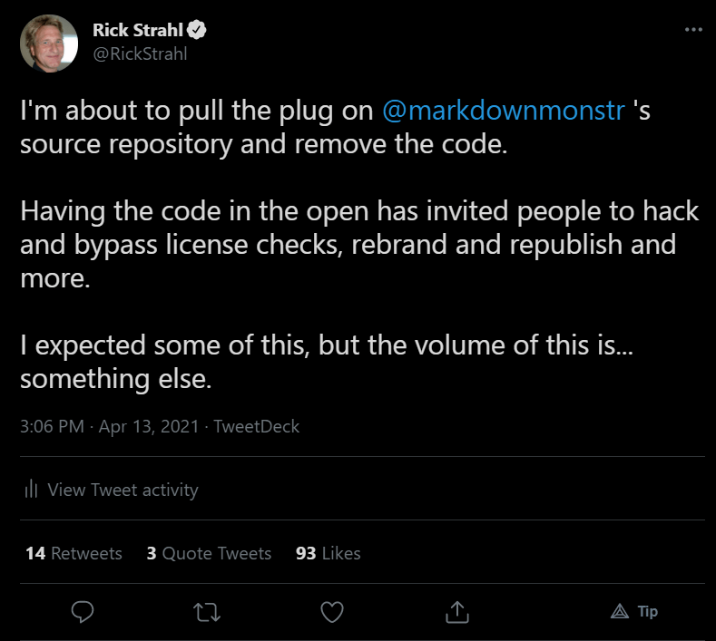
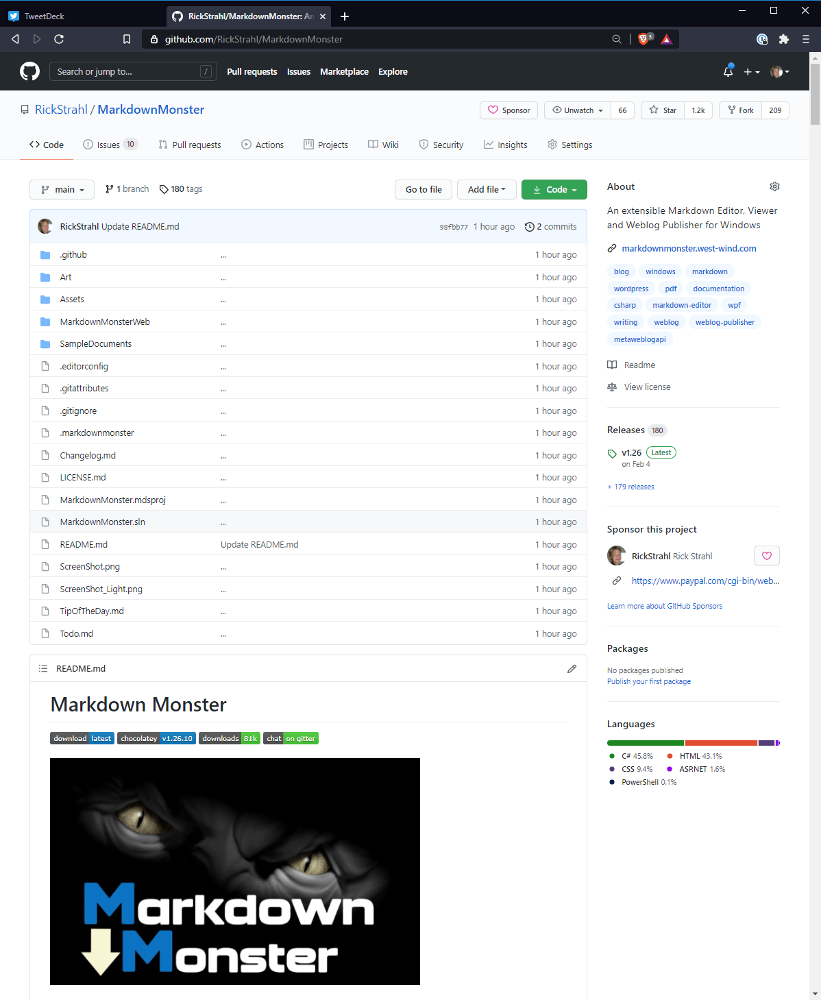
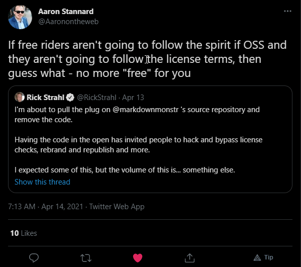
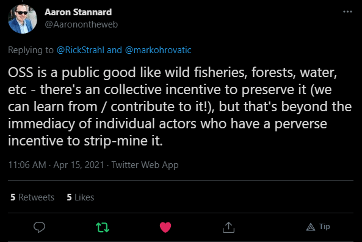

# Taking down the Markdown Monster Source Code

With a heavy heart and a lot of hand wringing, I decided last week to take down the [Markdown Monster](https://markdownmonster.west-wind.com) source code from the public GitHub repository due to rampant license abuses.

The GitHub repository is still there and will continued to be there. You can still download Markdown Monster installers and access the Chocolatey, Snap and WinGet packages. Issues will continue to be processed and fixed and new versions will be forthcoming. Markdown Monster is not dead!

But the source code out in the open is now a thing of the past.

In this post I'll talk about the reasons for this action as well as offer my thoughts on the state of software today. You can take the latter with a grain of salt, but the discussion of the hows and whys of having source code in the open and how it didn't work out for me, might be useful to others who are thinking about doing something similar.

### A History of Markdown Monster as a Product
Markdown Monster is a Windows based Markdown Editor and Weblog Publisher that provides a ton of functionality around the basic process of Markdown editing. You can check out the features either on the [Markdown Monster site](https://markdownmonster.west-wind.com) or on the [GitHub repository](https://github.com/RickStrahl/MarkdownMonster).

Markdown Monster started very modestly but has grown both in feature scope as well as popularity. 

The project is not and never was a FOSS (Free Open Source) project.  Rather it has the source code out in the open, but uses a commercial license that requires purchase of a product license or use one of several avenues related to supporting the project to get a free license. Free licenses are offered to contributors (both code as well as feedback, help with tracking down bugs, or any other valuable support of Markdown Monster) as well to various developer programs and organizations. Discounted licenses are available depending on international locations.

When I started with Markdown Monster it was a very small project and licensing was more or less of an afterthought, but as time went on the product grew in sophistication, and today it is used by 1000's of people every day. Supporting and updating Markdown Monster has become much more than just a small side project that I can work on for a few hours a week between adding new features, fixing bugs and fielding support for issues, feature requests and other minutiae.

From the very beginning I was pretty clear in my vision to **not make this a free product**. I have plenty of true open source projects where all code is open and free to use, but when it comes to building what ended up being a commercial  product as a one-man shop developer, the effort involved goes beyond what I can afford to just give away in terms of time and effort, even in light of free competition from other editors that have big corporate backing or from small tools that are much less feature rich. For me I was never about giving Markdown Monster away for free.

Initially - before there was a lot more interest - this dual distribution worked out well. Many people registered and played by the licensing rules. And **thank you to all of you that did** - I really appreciate that, especially in light of all those that didn't. Additionally, at the start at least, there was quite a bit of support with code, or simply working through features or bugs, which resulted in me giving out quite a few free licenses for helping along Markdown Monster to become a better product. I really want to thank those contributors as well - you've all helped make Markdown Monster a better tool!

Over time though, as Markdown Monster has added many new features and the code has gotten more complex, that involvement has died down some, although there are still many great feature requests and bug reports that require working through issues and that is much appreciated.

### Popularity
As Markdown Monster became more popular though and I started looking at the logs it became quite obvious that the vast majority of users were not playing by the rules. 

For example, for users that have 50 or more uses of Markdown Monster the ratio of registered to unregistered use is somewhere to the order of 1 to 180. For 20 uses or more than number jumps closer to 1 to 350!

Additionally there are also many registered uses that show up in countries where I have no or very very few registrations from. With a few exception none of the Asian countries show registrations. From China and India I literally 2 registrations each, yet access from those countries alone - many showing as registered - in combination makes up more than 40% of total usage. There are other countries with similar stats...

This despite the fact that some time ago I'd set up options for reduced pricing for international locales to make pricing more in in-line with local income. I put this program up over half a year ago - to date I had **two requests** for the discount and **one order** from it. IOW, nobody gives a shit... because free is always better than cheap, right?

But it's not only the usage - I can also see that people are actively bypassing the registration protocol with fake registrations. As with everything else when I set up MM I was banking on making Markdown Monster's features and pricing attractive enough that people wouldn't resort to piracy or down right fraud. Naive yes but based on the same premise I mentioned earlier that I was hoping users would see the value of the product and support it. Naive yes? 

The very worst of it though, is that running the logs also showed me several different re-branded versions of Markdown Monster running under a different name. These people are so lazy they didn't even bother to remove the logging code.

As with all piracy you can make life miserable for everyone, and still not supress all piracy, so I was opting for trying to make this work without minimal security and requirements and source code out in the open :smile:  

I'm not so naive to think that some of this wasn't going to happen.But the scale of it was something that I didn't expect. Rampant is the word and it's not an exaggeration in this case.

I have no one else but myself to blame. This was a conscious choice at the time and I was proven naive to think a different outcome was going to come from this.

### Thank you! 
To be fair there have been many registrations to Markdown Monster. As well as many people who have either contributed, made a valuable feature request, or have taken the time to report a bug and followed through the sometimes time consuming process of tracking down a bug.

I want to thank you and provide a glimmer of hope that maybe I'm not a completely hopeless idealist.

I really appreciate the support and those of you that have played by the rules that are a huge incentive to continue working on Markdown Monster and improving it going forward. 

### Code Removal Contemplation
So as a result of all this, I've been contemplating to tamp down on the rampant license abuse by removing Markdown Monster's source code. Having the source code available makes it just too easy to hack the code,  remove the licensing or as some have obviously done, completely re-brand Markdown Monster.

I've been contemplating this move for quite some time. Before actually going ahead with it, I wanted to see what kind of reaction I'd get and started off with this tweet from people that I regularly interact with on Twitter:

I was expecting a bit of pushback and being talked out of going forward.

Instead, surprisingly there was tons of feedback and a bunch of co-miseration by other developers who had similar stories with code out in the open. The feedback was mostly along the lines  "Yeah that sucks, but do what's right for you", which frankly I did not expect.

If you're interested you can follow the [discussion on the tweet](https://twitter.com/RickStrahl/status/1382138098117615618) - there are a lot of insightful comments on this very long thread. 

## Markdown Monster is not Dead!
I want to be very clear here: Although I cut off the source code in the [GitHub repository](https://github.com/RickStrahl/MarkdownMonster):

**Markdown Monster will continue as it did before**

This change actually has very little impact on 99% of you using Markdown Monster. Unless you were one of the very few people using the source code - legitimately or otherwise - this has no impact on you at all.

I will continue to work on Markdown Monster, just as I did before, pushing out frequent updates, responding to issues on GitHub, fixing bugs and updating the various distribution points for Markdown Monster.

If you own a license - thank you I really appreciate your support!!! And your license is still good and continues to work just as it did before and you'll continue to get updates of the current major version for free, just as before.

If you don't own a license, the evaluation version continues to work the same as before too: You'll get the same fully functional version of Markdown Monster with the occasional nag screens and notices and a few features that are not accessible.

### Source Code
The only thing that changes as of March 14th, 2020 is that the source code is no longer available in public. 

The [GitHub repository](https://github.com/RickStrahl/MarkdownMonster) is still up and continues to serve for issue tracking and as a secondary product landing page that contains download, installation and feature links.

But this repository is now devoid of a `Src` or `MarkdownMonster` folder that used to contain the source code.

There are still many forks of Markdown Monster out there but those forks will no longer track the live code going forward which now resides in a private repository. 

I would much prefer to build Markdown Monster out in the open, but due to the rampant abuse keeping a public repository simply makes it too easy for the shit heads to abuse their privilege.
  
And for those that want to work with the Markdown Monster code for internal use, or to help improve Markdown Monster, it's possible to **request private access** to the GitHub repository. There's [more info on the licensing page](https://markdownmonster.west-wind.com/purchase#SourceCode) on how to go about that.

### Regretabble
While I hate to do this and it is more work for me, private access at least allows me some control over who has access and if the abuse continues I can easily shut off either individual accounts or if necessary every one. We'll see. 

What sort of abuses? Markdown Monster tracks anonymous usage statistics and those usage statistics tell a pretty ugly usage story. Markdown Monster is not a free product despite the fact the source code was available on GitHub. 

Here are some numbers from some of the recent logs:

* More than 1000 people use Markdown Monster daily on average
* Of users having used MM more than 50 times - less than 1 in 150 is registered
* Of users having used MM more than 20 times - less than 1 in 400 is registered.
* Lots of first time accesses with 'Registered' status from locations that have never registered

For example, there are tons of users in China and Russia that show with registered status. Just checked I  have 1 registration from China, none from Russia. India shows tons of users that show up as registered users yet I have 2 whole registrations from there.

Registrations may have nothing to do with Source Code as the registration mechanism is very simplistic with a single passphrase. Again I purposely did this to use the simplest path possible for users as well as for me thinking that with fair licensing enough people would do the right thing and register or participate.

I also realized that for many locales around the world US pricing is a big hurdle, so I've also offered reduced pricing for licenses in different locales based on the Big Mac Index which assigns percentage discounts based on the locale by request. This is a relatively new addition, but it's been running now for well over half a year. You know how many people have taken me up on this: 1 request, and 1 actual taker using the discount. For some countries that discount is 50%.

There are also free license offers for Microsoft MVPs, Microsoft Employees, any company that provides free stuff into the MVP program - which is my way of giving back something to that program and those companies that have provided access to tools and software to me over the years.

So per license requirements, continued use requires a license which could be aquired by either [paying for a license](https://markdownmonster.west-wind.com/purchase) or by contributing in some meaningful way, either with feature PRs, or even with significant bug reports and feature requests. A doc typo fix won't qualify for a license, but a good feature request or a helping track down a nasty bug would. I've given away just over 50 free licenses for contribution scenarios, which doesn't seem like a lot, but it's commensurate to the number of PRs/Features/Issues etc. handled.

What I'm trying to get at here is that I've tried to make licenses accessible and fair. I get it that some will still think a purchased license is too much **because you know this other product is free**... Fair enough, use that product if that works for you. But that's usually not how that goes...

As much as I prefer having things out in the open, it wasn't much of a benefit to have the source available during the 4 years of Markdown Monsters time so far. Early on there were a few strong contributions, but as the product has matured that has fizzled. I'm not surprised as Markdown Monster is not exactly trivial to work on and the code base is uhm somewhat unique to my coding style. The source is not the easiest to navigate especially anything that has to do with UI.

I'm not complaining: For MM I actually prefer feature requests that I end up implementing unless it's something altogether out of my realm of capability or desire to build. For maintenance it's usually much easier for me to write the code and maintain it long term and streamline it into the overall Markdown Monster application flow. 

However, I'm very interested in feedback on what should be implemented for any given feature or request and detailed discussion on these topics is very much welcome. It's not about control, as much as it is for me as a single developer to keep a handle on the scope of Markdown Monster. I don't see MM being driven by a bunch of people.

-

### Some thoughts

