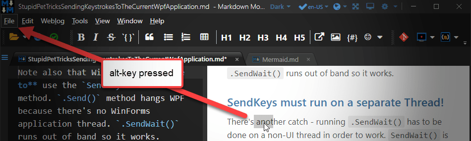

# WebView2: Forwarding Alt Keys to a Host WPF Window



Here's a quick tip if you're using the new WebView2 browser control and you need to forward menu and toolbar shortcuts from the new Edge based WebView2 control to WPF. Unlike the old IE based WebBrowser control, the WebView2 doesn't do 'passthrough' key forwarding for some keys - it works for some keys, but maddeningly not for all. Specifically, one important set of keys that isn't forwarded are `alt` key and `alt` key combinations that are common for activating application menus, toolbar shortcuts or button mnemonic shortcuts. This is a problem if you have content inside of the HTML page that needs to interact with menus or tool buttons.

If you're using the WebView purely for HTML display, then that probably doesn't matter much. But if you're using the control for user input inside of the HTML content then key interaction with the host application is quite important.

Here's what I'm talking about: Say you have a WebView control in a WPF window, and focus is inside of your HTML view that is displayed. Maybe you have a text selection inside of the HTML, or you're actually working with user input fields inside the browser, which is quite common for hybrid Web applications. In a real life scenario for me in [Markdown Monster](https://markdownmonster.west-wind.com), the main Markdown editor control is a large text entry field - and yes I want users to be able to access the main menu **from within the editor inside of the WebView**.

With focus in the WebView, if you now press the `alt` key at that or any `alt` key combination, you'll find out that you get - a whole lotta nothing! The keyboard handling **won't activate the WPF menu** or fire button/toolbar shortcuts as you would expect. In short any `alt` key operations aren't forwarding to the host form.

## Forwarding Alt Key Sequences
To work around this problem, you have to capture keys coming out of the Web Browser control, then explicitly focus the form and then re-fire the key in the context of the WPF form. Maddeningly the `alt` key combinations seem to be the only set of keys that don't work - most other keys (Function keys, Ctrl Combos, etc.) seem to forward just fine into WPF, but `alt` and `alt` key combinations do not.

So, to forward `alt` keys from the WebView into the WPF form you need to:

* Intercept the WebView's KeyDown Event 
* Check for `alt` key presses
* Set focus to the host WPF window
* Use `SendKeys.SendWait("%")` to forward the Alt key to WPF
* Run the `SendWait()` call out of band

Here's what this looks like in code:

```csharp
private void WebBrowser_KeyDown(object sender, System.Windows.Input.KeyEventArgs e)
{
    // Handle Alt-Key forward to form so menus work
    if (e.Key == System.Windows.Input.Key.LeftAlt)
    {
        Model.Window.Focus();
		
        // must be out of band
        Model.Window.InvokeAsync( () => SendKeys.SendWait("%"));
    }
}
```

And that's all it really takes to get somewhat natural `alt` key behavior for your WPF form.

### Focus is King
The reason why key forwarding is tricky in WPF with the WebView has to do with Windows and how the WebView is hosted inside of WPF. The WebView - like the WebBrowser control before it - is a Windowed control, meaning it has it's own HWND and it's own Windows message pump. The WPF WebView integration wrapper then provides the hosting mechanism that handles the placement of the control and the event routing from the separate Window into the WPF form. When you think about how this works it's surprising this stuff works as well as it does.

I suspect the reason the `alt` key forwarding from the WebView isn't working, is because these keys actually interact with the user interface directly. The `alt` key is probably making it into WPF, but because the Window doesn't have focus the key press is just not doing anything.

To get around this the first thing that needs to happen when `alt` is detected, focus needs to be set back to the WPF host Window:

```cs
Model.Window.Focus();
```

This forces the WPF Form to be the active foreground window, rather than the WebView. Now we're ready to send keys to the window.

### SendKeys?
Now we can use `SendKeys.SendWait()` to feed keys to the form.

Some people are likely to snipe at the use of `System.Windows.Forms.SendKeys` because - you know - **WinForms** 😱. Suit yourself,  but trust me when I say that using `SendKeys` is by far the easiest and cleanest way to simulate a key press and well worth the dependency. 

So then we need to send the `alt` key to the host form and we can use this code:

```csharp
Model.Window.InvokeAsync( () => SendKeys.SendWait("%"));
```
 
you can find the key combinations for special keys like alt in the [documentation for SendKeys](https://docs.microsoft.com/en-us/dotnet/api/system.windows.forms.sendkeys?view=net-5.0#remarks).
 
Initially I was afraid I would have to handle not only the `alt` key, but also  any of the following keys. But it turns out that switching focus and activating the alt key is enough to continue using the follow on keys naturally.
 
The only behavior here is that if you choose to abort the alt combination, focus is now on the form and no longer in the WebView. Not perfect but I can live with that and the old WebBrowser also had the same behavior.

Note also that With WPF **you have to** use the `SendKeys.SendWait()` method. `.Send()` method hangs WPF because there's no WinForms application thread. `.SendWait()` runs out of band so it works.

Also note **that you have to make the `.SendWait()` call out of band** after activating the window to ensure that the Window is active when the keys are sent. Initially I found some suggestions that this needs to happen on a separate thread (I used `ThreadPool.QueueUseWorkerItem()` which also worked) but it looks like a `Dispatcher.Invoke()`  call is enough to make this work. Without some sort of out of band call  this `.SendWait()` call does not work.

### It works
So now when I press the `alt` on it's own I see:


And if I press `alt-t`:


In other words you pretty much get the expected behavior for menu shortcuts. The same works for toolbar buttons, or buttons with mnemonic shortcut keys on the active form.

## More Control needed for Alt-Key Combos inside of WebView
So the above solution works great for my Markdown Monster Previewer since it's a mostly passive control that displays content, but needs to handle standard key strokes - including the menu activation keys as well.

Howerver, for the Markdown Monster editor, which is a full text editor entry control that has lots of key input including other alt key combinations, this is not perfect. It sort of works, but not perfectly. The Alt key now triggers the WPF menu and changes the focus. But Alt-Key combinations (like Alt-Z to trigger word-wrap or Alt-I to pop up the image embedding dialog) don't consistently work and often require multiple tries to trigger. This is because the `KeyPress` event above immediately fires and depending on whether the DOM code fires before the WPF handler, or not.

For an editor application that's not a good look. I know it bugs me from a **user perspective** to have key inconsistencies where you press a key or key combo and have it not work or stutter. 

So... to fix this alt key timing issue, I went one step further by pushing the key handling down into the editor and removing .NET out of the event handling loop altogether. 

This approach works by:

* Intercepting `alt` keys in JavaScript
* Delaying the Window Menu behavior by 500ms
* Processing Alt-Key combos immediately
* Sending the delayed alt-key to .NET via Interop


Here's what this looks like in Markdown Monster's key interception:

```javascript
// keep track of last alt key press time
te.lastAltkeyTime = 0;

$("pre[lang]").on("keyup", function (event) {
        // check for Windows Alt-Menu behavior
        // delay trigger menu so native alt- key processing can work
        if (te.mm && event.key == "Alt") {   // ACE Editor: otherwise check for `event.altKey`
            te.lastAltkeyTime = new Date().getTime();
            setTimeout(function () {
                if (te.lastAltkeyTime == 0) return;
                
                // Call .NET Code here
                te.mm.TriggerWindowAltMenu();
            }, 500);
        } else
        	// if another key was pressed invalidate
        	te.lastAltKeyTime = 0;
```

This code basically debounces the `alt` press and delays the menu activation by a half a second, which should give other key combinations a chance to process first. So when `alt-z` is pressed it's a key combo that happens quicker than 500ms and so takes precendence. If there's a slight delay after the `alt` key press then the menu is activated and Windows menu behavior works as you'd expect - with focus on the Window.

The .NET Code called is an Interop method in `WebViewDotnetEditorInterop` that does what the KeyPress handler previously did:

```csharp
/// <summary>
/// Call this to trigger the Alt-Window command to show underlines
/// and activate the Window to navigate the shortcut menus.
///
/// Client code calls this after short alt-key delay from
/// keyup handler in editor.js
/// </summary>
public async Task TriggerWindowAltMenu()
{
    Model.Window.Focus();
    Model.Window.Dispatcher.InvokeAsync(() =>
    {
        SendKeys.SendWait("%");
    });
}
```

And that provides pretty close to 'native' behavior similar to what worked with the IE based Web Browser control. Yay!

### A ShowStopper Overcome
I hate to admit it but this silly little problem has been a showstopper for me to using the WebView2 in Markdown Monster more extensively. Currently Markdown Monster uses the WebView for the preview as an **optional add-in**. The preview is a passive display control that displays rendered HTML output only. However, the main editor is also an HTML/JavaScript based interface, but it requires very close interaction with the user interface - including activating menu and shortcut commands. 

I originally played around with various ways to capture keys and forward them (actually captured in JavaScript and then forwarded) but had not much luck. Turns out my problem was that I didn't handle the `SendKeys()` out of band processing and making sure the host Window was active. With this in place I can now look at moving over the editor to use the WebView as well which would be awesome as I could finally ditch the IE only code and get some decent debugging functionality for the editor - plus the ability to use ES2018 code instead of the ES5. So I'm excited as this has opened up more possibilities.

### Performance Considerations for lots of Key Input
Coming back to my Markdown Monster Editor example, one thing that's important in that scenario is that the editor is very rich and handles every keystroke inside of the JavaScript control that manages the editor. MM is an editor so typing speed is a big issue. Using a .NET event means that **every keystroke made in the editor has to be forwarded into .NET from JavaScript** which requires Interop and which is relatively expensive.

As a workaround to this it might be useful to capture the `alt` key in the editor's JavaScript key events and only forward the alt key operation from JavaScript to .NET when the `alt` key is pressed, to avoid all the extra Interop overhead for every key pressed. I haven't gotten to this part just yet, but I'm pretty sure that's how I will have to handle the `alt` key processing rather than using the .NET `keydown` event. 

## Summary
Holy shit, this was a lot of work and trial and error to find a solution that works well. It's a bummer that the WebView2 control doesn't forward `alt` key combinations natively as the Web Browser control did. 


With this keyforwarding trick though it looks like we can forward keys and get past this limitation. It's a funky workaround, but it gets the job done...

<div style="margin-top: 30px;font-size: 0.8em;
            border-top: 1px solid #eee;padding-top: 8px;">
    
    this post created and published with the 
    <a href="https://markdownmonster.west-wind.com" 
       target="top">Markdown Monster Editor</a> 
</div>