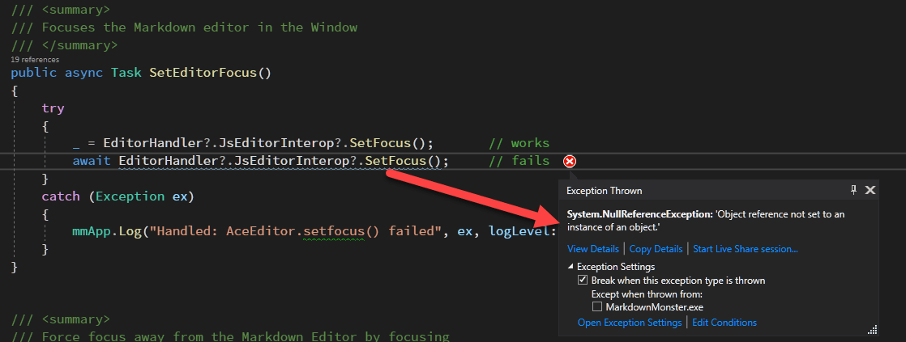

# Async/Await Calls Gotcha with the CSharp ? Null Propagator


So I ran into a bug in one of my projects this weekend.  I've been working on updating [Markdown Monster Editor](https://markdownmonster.west-wind.com) to use the Chromium WebView Control. As part of that update I ended up going through an `async`/`await` Async Cascade scenario where a lot of code had to be converted from sync to async to accommodate the WebView's completely async-only interop APIs. This ended up touching a lot of methods just to get runnable code again. Eeek.

In the process I ended up with a lot of small method code like this:

```csharp
/// <summary>
/// Focuses the Markdown editor in the Window
/// </summary>
public async Task SetEditorFocus()
{
    try
    {
    	// This!
        await EditorHandler?.JsEditorInterop?.SetFocus();
    }
    catch (Exception ex)
    {
        mmApp.Log("Handled: AceEditor.setfocus() failed", ex, logLevel: LogLevels.Warning);
    }
}
```

Looks like the `await` call should work, right?  But it turns out it doesn't when `JsEditorInterop` is null.  



When Markdown Monster starts up there might be several calls to this method when `JsEditorInterop` is still `null`, and with the code as it is it fails in that (common) scenario. That's expected and the call just doesn't happen as there's nothing to set focus to. With sync - no problem, but with async :bomb:.

So to summarize:

Sync code that works fine like this:

```csharp
// sync code
EditorHandler?.JsEditorInterop?.SetFocus(); // works
```

doesn't work when using the same code with an `await`:

```csharp
// async code
await EditorHandler?.JsEditorInterop?.SetFocus();  // boom
```
So why the tears with the `await` call here?

## Why does this fail?
I didn't catch it right away and took to Twitter wondering why this failed with `await` vs. plain sync code,  when [@ssefaccan](https://twitter.com/ssefaccan) quickly picked up on what I missed:

[](https://twitter.com/ssefaccan/status/1393668819877613571)

namely that the async failure is not on the `JsEditorInterop` reference, but rather on the `await` call itself.

Let's break this down:

The `?` (Elvis) operator in C# propagates the `null` value in `JsEditorInterop` and short circuits the call to `SetFocus()` which never happens in either version.

The first version works because **`null` is a valid result** for an expected result of a `void` method, or no result value from the method or assignment to a variable.

For the async code the same overall logic applies - `JsEditorInterop` returns `null` and `SetFocus()` is never called. 

But... **the expected result from an `await` call - even if there's no result value - is a `Task` object.** Instead the result is `null` and the compiler generated `async\await` code internally can't deal with the `null` value. Hence the `NullReferenceException` when a value of `Task` is expected. And it goes *Boom* :bomb:

When you break it down like this the error makes perfect sense. But it's easy to miss, because of the different sync behavior which works as you would expect, while the async versions does - well, not so much...

Logical? Yes. But also very unintuitive!


## Read the Signs!
Incidentally if I had paid better attention, Visual Studio (or Resharper really) would have been like: *"Told you so!"*

The IDE's Code Analysis is smart enough to actually catch the async null reference as invalid:


Then again... **even if** I had seen the warning before tracking the runtime error I would have probably ignored it as a false positive, and almost certainly wouldn't have drawn the right conclusion all the way to the `null` `Task` reference. 

## How to fix this?
The [Twitter Thread](https://twitter.com/RickStrahl/status/1393667788296777728) has a bunch of different responses for approaches that can be used for this, but for me it seems simplest to use just an old school pre-checking for `null`:

```csharp
public async Task SetFocus()
{
	var jsInterop = EditorHandler?.JsEditorInterop;
	if (jsInterop == null) return;
	
	try
	{
	    await jsInterop.SetFocus();
	}
	catch (Exception ex)
	{
	    mmApp.Log("Handled: AceEditor.setfocus() failed", ex, logLevel: LogLevels.Warning);
	}
}
```

Certainly more verbose, but it works. 

The downside with this is that it's not very obvious on why the extra code is needed. It's easy to come through this code in the future and end up trying to refactor it back for null propagation, when that in fact won't work.

The sad part for me is that this code has just been bulk updated from sync code to async just in order to even get it to compile and I updated roughly 50 functions that all use a similar pattern. I now get to go back and hunt all of those down and adjust each method. I can hear the buzz of the Yak shavings in the distance...

## Another Suggestion
Another suggestion that came up in the thread and perhaps an easier code fix is too double down on Elvis! 

This code works too:

```csharp
await (EditorHandler?.JsEditorInterop?.SetFocus() ?? Task.CompletedTask);
```

Note that the parenthesis are required in order to keep the scope to the entire expression.

This code explicitly checks for a null value of the first expression and if so returns a completed `Task` instance. This works too, and it's a shorter implementation. It's more explicit too, as it effectively points at the reasoning why `null` can't be returned here - ie. a `Task` is required. Not a huge fan due to the required parenthesis, but that's more of a personal preference.

## Summary
It's a bummer that null propagation doesn't work with `Task` only (no result) results on `await` calls in the same it does with synchronous calls.

Looks like there's a [proposal in the CSharp language repository](https://github.com/dotnet/csharplang/blob/main/proposals/null-conditional-await.md) for a feature request that would make `await` calls behave similar to sync calls, which certainly seems like a good idea. I can't think of a downside to this. But regardless even if this comes to pass, it's likely a few versions off and certainly wouldn't help me in my full framework C#7 code.

As with so many things in .NET - things seem like they are not working but due to the language ambiguities we see behavior that might be unexpected - but correct. Knowing how it works helps working around issues like this next time they pop up. 

Writing them down as a reminder does too... :smiley:

<div style="margin-top: 30px;font-size: 0.8em;
            border-top: 1px solid #eee;padding-top: 8px;">
    
    this post created and published with the 
    <a href="https://markdownmonster.west-wind.com" 
       target="top">Markdown Monster Editor</a> 
</div>