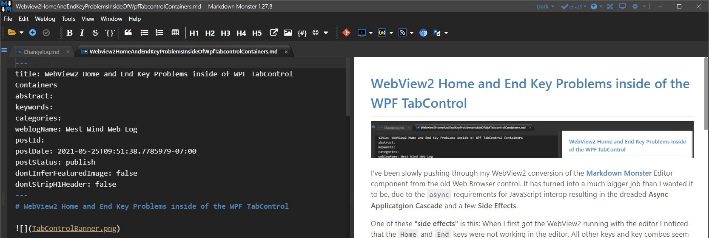

# WebView2 Home and End Key Problems inside of the WPF TabControl



I've been slowly pushing through my WebView2 conversion of the [Markdown Monster](https://markdownmonster.west-wind.com) Editor component from the old Web Browser control. It has turned into a much bigger job than I wanted it to be due to the `async` requirements for JavaScript interop resulting in the dreaded **Async Application Cascade**, but also - and more importantly for this post - a few **unexpected Side Effects**.

One of these **"Side Effects"** is: When I first got the WebView2 running with the HTML based editor, I noticed that the `Home` and `End` keys were not working. The keys do not work in the editor - initially they did nothing.  All other keys and key combos seem to be fine and enter or navigate in the editor, but very specifically `Home` and `End` do not work!

## Troubleshooting Keyboard Handling - Ugh!
Since I just managed to get the control running and there were still a lot of errors from the interop calls into the control I figured it was probably due to some key processing in the control. But once I started cleaning up my async errors and got the control to run, the problem unfortunately persisted.

It took a few hours for me to track the `Home` and `End` key non-workage down through a bunch trial and error tests with the WebView control. 

* Remove all key handlers in JavaScript (doesn't work)
* Removing all key handlers in .NET (doesn't work)
* Testing in a standalone WPF `Window` (works!)
* Testing as runtime added `UserControl` (works)
* Testing adding my Editor Container into standalone form (works)
* **Testing WebView inside of Tab Container (doesn't work - Aha!)** 
* **Testing Editor Container inside of Tab Container (doesn't work - Aha!)** 

The latter two scenarios point at the real problem: A WebView running inside of a `TabControl`l

## Keyboard Leakage with a TabControl
It turns out the problem occurs when the WebView2 is hosted inside of a TabControl. In that scenario the `Home` and `End` key don't work inside of the control. If I have a single tab open the keys are just dead and don't do anything. If I have multiple tabs open the keys navigate to the first and last tab respectively. That's the clue - the TabControl is interfering with the WebView's keyboard handling and stealing focus from the Web Browser for tab navigation.

At first I didn't notice the Tab navigation behavior because I only had a single tab open. In the case the keys just didn't work. But once I opened multiple tabs it became clear that the Tab Control's Tab Navigation was kicking in navigating to the first and last tab respectively rather than handling `Home` and `End` in the Editor.

I am actually using a custom Tab Control - the excellent `TabablzControl` from the [Dragablz](https://github.com/ButchersBoy/Dragablz/) package - but it inherits the keyboard behavior from the default WPF `TabControl`. In the testing earlier, both the base `TabControl` and the `TabablzControl` exhibit the same key forwarding behavior.

Now it's debatable whether this behavior is correct or not. The TabControl supports turning off navigation features via `Keyboard` sub-properties, but those seemed to have no effect and the key forwarding happened regardless.

Also, the behavior of `WebView2` is different from the old IE based `WebBrowser` control which had no problem living inside of a Tab Control and was not forwarding keys. It's doubly frustrating because the WebView2 is not forwarding other keys (like Accellerator keys `alt` for menu and hotkey operations) that I actually would like to see forwarded. Go figure...

## Fixing the Keyboard Forwarding in the TabControl
OK, so now that I know the problem, how do I fix it?

The trick is to override the base `TabControl` or `TabablzControl`  control used and override the `OnKeyDown` handler to essentially not forward the offending keys:

```csharp
public class MarkdownMonsterTabControl : TabablzControl
{
    protected override void OnKeyDown(KeyEventArgs e)
    {
        if (e.Key == Key.Home || e.Key == Key.End)
            return;  // don't process keys

        base.OnKeyDown(e);
    }
}
```    

Actually - that's not quite what I'm using: I actually don't call `OnKeyDown()` at all so I'm not letting the TabControl do any key processing (whatever that might be):

```csharp
protected override void OnKeyDown(KeyEventArgs e)
{
     // bypass all TabControl key processing
}
```

I already have custom tab handling in place for rotating through open tabs and closing etc. so I don't actually need the default behavior (and it doesn't work properly with tab re-ordering).

I'll review this as needed. I may have to adjust to return some functionality that I might not be aware of, or possibly may also need to add `OnKeyUp()` to handle additional keys etc. For now this solves my problem of the missing `Home` and `End` key processing.

Several people mentioned that overriding events should also fix the problem, but it turns out that it doesn't:

```csharp
protected override void OnInitialized(EventArgs e)
{
    base.OnInitialized(e);

	// hook up key event rather than overriing base control
    PreviewKeyDown += MarkdownMonsterTabControl_PreviewKeyDown;
}

private void MarkdownMonsterTabControl_PreviewKeyDown(object sender, KeyEventArgs e)
{
	// doesn't work - home and end still not working
    e.Handled = true;
}
```

I suspect this is because the base behavior is independent of the key events that are externally exposed by the TabControl.

## KeyboardNavigation Properties?
The TabControl has several keyboard navigation properties that - in theory - should disable navigation and not cause this keyboard interference. 

I tried these:

```xml
<mmcontrols:MarkdownMonsterTabControl x:Name="TabControl" x:FieldModifier="public" Grid.Column="2"
    
    ...
    
    KeyboardNavigation.TabNavigation="None"
    KeyboardNavigation.DirectionalNavigation="None"     
    KeyboardNavigation.ControlTabNavigation="None"
>
```

But that seemed to have no effect on tab navigation. With these set as show, I still ended up navigating on `Home`, `End` and `Ctrl-Tab`. Grrr... Too easy to work I guess.

So the `OnKeyDown()` override hack is still the way to go that works.

## Finishing up
What's left to do then is to replace the original `TabalzControl` with the new `MarkdownMonsterTabControl` in the XAML markup:

```xml
<mmcontrols:MarkdownMonsterTabControl x:Name="TabControl" x:FieldModifier="public" Grid.Column="2" 
       ...
/>
```

and also replace some of the custom styles to point at the new control - for now needed both for the standard and customized Tab Controls:

```xml
<Style TargetType="{x:Type dragablz:TabablzControl}" BasedOn="{StaticResource {x:Type dragablz:TabablzControl}}">
	 ...
     <!--  // same as below -->
 </Style>

 <Style TargetType="{x:Type mmcontrols:MarkdownMonsterTabControl}" BasedOn="{StaticResource {x:Type dragablz:TabablzControl}}">
     <Setter Property="ItemContainerStyle" Value="{StaticResource MarkdownMonsterTrapezoidDragableTabItemStyle}" />
     <Setter Property="AdjacentHeaderItemOffset" Value="-12" />
     <Setter Property="ShowDefaultAddButton" Value="True" />
     <Setter Property="ShowDefaultCloseButton" Value="True" />
 </Style>
```

And now I'm back to a working control. Yay! But a big thumbs down for the change in behavior compared to the WebBrowser control.

## Summary
This key forwarding problem where the Tab Control's navigation is interfering with the normal key handling inside of the `WebView2` control is a very specific problem to run into. But I think hosting a `WebView2` inside of a tab is probably not uncommon,  so I expect other people will run into this issue from time to time too. Hopefully this post will help point people in the right direction of working around TabControl - or other container control key interference with the WebView.

Carry on!

<div style="margin-top: 30px;font-size: 0.8em;
            border-top: 1px solid #eee;padding-top: 8px;">
    
    this post created and published with the 
    <a href="https://markdownmonster.west-wind.com" 
       target="top">Markdown Monster Editor</a> 
</div>