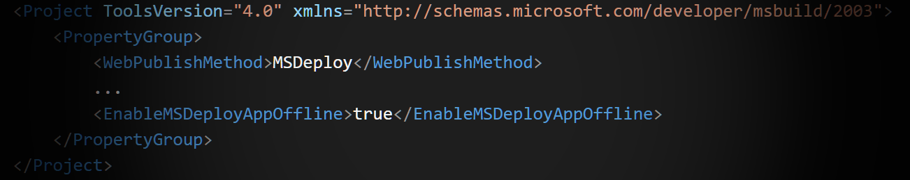
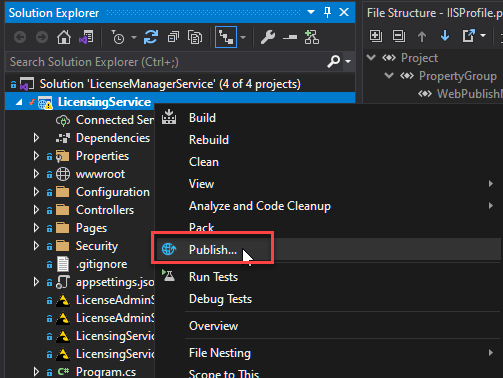
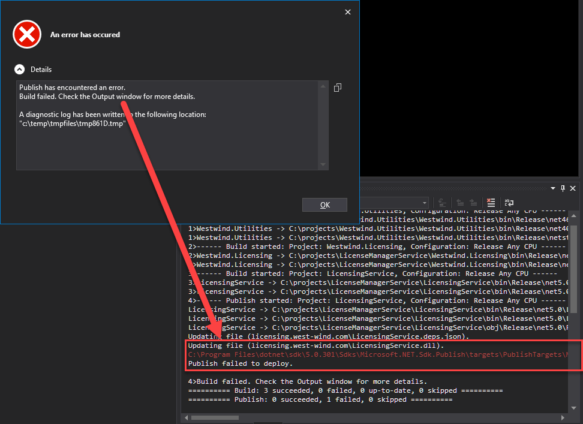

# Locked Files When Publishing .NET Core Apps to IIS with WebDeploy



If you still use IIS on a physical box to host Web Applications (as I do) and you're creating .NET Core applications and deploy them via Microsoft's Web Deploy you've likely run into this problem:

When you publish the first time everything everything is fine - the app distributes and it properly publishes and starts up fine.

However, when you re-publish after the app's been running and you publish again you find that the publish process fails due to locked files. The publish process gets half way through, then fails on one of the `dll` files as they are sent to the server.

Unlike classic ASP.NET, ASP.NET Core applications hosted in IIS **run in-place** and lock the files that they are running from. This means while the app is running the files are locked and can't be replaced. 

Whag, whag, Whag 🦆 🦆 🦆

## Publish Profiles in Visual Studio and Publish Web Site
If you're using Visual Studio and you publish to IIS you can use the **Publish Web Site** feature:



This pushes the entire site to the server. It's a no frills publish operation and it supports publishing via MsDeploy, FTP and a few build pipelines.

If you use the MsDeploy mechanism, you'll find that the **Publish Web Site** feature does not deal with the locked file issue and fails if any files are in use.



As you can see the publish process fails half way through as it runs into a locked file - one of the binary dll files in this case. At this point you have a broken update because some files went up, while others failed to go and the publish was aborted.

## Unloading Apps with app_offline.htm
IIS has always had a feature using a special file called  `app_offline.htm` to temporarily shut down the Application Host and start it back up but without loading any of the modules and only serving the `app_offline.htm` file which displays a busy message. Effectively this keeps your site from running any code while the file exists in the root folder of the site. When the file gets deleted the site starts back up.

You can create this static file containing some HTML and as soon as that file is placed in the folder the current running application is shutdown and any new requests only see the `app_offline.htm` page.

The idea is that you can plop this file into the application's root folder, which shuts down the app. You can then publish your application replacing all files as needed then remove `app_offline.htm` to restart the app.

This works fine, but it's hard to automate this process unless you have direct access to the site or you are running an explicit deploy process on the server. It certainly doesn't help with the IIS Publish feature in Visual Studio by default.

By default WebDeploy doesn't place an `app_offline.htm` file into the folder while publishing which is really bad form.

## Publish Profile Setting: EnableMsDeployAppOffline
Luckily there's a simple solution via a newish switch available in MsDeploy that was added in Web Deploy 3.x.

There's now a `EnableMsDeployAppOffline` value that you can add to the publish profile like this:

```xml
<Project ToolsVersion="4.0" xmlns="http://schemas.microsoft.com/developer/msbuild/2003">
    <PropertyGroup>
    	<WebPublishMethod>MSDeploy</WebPublishMethod>
        ...
        <EnableMSDeployAppOffline>true</EnableMSDeployAppOffline>
    </PropertyGroup>
</Project>
```

When set to `true` this setting automatically has MsWebDeploy create an `app_offline.htm` file which unloads the running application, publishes files, then removes that file.

It's a very simple fix that automatically handles copying a generic `app_offline.htm`, publishing files, then removing the file. **Sadly it's not the default setting** and the switch is somewhat obscure that is not easily discoverable, which is why I'm writing this post.

With that switch in place and set to `true`, publish now works to properly publish files to a running site. Yay!

## Should be a Default Setting
It seems odd that this setting is not in the default Publish Template that Visual Studio creates for publishing ASP.NET Core applications.  Without this setting ASP.NET Core publishing to IIS is effectively broken whenever a site is already running.s

I suspect the publish template may be used for all types of apps publishing to IIS and maybe specifically was created for classic ASP.NET applications, which didn't need this functionality as desperately since class apps are shadow copied to a different location and files are not locked.

But even then it would make sense to add the `EnableMsDeployAppOffline` setting in the default configuration and just set the value to `false` - at least that way the setting is much more **discoverable** and easy to flip.

## Azure? Use Deployment Slots
Publish Web Site also works on Azure if you are publishing to an IIS Web site. Before you cringe - remember that the default Web site format on Azure if you don't specify a platform is still Windows - odd but true. And Web Publishing works in that scenario just as it does to a native machine.

But, if you're using Azure and use IIS you have other options that are a better and more reliable choice since you have access to automated tools on the server in the form of Azure publish pipelines.

You can use Deployment Slots to publish to a separate environment, make sure the app runs, then hot swap the staging slot for production. This removes the problems of running application updates and on top of it provides for a nice way to test the deployment before taking it live as well as providing a quick way to roll back if something goes wrong.

Various deployment pipelines like Azure Pipelines, GitHub Actions or raw Kudu  can take advantage of Deployment Slots to publish and automatically swap between application publish folders in a similar manner.


## Neglected Windows 
All that said, I often use Publish for small or internal apps where the punishment for failure is minimal to non-existant. It's much easier to publish than to configure publish pipelines, and you can set up your own process for managing publish versions and staging environments before you even hit the publish button to accomplish most of the core features easily without all the cruft.

If you are still on physical hardware like I am, there is no built in tooling that can help you so you're on your own to automate your pipeline or use a third party solution. 

Personally I keep things simple and use staging and production sites with plain Publish operations, along with Git branches to manage publish versions, before publishing. It's hacky homebrew style, but it works. And while there's no instant restore if there's a failure, it's one Git branch rollback and a re-publish away from getting back to a working environment should I muck things up (been there done that).

As always - the key is to use the appropriate tool for the job. And overkill is a failure of imagination too!

## Summary
It's kinda sad to see Microsoft doing such a crappy job supporting IIS and Windows support features. The publishing issue I describe here has been complained about forever, and it has such a simple fix that there's no reason why this hasn't been fixed yet. 

I'm writing this down as I once again was looking for this setting and not finding a quick way to even find this setting. So next time, I'll have it handy.

Or maybe we'll get lucky and Microsoft deins it important enough to at least adds the setting into the default Publish Profile. I'm not holding my breath after all these years :smile:

<div style="margin-top: 30px;font-size: 0.8em;
            border-top: 1px solid #eee;padding-top: 8px;">
    
    this post created and published with the 
    <a href="https://markdownmonster.west-wind.com" 
       target="top">Markdown Monster Editor</a> 
</div>