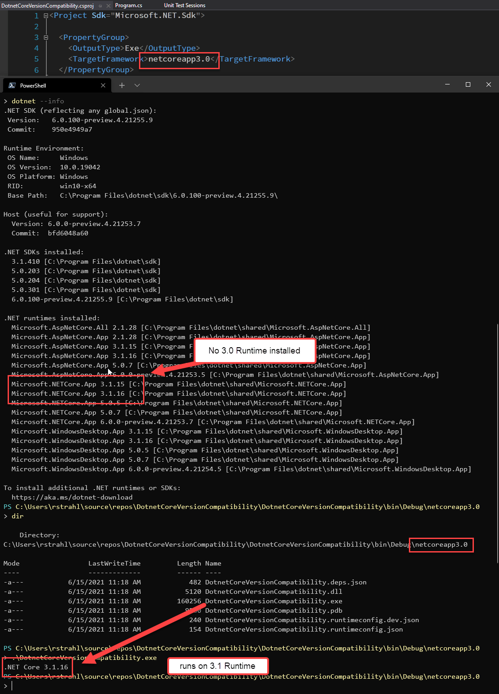

# Running .NET Core Apps on a Framework other than Compiled Version?


Here's a question that I see come up a lot:

> I have an application that was built and compiled for .NET Core 2.1. If I deploy the app on a machine that only has .NET Core 5.0 installed, will this application run?

The short answer to this question is: **No it will not run**. Or at least not in the default run configuration. 

.NET Core requires a runtime that is at least in the same major version with the runtime version at least equal to or higher than the compiled application. In addition the minor version of the application can't be higher than the available runtimes.

Given that, here's what you get when you try to run a .NET Core 2.1 application, when no 2.x runtime is installed, but when 3.x, 5.x and 6.x runtimes are available:


It fails to run due to the missing .NET Core 2.1 runtime. Notice that the error message is pretty helpful and shows what **is** installed and can run, and where you can find the specific runtime that you need to run the application.

However, you **can** run applications with a lower compiled **minor** version, on a runtime of the same major version that is higher than that minor version.

Here I'm running .NET Core 3.0 application, using .NET Core 3.1:



and that works.

## .NET Core Runtime Compatibility
So what works and what doesn't? 

Here are what I think are the most common scenarios:

| Scenario               | Application Version       | Works?   | Runtime Version       |
|------------------------|---------------------------|:--------:|-----------------------|
| Versions Match         | .NET Core 5.0 Application | ✔        | .NET Core 5.0 Runtime |
| Higher Runtime Version | .NET Core 3.0 Application | ❌        | .NET Core 5.0 Runtime |
| Lower Minor Version    | .NET Core 3.0 Application | ✔        | .NET Core 3.1 Runtime |
| Higher Minor Version   | .NET Core 3.1 Application | ❌        | .NET Core 3.0 Runtime |

In short:

**Works**

You can run an application on the same exact runtime version (major.minor) that it is compiled in obviously. 

You can also run an application that is compiled with a lower version on a higher minor of the same major version of the runtime (ie. compiled for 3.0 and run on 3.1).

(Haven't verified: Patch version differences don't matter even if the patch version of the build is higher, it'll run on a lower patch version of the same major.minor) 

**Doesn't**

You cannot run an application on a different major version than what it was compiled for. 

An application compiled to a higher minor version running on a lower minor version (ie. compiled for 3.1 but running on 3.0) does not work.

## Explicit Runtime Override with `dotnet --fxversion`
You can however override the runtime version **explicitly** by specifying a runtime version either on the `dotnet` command line or via a runtime configuration file.

To explicitly specify a runtime, you can launch the application with the `dotnet` command and the `--fx-version` command argument to specify the .NET Runtime version which **has to match** an installed version.

Again, I'm running the 2.1 compiled console app here, using one of the installed 5.0 runtimes:

```ps
dotnet --fx-version "5.0.7" .\DotnetCoreVersionCompatibility.dll
``` 

This works and runs the application:


## Explicit Overrides with .runtimeconfig.json files
You can add a `runtimeconfig.template.json` file into your project that provides runtime policy overrides. In this file you can specify a specific version that the application should use at runtime. 

You can also a specify `rollForward` policy by specifying `minor`, or `major`.

Here's what Microsoft docs say about this:

[.NET Core run-time configuration settings](https://docs.microsoft.com/en-us/dotnet/core/run-time-config/#runtimeconfigjson)

In a nutshell you can specify a version and `rollForwardPolicy`. In this first example it rolls forward for the major version

```json
{
  "runtimeOptions": {
    "tfm": "netcoreapp3.0",
    "rollForward": "minor",
    "frameworks": [
      {
        "name": "Microsoft.NETCore.App",
        "version": "3.0.1"
      }
    ]
  }
}
```

This means it this app which is targeted `3.0.1` can also run on .NET Core 3.1, but won't run on .NET 5.0.

To use major version rollForward:

```json
{
  "runtimeOptions": {
    "tfm": "netcoreapp3.0",
    "frameworks": [
      {
        "name": "Microsoft.NETCore.App",
        "version": "3.0.1",
        "rollForward": "major"
      }
    ]
  }
}
```

Here the `3.0.1` app can run on 5.0. 

Although you can roll forward be aware that this may cause problems since major versions can have breaking changes including runtime changes that might not be backwards compatible. This means your code can compile fine, but fail to bind to member signatures at runtime if APIs were changed. Use this very carefully if at all and make sure to test carefully.  It'll work fine on a test hello world console app, but it's likely to have lots of little *artifacts* in a full application.

## What about SDKs?
Another important thing to keep in mind is that SDKs - the tools you use to build and compile applications - are completely separate from the Runtimes even though the SDKs install a runtime alongside of them. So when you install the .NET Core 5.0 SDK you are also installing a bunch of runtimes at the same time. For example, on Windows the SDK installs: .NET App Runtime, ASP.NET Core and Windows Desktop Runtime.

However, when you **build your application, you can build for any of the previous releases** from the current SDKs not just for the currently installed SDK version. 

This means I can build a .NET Core 2.0 application even if I only have the .NET Core 5.0 SDK installed.

How can that work? Yeah I thought that too - after all the compiler needs to know what's available to compile against in the runtime right?

Kathleen Dollard helped me out here explaining:


The SDK will download the appropriate *Reference Packs* which are placeholder, metadata assemblies, not the full runtimes, if they are not already present or an appropriate runtime is available locally. It'll then compile your application against those reference assemblies to get it to build - but not run. 

You can see this in my first screenshot: I built the application using the .NET Core 5.0 SDK using `dotnet build`, which worked fine. But when I then try to run either with `dotnet run` or `dotnet <app>.dll` it fails with the missing runtime error show in the screenshot because the .NET Core 2.1 target framework is not available.

The use of downloaded reference packs is clever and very useful as it means that you really only need to have a single .NET Core SDK installed on your local machine to build for any (2.x and later) versions of .NET Core. 

Now if only each version of Visual Studio wouldn't insist on installing its own fixed version of the SDK.

## Runtime Distribution Hell?
Now these questions invariably come up, in regards to app distribution and mostly for client applications, rather than server applications. Servers are easy to control, but applications that ship out to clients to install are a different matter.

If you've been a .NET developer long enough you might remember dealing with the .NET Framework Runtime installations and making sure that runtimes are installed from the early pre-.NET 4.0 version days of .NET. Back then a higher version of a runtime needed to be installed in order to run applications. But - Full Framework the framework is backwards compatible so it's perfectly capable of running a .NET 2.0 application on the 4.0 Runtime.

Not so with .NET Core Runtimes, which are tightly tagged to the Major version, meaning that you can't run applications compiled in an older version of the runtime, on a higher (or lower) version of the runtime. 

This means that each major runtime version has to be installed side by side with others. As a result you almost certainly end up with a huge mess of runtimes with small patch version differences installed on your machine. If you look back on my second screenshot you can see the big blob of runtimes - that's my *'cleaned up'*  runtimes folder which I try to keep pruned to just the latest versions.  Before the cleanup I had 3 pages worth of runtimes and SDKs installed - mostly from Visual studio or other dev tool installs.

The good news is that the side by side installs are not enormously large, and are basically single folder installs without a bunch of infrastructure scattered all over the machine. And they can be nuked just by deleting the runtime folders - but be careful with that as it might break applications that rely on a specific version. I tend to clean up my runtimes to keep just the highest version around and that seems to keep things relatively sane.

Still it definitely sucks that you end up with a bunch of runtimes installed on your machines, with no clear idea what runtimes are still in use by other applications and which aren't needed anymore.

### Self-Contained Runtime
If runtime availability is a major issue for your application, there's always the option of shipping the runtime as part of the application, in a self-contained application. It's great that this option exists, and it works just fine. But it will bloat the size of the unpacked application in the 70mb range at minimum, which is not ideal to say the least. 

## Summary
Runtime availability is a complex topic, and I'm greatly oversimplifying in this post. In fact, https://github.com/dotnet/runtime/blob/main/docs/design/features/framework-version-resolution.md[Microsoft has a huge document](https://github.com/dotnet/runtime/blob/main/docs/design/features/framework-version-resolution.md) that goes into all the details of this, and while it has everything you need to know in there, it's not exactly easy to figure out when you're in a hurry. In this post, I've addressed a few common scenarios and hopefully this makes it easier at a glance to see what will work and what won't. And if your use case is more complex, there's the Microsoft document.

## References

* [Framework Version Resolution](https://github.com/dotnet/runtime/blob/main/docs/design/features/framework-version-resolution.md) (microsoft)
* [.NET Core run-time configuration settings](https://docs.microsoft.com/en-us/dotnet/core/run-time-config/#runtimeconfigjson) (microsoft)

<div style="margin-top: 30px;font-size: 0.8em;
            border-top: 1px solid #eee;padding-top: 8px;">
    
    this post created and published with the 
    <a href="https://markdownmonster.west-wind.com" 
       target="top">Markdown Monster Editor</a> 
</div>