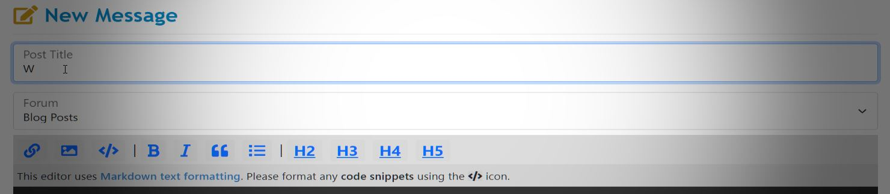
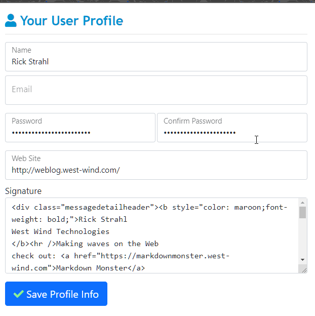
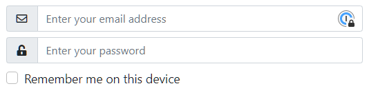

# Should we add Bootstrap 5.0 Support to Web Connection?



Over the weekend spent some time updating the support site to run on Bootstrap 5.0 as an exercise to see what's involved in updating from v4 to the latest v5 version. In case you missed it Bootstrap a while back rev'd to version 5.0 and while overall most functionality is maintained compatible with previous versions, there are a handful of nice improvements and a few breaking changes.

I'll go over some of the changes required below, but the reason for this post is to gather a little information on whether Web Connection should update to this latest version of Bootstrap. Given that the upgrade of this site took a few hours to find and cleanup all the little issues (and this site is pretty simple), it's not just a drop in replacement. 

For Web Connection rev'ing to a new version would mean updating a bunch of the `HtmlHelper` components as well as potentially a few small breaking changes for older versions.

My questions are:

* Are you using Bootstrap with Web Connection today?
* How important is it to run on the latest version?
* Are you use HtmlHelpers (in `wwHtmlHelpers.prg`) extensively?

A few other things to consider along these lines:

It's totally possible to run a Bootstrap 5.0 application with the current Web Connection Bootstrap 4.0 tools. While manual changes have to be made overall the process to do this is pretty straight forward (notes below). So nothing is procluding from using Bootstrap 5.0 today with Web Connection existing setup.

The main consideration from my end is - potentially breaking some components that depend on Bootstrap features. This might include the date picker and some of more complex HtmlHelpers that inject some Bootstrap specific features (minimal but there are a few). Currently Web Connection can deal with v3 and v4 versions with specific bracketing for them, but the prospect of adding additional brackets is not something that I'm looking forward to. 

So while I'm more than happy to make the changes for Bootstrap 5.0, realize that there might be a small bit of pain for people that are not upgrading and staying with older versions... and regardless upgrading from an older version will require some work for those making the journey.

### Bootstrap 5 - Noteworthy Enhancements
The first question should always be: Is it worth upgrading in the first place? 

#### Compatibility is good overall
Overall Bootstrap 5.0 maintains the same old Bootstrap concepts of layout and control management. Most things continue to work as they did before, although this version has a lot of nice improvements under the hood on how the controls are rendered using the latest CSS feature. This results in better performance of layouts.

#### Render and Behavior Improvements
There's also been a nice touch up on how controls render and overall there are lots of little UI improvements that just look better than in previous versions. This is subtle, but there are both visual improvements as well as subtle behavior adjustments.

#### Floating Labels
There's support for a new floating label form group, which you can see on the Message board here. The idea is that you have a single line text boxes with labels that automatically 'float' above the text once text is entered. This provides some space-saving for busy forms and also makes it much easier to line up multi-column field layouts as the label and input are rendered as a single block element by default.



Notice how the Email field is empty and just shows the label. As soon as you start putting text in the small label floats above the user input. Also notice how the two passwords align easily with both the label and input. 

It's a trendy feature and you see that on a lot of sites these days, but for once I agree in that this is good looking and useful way to present input fields in many situations.

On the downside there appear to be a few issues with this control:

* Placeholders don't work on the input fields (presumably because the label serves that purpose until you start entering text).  Still would be nice as you could have both a label and placeholder with that placeholder providing context like an input mask.

* TextAreas have problems with labels under scrolling the label - not sure if that's by design or what but it looks bad. (hence the label on the actual text area in the figure).


#### Easy FlexBox Classes
There are now built-in FlexBox CSS classes that you let you quickly specify ` d-flex align-items-top` to group elements like an alert box to automatically align content side by side for example. I used to use custom classes for this, but with these built-in class it's much more generic. This is documented in a few 'features' like the [Icons in Alert Boxes](https://getbootstrap.com/docs/5.0/components/alerts/#icons) feature for example which just uses the FlexBox functionality.

Bootstrap 5.0 also adds a bunch new CSS helpers to allow you to express common tasks like padding, margins, position, visibility etc. via small CSS class helpers that easy and consistent to use. This expands on these features a lot of these that were introduced in 4.0 and have been expanded. It pays to take a read through the [CSS Helpers section in the docs](https://getbootstrap.com/docs/5.0/helpers/) on all the good stuff available there.

### Upgrade Notes to Bootstrap 5
So if you do decide to upgrade what sort of things are you going to run into? This list is by no means comprehensive but this is what I've found in multiple updates.

As mentioned I updated this message board, and if you're interested you can look at the [upgrade Git commit that shows all the changes here](https://github.com/RickStrahl/West-Wind-Message-Board/commit/e3c79f386efbd3146fa867f6e82615ae28d04bfd).


#### No IE Support
We need to get this out of the way: Bootstrap 5 drops all support for Internet Explorer. So once you start using Bootstrap 5 you can no longer use IE. For new applications IE should definitely no longer be used and I sincerely hope nobody is still running IE as a their primary browser for anything but specific apps that require IE specific feature support.

While I welcome ditching all things IE, I am a little bummed about this because this means that I can't use Bootstrap 5.0 with Help Builder or any other application that uses the Web Browser control. :sadface:

#### -start and -end instead of -left and -right
Bootstrap 5 introduces support for Right to Left (RTL) display and because of it the meaning of `-left` and `-right` in various helper names became ambiguous and end up getting changed to the `-start` and `-end`.

I use `float-right` and `float-left` quite a bit. Mostly the former for things like item specific menus or option bars at the top of a group. These need to be renamed to the `float-end` and `float-start` respectively. This is a very specific naming change so it's pretty easy to do this with a **Replace in Files** feature. If you're using Visual Studio code you can open your Web Connection project and use `shift-ctrl-H` or to bring up the **Replace in Files feature** and just let it run. 

#### Dropped jQuery Dependency
Bootstrap 5 drops the requirement to use jQuery for custom components and by default requires that raw DOM access is used to manipulate the JavaScript bootstrap components such as the modal dialog, popups, accordion etc. The changes over the jQuery code are relatively minor, but the biggest problem is digging them up and finding all of them.

On the flip side, extending the trend that they used in v4 to make most operations triggerable using `data-`  attributes has been expanded and it's quite possible to do most operations (like triggering a modal to pop open or class) via attributes. That is the preferred way to do it. 

For example (`data-bs-dismiss`):

```html
<button id="btnPasteCode" type="button" class="btn btn-primary"
        data-bs-dismiss="modal" aria-label="Close">
    <i class="fa fa-code"></i>
    Paste Code
</button>
```

Unfortunately for me on this site quite a bit of the interactivity is handled through script code so I had to convert each of the dialogs explicitly.

The new, non-jQuery code looks like this - in this case to show and dis

**object interface**

```js
// $("#HrefDialog").modal();

var modal = new bootstrap.Modal(document.getElementById('HrefDialog'));
modal.show();
```

**event handler notification when shown**

```js
// $("#HrefDialog").on('shown.bs.modal', function () {...});

document.getElementById("HrefDialog")
        .addEventListener('shown.bs.modal', function () {...});
``` 
   
Again, nothing difficult about this, but unfortunately  it's not a plain search and replace operation that makes this work, so you have to manually find all the code points where anything script related happens.

I'd already moved most of my code to use attribute based activation whenever possible, but for the dialogs in the editor in particular they were all code based and required manual updates like this.

### Input Group Changes
Another component that has change slightly is the `input-group` component which creates a single row icon/text and input control. Input groups are great for very small dialogs like login controls, or for 'most important' items in a form. They're also useful for self contained forms like a search box where the right control is a button to start the search.

Here's an example of two input-groups in the login box:



Changes here are:

```html
<div class="input-group ">
    <div class="input-group-prepend">
        <span class="input-group-text">
            <i class="far fa-fw fa-envelope"></i>
        </span>
    </div>
    <input type="text" name="WebLogin_txtUsername" id="WebLogin_txtUsername"
           class="form-control" placeholder="Enter your email address"
           value="<%=  pcUserName %>"
           autocapitalize="off"
           autocomplete="off"
           spellcheck="false"
           autocorrect="off" />
</div>
```

to:

```html
<div class="input-group mb-2">
    <span class="input-group-text">
        <i class="far fa-fw fa-envelope"></i>
    </span>                        
    <input type="text" name="WebLogin_txtUsername" id="WebLogin_txtUsername"
            class="form-control" placeholder="Enter your email address"
            value="<%=  pcUserName %>"
            autocapitalize="off"
            autocomplete="off"
            spellcheck="false"
            autocorrect="off" />
</div>
```

It's a small change but it's a definite usability improvement as it drops the wrapper required around the `input-group-text`. 

For this you can easily search for all `input-group-text` in documents and just remove the extra wrapping `input-group-prepend` or `input-group-append`.

### Floating Labels Conversions
As mentioned one of the reasons I wanted to use Bootstrap 5 is the floating labels implementation. I've been using a custom version of this for some time in some apps, but because it's custom it doesn't quite works the same as other Bootstrap components, plus there were a few quirks. 

Converting from the old Form group to floating labels is pretty straightforward:

```html
<div class="form-group">
    <label class="control-label" for="Name">Name</label>
    <input type="text" class="form-control" id="Name" name="Name" placeholder="Your display name on messages."
           value="<%= Request.FormOrValue([Name],poUser.Name) %>">
</div>
```

to:

```html
<div class="form-floating mb-2">            
    <input type="text" class="form-control" id="Name" name="Name" 
           value="<%= Request.FormOrValue([Name],poUser.Name) %>">
    <label class="control-label" for="Name">Your Name</label>
</div>
```

One additional advantage with the floating label is that the label is very small, so you can use longer labels - that double as placeholders which don't get replaced - than you might normally use and you don't have to worry about horizontal labels ever.


#### Full List of Changes in Bootstrap 5
Here's a link to the full migration documentation for Bootstrap 5:

[Migrating to Bootstrap 5](https://getbootstrap.com/docs/5.0/migration/)

There's a lot more than what I've covered here, and you may run into more or less of the issues that I covered here.

But while this list looks long, I've found that overall compatibility is excellent. 
  
As another happy aside - it looks like the Bootstrap DatePicker component Web Connection uses still works with Bootstrap 5 even though it's specifically for v4.


### Summary
Upgrading to Bootstrap 5 in a Web Connection application is not difficult, but be prepared to do quite a bit search and replace if you plan on going down this path. I hope some of the things I've gone over here make your life easier if you are going ahead with a migration.


So is it worth doing all of this? To me it depends on the application. I certainly think some of the improvements in Bootstrap are worthwhile both in terms of new functionality (floating labels in particular) as well as the more consistent CSS functionality that the latest version provides.

And it's always a good idea to keep up with versions to some degree lest you get left behind at a point where upgrading becomes essentially rewrite :smile:

But if I had a complex application with tons of screens and controls I would probably think long and hard whether it's worth the effort to upgrade. Aside from the very visible floating labels feature, most other features are minor and don't provide a big usability improvement. 

So your mileage may vary.

<div style="margin-top: 30px;font-size: 0.8em;
            border-top: 1px solid #eee;padding-top: 8px;">
    
    this post created and published with the 
    <a href="https://markdownmonster.west-wind.com" 
       target="top">Markdown Monster Editor</a> 
</div>