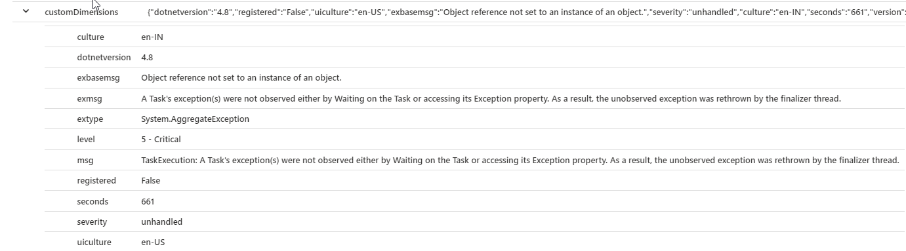
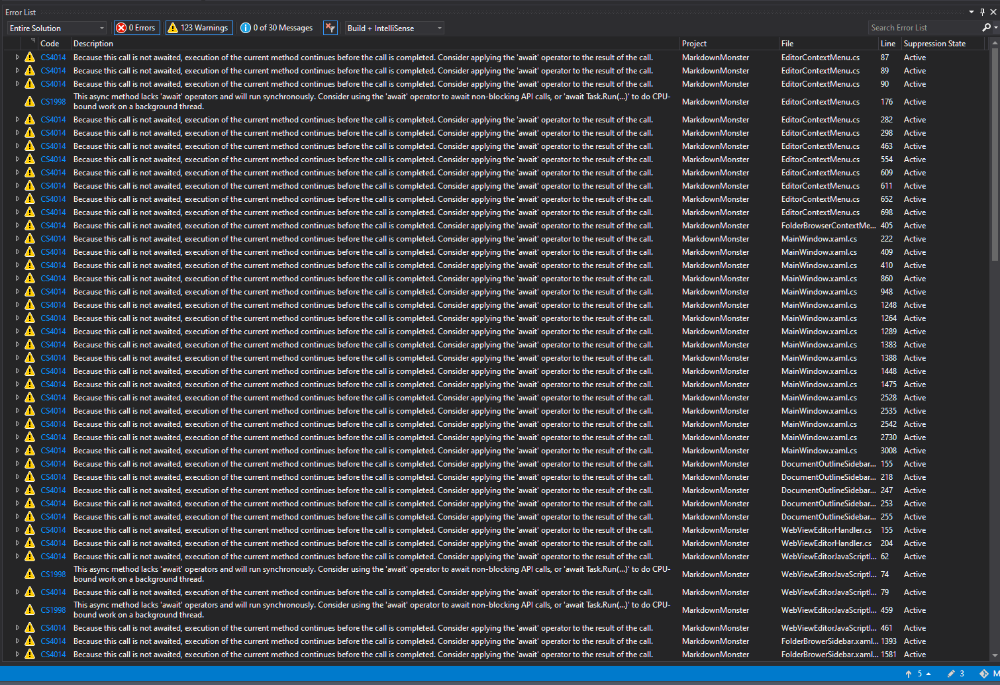

# Thoughts on Async/Await Conversion in a Desktop App


If you've been following this blog and my [Twitter feed](https://twitter.com/rickstrahl), you know I've been going through a lengthy process of updating the [Markdown Monster](https://markdownmonster.west-wind.com) WPF desktop application from using an `WebBrowser` control based editor and preview interface to using the new `WebView2` control. This new control provides a modern browser that use the **Chromium engine** which provides much better compatibility with modern Web Standards than the old Internet Explorer based WebBrowser control. 

The new control has strict requirements to use **asynchronous access** to make calls into the Web Browser control, which Markdown Monster uses a lot to interact with the editor. The original application wasn't built with Async in mind - especially not when it comes to accessing common operations that you typically don't associate with asynchronous operation like say setting or getting the document text. The process of conversion of Markdown Monster from mostly sync to mostly async has been frustrating as heck and turned out to be a **much bigger job than I anticipated**. Not only in terms of actual work involved making the conversions, but also with **many, many strange side effects that resulted from code going from sync to async** despite making use of the  `async/await` infrastructure in .NET.

So in this post I'll go over a few of the issues I ran into, what I tried, what worked and what didn't (hint: lots!). This isn't a comprehensive post about best practices or how to approach async, so if that's what you're expecting or looking for this is not the right place. And frankly I'm not qualified to provide any advice in regards to `async` processing in desktop applications, as I'm still grappling with properly and efficiently utilizing `async` in non-server applications where UI interactions are much more susceptible to race conditions than (typically) more linear server applications.

As such this post is a bit rambling in regards to a few random issues that I ran into in my conversion process, as it's taken from my notes I took along the way. I hope it'll spark some discussion on experiences or ideas others have had in similar situations.

## The Markdown Monster Async Scenario
The base scenario is that I had a mostly synchronous application originally in Markdown Monster. The application used standard non-async .NET code to handle most event 
processing because - well most of the processing in this application is synchronous. Interacting with text in one or more documents is by its nature very synchronous so that that makes good sense, right? 

There are a few exceptions for longer running operations in Markdown Monster, like Weblog publishing, downloading posts, Git Commits and few others, and those operations are **explicitly** started with async and then run in the background. These operations report results back as needed using strictly asynchronous messages via events or `Dispatcher` UI updated to synchronize back to the UI thread as needed. To me this makes good sense and it has served me well over the years in this application, rather than the prescribed advice of *"make all the the things async"*.

Accordingly Markdown Monster went down that path: Essentially a sync app with a few controlled async operations along the way. And it's worked well up to very recently.

### Async is Viral - whether you like it or not
But - as I describe in this post - it turns out that async is viral. Once you start with it, and especially when you are forced into it via libraries that force async only, you often don't have a choice but to **turn perfectly good sync code into async just to make async code further down the call stack work properly**. :cry:

When I started using the new **WebView2 control** it was initially for the Markdown Previewer, which was isolated in an addin. I immediately ran into issues with the control's async **requirements**, which mandate that **all interactions into the DOM are handled asynchronously**.  Specifically the main interaction mechanism is `ExecuteScriptAsync()` which is used to make scripting calls into the DOM. Unlike the `WebBrowser` control the WebView has no direct access to the HTML DOM and the only way to interact is via `ExecuteScriptAsync()`. For Markdown Monster this means any interactions into the DOM require async access for managing common and typically very fast operations, like retrieving or setting document content. **No way around using async!**

Right away this introduced a good chunk of asynchronous interaction. The initial conversion for the previewer went reasonably well, because it was isolated in a separate add-in, and because it mostly dealt with operations that are one-way and of the 'fire and forget' variety, namely refreshing the preview which isn't time critical or doesn't require picking up a result. For the previewer I was able to isolate the async behavior to not bleed into the host application because the main interface - a preview refresh - is essentially a background operation anyway.

However, as I started the conversion with the main Markdown editor interface (which runs in JavaScript code) I now found myself having to access to the Editor's primary JavaScript API wrapper I created. This wrapper provides the application interface into the common operations that Markdown Monster uses to fire into the [ACE Editor](https://ace.c9.io/) JavaScript component that drives the editor. The scenario is that all editor interactions are fired from WPF into the JavaScript and in quite a few cases the editor returns data back to WPF. And with one stroke **all of these interactions with the editor now had to become forcibly asynchronous**. 

While the Previewer was mostly passive interaction, the editor interface requires **constant two-way access** between the editor and the WPF application, and it's woven tightly into the code base in lots of places as editor interactions are the core feature set of... well an editor.

## The Async Cascade
I've talked about an Async Cascade a couple of times. Let's break that down. What happens with even a small number or even potentially a single async call is that all of a sudden an application that previously made sync calls, now **cascades into most of the application having to move to async code**. What looked like a small integration of replacing one type of browser control for another, turned into a major migration that touched a good 80% of the code base.

The async cascade works like this:

* You have an `async` method in the API you have to call async
* Now the calling method that calls the API needs to be async
* Now the method that calls the calling method needs to be  async
* ... rinse and repeat until you get all the way to the top of the call hierarchy
* ... rinse and repeat for every dependency of code touched...

It gets outta hand very, very quickly!

## No Easy way to call Async Code from Sync Code
This cascade occurs because there's no reliable way in .NET to call asynchronous code synchronously. And yes, I tried to go down that path, but - as anybody who's tried it or who understands the Task based async APIs in .NET will tell you, (they did!) **there are no reliable solutions for calling async code and wait for it to complete** built into the framework.

Seems crazy right? There are properties (`.Result`) and methods (`.Wait()`, `.GetResult()`) to wait synchronously on async operations, but **they are not actually safe to use** in busy environments and they are prone to deadlocks. They work in some scenarios where operations are isolated and infrequent, but if you need to repeatedly call code using these async->sync transitions, where simultaneous calls overlap, they are **very likely to deadlock**.

There are a few hacks that can make this better by using `GetAwaiter().GetResult()` and a number of others, but ultimately **these workarounds just reduce the probability of a failure** marginally, and the problem of deadlocks is still an issue.

You can resort to wrapping code into `Task.Run()` or `Dispatcher.InvokeAsync()` to asynchronously start the async chain. While that allows you to call and run the asynchronous code using `await`, you still need to actually wait on a result of the aggregate operation in `Task.Run()`. So, while the code to call your original function is now async and can `await`, if you need a result or to sequence operations in the calling code making the `Task.Run()` call, you're right back to Square One of unreliable synchronous waiting on an async operation. 

The closest I've come to actually making this work is to run a timer thread and check for a result value that gets set in the async operation. This is not reusable, requires extra closures, is very inefficient, very unnatural to write and easy to get wrong.

And this is exactly where I found myself in Markdown Monster and it wasn't for lack of trying. At first I thought maybe **I can get away with using a few isolated sync over async operations**. But it quickly became apparent that **none of the solutions were reliable** and would either lock up or slow down the application drastically.

I fired off a Twitter thread innocently asking if this isn't something that could be solved internally by the runtime and hundreds of messages later with various experts all chiming in, with a few band aid workarounds, the overwhelming consensus was that the **only way to fix async reliability is by making all calling code asynchronous**. All the other workarounds are still going to break and deadlock.

Seems like there should be a solution, but... well, see the responses to [the Twitter thread](https://twitter.com/RickStrahl/status/1398777292923441152):

[](https://twitter.com/RickStrahl/status/1398777292923441152)

Yikes!

### If you absolutely must call async as sync
So if you really have to call async code and get a sync result back or must wait for the return of an async call, there are a few *slightly more reliable* ways to do this. But... keep in mind that **these still are not guaranteed to work**. 

I played around with both of these solutions in Markdown Monster briefly and while considerably less frequent, they both resulted in hanging code. So take these with a grain of salt and only consider them for specialty, one-off scenarios - if they are used in high traffic, overlapping code it's still almost guaranteed to fail. 

With all of that out of the way, here are the two ways that worked '*better*' for me than other approaches:

#### TaskFactory.StartNew.Unwrap()
Outside of WPF in a semi generic way the first way uses a very specific sequence of Task operations to run a task, unwrap the result or exception and then await the already completed result which attempts to minimize the amount of time the code spends blocking:

*Thanks to Andrew Nosenko ([@noseratio](https://twitter.com/noseratio))*

```csharp
/// <summary>
/// Helper class to run async methods within a sync process.
/// Source: https://www.ryadel.com/en/asyncutil-c-helper-class-async-method-sync-result-wait/
/// </summary>
public static class AsyncUtils
{
    private static readonly TaskFactory _taskFactory = new
        TaskFactory(CancellationToken.None,
            TaskCreationOptions.None,
            TaskContinuationOptions.None,
            TaskScheduler.Default);

    /// <summary>
    /// Executes an async Task method which has a void return value synchronously
    /// USAGE: AsyncUtil.RunSync(() => AsyncMethod());
    /// </summary>
    /// <param name="task">Task method to execute</param>
    public static void RunSync(Func<Task> task)
        => _taskFactory
            .StartNew(task)
            .Unwrap()
            .GetAwaiter()
            .GetResult();

    /// <summary>
    /// Executes an async Task method which has a void return value synchronously
    /// USAGE: AsyncUtil.RunSync(() => AsyncMethod());
    /// </summary>
    /// <param name="task">Task method to execute</param>
    public static void RunSync(Func<Task> task, 
                CancellationToken cancellationToken, 
                TaskCreationOptions taskCreation = TaskCreationOptions.None,
                TaskContinuationOptions taskContinuation = TaskContinuationOptions.None,
                TaskScheduler taskScheduler = null)
    {
        if (taskScheduler == null)
            taskScheduler = TaskScheduler.Default;

        new TaskFactory(cancellationToken,
                taskCreation,
                taskContinuation,
                taskScheduler)
            .StartNew(task)
            .Unwrap()
            .GetAwaiter()
            .GetResult();
    }

    /// <summary>
    /// Executes an async Task&lt;T&gt; method which has a T return type synchronously
    /// USAGE: T result = AsyncUtil.RunSync(() => AsyncMethod&lt;T&gt;());
    /// </summary>
    /// <typeparam name="TResult">Return Type</typeparam>
    /// <param name="task">Task&lt;T&gt; method to execute</param>
    /// <returns></returns>
    public static TResult RunSync<TResult>(Func<Task<TResult>> task)
        => _taskFactory
            .StartNew(task)
            .Unwrap()
            .GetAwaiter()
            .GetResult();


    /// <summary>
    /// Executes an async Task&lt;T&gt; method which has a T return type synchronously
    /// USAGE: T result = AsyncUtil.RunSync(() => AsyncMethod&lt;T&gt;());
    /// </summary>
    /// <typeparam name="TResult">Return Type</typeparam>
    /// <param name="func">Task&lt;T&gt; method to execute</param>
    /// <returns></returns>
    public static TResult RunSync<TResult>(Func<Task<TResult>> func,
        CancellationToken cancellationToken,
        TaskCreationOptions taskCreation = TaskCreationOptions.None,
        TaskContinuationOptions taskContinuation = TaskContinuationOptions.None,
        TaskScheduler taskScheduler = null)
    {
        if (taskScheduler == null)
            taskScheduler = TaskScheduler.Default;

        return new TaskFactory(cancellationToken,
                taskCreation,
                taskContinuation,
                taskScheduler)
            .StartNew(func, cancellationToken)
            .Unwrap()
            .GetAwaiter()
            .GetResult();
    }
}
```

While this is **way better** than using `.Result` or `.Wait()` it still can result deadlock hangs and it did for me, mostly in a UI context.

#### WPF: DispatcherFrame
If you're using WPF, then there are some other more flexible options using the Dispatcher. The Dispatcher is aware of the event loop in WPF and so has the ability to yield so that UI can continue to respond while in a wait state. 

```csharp
public static TResult RunSync<TResult>(this Dispatcher disp, Func<Task<TResult>> del)
{
    var frame = new DispatcherFrame() {Continue = true};

    var dispOp = disp.InvokeAsync<Task<TResult>>(
        async ()=>  {
            try
            {
                return await del.Invoke();
            }
            finally
            {
                frame.Continue = false;
            }
        });

    // waits synchronously for frame.Continue = false
    // while pushing the message loop
    Dispatcher.PushFrame(frame);
    
    var task = dispOp.Task.Unwrap();
    return task.GetAwaiter().GetResult();
}
```

This is promising mainly because the Dispatcher in WPF has the ability to wait while still letting the UI process messages while waiting on `Dispatcher.PushFrame()`. But even this solution - while much better than just raw `Task` based APIs or even `RunTask()` - still ended up deadlocking Markdown Monster occasionally.

#### Not reliable!
After many attempts of trying to make this work I eventually had to throw in the towel. Bottom line for me was simply that waiting on async code synchronously was just not going to work in Markdown Monster due to the frequency that async code in question was being called potentially by simultaneously executing operations. 

It seems crazy that there is no reliable solution to make an application wait for an async result other than a Task continuation and in fact some of the architects/designers of the Task library have outright said so. So here we are. Bottom line, sync over async is not a solution.


## Async All the Things is the Only Way
As David Fowler so unceremoniously announced on the Twitter thread:


So after all of this async->sync experimentation and essentially failing, the only solution to make this work is to ensure that code can run asynchronously by making methods along the call hierarchy `async` methods (or just return `Task` or `Task<T>`). For me this means converting not just the handful of critical calls that get and set values from the editor but also many of the support functions, including some of the generic access wrappers.

What was supposed to be a simple migration just **exploded the scope of changes required**.

### Walk to the Top Level: Event Handlers and `async void`
When adding async code, you have to walk from the point of `await`, back up the hierarchy until you hit code that **naturally runs `async` code**. In WPF typically this ends up being an event handler or `Command` object where you can replace `void` event handler methods with `async void`. 

```csharp
private async void WebLogStart_Loaded(object sender, System.Windows.RoutedEventArgs e)
{
    ...
    
    // code that gets markdown from WebView (async)
    var markdown = await editor.GetMarkdown();
    
    ...    
}
```

Similarly using command objects:

```csharp
OpenRecentDocumentCommand = new CommandBase(async (parameter, command) =>
{ ...  }
```            

or programmatic event handlers assigned in code:

```csharp
var mi2 = new MenuItem()
{
    Header = "Add to dictionary", HorizontalContentAlignment = HorizontalAlignment.Right
};
mi2.Click += async (o, args) =>
{
    dynamic range = JObject.Parse(jsonRange);
    string text = range.misspelled;

    model.ActiveEditor.AddWordToDictionary(text);
    await model.ActiveEditor.EditorHandler.JsInterop.ReplaceSpellCheckRange(jsonRange, text);

    model.Window.ShowStatus("Word added to dictionary.", mmApp.Configuration.StatusMessageTimeout);
};
```

Basically anywhere an event handler or command is used it's possible to replace the `void` signature with `async void` or by using expression syntax with a `async` prefix to the the method (`async ()=> { }`). This is a relatively simple way to get async code rolling from the the top of the call hierarchy.

Note that `async void` generally **should be avoided** in favor of `async Task`, as `async void` can cause exceptions to bubble out of the call context and fire unpredictably in another context. This may or may not be a problem depending on how the application runs and disposes of code, but it can end up causing unexpected crashes especially if exceptions are not caught before a shutdown.

The code in the samples above use `async void` because **event handlers have to use async void** due to the delegate signatures used to call the handlers. Using `async void` lets you use existing event handlers but using the `async` prefix to start off the async chain.  Note that `async Task` **does not work for event handlers**, so `async void` is the only way to deal with event handlers!

`async void` event handlers can also behave quite differently than non-async event handlers. The reason is that the events - although async - **are not actually awaited** by the caller. This means the event code completes immediately, while any code that is awaited continues to run in the background. This can result in out of sync operation of code in some cases where timing or order of operations are critical. 

Depending on the platform you are using, there may also be special Synchronization Context handling associated with events, that may provide better error handling support if an exception occurs inside of the `async void` method. WinForms and WPF have special logic around UI generated events that wrap a Synchronization context around these calls, so at least exceptions caused in the methods can be trapped using standard error handling logic instead of generic Task Exceptions.

Whether events are user interactions like button clicks or `Command` object, or whether it's control events like load or activation or size changed etc. these can be easily turned into async code and server as the **top level** async operation you need to trace back to.

### async void Gotchas
`async void` is a 'quick' way to get a top level async chain running, but keep in mind that the events are not actually called in a Task specific manner. Event handlers still call these events as void methods that are not awaited. Using `async void` is a hack that lets you use a top level `async` method to handle an essentially non-async event.

This has subtle implications on the behavior of the event. The event handler actually completes immediately and returns to the event caller, when it encounters an `await` in the event handler, while the async code runs in the background. The event has completed, but the code in response to it is still executing. IOW, the event caller no longer is guaranteed that the event handler code has completed when the event returns. 

For most UI events this isn't a problem because events are meant to fire out of order anyway. But it can introduce subtle differences in behavior and timing of the order of events getting processed.

For subtle example, check out this code in Markdown Monster where I handle a document type selection change. This value is data bound and may be fired in very quick succession when documents are changed as values are unset and then reset.

```csharp
private async void DocumentType_SelectionChanged(object sender, SelectionChangedEventArgs e)
{
    if (Model.ActiveEditor == null)
        return;

    await Model.ActiveEditor.SetEditorSyntax(Model.ActiveEditor.MarkdownDocument.EditorSyntax);

    // this frequently fails - despite the null check above!
    SetTabHeaderBinding(TabControl.SelectedItem as TabItem, Model.ActiveEditor.MarkdownDocument);
}
```

In this code a selection event is fired and the code then proceeds to make some async modifications to the document - in this case explicitly set the syntax of the document (calls into the WebView, hence the async requirement). That call is async which means that the event immediately completes when the await is encountered.

The code then returns from the `await` but now **other events** may have already fired and changed the status of the `Model.ActiveEditor` via another selection. This can happen if quick (accidental) clicks occurs for a tree selection for example. With this asynchronous code `SetTabHeaderBinding()` now essentially fires completely outside of the scope of the original event and with the changed setting it blows up.

To fix this the code needs to be changed to either check for null again, or explicitly capture the `Model.ActiveDocument` and update the captured reference rather than the data bound value that might be changing.

The safe thing to do is:

```csharp
private async void DocumentType_SelectionChanged(object sender, SelectionChangedEventArgs e)
{
    var doc = Model.ActiveEditor?.MarkdownDocument;
    if (doc == null)
        return;

    var tab = TabControl.SelectedItem as TabItem;

    await Model.ActiveEditor.SetEditorSyntax(doc.EditorSyntax);

    // due to async this may change on quick click throughs so explicitly check AGAIN
    if (tab == TabControl.SelectedItem)
        SetTabHeaderBinding(tab, doc);
}
```

Easy to do, but even easier to simply overlook!

This was never an issue with the sync code which ensured that the event code completed before then next selection could occur.

Bottom line: `async void` can have subtle changes in behavior where events are very quick and stack on top of each other because the event handler code completes as soon as an `await` is encountered.

Another subtle difference is that `await` essentially causes WPF to catch up pending events, which results in much more frequent UI processing than sync code. Again this usually considered one of the benefits of async in that code doesn't get tied up in long blocking execution. But in some cases like the many document loading scenario, it can cause race conditions because essentially the sequencing is now very different than the equivalent sync event code.

I wouldn't say this is a common issue - most event handlers are not so time critical that this is a problem, but the big thing with this is that it's hard to catch these types of errors. They show up only in rare instances at runtime and are difficult to duplicate, test for and track. 

### Top Level: Task.Run(), Dispatcher.InvokeAsync()
The other top async scenario is where you end up with code that can't be async all the way to the top of the hierarchy. This might be a top level entrance in something like `void main`, something called from an external tool or library (a COM server for example), or code in a library that doesn't have any 'top level' entries that are async.

The option for these is to kick off async code `Task.Run()` or  (in WPF) using `Dispatcher.InvokeAsync()` which lets you essentially start an async operation from anywhere a Dispatcher is accessible.

These operations work great for **fire and forget** operations that need to be `async` but essentially don't need to be waited on. In Markdown Monster thankfully a lot of code is of this variety and it's relatively simple to convert code use this simply by wrapping it an `InvokeAsync()` handler:

The following is an example of a scenario where code coming in from an external interface - Named Pipes in this case - cannot be async at the top level. Dispatcher.InvokeAsync() to the rescue:

```cs
private void HandleNamedPipe_OpenRequest(string filesToOpen) =>
    Dispatcher.Invoke(async () =>
    {
        if (!string.IsNullOrEmpty(filesToOpen))
        {
            var parms = StringUtils.GetLines(filesToOpen.Trim());

            var opener = new CommandLineOpener(this);
            await opener.OpenFilesFromCommandLine(parms);

            BindTabHeaders();
        }

        Topmost = true;

        if (WindowState == WindowState.Minimized)
            WindowState = WindowState.Normal;

        WindowUtilities.SetForegroundWindow(Hwnd);

        // needs to fire out of band
        _ = Dispatcher.InvokeAsync(() => Topmost = false, DispatcherPriority.ApplicationIdle);
    }).FireAndForget();
```            

You can use this like a complete method wrapper as I do above, or as a partial in the middle of a method:

```csharp
public void OpenFavorites(bool noActivate = false)
{
   // sync code
   else if (!noActivate)
   {
       SidebarContainer.SelectedItem = FavoritesTab;

       // fire and forget
       Dispatcher.InvokeAsync(async () =>
       {
           var control = FavoritesTab.Content as FavoritesControl;
           var searchBox = await control.Search();
           ...
       });
   }
}
```

But... neither of these works if you need to get a result value from the async call.

Although you can call these methods to start an async operation, you end up with the same problem described above if you need to synchronously wait for operation to complete or return a result so these operations tend to be useful only for fire and forget operation.

### Watch for Exceptions in Fire and Forget
One issue that needs to be considered with async code in general and in particular in Fire and Forget scenarios is that exceptions that occur inside of async code may fire on a separate, non-UI thread. 

If you run code like this:

```csharp
Dispatcher.InvokeAsync( async ()=> {
    ...	
    await 
});
```

or use a discard variable to 'ignore' a Task result:

```csharp
_ = AsyncTaskMethod();
```

and an exception occurs, the exception is not actually fired immediately or handled anywhere. In past versions of .NET this would actually cause the application to shut down as an unhandled exception on the non-main thread would immediately terminate the application. 

More recent versions are more forgiving, but the exception still is not monitored and depending on the context can cause exceptions not getting released or getting released at some indeterminate time later - often when the application shuts down. 

I ran into this with Markdown Monster a lot in my error logs, which results in a generic Task Exception that fires in a finalizer and provide **no error or stack information at all** in a `System.AggregateException`:



Normally in 'regular' exception I see a call stack and method and line number (with embedded debug symbols), but in these unhandled Task exceptions all that is lost and all you get is the useless `AggregateException`. These errors suck big time, because **you literally have no idea what caused them**.

Worse than that is that exceptions get released when the finalizer runs on the wrapping code or task, and in some cases that may never happen, until the app shuts down because the failing code holds state that isn't release as the stack isn't unwound immediately. The end result in those situations is that you effectively have a memory leak. Yikes!

Long story short you'll want to make sure to either:

* Wrap any async code into an exception handler to ensure that code doesn't leave an exception hanging
* Actually continue the task if an error occurs

Here's some code thanks to Joe Albahari ( [@linqpad](https://twitter.com/linqpad) ) that essentially provides you with `FireAndForget()` functionality, which specifically continues a task if an exception occurs, thereby resolving the exception immediately:

```csharp
public static void FireAndForget(this Task t)
{
    t.ContinueWith(tsk => tsk.Exception,
        TaskContinuationOptions.OnlyOnFaulted);
}
public static void FireAndForget(this Task t, Action<Exception> del)
{
    t.ContinueWith( (tsk) => del?.Invoke(tsk.Exception), TaskContinuationOptions.OnlyOnFaulted);
}
```

```csharp
Dispatcher.InvokeAsync( async ()=> {
    ...	
}).Task.FireAndForget();
```

or if calling async code in general:

```csharp
public void UpdateDocument() 
{
	... 
	editor.JsInterop.UpdateStats().FireAndForget()	
}

// or using Task only
public Task UpdateDocument() 
{
	... 
	editor.JsInterop.UpdateStats().FireAndForget()	
	return Task.Completed;
}
```

This is useful as it ensures that Tasks are cleaned up and it's also useful to avoid adding the overhead of `async` methods in scenarios when you effectively don't need to wait for an async result. Each `async` method adds a state machine so unless you really need it, not using it reduces both code size and call overhead and this is an easy and clear way of doing it.

Before going through the code and making sure all (AFIK) code has some sort of Task handler associated with it - either via `await` calls, or via `FireAndForget()` I was seeing large number of `System.AggregateException` failures with no way to track them down. After going through the code I only see maybe a handful in the course of a week or so. Those are likely to be the result of `async void` methods firing exceptions.

### Handling Unobserved Exceptions
In the last section I showed my Analytics error entries for the `System.Aggregate` exceptions - those actually are not trapped by simple `try/catch` handlers, but rather by a global, catch-all  `TaskScheduler.UnObservedTaskException` handler:

```csharp
TaskScheduler.UnobservedTaskException += (s, e) => {
	// Error logging
	mmApp.HandleApplicationException(e.Exception as Exception, ApplicationErrorModes.TaskExecution);
	
	// mark as observed so it can release
	e.SetObserved();
};
```


This captures any exceptions on Task code that are not otherwise  captured. By setting `.SetObserved()` the exceptions are cleaned up immediately. Although this is a quick fix, you probably want to capture exceptions closer to the source - this is similar to application level, 'hail mary' error handlers which are meant only meant for failure of last resort.

## Converting to Async
All of the above is good for a lot of things, but in a complex application conversion it's only going to get you so far. At some point **you are going to end up with code that has to run asynchronously** and either be sequenced where one async task runs after another in the right order, or where an async task returns a value that you need to work with before code can continue. 

This is what `async/await` is made for in the first place of course, but this is also where the async cascade starts and **has to be implemented up the call hierarchy**.

So for Markdown Monster I ended up biting the bullet and going down the **all async** rabbit hole because, in MM there are number of rapid fire interactions with the editor document that have to be made asynchronously. This precludes using async->sync results which would cause hangups as discussed earlier.

At the end of the day, the entire interface API to the WebView control had to be created with async calling methods which where my 'patient zero' starting point from which to work backwards.

The most prominently used methods in the API dealt with getting and setting the editor content, setting and replacing selections with customized mark up and so. As you can imagine there are a lot of places in the code where these async methods are accessed.

Which in turn meant that a ton of code hosts these calls and needs to be converted as well. As mentioned earlier this snowballs very quickly where you may have an initial 20-30 methods that need to be converted to async but once you walk through the conversion to async through the entire hierarchy I ended up with closer to 250 methods that actually ended up being changed. Holy crap!

And then once you go down this path you realize that now your APIs and any code touched is inconsistent, so you make more code async to provide a more consistent interface for the application. When it was all set and done nearly 400 methods ended up changing signatures to async.

To put this into perspective let me give you an example of how a single async call ripples up to the top all of which need to become async now:

* WebView interop access method: `JsInterop.GetValue()`
* `MarkdownDocumentEditor.GetValue()`
* `MarkdownDocumentEditor.OpenDocument()`
* `Window.OpenDocument()`  (wraps some UI behavior)
* `OpenDocumentCommand`  button handler command 

So for a single call to `GetValue()` in the WebView control there are 5 methods that are affected to get to an async root.

This code then hits about 15 other methods that call either of the  `OpenDocument()` methods. And then 5 of those methods... and so on and so on. You can see how this gets out of control quickly. 

The process is basically to go from:

```csharp
public void EventHandler_Method(object s, EventArgs e) 
```

to 

```csharp
public async void EventHandler_Method(object s, EventArgs e) 
```

Or for anonymous methods like command handlers:

```csharp
OpenDocumentCommand = new CommandBase(async (parameter, command) =>
{ }
```

Code then can use `await` instead of straight calls:

```csharp
OpenDocumentCommand = new CommandBase(async (parameter, command) =>
	var file = parameter as String;
	if (!string.IsNullOrEmpty(file) && File.Exists(file))
	{
	    await Model.Window.OpenTab(file, rebindTabHeaders: true);
	    return;
	}
});
```

Often that's as simple as just pre-pending the `await` command before a call, but be careful there.

But it's not as simple as just converting sync methods to async and adding `await` statements. Once method signatures are changed you end up with code that in many instances is broken but won't actually cause an error:



Instead you end up with:

* Formerly void calls that are now not awaited (Warnings)
* Methods called from a `var` variable request that are now cast wrong  (Errors) 
* [Potential problems with Null Propagating Operator](https://weblog.west-wind.com/posts/2021/May/15/Async-Await-with-the-Null-Propagator) (`?`)

For the former you have a few choices to choose from for these which are all fire and forget:

* `await AsyncCall()`
* `var task = AsyncCall()`
* `_ = AsyncCall()`    (fire and forget)
* `AsyncCall().FireAndForget()` (best option)

If you don't care about execution order on a method call - ie. fire and forget - then just calling the method using a discard var `_` is probably the easiest and most efficient, although you have to worry about the exception handling mentioned earlier. To be safe using `.FireAndForget()` (or continuing manually) is the safe way to ensure Exceptions don't trigger unexpectedly.

Tracking all of this down takes time and while not difficult, it's tedious as heck. And when you first start on this task, making the first few changes is frustrating as hell **as you end up with more errors than before you made the change in the first place!**

At one point while working on this **I had nearly 500 errors showing** in the Visual Studio error list! Talk about a mountain out of a mole hill!

Finally be careful of the Null Propagating operator with code like this **which compiles, but fails at runtime if a null is encountered**:

```csharp
public async Task SetEditorFocus()
{
    try
    {
    	// This!
        await EditorHandler?.JsEditorInterop?.SetFocus();
    }
    catch (Exception ex)
    {
        mmApp.Log("Handled: AceEditor.setfocus() failed", ex, logLevel: LogLevels.Warning);
    }
}
```

If any of the `?` values are `null` an exception is thrown because the values are expected to be of type `Task` rather than an object. Because `null` is an invalid `Task` to be `await`ed the code blows up on `null`. You can read more in this [detailed post](https://weblog.west-wind.com/posts/2021/May/15/Async-Await-with-the-Null-Propagator#why-does-this-fail) on how to fix and work around this issue.

### Does the Async Conversion work?
Funny question, but after going through the error cascade that resulted in having to fix so many errors all at once without running code in between, I wasn't sure whether the code was going to run on the other end of that process.

The good news is that for Markdown Monster while the async conversion was a huge undertaking, none of it was difficult, just **incredibly time consuming**.  It's **full on whack-a-mole** where you fix one thing, and 10 more spring up until you get towards the top of the call chain.

But after all that the application came up just fine and worked with now mostly `async` processing for a good chunk of it!

### Timing Problems
Running is one thing, but running well is another. And here I ran into some serious issues that ended up resulting in another long stretch of work to tweak startup operation, and reduce jankiness of the UI.

Once the application had been physically converted and all the async code had been walked to the top, the app runs, but the application now is behaving very differently with UI operations actually happening more haphazardly.

When you convert synchronous code to async, it's more than just changing syntax, so although code generally maintains its original logic flow structure, the actual framework UI execution may actually happen differently.

In Markdown Monster this caused some big problems with UI jankiness especially during startup with tabs and content bouncing around wildly. For example, when MM starts up it may end up loading a bunch of tabs into the editor,  based on retrieving disk content and feeding it into the editor - asynchronously. All of these operations are now async where before they were purely sequential.

This has two consequences:  

* Internally the async load behavior (especially of the WebView) is unpredictable
* There's no 'safe' way to detect final load completion

In the pre-async code I could put off making the form visible until everything was completely loaded and there was good confidence that this could happen at the right time. With purely async loading of the Web View there's no such guarantee. In fact, even with mitigations that I've put into place there are still some scenarios where the browser has to reload content because other parts of the application are still busy creating the content to be displayed.

The problem here are subtle timing issues that were no problem in sync code, but can result in out of order execution of events, even when using `await` to attempt queuing things one after the other.

For example, here's the code that opens the last open documents on startup:

```csharp
private async Task<TabItem> OpenRecentDocuments()
{
    var conf = Model.Configuration;
    TabItem selectedTab = null;

    foreach (var doc in conf.OpenDocuments.Take(mmApp.Configuration.RememberLastDocumentsLength))
    {
        if (doc.Filename == null)
            continue;

        if (File.Exists(doc.Filename))
        {
			// async tab call here
            var tab = await OpenTab(doc.Filename, selectTab: false,
                batchOpen: true,
                initialLineNumber: doc.LastEditorLineNumber);

            if (tab == null)
                continue;

            var editor = tab.Tag as MarkdownDocumentEditor;
            if (editor == null)
                continue;

            if (doc.IsActive)
                selectedTab = tab;
            }
        }
    }
    return selectedTab;
}
```        

So even though the `OpenTab()` calls are made with an `await` clause, the load behavior does not appear to be completely sequential. Because the individual calls as `async` what happens in the context of the calls may happen out of band and perhaps not exactly in sequential order. I double checked to ensure that all the UI operations that affect the initial load are indeed awaited all the way down the call stack and they are. Stepping through I can also see the await code waiting for completion.

But because the WebView's initialization is async as well, the initial control load can be delayed. Which in turn delays the content loading which in turn delays the visibility activation.

Yet I still have crazy janky, jumping jack window behavior because behind the WebView preview is refreshing out of band and some operations are essentially not running in the exact order as they did before.

It literally took me a couple of days of tweaking to strike a balance between an incredibly jumpy and janky display to come up, or running horribly slow initial loads that depend on UI interaction. The compromise was occasional janky UI and somewhat slower load times.
  
Bleh!

### Async Artifacts in Applications
To be fair this last issue is not an `async` problem in general, but a specific problem with the way the `WebView2` control handles async activation which has all sorts of behavior quirks. There is a non-controllable 'white flash' on startup of the WebView, the startup code is completely async with no event to effectively tell when the control is ready other than document ready and the control doesn't load content when it's not visible, just to mention a few.

But alas it demonstrates the fact the underlying async implementations can have unexpected behavior effects on your application even when seemingly using `await` to sequence code.

What I'm getting at here is that even when you use `await` to sequence async calls, there may still be things in the UI frameworks that now behave differently than they did before with sync code just by the very nature of the underlying async operations that occur. In Desktop UI applications in particular, where there `Dispatcher` often takes liberties on what order UI operations are fired in the first place this can introduce extra havoc into an already chaotic event sequence.

To be fair Markdown Monster is a bit of a unique scenario because it loads several `WebView2` controls simultaneously and these controls have asynchronous startup behavior that can be unpredictable due to its interaction with the UI thread. This may not be as much of a problem for 'normal' WPF UI code. But nevertheless, be aware that async introduces subtle differences in timing and behavior that can change the otherwise autonomous behavior of the UI.

I've been able to mitigate some of this during initial load by simply hiding the controls until the documents are ready, but even that appears to be elusive as the `DOMContentCompleted` events are not firing when the document is completely loaded yet. In some instances that still ends up rendering before the HTML of the page is ready to render.  

### Finding the Odds and Ends
I'm now mostly through the async conversion in Markdown Monster. I've been running MM using this new codebase for a few weeks with additional changes coming in and it's working well. But I still find little places where code is broken due to async conversions - a missed result value or a `FireAndForget()` that should have waited instead of just blasting on.

It's an ongoing process.

On the flip-side while startup perf is now slower due to the timing issues, once the editor runs it has better performance and generally 'feels smoother' in operation. Before there were occasional short hangs or stutters, especially with larger documents as the preview was refreshing (which tied up the UI thread). Those issues are pretty much gone now. Even very large documents now work better as the preview rendering happens completely out of band. 

So while a big effort, in the long run it's been worth the effort. I also expect the WebView control to eventually iron out some of the problems it has now, which hopefully will allow removing some of the delay mitigations I have in place to make for smooth startup.

## Summary
I don't claim to be an expert when it come to async usage, as should be clear by my flailing around and experimenting with different angles to find what works. So this post isn't meant as guidance, but more as a starting point for discussion or a review of things that you are likely to run into when converting an application from sync to async.

The conversion from sync to async in Markdown Monster was a long and painful journey for me - it sucked! It took **way longer** than I expected it to, and ended up causing a lot of run-on issues - especially the timing issues - that were very time consuming with trial and error resolutions. I must have tried a thousand different startup combinations before arriving at a non-optimal compromise. There were a few times when I was considering just going back to the old code :smile:

I went through with it though, and it turned out OK, but there are still rough edges - although to be fair most of these have to do with the funky async behavior of the WebView than anything else.

At the end of the day porting an existing sync application to async is not trivial, and it's much preferable to build an application from the ground up using async rather than retrofitting an existing sync app to async!

Start with async and work async into the application properly right from the start. At that point it's manageable because you can see the effects of async behavior as you build your application and you can adjust appropriately and you can build it from the top down async, rather than from the bottom up as a conversion typically ends up with.

When I started Markdown Monster in 2015 all the async functionality existed and I could have started with async from the get-go. I didn't because frankly - no direct need.  I've never had issues with mostly sync code in UI applications and using async only  selectively where it makes sense for long running operations (like downloads, output generation, searches etc.). In most cases the potential UI hanging operations are easily isolated and if they are long running processes it's unlikely you'd be awaiting them anyway and opting for events or notifications to specify completion which can be managed with one off `Task` or other background operations.

I can't help but think that **a lot of this pain could have been avoided if the developers of the WebView2 would have just provided the ability to call into the DOM synchronously**. There's nothing inherently async about DOM access. There's no IO you're waiting on and DOM interactions calling into code tend to be universally fast. What's slow is not the DOM code calls, but DOM UI updates, which happen in the background, separately anyway. In short, there's no realistic reason that DOM access should **have to be** async. If there was an `ExecuteScript()` non-async function in addition to `ExecuteScriptAsync()`, it would allowed me to capture the two or three absolutely critical and very fast operations that needed to be sync in Markdown Monster, and avoid most of the pain that I describe in this post walking the async cascade to the top.  If both `ExecuteScript()` and `ExecuteScriptAsync()` existed I could have then **selectively** used the async interfaces where they actually make sense, waiting on a slow running DOM operations. I consider this a **deep design flaw in the `WebView2` control** especially in light of the `WebView2` being considered as a replacement for the `WebBrowser` control.

But **I was forced into this conversion** by the switch to the `WebView2` control which exposes async-only interfaces for interop. 

I really wish that **developers of tools and libraries would think long and hard about providing async-only APIs**. There's no reason every application should be built all async - with all the associated overhead and difficulties of side by side code -  just to support the few functions that actually require async functionality. Case in point: 90% of the async work I did in Markdown Monster was **just to make the tiny bit of code 10 levels down the call stack run**. Not because there's some divine app improvement that comes with async code.

Despite all this, I'm going to think long and hard about whether I want to start a new application and not use async. Despite my feelings about using `async` selectively only where it's needed. I think with new projects I will immediately jump into going async from the top down. I'm not a fan, but these days there are just too many (inconsiderate) libraries that are async only and I don't want to end up in a similar situation where a dependency forces my hand again after the fact.

If you want to try out Markdown Monster 2.0 that's using the new code I'm talking about here, you can download the [latest preview release from the download site](https://markdownmonster.west-wind.com/download).


<div style="margin-top: 30px;font-size: 0.8em;
            border-top: 1px solid #eee;padding-top: 8px;">
    
    this post created and published with the 
    <a href="https://markdownmonster.west-wind.com" 
       target="top">Markdown Monster Editor</a> 
</div>