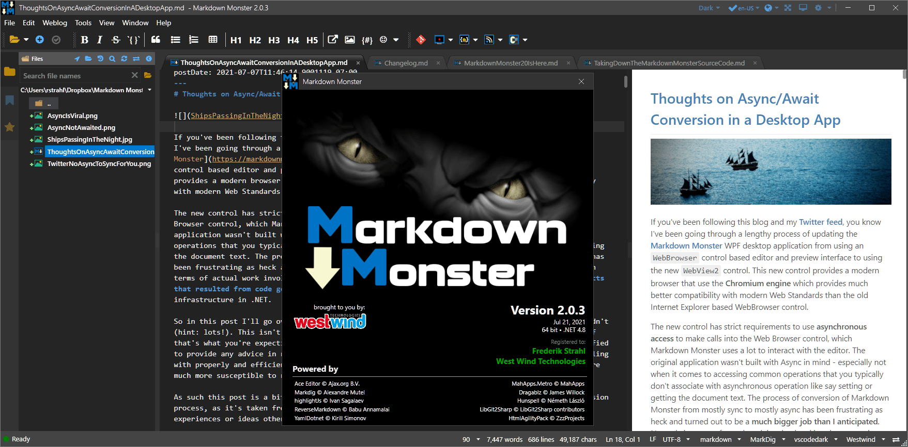
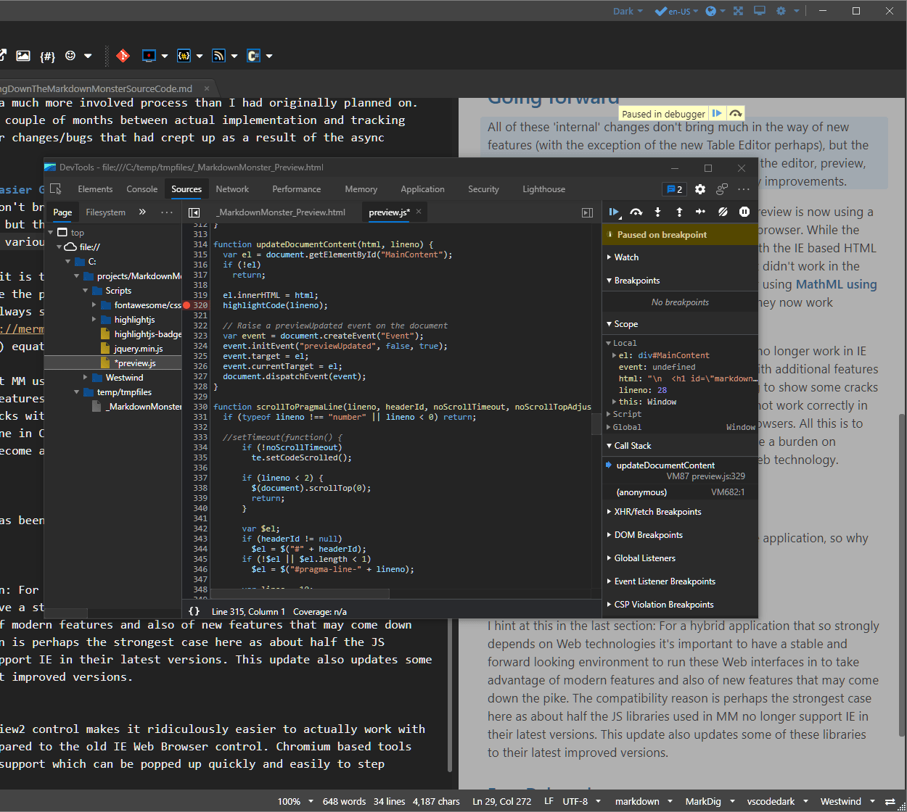

# Markdown Monster 2.0 is here

It's been a long road, but I've finally released [Markdown Monster 2.0](https://markdownmonster.west-wind.com). Markdown Monster is a sophisticated, yet easy to use Markdown Editor for Windows. If you've followed this blog and [my Twitter feed](https://twitter.com/RickStrahl), you've probably seen some of the discussions around my (mis)adventures around the process of building the update for this version. 

It's big release in terms of underlying architecture and foundations. It's updating some technologies to provide some future proofing by moving away from some legacy technologies and with that opening up new functionality that will make it easier to add enhancements to the Web based editor and preview in the future.

Some of the key internal features addressed by this release:

* Switch all Web Interactions to WebView2 (Chromium)
* 64 bit Application (now that IE is removed)
* Async through much of the code base
* Completely re-written Table Editor

If these don't sound very exciting from an end user perspective, you are right. Most of these features are internal and they affect the underlying foundation that Markdown Monster sits on. Building out these changes actually took a lot of effort - a lot more than I expected. I've written quite a bit about the [conversion from the Internet Explorer based WebBrowser views to the Chromium based Edge WebView2 control](https://weblog.west-wind.com/posts/2021/Jan/14/Taking-the-new-Chromium-WebView2-Control-for-a-Spin-in-NET-Part-1) which touched a lot of the code base. That was a pretty major change as it is, but as part of that conversion it also required an intense refactoring to [move the mostly sync application to mostly async](https://weblog.west-wind.com/posts/2021/Jul/07/Thoughts-on-AsyncAwait-Conversion-in-a-Desktop-App). This proved to be a much more involved process than the browser conversion as it ended up touching a huge swath of the codebase. All in all this process took up a couple of months between actual implementation and tracking down lots of small little behavior changes/bugs that had crept up as a result of the async changeover.

## Changes to make Improvements Easier Going forward
All of these 'internal' changes don't bring much in the way of new features (with the exception of the new Table Editor perhaps), but the switch to using the Chromium based controls for the editor, preview, table editor and various other dialogs bring many improvements. 

For end users the immediate benefit is that the Preview is now using a modern browser as opposed to the old IE based browser. While the preview templates were designed to work well with the IE based HTML features, there were always some edge cases that didn't work in the past. For example, displaying [Mermaid graphs](https://mermaid-js.github.io/mermaid/#/) or using [MathML using MathJax](https://www.mathjax.org/) equations didn't work in the preview - they now work natively.

Some of the support libraries that MM uses also no longer work in IE so we can now update to more recent versions with additional features of these libraries. The [ACE Editor](https://ace.c9.io/) too was starting to show some cracks with IE behavior divergences where features did not work correctly in IE, but work just fine in Chromium (or FireFox) browsers. All this is to say, the IE browser control was starting to become a burden on Markdown Monster, which so heavily relies on Web technology for both the editor and preview.

## Why All This Work?
v1 has been working fine and it has been a stable application, so why did I do all this work?

### Modern Web
I hinted at this in the last section: For a hybrid application that so strongly depends on Web technologies it's important to have a stable and forward looking environment to run these Web interfaces in to take advantage of modern features and also of new features that may come down the pike. The compatibility reason is perhaps the strongest case here as about half the JS libraries used in MM no longer support IE in their latest versions. This update also updates some of these libraries to their latest improved versions.

Additionally the current JavaScript code base of Markdown Monster is written for EcmaScript 5 which is the last JavaScript version that IE11 supports. With the switch to Chromium I can finally take advantage of ES6+ features to reduce code complexity and improve performance. This won't happen over night, with small changes at first and more refactoring and simplification of interfaces yet to come. But already there are a number of small features that have been updated to take advantage of modern JavaScript features, especially in the previewer and the new HTML based Table Editor.

### Easy Debugging
Additionally the new WebView2 control makes it ridiculously easier to actually debug JavaScript and HTML code, compared to the old IE Web Browser control. Chromium based tools include the built-in Chrome Developer Tools support which can be popped up quickly and easily to step through code.

Being able to pop up the debugger like this:

and step through code as part of the desktop application is a huge step up from the rigamarole we had to go through with [debugging the IE Web Browser control](https://weblog.west-wind.com/posts/2017/Jul/06/JavaScript-Debugging-in-a-Web-Browser-Control-with-Visual-Studio) (and the VS route no longer works in vs2019).

There are debug options in the  Markdown Monster settings that enable opening the dev tools optionally which is incredibly useful for debugging.

As simple as both the debugging and modern features sound, this opens up a lot of scope for feature improvements in Markdown Monster. Previously some things were just too complex to take on without an easy way to debug code. However, with the ability to easily step through code and examine running state, it's much easier to take on more complex scenarios that require lots of interaction. For example, I remember having to debug the spell checking experience which is highly interactive with IE before - it's now a breeze to do with the debugging tools and console to look at values and experiment with live values and state in the actual running application. Modern JavaScript features also make it easier to break out code into modules, although that has not happened yet. That's on the list for the next rounds of internal updates sometime down the road.

The new Web based Table Editor in MM is the first beneficiary, taking advantage of some ES6+ features from the get go.

### Sync to Async Struggles
But the biggest struggle in this entire conversion was the move from sync to async in the code base.

The conversion from mostly sync to async in Markdown Monster was not voluntary - it was forced on me by the introduction of the `WebView2` control, which **requires** async operation for interaction with the DOM. In Markdown Monster DOM interaction is done via JavaScript calls into a wrapper library that I created around the editor with common operations. These calls are a key part of Markdown Monster and touch most parts of the application both at the core layer and in the UI. In the previous version this process was straight forward through HTML DOM COM automation that is built into MsHtml interfaces.

The WebView2 has no direct interface to the DOM of a loaded document. Interop between .NET and Chromium occurs over internal service interfaces that are essentially passing messages back and forth and then provide a wrapper around that. While DOM operations don't 'feel like' async operation, the way that .NET interacts with the DOM loaded inside of the WebView control is actually via an async messaging interface. As a result the `WebView2` requires all calls to the `ExecuteScriptAsync()` functionality to be `async`. 

While there aren't a huge number of calls that actually require waiting for results - a lot of calls can be async Fire and Forget - there are a few very frequently accessed calls that do things like retrieving and setting the document content, setting selections, and updating editor state that require waiting for results, or at minimum require synchronized operation.

But even these relatively few required async calls, ended cascading out into a major set of changes that affected more than 80% of Markdown Monster's code base. I call this the **Async Cascade** and talk about it in great detail in [this recent post](https://weblog.west-wind.com/posts/2021/Jul/07/Thoughts-on-AsyncAwait-Conversion-in-a-Desktop-App).

Long story short, this conversion ended up being an extremely long winded affair that took much longer and caused many more side effects than I expected. 

All of this is the reason that this ended up being **a long road** to getting this release out.

### Responsiveness Improvements
But... the async conversion also has some nice benefits in the way of an overall more responsive UI. While the initial loading of the controls is actually slower and more janky than in the old version, once the controls are fully loaded the editor and preview are much more responsive. Because much of the editor interaction is now async, there's much better responsiveness between editor and preview, and MM now works much better with large documents.

The editor also works a little faster and smoother now with the WebView, thanks to the efficiency of the Chromium engine. 

Interesting side note: It seems that on initial load the editor is a little bit slower, but after a few minutes of usage the performance and 'feel' of each editor window seemingly improves quite drastically.\ I suspect this has to do with the recent changes in the Chromium engine, that does quick pre-compilation and optimized compilation of code once there's some idle time available.

### Loose Ends
Although I'm just releasing Markdown Monster now, I've been using v2 now for nearly 2 months full time and it's been solid for me. It's also been out in pre-release for a couple of weeks and looking at the logs - other than some WebView irregularities (due to the control internals it looks like) there aren't any unusual issues with this update which is great.

There are likely to be a few odds and ends that I've overlooked, but so far it's looking good. I'm keeping a close eye on the logs and reviewing any hard errors that are making it through as quickly as they come. **If you run into any issues using v2, please file an issue on GitHub** so it can be resolved quickly. You can expect a few rapid fire updates popping up in the downloads and on Chocolatey.

### Table Editor Update
While this release doesn't have a ton of big new features, perhaps the biggest new feature is the updated Table Editor, which has switched over from a native WPF form to using a browser based interface. 

The HTML based interface is significantly faster than the WPF interface and much more dynamic with the ability to very quickly insert,  move and remove rows and columns. It's easy to sort columns and simply tab through the table including the ability to create new rows as you tab past the end. The table editor reflects the layout theme from the currently active preview theme, so as you switch themes the table editor reflects that theme.

Related editor features include the ability to paste tables from the clipboard and from CSV files, or for editing existing Pipe, Grid or HTML tables from within editor content.

Most of the functionality existed previously in v1, but due to the IE limitations performance was not great, and key handling in the HTML interface was not working quite right due to some IE key handling weirdness. With the WebView all these issues disappeared plus the rendering and previewing of tables is much faster especially once you start working with larger tables - which oddly some people do. I got an email from a user who was editing a table with 2000 rows. Really? In Markdown? But Ok, if you can do it, somebody like will :smile:

### Other Updates
There have also been a number of other small changes in this release, more on par with minor version updates. 

* **Allow Swapping Editor and Preview Location**  
You can now swap the editor and preview location via a new **View->Swap Editor and Preview Location** menu option and a via Editor/Preview Splitter Context Menu.

* **New Splitter Context Menu**  
Added a new context menu that displays options for swapping editor and preview, entering presentation mode and toggling the preview display.

* **[Track Active Document in Folder Browser](https://markdownmonster.west-wind.com/docs/_4wu1cjyka.htm)**  
As a heavily requested feature, we've added support for optional document tracking in the folder browser. Using the `FolderBrowser.TrackDocumentInFolderBrowser` configuration switch (also via  a toggle button in the Folder Browser) any time you change the document the Folder Browser navigates to that file.

* **Improved Folder Browser Navigation**  
Folder browser navigation now shows previews for most text type documents in 'inactive' mode that is temporary until the next document is accessed. Documents become 'active' once you edit the document or double click to explicitly open for editing. Single click now also previews any non-edit formats externally, like PDFs, Office docs, etc. Executables open selected in Explorer but are not executed. Drag and Drop start operations are now less twitchy. 

* **Move Support Binaries out of Root Folder**  
Support binaries are now moved out of the root folder into a `BinSupport` subfolder to avoid ending up on the User's path and causing naming conflicts. Only applications that should be visible on the user path now are: `MarkdownMonster`, `mm` and `mmcli`.

* **Make Settings HelpText Selectable**  
You can now select the help text associated with a configuration setting in the Settings window. This allows picking up URLs and other fixed values more easily. (#817)

* **Dev: Add Debug Editor and Preview Template Paths**  
Added configurable Editor and Preview Template paths that are configurable and allow pointing the template folders to the original development folder, rather than the deployed applications' folders. This allows making changes to the Html/Web templates without having to recompile code. Settings are `System.DebugEditorHtmlTemplatesPath` and `System.DebugPreviewHtmlTemplatesPath` and they default to `.\Editor` and `.\PreviewThemes` which are fixed up at runtime.

As always there's a more complete list of recent changes in the [What's new document](https://github.com/RickStrahl/MarkdownMonster/blob/main/Changelog.md).

### No More Source Code in the Open

In case you missed it, about a month ago I pulled the source code on the Markdown Monster repository due to rampant abuse of the code for bypassing licensing, and blatant rip-offs and re-branding of the software. Markdown Monster was never free (FOSS), but it did have to code out in the open using a source open licensing scheme which unfortunately got taken advantage of. I don't want to rehash all of the issues here, but if you're interested I posted a long blog post in May on the hows and whys:

[Taking down the Markdown Monster Source code](https://weblog.west-wind.com/posts/2021/May/05/Taking-down-the-Markdown-Monster-Source-Code)

For those that are interested you can still get [access to the source code in a private repository](https://markdownmonster.west-wind.com/purchase#SourceCode) by requesting access to the private repo explicitly. The idea is that I have at least some level of control using the private repo, and I can revoke or pull access if it should turn out the abuses continue. But my feeling is that simply requiring acknowledgement is enough to keep most of the riff raff out.

This doesn't solve all the piracy problems of course. Markdown Monster after all is a .NET application, and as such can be easily decompiled. That's always a risk, but removing the source will at least prevent the drive by code editing on each release that I've seen in the past and which was way too easy before. Those determined will likely still continue, but it serves both as an obvious statement that this is not a free product and makes it at least a little bit more difficult to hi-jack Markdown Monster lock stock and barrel as some assholes have done.

Markdown Monster now also has a new licensing system that matches individual registrations to licenses so there's a bit more control on my end. I hate having to resort to this. It means more work on my end and a little more complication for users. But it's the only way that I can think of to at least stem some of the bleeding that had been going on.

## Infrastructure
These last few months have been busy and a bit frustrating for me, as most of the work has focused on aspects of Markdown Monster that are internal and don't have any immediately useful benefits. Most of the benefits are internal and some of them are more important for going forward with new features especially as they relate to the Web based code components.

This process involved both Markdown Monster itself as well as building out a new license server and updating my custom Point of Sales app to support the licensing directly. The end result is that there have been huge changes in the way MM works under the hood, how it's administered, while outwardly showing very little change that affect end users. 

## Upgrading
Version 2.0 is a full version and therefore paid upgrade from v1. If you ordered Markdown Monster after or on January 1st, 2021, you can get a free upgrade. There's more information on the Markdown Monster site, regarding the upgrade process:

[Upgrading Markdown Monster to v2](https://markdownmonster.west-wind.com/purchase#upgrades)

### Upgrade Process - please be patient
The upgrade process requires manual review of previous licenses so upgrades are not immediately confirmed. I'll turn these around as quick as I can but it takes a little time.

Free upgrade processing requires putting in an upgrade order anyway and if qualified the order will be completed uncharged (although an authorization may still show for a couple of days). Please leave a note in the order's Notes field on checkout as an extra reminder for the free upgrade.

## Where do we go from here?
I think the infrastructure bits are done now, and I can now get back to focusing on features and usability improvements to make Markdown Monster better and actually provide more tangible benefits in Markdown Monster.

I hope those of you that are using Markdown Monster can help me in that respect by providing ideas and feature suggestions that could make your life with Markdown Monster better. If you have ideas please use GitHub Issues.

But first - a short break to catch a breath and reset sentiment and maybe bask in the satisfaction of finally pulling the trigger and putting out this Markdown Monster release.

    
    this post created and published with the 
    <a href="https://markdownmonster.west-wind.com" 
       target="top">Markdown Monster Editor</a> 

