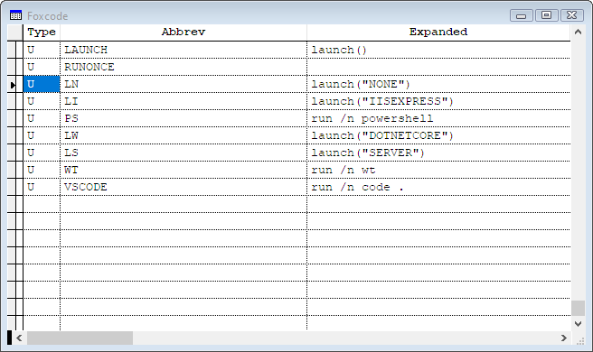

# Updating Launch.prg to Latest Version in Web Connection

In v6 and later of Web Connection, `launch.prg` is a new and  easy way to launch your Web Connection application on the local machine during development. `launch()` is a single command you can use to launch the Web Server, your Web Connection application and a Web browser and have a ready to run application. 

It's great for getting started after creating a new project without having to remember or understand all the pieces required to start a Web Connection project and get it running in the browser.

> `launch.prg` is used during development of the application **on the local machine only**. In a live production environment, applications are launched either by running the compiled EXE directly or via COM instantiation.

### Auto-Generated in New Projects
`launch.prg` is automatically generated as part of a new project creation, using the Web Connection new Project Wizard and applying some of the selections that you choose using the Wizard. Because `launch.prg` is just a FoxPro program file, the generated file can be customized to affect launch behavior, and you can add your own launch logic if your environment requires special setup.

`launch.prg` is run from the command window in the project's `Deploy` folder using `launch()` or `do launch`, and it does the following:

* Starts up the Web Server (IIS Express, Dotnet Core Server)
* Sets paths so it finds Web Connection and related resources
* Starts up Web Connection FoxPro Server application (from the FoxPro IDE)
* Opens a browser and navigates to default page

Here's what this looks like with the Web Connection Support Message Board application immediately after launching into the `c:\WebConnectionProjects\wwThreads\Deploy` folder:


Here I'm using the .NET Core based local Web Connection Web Server as the default server, but the `launch` command can launch any of the supported Web servers by explicitly specifying a Web Server name:

* `launch()` - default to whatever the project was created with

which is one of these:

* `launch("IISEXPRESS")`
* `launch("WEBCONNECTIONWEBSERVER")` or `launch("DOTNETCORE")`
* `launch("IIS")`
* `launch("NONE)` - start without starting a Web server

If you run `launch()` without parameters as I do in the screen capture, the default server is used. The default is the server you configured your project for when you ran the New Project Wizard, but you can change the default if you decide to work with a different server.

## It's a PRG File: Customize it
Because `launch.prg` is merely a PRG file, you can customize the file easily after initial installation.

In fact, all the configurable values are defined at the top of `launch.prg` and you can easily change these values to change the default behavior.

### Default Configuration Values

The values that you can change are at the top of the file.

Specifically you can change these values:

```foxpro
*** Changable Project Launch Settings
lcServerType = "WEBCONNECTIONWEBSERVER"  && default if not passed
lcVirtual = "wwThreads"     && used only for IIS
lcAppName = "wwThreads"     && used to launch FoxPro server
  
llUseSsl = .F.   &&  hard-code. Web Connection Web Server only
lcIisDomain = "localhost"

*** These you usually don't change
lnIISExpressPort = 7000
lnWebConnectionWebServerPort = 5200
```

The `lcServerType` is the main thing that you might change in an already created `launch.prg` file and if you decide to run a different server as your default server. The `lcVirtual` value is used for `IIS` if you are running on `localhost` and specifies the virtual directory such as `http://localhost/wwthreads`. If you are running IIS at the root folder, leave this value as an `""` empty string. The `lcAppName` is used to launch the FoxPro server with `DO wwThreadsMain`. If you prefer to run an EXE, you can change the logic at the very bottom of `launch.prg` to remove the `Main` from the following commands:

```foxpro
? "Server executed:"
? "DO " + lcAppName + "Main.prg"

*** Start Web Connection Server
DO ( lcAppName + "Main.prg")
```

`lUseSsl` applies only to the .NET Core Web Connection Web Server which can easily run under the `https` protocol. `IISEXPRESS` can also run under SSL but it has to be configured at the server level which is not done by default.

The `lcIisDomain` lets you specify a custom domain or IP Address for your server if you don't want to run on `localhost`. This will allow you to access multiple sites with host headered names when using IIS which is useful if you run with IIS.

The `IISEXPRESS` and .NET Core Web Connection Web Server can also choose a specific port to run under when started and specifying the port will launch on that port and then launch the browser on that port. Typically you don't need to change this port **unless you work on multiple Web Connection applications at the very same time**. Note that if you re-use the same port with multiple sites, you may have to do a hard browser refresh (`ctrl-shift-r`) to force the browser to refresh all cached resources to show the appropriate site resources. 

### Add your own Environment Settings and Setup
`Launch.prg` can also make for a great environment setup starter that ensures that your environment is set up properly to run and/or build your Web Connection application.

There's nothing special about the `launch.prg` FoxPro program file, so if you need to set up your environment on launch - such as adding paths and settings specific environment settings when you start your application - you can do it in `launch.prg` as well. 

This is useful if you application specific setup that needs to be performed when you first start Visual FoxPro but before you can launch your application. While I recommend you put most of the Web Connection application startup requirements directly into your server code, some things like paths so everything can be found for building an application can't be stored there.

I recommend you add any custom configuration code you need immediately after the initial setup variables and mark it with a very visible comment marker, so that you can easily lift that code and move it to an updated file if necessary in the future.

```foxpro
...
*** These you usually don't change
lnIISExpressPort = 7000
lnWebConnectionWebServerPort = 5200

**********************************************
*** START CUSTOM STARTUP ENVIRONMENT SETUP ***
**********************************************

RUN &lcSupportApplication

SET PATH TO `e:\dev\FoxLibs\` ADDITIVE
SET PATH TO `e:\dev\WebConnection\Fox` ADDITIVE

**********************************************
*** END CUSTOM STARTUP ENVIRONMENT SETUP   ***
**********************************************

...
```

## Trick: If you often switch Servers use Intellisense Shortcuts
I use a few Intellisense shortcuts for various launch operations:

* **LI**  - Launch IISExpress
* **LN**  - Launch None (doesn't launch a Web Server but everything else)
* **LW**  - Launch the Dotnet Core Web Connection Web Server




## Don't have a Launch.prg or an old version?
If you don't have a `launch.prg` in your project because you have a really old project, or you have an old out of date version, you can still take advantage of this functionality by essentially creating a new `launch.prg` file as part of a new project and then copying the file.

You should be able to use `launch.prg` with any project that is v6 or later, and it might even work with older projects although you'll have to stick with IIS and IIS Express for those.

The easiest way update a project with a new and current `launch.prg` file is:

* Create a new Project in the New Project Wizard
* Choose IIS Express or Web Connection Server for lowest install impact
* Go through the Wizard 
* Go to the project's folder
* Copy `launch.prg`
* Paste into your projects `Deploy` folder
* Update the configurable variables at the top of `launch.prg`
* If you want delete the newly created project folder

Projects by default are created in `\WebConnectionProject\YourProject` and with v6 and later projects are fully self contained in that folder structure. If you didn't configure for IIS, you can simply delete the folder and everything related to the project is gone - there are no other resources used on the machine. This of course is one benefit of the new project system in that provides a single, fully portable directory hierarchy that you can easily move to a new location.

As far as `launch.prg` is concerned, it's pretty much a generic program file that can just be copied verbatim from the generated project into another location. You can then use [the configuration settings mentioned above](#its-a-prg-file-customize-it) to customize for your specific application. Typically you'll only need to change the `lcServerType` and `lcAppName` and `lcVirtual` values.

## Summary
To me `launch.prg` is a very simple, but extremely time saving utility in Web Connection. It makes it easy for new users to get started, makes it easier to not forget to launch one part of the application, and most importantly can save a lot of time to start up an application **consistently**. You can use the same command for each application, which makes it convenient and easy to shortcut the commands via Intellisense to make it even easier.


<div style="margin-top: 30px;font-size: 0.8em;
            border-top: 1px solid #eee;padding-top: 8px;">
    
    this post created and published with the 
    <a href="https://markdownmonster.west-wind.com" 
       target="top">Markdown Monster Editor</a> 
</div>