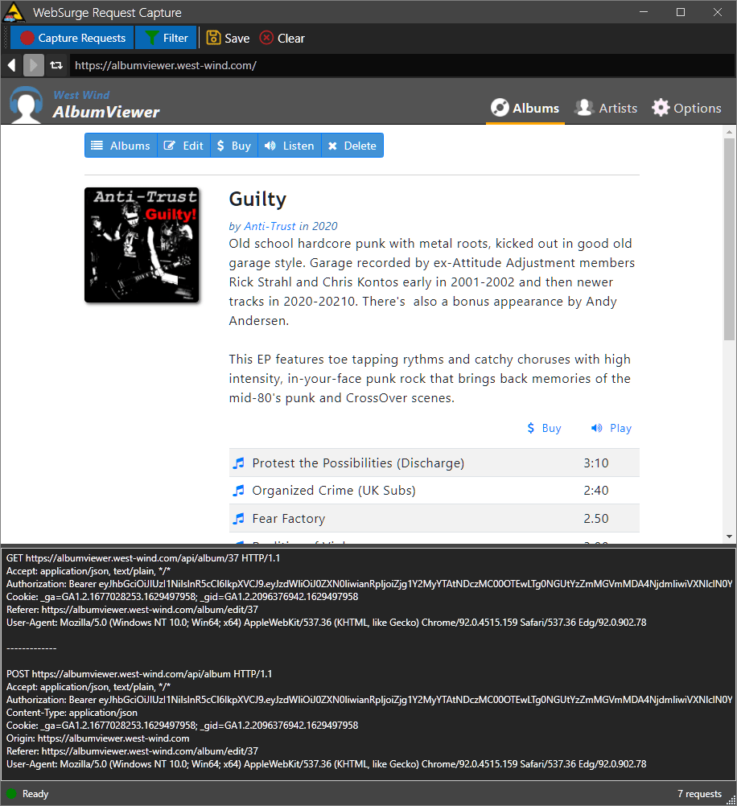

# Using the WebView control to capture HTTP Request Content


Recently I had a need to replace an old application's HTTP proxy capture code to use a solution that wasn't so finicky with TLS certificate rules in modern browsers. As part of my[ WebSurge Stress Tester](https://websurge.west-wind.com) application I need to let users capture request content to more easily build test routines. I'd been [using FiddlerCore for this](https://weblog.west-wind.com/posts/2014/Jul/29/Using-FiddlerCore-to-capture-HTTP-Requests-with-NET), which is a generic intercepting HTTP proxy. It works well, but in order to do this - essentially an intentional and open man in the middle intercept - it's necessary to have a dedicated certificate both in the trusted store as well as for each request in order to capture `https` requests. This used to work reasonably well before modern browsers instituted - rightly so - much tighter integrity checks on certificates and certificate origins precisely to protect against man in the middle attacks. In short, it's gotten a lot harder to manage the certificate issues with a proxy solution that isn't built into the browser itself. (If you want to know what I mean look at Fiddler's use of per site injected certificates).

So, rather than dealing with these security implications, with the advent of the WebView2 control I figure an easier way to do this would be to use an application based pop up browser in an application `Window` that the application controls and can then intercept the request data. In the past with only the IE WebBrowser control available this was really not an option, because the IE based WebBrowser control sucked so bad. But with the WebView2 and a modern Chromium based browser, using a built-in application browser once again becomes a viable option and a much cleaner one that doesn't affect browsing security.

This post is about capturing request data with the WebView2, which is a little bit more involved than I expected it to be.

## Capturing Requests with the WebView
The idea behind capturing requests is that I can pop up a browser window and then capture the request data as requests are made. This is not as simple as it should be - in previous browsers you could use `BeforeNavigate` events, and while WebView2 has `NavigationStarted` and `NavigationCompleted` events these events don't provide all the necessary request data. Specifically `NavigationStarted` only provides the `Uri` and `Headers`, but no POST content.

There is however a `WebResourceRequested` event that does provide, `Uri`, `Headers` and a `Content` stream. But this event requires some extra work by first defining a filter and context that determines what requests are routed through this event.

If you're new to the Chromium Edge WebView2 control in .NET, you might want to take a look at my previous blog post: [Taking the new Chromium WebView2 Control for a Spin in .NET - Part 1 ](https://weblog.west-wind.com/posts/2021/Jan/14/Taking-the-new-Chromium-WebView2-Control-for-a-Spin-in-NET-Part-1) which talks about how to set up the control as it requires a little more work than the old IE WebBrowser control in .NET.


### Set up the Event Handling
Here's how to set up the event handling:

```cs
public MainWindow()
{
    InitializeComponent();

    ...
    
    _ = InitializeAsync();
}

async void InitializeAsync()
{
    var env = await  CoreWebView2Environment.CreateAsync(userDataFolder:
             Path.Combine(System.IO.Path.GetTempPath(),"WebSurge_Capture"));
    await webView.EnsureCoreWebView2Async(env);

    ...

    string filter = "*://west-wind.com/*";   // or "*" for all requests
    webView.CoreWebView2.AddWebResourceRequestedFilter(filter,
                                               CoreWebView2WebResourceContext.All);
    webView.CoreWebView2.WebResourceRequested += CoreWebView2_WebResourceRequested;
}	
```

First you need to use [AddWebResourceRequestedFilter](https://docs.microsoft.com/en-us/dotnet/api/microsoft.web.webview2.core.corewebview2.webresourcerequested) to specify a URL filter on what to capture. This minimizes the resource capture to just the requests that match the filter string and resource context specifier. You can use `*` to include every request, but for WebSurge it's actually useful to filter by domain like this `*://west-wind.com/*` since WebSurge has application filters for domains. As a bonus you can also specify `CoreWebView2ResourceContext` which lets you filter by resource type such as `Document`, `Image`, `Media` etc. which is also useful in WebSurge where developers often only want to capture the primary documents or API calls. Bonus! This might actually allow me to specify these same filters in WebSurge itself to give users more control beyond the basic settings I currently use.

> #### @icon-warning Can't combine multiple Context Enums
> Although the `CoreWebView2WebResourceContext` is an enum, it looks like you **can't combine multiple values** using **OR** (`|`) logic. If you want to apply multiple filters for individual document types, you need to create separate calls the `AddWebResourceRequestedFilter()`:
>  
```csharp
if (Model.OnlyCaptureDocuments)
{
    WebBrowser.CoreWebView2.AddWebResourceRequestedFilter("*",
        CoreWebView2WebResourceContext.Fetch);
    WebBrowser.CoreWebView2.AddWebResourceRequestedFilter("*",
        CoreWebView2WebResourceContext.XmlHttpRequest);
    WebBrowser.CoreWebView2.AddWebResourceRequestedFilter("*",
        CoreWebView2WebResourceContext.Document);
}
else
{
    WebBrowser.CoreWebView2.AddWebResourceRequestedFilter("*",
        CoreWebView2WebResourceContext.All);
}
```

### Capture the Request Data
Once you've set up the filter that determines what fires into the event, you can handle the event itself to capture the individual incoming requests and capture the request data:

```csharp
private void CoreWebView2_WebResourceRequested(object sender, CoreWebView2WebResourceRequestedEventArgs e)
{
    var headers = e.Request.Headers;
    string postData = null;
    var content = e.Request.Content;
    
    // get content from stream
    if (content != null)
    {
        using (var ms = new MemoryStream())
        {
            content.CopyTo(ms);
            ms.Position = 0;
            postData = Encoding.UTF8.GetString(ms.ToArray());
        }
    }
    var url = e.Request.Uri.ToString();

	// collect the headers from the collection into a string buffer
    StringBuilder sb = new StringBuilder();
    foreach (var header in headers)
    {
        sb.AppendLine($"{header.Key}: {header.Value}");
    }
    
    // for demo write out captured string vals
    Debug.WriteLine($"{url}\n{sb.ToString()}\n{postData}\n---");
}
```

For WebSurge, I'd capture the headers, the POST content and URL and build up a request object for each of the requests I'm capturing, that can then be edited or used as is for individual request or bulk load testing. The only downside in that scenario is that now I have to deal with the requirement of having the WebView runtime installed as part of the installation.

### In the real World

Here's what the Web Request capture form looks like in practice in WebSurge:



This application is a SPA application, and WebSurge in this case captures only document and XHR/Fetch requests (via a filter).

The form captures request by parsing out the request data into WebSurge's request object format. For convenience it also displays the result.

```csharp
private void CoreWebView2_WebResourceRequested(object sender, CoreWebView2WebResourceRequestedEventArgs e)
{
   // not active
   if (!Model.Capturing)
       return;

   var request = new HttpRequestData();

   request.Url = e.Request.Uri?.ToString();

   string postData = null;
   var content = e.Request.Content;

   // get content from stream
   if (content != null)
   {
       using (var ms = new MemoryStream())
       {
           content.CopyTo(ms);
           ms.Position = 0;
           postData = System.Text.Encoding.UTF8.GetString(ms.ToArray());
       }
       request.RequestContent = postData;
   }
   request.HttpVerb = e.Request.Method;

   foreach (var header in e.Request.Headers)
   {
       if (string.IsNullOrEmpty(header.Value) || 
           header.Key.StartsWith("sec-ch")) continue;

       request.Headers.Add(new HttpRequestHeader() { Name = header.Key, Value = header.Value });
   }

   Window.Model.CapturedRequests.Add(request);

   Window.TextCapturedRequests.Text += request.ToRequestHttpHeader() + "\n-------------\n\n";
   Window.TextCapturedRequests.ScrollToEnd();
}
```

The end result of this code will be a saved WebSurge Session file saved to disk or simple text copied from the Request output text area to the clipboard, and which looks like this:

```http
GET /api/albums HTTP/1.1
Accept-Encoding: gzip,deflate
Accept: application/json

------------------------------------------------------------------

GET /api/albums?page=2&pageSize=2 HTTP/1.1
Accept-Encoding: gzip,deflate
Accept: application/json

------------------------------------------------------------------

GET /api/artists HTTP/1.1
Accept-Encoding: gzip,deflate
Accept: application/json

------------------------------------------------------------------

POST /api/posttrack HTTP/1.1
Accept-Encoding: gzip,deflate
Accept: application/json
Content-Type: application/json

{
  "Id": 1,
  "SongName": "End of the Silence",
  "ArtistId": 10
}

------------------------------------------------------------------

GET /api/artist/33 HTTP/1.1
Accept-Encoding: gzip,deflate
Accept: application/json

------------------------------------------------------------------
```


The full capture code is pretty simple and straight forward and provides a nice user experience, without the hassles of having to deal with the confusing certificate hell.

You can see that only the HTML document and API requests are captured via this filter:

```cs
WebBrowser.CoreWebView2.AddWebResourceRequestedFilter("*://albumviewer.west-wind.com/*",
    CoreWebView2WebResourceContext.Fetch);
WebBrowser.CoreWebView2.AddWebResourceRequestedFilter("*://albumviewer.west-wind.com/*",
    CoreWebView2WebResourceContext.XmlHttpRequest);
WebBrowser.CoreWebView2.AddWebResourceRequestedFilter("*://albumviewer.west-wind.com/*",
    CoreWebView2WebResourceContext.Document);
```        


With this Chromium control a full featured browser experience is available inside of my application, which is great. 

On the downside, you lose browser conveniences like support for plugins and password managers. All that **does work** but you have to explicitly install it in the WebView yourself which is not quite smooth. One workaround for this might be to use the default Edge profile - I have to experiment with that, and that might make a good topic for another WebView post in the future.

## Summary
Sweet. Once you know about the filtering, the WebView comes through and makes it relatively straight forward to capture requests that are running through the WebView. There's a good amount of control via the filter, which - while not especially obvious at first - is actually quite useful for applications that wish to capture content by limiting what gets actually captured.

All of this is straight forward, but a bit unexpected especially if you come from the WebBrowser control as I have, so it took me a bit to figure out that the filter had to be set and that `WebResourceRequested` is the event to track. But to be fair, having a separate `WebResourceRequested` event that is explicitly triggered by a filter prevents every normal, non-filtered Request from not capturing all this information and incur the extra overhead. So cool beans - these two APIs do what I want it to and as a bonus provide some extra filtering features I can take advantage of in my applications.

I hope this post saves some of you the little bit of time it took me to figure out how to capture request in the WebView2 without having to experiment with trial and error yourselves.

## Resources

* [Taking the new Chromium WebView2 Control for a Spin in .NET - Part 1 ](https://weblog.west-wind.com/posts/2021/Jan/14/Taking-the-new-Chromium-WebView2-Control-for-a-Spin-in-NET-Part-1)  ([Part 2](https://weblog.west-wind.com/posts/2021/Jan/26/Chromium-WebView2-Control-and-NET-to-JavaScript-Interop-Part-2))
* [WebResourceRequested Event](https://docs.microsoft.com/en-us/dotnet/api/microsoft.web.webview2.core.corewebview2.webresourcerequested)
* [AddWebResourceRequestFilter Method](https://docs.microsoft.com/en-us/dotnet/api/microsoft.web.webview2.core.corewebview2.addwebresourcerequestedfilter)


<div style="margin-top: 30px;font-size: 0.8em;
            border-top: 1px solid #eee;padding-top: 8px;">
    
    this post created and published with the 
    <a href="https://markdownmonster.west-wind.com" 
       target="top">Markdown Monster Editor</a> 
</div>