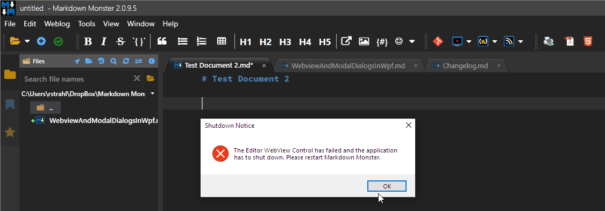

# WebView and Modal Dialogs in WPF Async Code



Ah the hits just keep coming when it comes to using the new `WebView2` control with WPF! As if things haven't been crazy enough trying to get async operations to work reliably, I've run into yet another edge case problem that's showing up in Markdown Monster occasionally and has been terribly difficult to track down due to its infrequency.

## Dialogs called from Async Code affect active WebView Controls
So this problem is a real head-scratcher and one that occurs only under very specific circumstances:

* Form with a WebView on it
* An async method/event is being called  (event, command, dispatcher, async method)
* An `await` method is called **before** the dialog (ie. actual async operation)
* A **modal Windows Dialog** is popped up (MessageBox, FileOpen, FileSave, DirectoryOpen etc.)
* Dialog stays open for at least 20 seconds or so
* **... BOOM**

Weird? Hell yeah.

Specifically in my case this it consistently fails with **InputBindings** that are bound to Command objects that have an `async` handler. It seems to **not fail** when when commands are bound directly to buttons or in button events even when those events are handled using `async void`.

So - pressing a toolbar, menu or context menu item directly it works. But using an InputBinding that is bound to those very same commands it blows up.

### The Short Version
The short version of this story is that it appears that modal Windows dialogs (not WPF modals though!) end up causing a focus error in the Web View if the dialog is kept open for a lengthy bit of time. When the dialog is closed, an exception occurs that starts deep in the bowels of Windows events and then walks its way up the stack into the Web View, but never hits application code. The WebView fails and then becomes 'unresponsive' and essentially dies. 

For Markdown Monster this means the WebView has to be shut down and the App restarted, because once in this unresponsive state a full browser reload is required - for Markdown Monster that essentially means a full application restart. Yechhh!

The problem is code like the following that invokes a Windows dialog from within an async method:

```cs
 SaveAsCommand = new CommandBase(async (parameter, e) =>
{
    var tab = Model.Window.TabControl?.SelectedItem as TabItem;
    var editor = tab?.Tag as MarkdownDocumentEditor;
    if (editor == null)
        return;

	...
	
	// an await here triggers async!
	var editorText = await editor.GetMarkdown();
	
	...
	
    var sd = new SaveFileDialog
    {
        FilterIndex = 1,
        InitialDirectory = folder,
        FileName = filename,
        CheckFileExists = false,
        OverwritePrompt = true,
        CheckPathExists = true,
        RestoreDirectory = true
    };

    var mdcryptExt = string.Empty;
    if (isEncrypted)
        mdcryptExt = "Secure Markdown files (*.mdcrypt)|*.mdcrypt|";

    sd.Filter =
        $"{mdcryptExt}Markdown files (*.md)|*.md|Markdown files (*.markdown)|*.markdown|All files (*.*)|*.*";

    bool? result = null;
    try
    {
    	// THIS CODE BLOWS UP THE WEBVIEW!
        result = sd.ShowDialog();
        // BOOM here or at next await
    }
    catch (Exception ex)
    {
        mmApp.Log("Unable to save file: " + editor.MarkdownDocument.Filename, ex);
        MessageBox.Show(
            $@"Unable to open file:\r\n\r\n" + ex.Message,
            "An error occurred trying to open a file",
            MessageBoxButton.OK,
            MessageBoxImage.Error);
    }
    ... 
    
    // BOOM here if it didn't blow up on the dialog immediately
    await editor.SetDocumentStats();
}
```

A simpler repro is:

```cs
public async void Button_Click(object sender, RoutedEventArgs e) 
{
      await Task.Yield();  // forces async
      
      // fail here
      MessageBox.Show("Boom", "Crash me when you can!");
      
      await Task.Delay(2);   // or fail here
}
```

The failure happens in two ways:

* An Exception fires that results in a weird focus failure in the WebView control
* The WebView control becomes unresponsive

More on these below in the detail, but for now just know when this error occurs the WebView **dies and becomes unusable** unless completely reloaded.

### Quick Fix
The quick fix to avoid this WebView failur is to use a `await Dispatcher.InvokeAsync()` call and wrap the modal dialog call:

In the code above replace the call to:

```cs
result =  sd.ShowDialog();
```

with 

```cs
result = await  Model.Window.Dispatcher.InvokeAsync(() => sd.ShowDialog());
```


Other Dispatcher variations worked sporadically for me and caused me to prematurely declare victory, but the only reliable way in the end was the `await Dispatcher.InvokeAsync()` syntax.

This fixed the problem for me, although I had to hunt down many `ShowDialog()` calls in the application and check if they were firing in `async` methods or were being called by async methods. 

Another approach that also works, and might be a better **general recommendation** is to set up Command object and event handlers **by explicitly wrapping them into Dispatcher calls**.

```cs
SaveAsCommand = new CommandBase((parameter, e) => {

	Model.Window.Dispatcher.Invoke(async () => {
		// handler code here
		
		// this seems to correctly bind the call context so modals work
	});
});
```
### Only a Problem with Windows Dialogs
Note that the failures **did not appear to happen with WPF Window objects and calling `ShowDialog`** - this failure **only happens with native Windows Dialogs** like `MessageBox`, `FileOpenDialog`, `FileSaveDialog` etc.

## Digging Deeper into the Problem
So what happens is that two errors occur when the modal is closed and focus returns to the original form and presumably to the Web Browser control. 

First an exception fires that touches the WebView focus operations:

```text
Microsoft.Web.WebView2.Core
   at Microsoft.Web.WebView2.Core.Raw.ICoreWebView2Controller.MoveFocus(COREWEBVIEW2_MOVE_FOCUS_REASON reason)
   at Microsoft.Web.WebView2.Core.CoreWebView2Controller.MoveFocus(CoreWebView2MoveFocusReason reason)
   at System.Windows.RoutedEventArgs.InvokeHandler(Delegate handler, Object target)
   at System.Windows.RoutedEventHandlerInfo.InvokeHandler(Object target, RoutedEventArgs routedEventArgs)
   at System.Windows.EventRoute.InvokeHandlersImpl(Object source, RoutedEventArgs args, Boolean reRaised)
   at System.Windows.UIElement.RaiseEventImpl(DependencyObject sender, RoutedEventArgs args)
   at System.Windows.UIElement.RaiseTrustedEvent(RoutedEventArgs args)
   at System.Windows.Input.InputManager.ProcessStagingArea()
   at System.Windows.Input.InputManager.ProcessInput(InputEventArgs input)
   at System.Windows.Input.KeyboardDevice.ChangeFocus(DependencyObject focus, Int32 timestamp)
   at System.Windows.Input.KeyboardDevice.TryChangeFocus(DependencyObject newFocus, IKeyboardInputProvider keyboardInputProvider, Boolean askOld, Boolean askNew, Boolean forceToNullIfFailed)
   at System.Windows.Input.KeyboardDevice.Focus(DependencyObject focus, Boolean askOld, Boolean askNew, Boolean forceToNullIfFailed)
   at System.Windows.Input.KeyboardDevice.Focus(IInputElement element)
   at System.Windows.UIElement.Focus()
   at System.Windows.FrameworkElement.OnPreviewGotKeyboardFocus(Object sender, KeyboardFocusChangedEventArgs e)
   at System.Windows.RoutedEventArgs.InvokeHandler(Delegate handler, Object target)
   at System.Windows.RoutedEventHandlerInfo.InvokeHandler(Object target, RoutedEventArgs routedEventArgs)
   at System.Windows.EventRoute.InvokeHandlersImpl(Object source, RoutedEventArgs args, Boolean reRaised)
   at System.Windows.UIElement.RaiseEventImpl(DependencyObject sender, RoutedEventArgs args)
   at System.Windows.UIElement.RaiseTrustedEvent(RoutedEventArgs args)
   at System.Windows.Input.InputManager.ProcessStagingArea()
   at System.Windows.Input.InputManager.ProcessInput(InputEventArgs input)
   at System.Windows.Input.KeyboardDevice.TryChangeFocus(DependencyObject newFocus, IKeyboardInputProvider keyboardInputProvider, Boolean askOld, Boolean askNew, Boolean forceToNullIfFailed)
   at System.Windows.Input.KeyboardDevice.Focus(DependencyObject focus, Boolean askOld, Boolean askNew, Boolean forceToNullIfFailed)
   at System.Windows.Input.KeyboardDevice.Focus(IInputElement element)
   at System.Windows.Interop.HwndKeyboardInputProvider.OnSetFocus(IntPtr hwnd)
   at System.Windows.Interop.HwndKeyboardInputProvider.FilterMessage(IntPtr hwnd, WindowMessage message, IntPtr wParam, IntPtr lParam, Boolean& handled)
   at System.Windows.Interop.HwndSource.InputFilterMessage(IntPtr hwnd, Int32 msg, IntPtr wParam, IntPtr lParam, Boolean& handled)
   at MS.Win32.HwndWrapper.WndProc(IntPtr hwnd, Int32 msg, IntPtr wParam, IntPtr lParam, Boolean& handled)
   at MS.Win32.HwndSubclass.DispatcherCallbackOperation(Object o)
   at System.Windows.Threading.ExceptionWrapper.InternalRealCall(Delegate callback, Object args, Int32 numArgs)
   at System.Windows.Threading.ExceptionWrapper.TryCatchWhen(Object source, Delegate callback, Object args, Int32 numArgs, Delegate catchHandler)
System.ArgumentException
```

The stack trace looks different depending on where it's fired from but it **never shows any application code**, just raw Windows events firing resulting in the final WebView methods:

```text
at Microsoft.Web.WebView2.Core.Raw.ICoreWebView2Controller.MoveFocus(COREWEBVIEW2_MOVE_FOCUS_REASON reason)
at Microsoft.Web.WebView2.Core.CoreWebView2Controller.MoveFocus(CoreWebView2MoveFocusReason reason)
```

which are always the same. It appears this happens when focus returns to the form/Webview after the modal dialog has been deactivated, but that's just a guess.

I see quite a few of these errors in my Analytics error logs.

Note that nothing in the code that actually blows up touches the WebView, but the WebView is active in the background of course and apparently it's the focus change that's starting this failure sequence. In MM there's other logic that fires to handle focus but based on the error trace it doesn't look like that form activation code is actually firing in this failure sequence.

### Unresponsive WebView
Once this exception fires, the WebView corrupts and becomes unresponsive. If you don't explicitly handle the  `WebBrowser.CoreWebView2.ProcessFailed` event, the Web View will fail on any subsequent operation with another exception that it's no longer responsive.

Warning: If this happens you can generate a lot of log errors in a hurry. Ask me how I know :smile:.

The much better alternative is to implement WebView's `ProcessFailed` event and then shut down (or if possible reload the WebView) to avoid the logging onslaught:

```cs
WebBrowser.CoreWebView2.ProcessFailed += CoreWebView2_ProcessFailed;

...

private static void CoreWebView2_ProcessFailed(object sender, CoreWebView2ProcessFailedEventArgs e)
{
    mmApp.Log($"Editor WebView Control Process Failed: {e.ProcessFailedKind} {e.Reason}",
        logLevel: LogLevels.Critical);

    MessageBox.Show(mmApp.Model.Window,
        "The Editor WebView Control has failed and the application has to shut down. Please restart Markdown Monster.",
        "Shutdown Notice",
        MessageBoxButton.OK, MessageBoxImage.Error);

    Environment.Exit(1);
}
```

Unfortunately this event doesn't provide shit for information other than `Unresponsive` which is not very helpful. However, it does allow you at least to detect and intercept when this failure occurs so that you can take the appropriate action.

For MM this simply means logging and shutting down, since a corrupt WebView essentially kills the editor and requires a full reload of the control.

## Make it Go Away Please!

As you might expect this was not an easy bug to track down. In fact I didn't catch this at all - it was a user issue that brought this to my attention. I saw the errors in the log, but because they are not showing any user code I had no idea where they were coming from.

Only after **a lot of back and forth** and **works on my machine** notes from me - and with the help of some very patient folks on GitHub issues - did we figure out that the problem only occurs when the dialogs are left open for a fairly long time (~20 seconds minimum).

Yeah, really!

Exit the dialog quickly, and no problem ever. Wait to exit for a bit and all of a sudden it no longer works. Go figure...

### And the Winner is

The solution is that the `ShowDialog()` calls have to be marshaled explicitly. Since `ShowDialog()` is not async and the code in these methods may be running on an async thread, forcing explicitly to the Dispatcher thread is important. Why this is only a problem after 20 seconds is anybody's guess - you would think if it's a marshalling problem related to async execution it would happen no matter what? 

IAC, it looks like using a Dispatcher is the solution as it can force the operation to perform synchronously without side effects. Specifically the only thing that seems to work reliably is to use `await Dispatcher.InvokeAsync()`.

```cs
result = await  Model.Window.Dispatcher.InvokeAsync(() => sd.ShowDialog());
```

Note it's important to `await` the `InvokeAsync()` call. I started with just an `Invoke()` call and that improved things a quite a bit, but it would still occasionally fail. With `await Dispatcher.InvokeAsync()` I have not seen any hang ups again.

## Summary

Chances are there's some odd timing or focus bug in the WebView control that's causing this problem. I've filed an issue for this previously and hopefully someone from the WebView team will have an idea what internals would trigger after a 20 second timeout. 

After I found this issue in Saving a new document (which was the bug report) I hunted through the entire application and replaced all `.ShowDialog()` code in `async` methods with Windows dialogs (FileOpen, FileSave, Directory, MessageBox etc. ) dialogs and replaced them with Dispatcher calls. Since then I have not seen the WebView shut down errors nor the the weird WebView focus issues. 

Dialogs in Async code are always a problem, but as you know - some dialogs and especially Windows dialogs are unavoidable. So hopefully the unintuitive Dispatcher workaround will get us by until Microsoft hopefully provides a fix for this funky and difficult to track behavior.

<div style="margin-top: 30px;font-size: 0.8em;
            border-top: 1px solid #eee;padding-top: 8px;">
    
    this post created and published with the 
    <a href="https://markdownmonster.west-wind.com" 
       target="top">Markdown Monster Editor</a> 
</div>