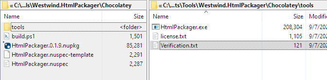
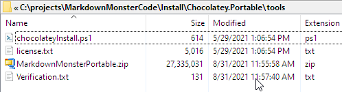

# Creating a Self-Contained Chocolatey Install

Chocolatey is a yummy and by now widely used Windows package manager that makes it easy to install all sorts of software, quickly from a Windows Command or PowerShell prompt. You can easily install many free tools and applications, as well as commercial software and all without user interaction and more importantly the often insidious 'trick you into' spamware installations that come with some free and commercial installations. Installations are silent generally and are performed without user interaction. And... because it's driven through command line operation you can easily automate the process.


Chocolatey is also open to submissions of all kinds. If you're a software publisher you can relatively easily publish to Chocolatey, and it's even possible for third parties to create packages of existing pre-packaged installers or tools. 

I personally distribute most of my software - both free and licensed through Chocolatey - and it's a great way for users to install my software as well as easily update it.

Today there are various other Package managers out there:

* Snap
* WinGet

but Chocolatey still remains the most popular one, and for end users - for now at least - continues to be the best choice.

## Chocolatey and Publishers
As much as I love **using** Chocolatey, I struggle with publishing packages. Chocolately has a Powershell based publishing mechanism that can be fairly difficult to get started with. While the final end result of the package configurations that are needed tend to be fairly short and concise, arriving at the exact right combinations of commands feels often elusive. 

## Creating a Self-Contained Chocolatey  
In this post I want to talk about a very simple scenario, that isn't well documented in the Chocolatey documentation which is:

* **Creating a Self-Contained Chocolatey package** 
This is a package that contains all the files it needs directly in the package. This package needs no post installation and can just be installed from files and is ready to run

## Chocolatey Installs 101
Chocolatey's documentation has a lot of detailed information, which is great for specific documentation once you know what you need to do. But there are lot of choices of how to create a package, and the documentation is not very good at giving an overview of what choices are available to you and when they apply.

At the top level Chocolatey is based on a NuGet repository, which is essentially a file distribution mechanism. A Nuget Package contains one or more files typically and then installs those files. Chocolatey build on top of that with a layer of automation via PowerShell scripts and a bunch of Choco specific commandlets that can be used to handle the install process. This can include things like downloading files, unpacking zip files, adding things to the path and so on. 

Three common scenarios that are all I've ever used are:

* Self Contained File(s)
* Self Contained Zip File
* Downloaded Installer

## Self Contained Files
As mentioned earlier Chocolatey is basically a NuGet package which contains files, plus a PowerShell script to run after the files have been installed. WIth a Self-Contained File install the idea is that you basically have a **very simple install** where the only thing you need to run the application is files in a single folder. Ideally for this type of install you have a single-file exe, or perhaps a single EXE with a configuration file or maybe - if you're pushing it - a couple of other support files. If you have more files than that it's probably better to use a Zip file install instead.

So for me I have several utilities that are fully self-contained in a single ILMerged EXE file, that can run completely on their own, and this type of install is perfect for it.

To do this:

* Add your binaries and support files into the `\tools` directory
* Add `verification.txt`  (sha and file information for all files)
* Add `license.txt`

I have a small utility called `HtmlPackager` which takes HTML content from a Web site or a local file and turns it into local copy that you can access locally without any online dependencies. It creates either a single (large) HTML file with embedded resources, or a folder or zip file with the HTML plus all of its associated resources. This is useful for backups and storage, as well as sending Web or local content via Email, or in applications to allow saving HTML output. 

Here's what the folder structure of a Chocolatey Nuget package looks like:



* A root folder that holds the `.nuspec` file
* `choco pack` builds a `.nupkg` file
* You probably want a `build` file to automate this
* `tools` folder holds
    * All distribution files
    * Verification and license files

The `.nuspec` file holds reference information about the package. Other than the version number this is a one time configuration.

Here's what this looks like for my Html Packager. Note not all settings are required.

```xml
<?xml version="1.0" encoding="utf-8"?>
<package xmlns="http://schemas.microsoft.com/packaging/2011/08/nuspec.xsd">
    <metadata>
        <id>HtmlPackager</id>
        <version>0.1.9</version>
        <title>West Wind HTML Packager</title>
        <authors>Rick Strahl,West Wind Technologies</authors>
        <owners>West Wind Technologies</owners>
        <licenseUrl>https://github.com/RickStrahl/Westwind.HtmlPackager#license</licenseUrl>
        <projectUrl>https://github.com/RickStrahl/Westwind.HtmlPackager</projectUrl>
        <projectSourceUrl>https://github.com/RickStrahl/Westwind.HtmlPackager</projectSourceUrl>
        <docsUrl>https://github.com/RickStrahl/Westwind.HtmlPackager#standalone-htmlpackager-application-windows</docsUrl>
        <requireLicenseAcceptance>false</requireLicenseAcceptance>
        <description>HtmlPackager is a small utility console app used ...</description>
		<iconUrl>https://raw.githubusercontent.com/RickStrahl/Westwind.HtmlPackager/master/HtmlPackagerIcon.png</iconUrl>
        <summary>Small utility used to package HTML content into a self contained HTML document both as a single file, or a folder with all dependencies copied to local.</summary>
        <copyright>West Wind Technologies, 2018</copyright>
        <tags>html packing console</tags>
    </metadata>
    <files>
        <file src="tools\**" target="tools" />        
    </files>    
</package>
```

The NuSpec file holds all the standard information about the package. The key piece in the file is the `<files>` section which pulls in all the files from the `/tools` folder

Chocolatey then handles hoisting up the `HtmlPackager.exe` via its executable aliasing so it's accessible on the Windows path (in `\ProgramData\Chocolatey\bin`). That's literally everything that's needed.

To prepare and build the package, my build process (build.ps) does the following:

* Copies binary into `/tools` folder
* Creates `/tools/verification.txt` with sha256
* Updates the `.nuspec` version
* builds the Choco script
* uninstalls any (if any) old version
* installs the new version
* pushes to Chocolatey (uncomment when ready)

Here's what this looks like in my build script:

```powershell
Set-Location "$PSScriptRoot" 

copy ..\HtmlPackager.exe .\tools

# get sha256 has and write to verification.txt
$sha = get-filehash -path ".\tools\HtmlPackager.exe" -Algorithm SHA256  | select -ExpandProperty "Hash"
write-host $sha

$filetext = @"
`VERIFICATION
`HtmlPackager.zip
`SHA256 Checksum Value: $sha
"@

out-file -filepath .\tools\Verification.txt -inputobject $filetext

$version = [System.Diagnostics.FileVersionInfo]::GetVersionInfo("$PSScriptRoot\tools\HtmlPackager.exe").FileVersion
$version = $version.Trim()

$versionFilePath = ".\HtmlPackager.nuspec-template"
$versionFile = Get-Content -Path $versionFilePath  

$versionFile = $versionFile.Replace("{version}",$version)
$versionFile
""
out-file -filepath $versionFilePath.Replace("-Template","")  -inputobject $versionFile


# Create .nupkg from .nuspec
choco pack

choco uninstall "HtmlPackager" -f

choco install "HtmlPackager" -fd  -y -s ".\"

#choco push
```

Most of this script deals with getting the package ready, so it's not really part of the native Choco process, which really is only the last 4 `choco` commands in the script.

Self-contained single file packaging is the easiest way to publish a Chocolatey Package.

## Self-Contained Zip File Packaging
The second scenario I have is a Portable installer of my [Markdown Monster](https://markdownmonster.west-wind.com) application. Markdown Monster is distributed both as a full installer application, as well as a portable install that is a zip file that can be unpacked anywhere. The latter uses Self-Contained Zip File Packaging where the Zip file is contained in the Chocolatey Package and then unpacked when it installs.

Self-Contained Zip File Packaging is for scenarios where you have more than a few files you need to distribute where single file packaging is too messy in terms of size, folder admin and also accounting for each file in `verification.txt`. For many files it's simply easier to combine them into a single  zip file. 

Everything works pretty much the same as the self-contained install except there's a script that unpacks the zip file. The process is:

* You'll zip up all your files into .zip or .7z archive
* You'll need to create a `chocolateyInstall.ps1` that handles the zip unpacking

Here's what the `tools` folder looks like:



The only difference here is that instead of the single EXE file, there's a zip file and the `chocolateyInstall.ps` that handles the unzipping of files. The `.nuspec` file's `<files>` section still does the same all-file inclusion `<file src="tools\**" target="tools" />`.

The `chocolateyInstall.ps1` file handles the unzipping of files into the Chocolatey install folder:

```ps
$packageName = 'markdownmonster.portable'
$toolsDir = (Split-Path -parent $MyInvocation.MyCommand.Definition)
$filePath = "$(Split-Path -Parent $MyInvocation.MyCommand.Definition)\\MarkdownMonsterPortable.zip"

Get-ChocolateyUnzip -FileFullPath "$filePath" -Destination $toolsDir
remove-item "$filePath"
```

The `$MyInvocation` based paths reference the Chocolately install folder for this package and its tool folder. You can just copy these verbatim or have them generated for you by using the `choco new` command which creates a (very busy) template that has these values preset for you.

My build script to build the package is very similar to the single file install. Again I:

* Copy the zip file from my build output to `tools`
* Create the `verification.txt` with Sha256
* Explicitly add shim removals for EXEs that I don't want hoisted by Chocolatey
* Create the package
* Push the package

Here's what my script looks like:

```ps
Set-Location "$PSScriptRoot" 

Copy-Item ..\builds\currentrelease\MarkdownMonsterPortable.zip .\tools

$sha = get-filehash -path ".\tools\MarkdownMonsterPortable.zip" -Algorithm SHA256  | select -ExpandProperty "Hash"
write-host $sha

$filetext = @"
`VERIFICATION
`MarkdownMonster.Portable.zip
`SHA256 Checksum Value: $sha
"@
out-file -filepath .\tools\Verification.txt -inputobject $filetext

# dont' add shims for internally used exes
out-file -filepath ..\Distribution\pingo.exe.ignore  -InputObject ""
out-file -filepath ..\Distribution\wkhtmltopdf.exe.ignore  -InputObject ""

out-file -filepath ..\Distribution\roslyn\csc.exe.ignore  -InputObject ""
out-file -filepath ..\Distribution\roslyn\csi.exe.ignore  -InputObject ""
out-file -filepath ..\Distribution\roslyn\vbc.exe.ignore  -InputObject ""
out-file -filepath ..\Distribution\roslyn\VBCSCompile.exe.ignore  -InputObject ""

Remove-Item *.nupkg

# Create .nupkg from .nuspec    
choco pack "MarkdownMonster.Portable.nuspec"

choco uninstall "MarkdownMonster.Portable"

choco install "MarkdownMonster.Portable" -fd -y  -s ".\" 

# choco push
```

Note that my build process for the Markdown Monster application creates both an installer and a portable `zip` file package the latter of which is what's copied in the script.

Again this process is very simple, and if you have an install that doesn't require explicit installation this is a very easy way to go. For most simple applications, that aren't single file, and that don't have an installer this is probably the easiest and most common way to get a Chocolatey package up quickly with minimal fuss.

## Installed and Downloaded Application
The last example I use with all of my full desktop applications, is to a package that downloads an installer from the Web and then runs it to install the application. My use case example, is again [Markdown Monster](https://markdownmonster.west-wind.com/) using the fully installed version this time around.


