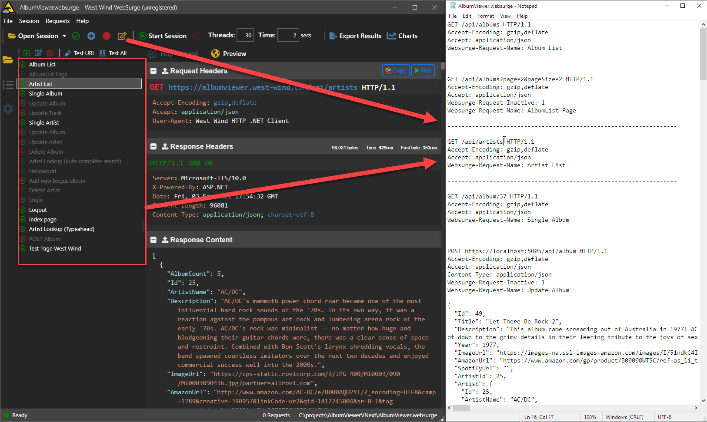
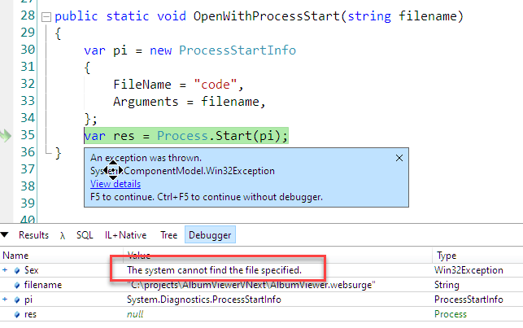
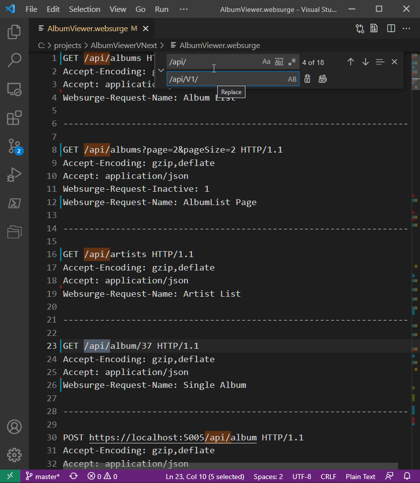
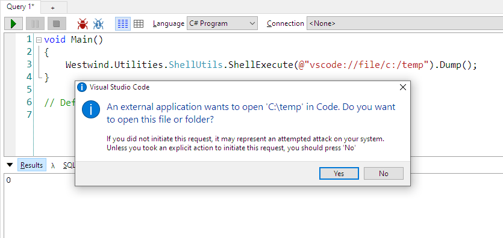

# Launching Visual Studio Code cleanly from a .NET Application

Visual Studio Code has pretty much become the de facto developer editor for most developers, so it's typically what developers want to see when reviewing any sort of code or text based content like code or logs. If you have an application that lets you edit or review code or text externally a common thing to do is shell out and launch an editor. In the past I've used `Notepad.exe` for this, because it's guaranteed to be present on a Windows machine. 

To set the stage, my first usage scenario of launching VS Code from an application is Windows specific, where I need to edit a text file externally as part of a larger application. *(I'll also cover Mac and x-platform later on)*

In [West Wind WebSurge](https://websurge.west-wind.com) which is an HTTP Request and Load Testing tool used mainly by developers, I allow for users to edit the raw session file that contains HTTP requests in plain text format, in addition to the app native session list. 



While editing in the session list in the app is more visually pleasant and interactive, if you need to do bulk updates to individual URLs or request data (say change a domain name or part of a URL) it's **much easier to do in a text editor** using **Find and Replace** than going through each individual entry in the application. Some devs also prefer to simply work with text than going through UI. The app automatically applies changes when you save the file reflecting the text changes back to the UI Session list.

In short, sometimes it's very useful to pop up an external editor and just edit text in raw form. 

## Editor, Editor on the Wall
As mentioned on Windows only I've used **Notepad** for popping up an editor, because it's guaranteed to be available for displaying or editing text content. It works, but you get none of the benefits of a full featured editor: No syntax coloring (if you use a 'known' format), advanced search and replace and text editing features, syntax completion etc. I admit that to me opening any file in Notepad instead of VS Code feels 'cave man'. Yechh.

**Visual Studio Code** has become so pervasive that you can almost assume it will be available on most developer machines. So wouldn't it be nice to launch Code instead of Notepad, when available and then fall back to a default solution like Notepad. Read on.

## VS Code Launcher - not so fast
It might seem pretty straight forward to launch Code, since it too installs on the global path and can run with:

```ps
PS> code \temp\test.md
```

just like Notepad does.

But if you try to use `code` or `code.exe` as a command name in `CreateProcess()` or via `Process.Start()` in .NET, you find that it doesn't work, as it's not actually found on the path. 

The following does not work:

```cs
var pi = new ProcessStartInfo
{	
	FileName = "code",
	Arguments = filename,
};

var res = Process.Start(pi);
```

and it results in:



Neither does using `code.exe` BTW, because that's not what `code` refers to.

## Launching VS Code the Right Way
The problem is the launcher is not a standard executable but an alias, and standard Windows `CreateProcess()` logic can't figure out how to launch it.

There are two ways around this:

* Using ShellExecute
* Specifying a full executable path

### Using Shell Execute
While native Win32 `CreateProcess()` has issues launching the global `code` command, using Win32 `ShellExecute` logic does work.

The following code works, but with a caveat:

```cs
var pi = new ProcessStartInfo
{
	UseShellExecute = true,  // IMPORTANT: This makes it work, sorta
	FileName = "code"
	Arguments = filename		
};
var res = Process.Start(pi);
```	

This launches code with the file in question opened. Yay! 



Here I'm opening the same file I used previously in NotePad, and I can use the search and replace functionality (including advanced options like RegEx).

But there's a caveat...

> #### @icon-info-circle Terminal Window Pop Up 
> The previous command works to pop up VS Code, but when the command runs **it briefly shows a command window instance** that flashes onto the screen and - usually - disappears. 
>
> This is because of the way the `code` command is hooked up in the shell which actually is launched through a `cmd` instance.

In order to fix this we need one more adjustment to this code by explicitly hiding the Window when the command is launched:

```cs
public static void OpenEditorWithShellExecute(string filename)
{
	var pi = new ProcessStartInfo
	{
		UseShellExecute = true,
		FileName = "code",
		Arguments = filename,
		// This hides the terminal window
		WindowStyle = ProcessWindowStyle.Hidden
	};
	
	try
	{
	    // fails if VS Code is not available
		Process.Start(pi);		
	}
	catch(Exception ex)
	{
		// fallback to Notepad
		pi.WindowStyle = ProcessWindowStyle.Normal;
		pi.FileName = "notepad.exe";
		Process.Start(pi);
	}
}
```	

And that works much more cleanly, launching without the annoying terminal window popping up.

This code also adds a fallback to `notepad.exe` if VS Code is not installed.

> #### @icon-info-circle Code uses a Singleton Window
> It should be noted that `code` launches individual files opened through ShellExecute in already open instances, if one is already open. It does not launch a brand new editor, unless Code is not yet running.
>  
> There are some exceptions to the Singleton mode:
> 
> * Running in elevated mode launches a new instance
> * Explicitly using command line options to launch a new window

### Explicitly Specifying the Executable
Another more explicit approach is to directly launch the `Code.exe` executable from its installed location. 

This is a bit more effort as you first have to figure if and where Visual Studio Code is installed. On Windows you can look in the registry or the common install path to find the location where Code is installed.

While the `code` launch command is an aliased command, there is an actual `Code.exe` that lives in the binary install  location, which by default is:

```text
%localappdata%\Programs\Microsoft VS Code\Code.exe
```

Informally you can check for the file there, but a more reliable way is to check the registry and the shell commands that register Code there.

Here's launch logic that checks for the file in the registry and falls back to `notepad.exe` if not found:

```cs
public static void OpenFileInTextEditor(string filename)
{
	string executable = "notepad.exe";
	var keyValue = Registry.ClassesRoot.OpenSubKey(@"Applications\Code.exe\shell\open\command")?.GetValue(null) as string;
	if (keyValue != null && keyValue.Contains("code.exe",StringComparison.InvariantCultureIgnoreCase))
	{
		executable = StringUtils.ExtractString(keyValue,@"""",@"""");		
	}
	var pi = new ProcessStartInfo
	{
		UseShellExecute = true,
		FileName = executable,
		Arguments = filename,		
	};
	var res = Process.Start(pi);	
}
```

This works too, but it's obviously very Windows specific with Registry checks and fallbacks to Notepad.

## What about on the Mac?
Both of the solutions above are Windows specific. On the Mac things are a bit more complicated because of its funky shell interface. 

There are two ways that you can launch VS Code in .NET.

### If VS Code is in your Path
If VS Code is on the Mac path, you can use the the `code` alias to launch simply with:

```cs
Process.Start("code", filename);
```

or 

```cs
var pi = new ProcessStartInfo
{
	UseShellExecute = true,
	FileName = "code",
	Arguments = filename,		
};
Process.Start(pi);	
```

Note that you have the use `UseShellExecute=true` **explicitly** as that's the only way that Mac programs will launch. Using `Process.Start()` ShellExecute apparently is the default (on Mac at least) so that also works.

This works great as long as `code` is on the path. My (fairly old original) VS Code install did not have `code` registered on the path, so the above didn't work until I explicitly installed the path in `~/.zprofile`:

```bash
# Add Visual Studio Code (code)
export PATH="\$PATH:/Applications/Visual Studio Code.app/Contents/Resources/app/bin"
```

I'm not sure if VS Code auto-installs this today or not.

### Generic Application Launch
If you don't want to rely on a PATH mapping, you can also launch VS Code by the application name using the `open` shell command. Thanks to [@robconery](https://twitter.com/robconery) who pointed out that you can launch an application using syntax like this:

```cs
Process.Start("open", $"-a \"Visual Studio Code\" \"{filename}\"")
```

or

```cs
var pi = new ProcessStartInfo
{
	UseShellExecute = true,
	FileName = "open",
	Arguments = $"-a \"Visual Studio Code\" \"{filename}\""
};
Process.Start(pi);
```

This works generically as well.


### CrossPlatform Scenario: Editor Startup in LiveReloadServer
Earlier I showed an example of popping up VS Code in a Windows only application. 

I have another application where I want to bring up VS Code this time for a generic tool that runs cross-platform and that opens a folder ready for editing.

This is for my [LiveReloadServer standalone, local Web Server](https://weblog.west-wind.com/posts/2021/Mar/23/LiveReloadServer-A-NET-Core-Based-Generic-Static-Web-Server-with-Live-Reload) which has an option to `-openEditor` switch to open an Editor in folder view to Web Root folder that's used for the Web site. I find it very useful to start up a site locally - in the browser, and in the editor all with one command.

In code the configuration for the Open Editor feature looks like this:

```csharp
/// <summary>
/// If true starts up the configured editor. Default editor is Vs Code
/// </summary>
public bool OpenEditor {get; set; } = false;

/// <summary>
/// Launch Command used to launch an editor when using -OpenEditor switch
/// </summary>
public string EditorLaunchCommand { get; set; } = 
    RuntimeInformation.IsOSPlatform(OSPlatform.OSX) ? 
        "open -a \"Visual Studio Code\" \"%1\"" :
        "code \"%1\"";
```

As you can see there are separate default commands used for Windows (and Linux) and Mac with Mac using the `open` command to launch code.

This command is then executed after server startup like this:

```csharp
if (ServerConfig.OpenEditor)
{
    string cmdLine = null;
    try
    {
        cmdLine = ServerConfig.EditorLaunchCommand.Replace("%1", ServerConfig.WebRoot);
        Westwind.Utilities.ShellUtils.ExecuteCommandLine(cmdLine);
    }
    catch (Exception ex)
    {
        ColorConsole.WriteError("Failed to launch editor with: " + cmdLine);
        ColorConsole.WriteError("-- " + ex.Message);
    }
}
```

`ExecuteCommandLine()` is a helper I use in applications where I let user specify command lines. A single command line is often easier to store and for users to provide, than multiple values for command and command line. This helper breaks out the command and arguments and then executes the appropriate bits.

```csharp
/// <summary>
/// Executes a Windows Command Line using Shell Execute as a
/// single command line with parameters. This method handles
/// parsing out the executable from the parameters.
/// </summary>
/// <param name="fullCommandLine">Full command line - Executable plus arguments. Recommend double quotes for best command parsing experience</param>
/// <param name="workingFolder">Optional - the folder the executable runs in. If not specified uses current folder.</param>
/// <param name="waitForExitMs">Optional - Number of milliseconds to wait for completion. 0 don't wait.</param>
/// <param name="verb">Optional - Shell verb to apply. Defaults to "Open"</param>
/// <param name="windowStyle">Optional - Windows style for the launched application. Default style is normal</param>
public static void ExecuteCommandLine(string fullCommandLine, 
    string workingFolder = null, 
    int waitForExitMs = 0, 
    string verb = "OPEN",
    ProcessWindowStyle windowStyle = ProcessWindowStyle.Normal,
    bool useShellExecute = true)
{
    string executable = fullCommandLine;
    string args = null;

    if (executable.StartsWith("\""))
    {
        int at = executable.IndexOf("\" ");
        if (at > 0)
        {         
            args = executable.Substring(at+1).Trim();
            executable = executable.Substring(0, at);
        }
    }
    else
    {
        int at = executable.IndexOf(" ");
        if (at > 0)
        {
 
            if (executable.Length > at +1)
                args = executable.Substring(at + 1).Trim();
            executable = executable.Substring(0, at);
        }
    }

    var pi = new ProcessStartInfo
    {
        Verb = verb,
        WindowStyle = windowStyle,
        FileName = executable,
        WorkingDirectory = workingFolder,
        Arguments = args,
        UseShellExecute = true
    };

    using (var p = Process.Start(pi))
    {
        if (waitForExitMs > 0)
        {
            if (!p.WaitForExit(waitForExitMs))
                throw new TimeoutException("Process failed to complete in time.");

        }
    }
}
```

By using this function I can use both the Windows and Mac command lines easily and preseed them with their platform specific values that can be easily overridden either via Command Line options or config file settings.

This works great in LiveReloadServer, which is shipped as a cross-platform Dotnet Tool.

## Another Option: Just use Filenames via ShellExecute
All the examples above are **specific to launching VS Code**. That works as long as you know VS Code is installed. On Windows you may be able to fall back to Notepad for editing as I showed in the examples, but Notepad doesn't have some features like the ability to open a folder view for example.

If you are mainly dealing with directly showing a file, and you're using standard format extensions that are mapped to a specific editor, you can use a simpler approach of simply using the OS mapping to pop up the appropriate editor.

If you're opening files that have been associated with an editor or VS Code specifically - like say a Markdown or CSharp file - you can simply use the filename with `Process.Start()`:

```cs
Process.Start("/temp/test.md");
```

This opens the document in the default editor. If VS Code is your default editor for Markdown files in this case VS Code opens. This works well for files, but obviously wouldn't work for a folder as that would open Explorer on Windows and Finder on the Mac.

This works fine and is often the best solution, **as long as you are using common file formats**.

But in both of the examples above this approach would not have worked for me: In **WebSurge** I needed to open `.websurge` files, which are mapped to the WebSurge application during installation, so Shell Execute wouldn't open an editor, but load another instance of WebSurge.

For **LiveReloadServer** I'm opening a folder, and that would open in Explorer or Finder, and again that would be the wrong action.  

So ShellExecute functionality is great if you are opening common file formats that have editor mappings, but it's not appropriate for uncommon file formats or folders.

### One more Thing: vscode:// Handler
There's yet one more thing that can be used to open VS code: The [`vs-code://` URL handler.](https://github.com/shengyou/vscode-handler) This is URL mapping in the OS that is installed when VS Code is installed (or can be added post-install via Registry settings on Windows or a custom Handler application in Applications on the Mac).

Using `Process.Start()` on Windows you can simply use the handler directly:

```cs
Process.Start("vscode://file/c:/temp/test.md")
```

Unfortunately on Windows invoking this `vscode://` Handler brings up a notification dialog:



On the Mac you can also use this handler, sans the dialog popping up, but the syntax is slightly different:

```cs
Process.Start("open","vscode://file/Users/MeAndMine/projects/LiveReloadServer/SampleSite")
```

Note in both cases you have to provide fully qualified filenames in proper URL format. For Windows this means **forward slashes for filenames**  and on the Mac it means no aliases for files (ie. `~/` won't resolve).

## Summary
VS Code is becoming so prevalent that it should be considered the Windows Default text editor, but since it is not a default installed application, if you want to integrate with it for opening text or other supported files, it takes a little extra effort to ensure that you can launch VS Code from your application.

Launching VS Code on Windows and Mac is decidedly different, so you can either use platform specific logic (via `RuntimeInformation.IsOsPlatform()`) or use a wrapper like my `ExecuteCommandLine()` helper.

There are quite a few choices on how you can launch VS Code. Using direct executable invocation, using the open command, using the protocol handler and more. Unfortunately, there doesn't appear to be a single, cross-platform way to do it for all environments, so you'll likely have to have OS specific logic that handles each platform specifically.

No rest for the wicked I guess - it's never as easy as it should be...

## Resources

* [Launch Samples in a Gist](https://gist.github.com/RickStrahl/38b2072c210c402e1ed919692ad1f56c)
* [Visual Studio Code](https://code.visualstudio.com/)
* [Live Reload Web Server](https://github.com/RickStrahl/LiveReloadServer)
* [West Wind Web Surge](https://websurge.west-wind.com/)

<div style="margin-top: 30px;font-size: 0.8em;
            border-top: 1px solid #eee;padding-top: 8px;">
    
    this post created and published with the 
    <a href="https://markdownmonster.west-wind.com" 
       target="top">Markdown Monster Editor</a> 
</div>