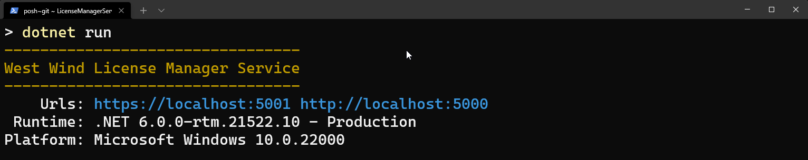
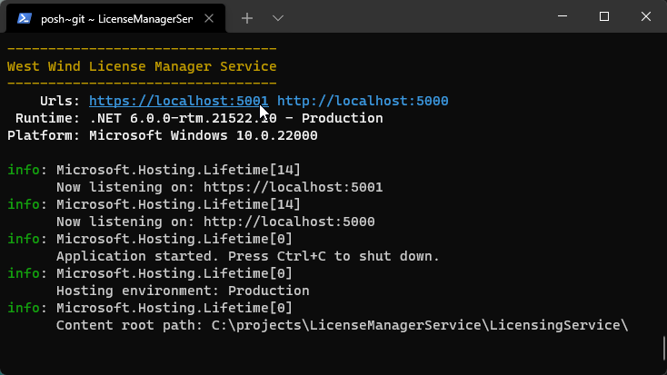
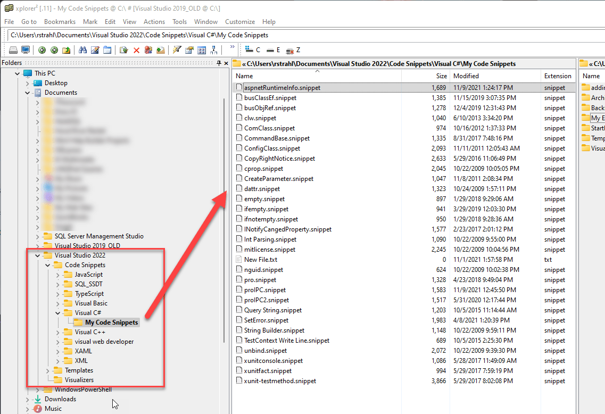

# Back to Basics: Add an ASP.NET Runtime Information Banner



For every .NET Core Console/Web application that I run, I add a little startup banner at the bottom of the startup code to provide basic runtime information about the application starting up. This is useful so I can see at a glance what I'm running. This seems obvious, but sometimes it's actually not and having the banner there makes sure I can see that I'm running on the right runtime and - more importantly - in the Environment configuration  - `Production` or `Development` - I'm expecting.

In some scenarios `dotnet run` in provides this info, but it depends on how you start the application, and **I really want to see this information every time the application starts**.

The things I want to know specifically are:

* **.NET Runtime Version**  
This seems silly, but can be important. Ensures that you are actually running on the runtime that you're expecting to be on. It's also a quick way to see which runtime is installed on a given machine for the application running.

* **Startup Environment**
This is actually the most important bit of information. I can't tell you how many times - especially on a dev machine - I've started up an application accidentally in **Development** when I expected it to be running in **Production** mode.

* **Operating System**  
This is not critical but useful in some scenarios where you're perhaps looking at a startup log for an application running on some service. You'd want to know what version of the OS your service is hosted on.

* **Binding URLs**  
This is useful during development, as a quick clickable link to startup a browser. I find this useful in API projects where I usually have `launchBrowser=false` in `launchSettings.json`, but when I manually want to hit a URL or status page on the site. A lot of times I don't want the browser to auto-start (especially when running with browser refresh/hot reload) and end up with 20 open browser windows from each launch. This is a quick way to launch a browser when **I want it to**.

* **Other Application Specific Information**  
Some other information you might want to add in addition to this generic data, might be some application specific information such as the application's version number, which connection(s) Ids are used etc. but that will be specific to each application, so I won't discuss it here.

So here's what a simple startup banner with the basic information looks like in my apps typically:



Obviously nothing ground breaking here, but still quite useful.  Note that in Windows Terminal and most non-Windows specialty terminals the links are clickable to open the local Web site.

## Gathering Runtime Information in .NET 6.0
If you're using .NET 6.0 and specifically the new minimal API startup that uses a single `program.cs` file for both service and application configuration you'll find that the base objects that previously had to be injected into the `Configure()` method are now available either on the `builder` or `app` instance.

The key is in order to get the Urls reliably you have to do it after the server has started and the Urls have been assigned. This means you can't use `app.Run()` which combines `app.Start()` and `app.WaitForShutdown()` into a single command. 

Instead you have to use these two commands explicitly and put the Url retrieval between these two in `program.cs`:

```cs
using System.Runtime.InteropServices;

...

app = builder.Build();

... 

// Can't use app.Run() to get Urls reliably
app.Start();

// this code can go anywhere after `app` is created...
Console.ForegroundColor = ConsoleColor.DarkYellow;
Console.WriteLine($@"---------------------------------
West Wind License Manager Service
---------------------------------");
Console.ResetColor();

var urlList = app.Urls;
string urls = string.Join(" ", urlList); // clickable

Console.Write($"    Urls: ");
Console.ForegroundColor = ConsoleColor.DarkCyan;
Console.WriteLine(urls, ConsoleColor.DarkCyan);
Console.ResetColor();

Console.WriteLine($" Runtime: {RuntimeInformation.FrameworkDescription} - {app.Environment.EnvironmentName}");
Console.WriteLine($"Platform: {RuntimeInformation.OSDescription}");
Console.WriteLine();

// no app.Run() so wait explicitly
app.WaitForShutDown();
```

Notice that in 6.0 the builder and app objects host many common *'system'* components that previously had to be injected. Specifically things like  `builder.Host`, `builder.WebHost`, `builder.Environment`, `app.Configuration`, `app.Lifetime` all live as properties on these objects.

> If you need to get access to Dependency Injection you can still use `app.Services` explicitly to retrieve resolved services that's similar the old `Configure()` injection behavior. Use `builder.Services` to add services and `app.Services` to retrieve resolved services after `builder.Build()` has been called.

The `RuntimeInformation` has a lot of useful information about the platform you're running on. So glad this has been added (I think in 3.1) as it was a royal pain to get this information prior.


## Create a Visual Studio Snippet
Since I want to add this type of banner to all of my Console applications, I also created a Visual Studio Snippet for it that can inject it into my startup code with a `aspnetRuntimeInfo` snippet:

```xml
<?xml version="1.0" encoding="utf-8"?>
<CodeSnippets xmlns="http://schemas.microsoft.com/VisualStudio/2005/CodeSnippet">
  <CodeSnippet Format="1.0.0">
    <Header>
      <Title>aspnetRuntimeInfo5</Title>
      <Author>Westwind Technologies</Author>
      <Description>Shortcut to add runtime startup info to the .NET app on the Console</Description>
      <HelpUrl />
      <SnippetTypes/>
      <Keywords />
      <Shortcut>aspnetRuntimeInfo5</Shortcut>
    </Header>
    <Snippet>
      <References />
      <Imports />
      <Declarations>
        <Literal Editable="true">
          <ID>AppName</ID>
          <Type />
          <ToolTip>Application </ToolTip>
          <Default>AppName</Default>
          <Function />
        </Literal>
      </Declarations>
      <Code Language="csharp" Kind="" Delimiter="$"><![CDATA[Console.ForegroundColor = ConsoleColor.DarkYellow;
Console.WriteLine($$@"---------------------------------
$AppName$
---------------------------------");
Console.ResetColor();

// Make sure to put this code between app.Start() and app.WaitForShutdown()
var urlList = app.Urls;
string urls = string.Join(" ", urlList); // clickable

Console.Write($$"    Urls: ");
Console.ForegroundColor = ConsoleColor.DarkCyan;
Console.WriteLine($$"{urls}", ConsoleColor.DarkCyan);
Console.ResetColor();

Console.WriteLine($$" Runtime: {RuntimeInformation.FrameworkDescription} - {app.Environment.EnvironmentName}");
Console.WriteLine($$"Platform: {RuntimeInformation.OSDescription}");
Console.WriteLine();
]]></Code>
    </Snippet>
    <Imports>
        <Import>
          <Namespace>System.Runtime.InteropServices</Namespace>
        </Import>
      </Imports>
  </CodeSnippet>
</CodeSnippets>
```

> #### Snippet Location
> Visual Studio C# Snippets are user definable XML files and are stored at:
>
> `Documents\Visual Studio 2022\Code Snippets\Visual C#\My Code Snippets`
>
> 
>
> by default. You can copy the files for each version of Visual Studio forward (or backwards). If you need to use snippets in VS Code (or Rider) [I built a Visual Studio Snippet converter](https://weblog.west-wind.com/posts/2019/Jan/14/A-Visual-Studio-to-Visual-Studio-Code-Snippet-Converter) some time ago that lets you move them to those environments.

With the snippet installed in the Snippets folder, I can just get this code injected by typing `aspnetRuntimeInfo` or using `Ctrl-K-X` and choosing the snippet from the Snippet Manager:


## Summary
Nothing too exciting here, but useful to me since I add this practically to every Console started project, so I figure some of you might find this useful as well, with hunting down the individual configuration settings each time. This posts serves as my bookmark in case I forget about the Snippet :smile:


<div style="margin-top: 30px;font-size: 0.8em;
            border-top: 1px solid #eee;padding-top: 8px;">
    
    this post created and published with the 
    <a href="https://markdownmonster.west-wind.com" 
       target="top">Markdown Monster Editor</a> 
</div>