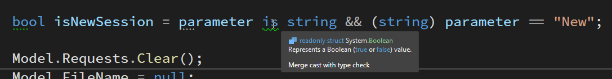

# Discovering new C# String Pattern Matching Features


I admit it: I haven't been a heavy user of the new pattern matching features in C# 8+. For the most part the terse syntax of many patterns to my eye often are actually harder to read and parse, even if they do take a few less keystrokes. When that's the case it's not a great trade-off to me. Easier readability always trumps less keystrokes in my book. 

That said there are a number of patterns that I've come to use quite a lot especially the type casting ones related to `is` `as` and `null` related functionality.

And then, once in a while a ReSharper or Rider Refactoring Suggestion **digs up a gem that I didn't even know about**. And yesterday one of those came up regarding string pattern matching.

### Casting, Strings and Null Checking
For real world context, I've been working on a simple bit of code that's inside of a WPF `Command` object, that handles a conditional operation in [WebSurge](https://websurge.west-wind.com/). It handles closing of open sessions which in effect can double also as creating a new session. Being a command, a parameter can be passed in to differentiate between closing and new operations by passing a string value of `"New"`. Basic stuff.

```cs   
public CommandBase CloseSessionCommand => {
{
    CloseSessionCommand = new CommandBase((object parameter, ICommand command) =>
    {
        bool isNewSession = parameter is string && (string) parameter == "New";
        
        Model.Requests.Clear();
        Model.FileName = null;
        Model.Configuration.LastFileName = null;
        Model.Commands.Session.NewRequestCommand.Execute(null);

        if (!isNewSession)
            Model.Window.Statusbar.ShowStatusSuccess("Session closed.");
        else
            Model.Window.Statusbar.ShowStatusSuccess("New Session opened..");
        Model.OnPropertyChanged(nameof(AppModel.Title));

    }, (p, c) => true);
}
```

Note that the parameter comes in as type `object` and thus can't be directly used as string and has to be cast in some way.

The code in question is this:



This code works just fine, of course and has since - well forever.

But notice that ReSharper is flagging the `is` for a suggested Refactoring. 

This particular Refactor suggests merging the type check with the assignment using the `is` assignment pattern which results in:


While this is a useful string Refactoring that merges the type check and assignment into a single statement which is useful in many scenarios, here it just feels like it makes the expression more complex than the original introducing another variable.

But wait, there's more: As you see in the image the `&&` is flagged for another Refactoring to merge assignment and comparison:


Whoa, that one was new to me! I had no idea you can a) use `and` and `or` in pattern statements for Boolean evaluation. Nor that you can do a comparison as part of the type pattern assignment. This definitely cleans the code up and makes it more readable - especially from the original refactored version.

But we're still not done. Although ReSharper doesn't catch this you can actually simplify this even more to simply:

```cs
bool isNewSession = parameter is "New";
```

This rolls up the type cast, null checking and string comparison into a single `is` statement. Yeah - that's one pattern I can get behind. 

This can be taken even one step further in that you can use `or` to add additional matches typed and chained matches:

```cs
bool isNewSession = parameter is "New" or "Close";
```

How clean is that?

## Pattern me this
Although I said at the outset that I'm not a big fan of a lot of the pattern matching tersification, the various null checking, string assignment and comparison features like this one definitely are a winner for me and I use them quite a bit. And I'll definitely be using this particular combination of comparison castings more in the future.

The type casting, null checking and comparison patterns provide both better readability and as a bonus save a few keystrokes too without falling into the *too-terse* trap. Win Win.

## Learning by Tooling
Apparently I'm not the only one who's slow on the uptake of C# Patterns and who's discovering them via Refactorings in ReSharper, Rider and Visual Studio more or less **by accident** :smile:. 

[Fillip](https://twitter.com/filip_woj) had a great and very true for me comment to my original Tweet of my 'discovery':

[](https://twitter.com/filip_woj/status/1456178146831646720)

Learn by tooling! Yeah, I think as of late that definitely describes how I learn about new features as old school comprehensive books or documentation are not really a thing anymore. And it works as you learn by doing. Great point and something we should really appreciate that tooling does for us!

As an anecdote I have a hard time just reading about patterns and correlating them to my own code. While I see and understand it, I rarely 'see it in my mind' when I'm coding. This is why 'Crutch by ReSharper' (or Rider) is so useful.

## Resources 
If you want to see a few more of the variations of this pattern, the C# docs have more examples of it  and various `is`, `is not` and assignment  comparisons.  Pretty cool:

* [Pattern Matching Enhancement in C# 9.0](https://docs.microsoft.com/en-us/dotnet/csharp/whats-new/csharp-9#pattern-matching-enhancements)


* [ReSharper](https://www.jetbrains.com/resharper/)

<div style="margin-top: 30px;font-size: 0.8em;
            border-top: 1px solid #eee;padding-top: 8px;">
    
    this post created and published with the 
    <a href="https://markdownmonster.west-wind.com" 
       target="top">Markdown Monster Editor</a> 
</div>