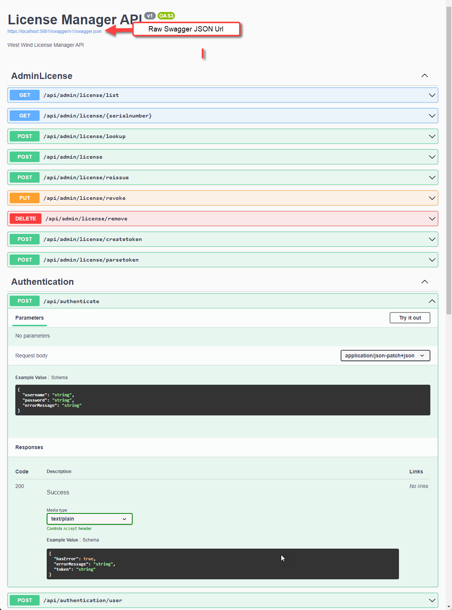

# Working with Swagger/OpenAPI on Server and Client in .NET

I've been working on Swagger/OpenAPI integration in West [West Wind WebSurge](https://websurge.west-wind.com/) which is an Http Request and Load testing tool. One much requested feature has been to add support for importing Http requests from Swagger or OpenAPI definitions to make API testing easier.

The end result of this looks like this:


When I started this journey though, it took a bit of time to get the pieces together for both the client and server sides with Swagger and OpenAPI integration in .NET. This post isn't meant to be a comprehensive introduction or review, but rather talk about some of the fundamental things you need to know to use these tools in .NET both on client and server since the documentation and information on all of this is scatter all over the place and hard to piece together. This is my attempt to make this a little more organized and - where appropriate - point at the relevant resources.

## Swagger and OpenAPI 
Swagger and OpenAPI are evolutions of the the same tooling. Swagger was the original name of a tool that produced API documentation, and it eventually evolved into a more formal name of OpenAPI that is 

## Enabling in ASP.NET Core


### Enable Swagger in your Startup configuration
You need to als

```cs
services.AddControllers();

builder.Services.AddEndpointsApiExplorer();
builder.Services.AddSwaggerGen(options =>
{
    options.SwaggerDoc("v1", new OpenApiInfo
    {
        Version = "v1",
        Title = "License Manager API",
        Description = "West Wind License Manager API",
        //TermsOfService = new Uri("https://example.com/terms"),
        //Contact = new OpenApiContact
        //{
        //    Name = "Example Contact",
        //    Url = new Uri("https://example.com/contact")
        //},
        //License = new OpenApiLicense
        //{
        //    Name = "Example License",
        //    Url = new Uri("https://example.com/license")
        //}
    });
});
```

The basic output for Swagger - even without any special consideration for API endpoints via XML documentation or extra attributes is pretty useful:




### Enable XML Documentation
If you want to add more meta data to the Swagger view, you can do via attributes and XML Documentation comments. You can add descriptions, response codes and more via docs. 

To do this enable XML Documentation in your project:

```xml
<PropertyGroup>
   <GenerateDocumentationFile>True</GenerateDocumentationFile>
</PropertyGroup>
```

And then tell the swagger configuration to use that documentation.

```cs
builder.Services.AddEndpointsApiExplorer();
builder.Services.AddSwaggerGen(options =>
{
    options.SwaggerDoc("v1", new OpenApiInfo
    {
        Version = "v1",
        Title = "License Manager API",
        Description = "West Wind License Manager API",
    });

	// Add XML Documentation
    var filePath = Path.Combine(System.AppContext.BaseDirectory, "LicensingService.xml");
    options.IncludeXmlComments(filePath);
});
```
  
### Add XML Comments to Controller Actions or Endpoint Methods
There are a few things that XML comments can do:

* Provide endpoint description
* Provide information about each poossible response status code 

Here's an example:

```cs
/// <summary>
/// Authenticates a user and returns a service token by username and password
/// </summary>
/// <returns></returns>
/// <response code="200">Authentication succeeded</response>
/// <response code="401">Invalid or missing credentials</response>
[HttpPost, Route("/api/authenticate")]
[Produces("application/json")]
public AuthenticationResult Authenticate([FromBody] AuthUser user)
```

## Protecting Swagger Documentation Access

```cs
// other endpoint managers
app.MapControllers();
app.MapRazorPages();


// check authentication
app.Use(async (context, next) =>
{
    var path = context.Request.Path;
    if (path.Value.Contains("/swagger/", StringComparison.OrdinalIgnoreCase))
    {
        if (!context.User.Identity.IsAuthenticated)
        {
            //context.Response.StatusCode = 401;
            //await context.Response.WriteAsync("Unauthorized");
            
            context.Response.Redirect("/account/login");
            return;
        }
    }

    await next();
});

app.UseSwagger();
app.UseSwaggerUI();
```

## Client Side Consumption - OpenAPI.NET


## References

* [Swagger Documentation](https://docs.microsoft.com/en-us/aspnet/core/tutorials/getting-started-with-swashbuckle?view=aspnetcore-6.0&tabs=visual-studio)
