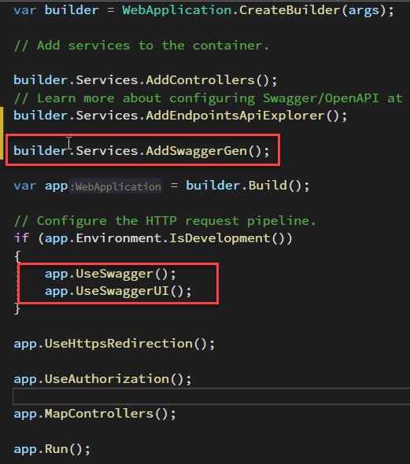
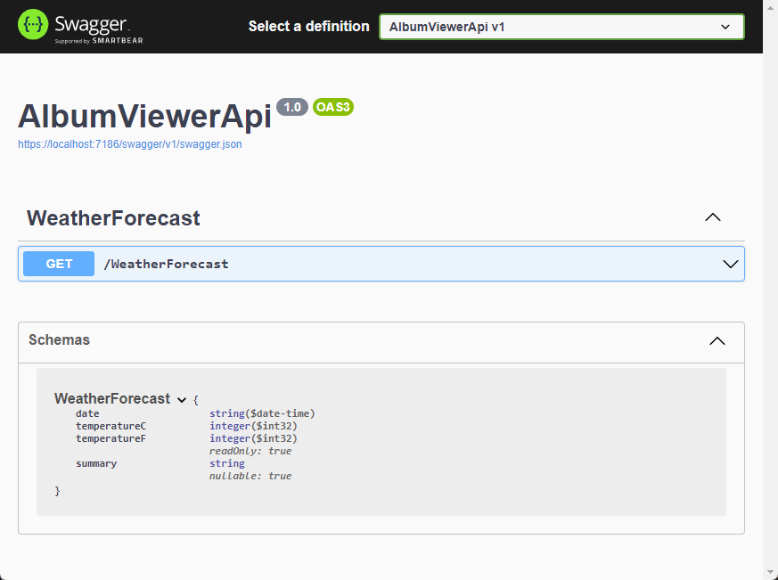
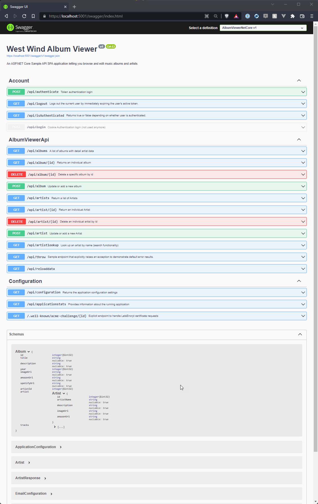

# Working with Swagger/OpenAPI on the Server and Client in .NET

I've been working on Swagger/OpenAPI integration in West [West Wind WebSurge](https://websurge.west-wind.com/) which is a Http REST Client and Load testing tool for Windows. One much requested feature has been to add support for importing Http requests from Swagger or OpenAPI definitions to make API testing easier.

The end result in WebSurge looks like this:


When I started this journey though, it took a bit of time to get the pieces together for both the client and server sides with Swagger and OpenAPI integration in .NET. In fact in the past I had issues with even setting up Swagger support in ASP.NET Core applications.

This post isn't meant to be a comprehensive introduction or review, but rather talk about some of the fundamental things you need to know to use these tools in .NET both on client and server since the documentation and information on all of this are scattered all over the place and hard to piece together. This is my attempt to make this a little more organized and - where appropriate - point at the relevant resources.

## Swagger and OpenAPI 
**Swagger** and **OpenAPI** are an evolution of the the same tooling. **Swagger** was the original name of a tool that produced API documentation, and it eventually evolved into a more formal name of **OpenAPI** that is now in much more wide use for many tools and different platforms. Think of **Swagger** as an early adopter brand while **OpenAPI** is a public standard.

## Swagger and OpenAPI on ASP.NET Core
ASP.NET Core has support for OpenAPI integration out of the box as of v3.1. Today it's easy to add into a project via a checkbox option, when you create a new API project to 'automatically' add Swagger support to the project when the project is created. This gives you the basics but you'll likely need to expand on that generated code to make the integration actually useful.

### Adding OpenAPI/Swagger to a new ASP.NET Project
When you create a new ASP.NET API project there's a checkbox in the API project dialog that lets you add OpenAPI support:


When you create a base project with this flag the default code that gets generated into the project looks like this:



Seems odd that this gets generated for debug mode only, but that's easy enough to change. More likely you have open access to the API definition on a public API, or - for internal use - secured by authentication. More on that later.

For a new project that creates the default `WeatherService` endpoint, you can go to the Swagger endpoint at:

https://localhost:5000/swagger/index.html

and get this default output:



The Swagger integration does the following:

* Runs through all API controllers (or minimal APIs) 
* Lists all endpoints for each HTTP Verb
* Picks up input and output parameters
* shows all associated type structures
* Optionally picks up XML documentation

Even with this simple default WeatherService 'API' with one GET request we can see the endpoint and the associated result type in a relatively nicely formatted display.

### A little bit more work for Real Projects
It's cool that this sort of base integration is provided out of the box, but for most applications you need to add a bit more configuration to make this actually useful.

Most applications will at minimum want to add:

* Service Title and Description
* Version number
* XML Documentation for endpoints

### A more involved Sample Application
To add OpenAPI/Swagger support in my sample [AlbumViewer Application's startup file](https://github.com/RickStrahl/AlbumViewerVNext/blob/master/src/AlbumViewerNetCore/Program.cs) looks like this:

```cs
services.AddControllers(...);

builder.Services.AddSwaggerGen(options =>
{
    options.SwaggerDoc("v1", new OpenAPIInfo
    {
        Version = "v1",
        Title = "West Wind Album Viewer",
        Description = "An ASP.NET Core Sample API SPA application letting you browse and edit music albums and artists.",
        //TermsOfService = new Uri("https://example.com/terms"),
        //Contact = new OpenAPIContact
        //{
        //    Name = "Example Contact",
        //    Url = new Uri("https://example.com/contact")
        //},
        //License = new OpenAPILicense
        //{
        //    Name = "Example License",
        //    Url = new Uri("https://example.com/license")
        //}
    });

    var filePath = Path.Combine(System.AppContext.BaseDirectory, "AlbumViewerNetCore.xml");
    options.IncludeXmlComments(filePath);
});

...

// allow open access
if (true)  // (app.Environment.IsDevelopment()) 
{
    app.UseSwagger();
    app.UseSwaggerUI();
}
```

This is what this looks like for this relatively small API application:



As you can see you now have the XML documentation pulled in. Each Controller gets its own section in the documentation and each of the input and output types are listed on the bottom of the list.

You can also drill in and see more detailed information about the request inputs and outputs. You can even **test individual requests** from here, although it requires you to repetitively enter test data each time. 

Still it's pretty cool that you get all of this for very little effort:


### Enable XML Documentation
The example above uses XML documentation which may or may not be useful depending on how meticulous you are documenting your APIs. Prior to using Swagger support I probably wouldn't have spent any time adding XML comments to my APIs, but if your API is going to be actually used externally as an API and this documentation is used to provide basic usage information, then the descriptive documentation is a must.

If you want to add more meta data to the Swagger view, you can do via attributes and XML Documentation comments. You can add descriptions, response codes and more via docs. 

To do this enable XML Documentation in your project:

```xml
<PropertyGroup>
   <GenerateDocumentationFile>True</GenerateDocumentationFile>
</PropertyGroup>
```

And then tell the swagger configuration to use that documentation.

```cs
builder.Services.AddEndpointsApiExplorer();
builder.Services.AddSwaggerGen(options =>
{
    options.SwaggerDoc("v1", new OpenAPIInfo
    { ... });

	// Add XML Documentation
    var filePath = Path.Combine(System.AppContext.BaseDirectory, "AlbumViewerNetCore.xml");
    options.IncludeXmlComments(filePath);
});
```
Note that you have to explicitly provide a file path which is typically in the application's startup folder using the project's name (ie. `projectName.xml`). You can get that base folder easiestt with the newish `System.AppContext.BaseDirectory` static property.
  
### Add XML Comments to Controller Actions or Endpoint Methods
There are a few things that XML comments can do:

* Provide endpoint description
* Provide information about each possible response status code 

Here's an example:

```csharp
/// <summary>
/// Authenticates a user and returns a service token by username and password
/// </summary>
/// <param name="loginUser">A user structure with username and password properties</param>
/// <returns>result with token and tokenExpiration properties </returns>
/// <response code="200">Authenticated</response>
/// <response code="401">Invalid or missing credentials</response>
[AllowAnonymous]
[HttpPost]
[Route("api/authenticate")]
public async Task<AuthenticationResult> Authenticate([FromBody] User loginUser)
{
    var user = await accountBus.AuthenticateAndLoadUser(loginUser.Username, loginUser.Password);
    if (user == null)
        throw new ApiException("Invalid Login Credentials", 401);
    
    ...
    
    return { ... };  // 200 success
}
```

Note that I can specify specific responses that the service is expected to return in this case success `200` or unauthenticated `401`. I suppose every request can potentially also be a `500` general failure, but I tend to provide only 'expected' responses.

If the only expected response is a `200` then I prefer to not provide any explicit documentation - only if there are multiple choices that are not universal.

### Protecting Swagger Documentation Access
If your API isn't open access you need to protect the OpenAPI url from general access through authentication. If you have an API that can be a bit tricky because API's typically use JWT Bearer Token authentication, while the Swagger endpoint isn't an API that you can easily pass a token to in a browser Http request.

To make this work you have to actually enable dual authentication modes for both Cookie and JWT Authentication - plus you need to have a way to authenticate users adding both a token and a cookie.

As is often the case non-standard authentication scenarios can be really finicky and this use case is no exception.

My initial idea was to just create a custom `app.Use()` handler and check for authentication like this:

```cs
app.UseAuthentication();
app.UseAuthorization();

// check Swagger authentication
app.Use(async (context, next) =>
{
    var path = context.Request.Path;
    if (path.Value.Contains("/swagger/", StringComparison.OrdinalIgnoreCase))
    {
        if (!context.User.Identity.IsAuthenticated)
        {
            context.Response.Redirect("/login");
            return;
        }
    }

    await next();
});

// endpoint handler terminates and allows for catch-all middleware below
app.UseEndpoints(app =>
{
    app.MapControllers();
});

app.UseSwagger();
app.UseSwaggerUI();
```


The problem is with a SPA application this:

```cs
if (!context.User.Identity.IsAuthenticated)
```

will never be true for the `/swagger/` endpoint because it doesn't have a Bearer token in the header.

So in order for this to work I need:

* Use both Cookie and JWT Authentication
* When logging into the SPA App return both JWT token **and** set a Cookie

#### Setting up Cookie and JWT Authentication
The hardest part in this process is - as per usual - the Authentication configuration. ASP.NET Core supports multiple authentication schemes simultaneously. The configuration for this is finicky and I had a real hard time making this work initially due to **order of the two schemes**. 

The code for both Cookie and JWT authentication configuration looks like this:

```csharp
services.AddAuthentication(CookieAuthenticationDefaults.AuthenticationScheme) // JwtBearerDefaults.AuthenticationScheme)
    .AddCookie(options =>
    {
        options.LoginPath = "/login";
        options.ExpireTimeSpan = TimeSpan.FromDays(1);
    })
    .AddJwtBearer(options =>
    {
        options.TokenValidationParameters = new TokenValidationParameters
        {
            ValidateIssuer = true,
            ValidIssuer = config.JwtToken.Issuer,
            ValidateAudience = true,
            ValidAudience = config.JwtToken.Audience,
            ValidateIssuerSigningKey = true,
            IssuerSigningKey = new SymmetricSecurityKey(Encoding.UTF8.GetBytes(config.JwtToken.SigningKey))
        };

    });
services.AddAuthorization(options =>
{
    var defaultAuthorizationPolicyBuilder =
        new AuthorizationPolicyBuilder(CookieAuthenticationDefaults.AuthenticationScheme, JwtBearerDefaults.AuthenticationScheme);
    defaultAuthorizationPolicyBuilder = defaultAuthorizationPolicyBuilder.RequireAuthenticatedUser();
    options.DefaultPolicy = defaultAuthorizationPolicyBuilder.Build();
});

...

var app = builder.Build();

...

app.UseAuthentication();
app.UseAuthorization
```

> It's vitally important that you **set up Cookie Authentication as the default authentication scheme**! Using JWT as the default scheme does not work!

#### Authenticating both Cookies and JWT
In order for authentication to work both for the Swagger Url and the SPA requests both a token needs to be returned to the client and an Auth cookie set which is then applied to the browser that eventually needs to access the `/swagger/` URL that is to be protected.

The authentication code looks like this:

```csharp
[AllowAnonymous]
[HttpPost]
[Route("api/authenticate")]
public async Task<object> Authenticate([FromBody] User loginUser)
{
    var user = await accountRepo.AuthenticateAndLoadUser(loginUser.Username, loginUser.Password);
    if (user == null)
        throw new ApiException("Invalid Login Credentials", 401);

    // create a state object we can serialize as a single claim
    var UserState = new UserState();

    // track user state through our claim
    UserState.UserIdInt = user.Id;
    UserState.Name = user.Fullname;
    UserState.Email = user.Username;

    // create a new token with token helper and add our claim
    var token = JwtHelper.GetJwtToken(
        user.Username,
        Configuration.JwtToken.SigningKey,
        Configuration.JwtToken.Issuer,
        Configuration.JwtToken.Audience,
        TimeSpan.FromMinutes(Configuration.JwtToken.TokenTimeoutMinutes),
        new[]
        {
            new Claim("UserState", UserState.ToString())
        });


    // also add cookie auth for Swagger Access
    var identity = new ClaimsIdentity(CookieAuthenticationDefaults.AuthenticationScheme, ClaimTypes.Name, ClaimTypes.Role);
    identity.AddClaim(new Claim(ClaimTypes.NameIdentifier, user.Username));
    identity.AddClaim(new Claim(ClaimTypes.Name, user.Username));
    var principal = new ClaimsPrincipal(identity);
    await HttpContext.SignInAsync(
        CookieAuthenticationDefaults.AuthenticationScheme,
        principal,
        new AuthenticationProperties
        {
            IsPersistent = true,
            AllowRefresh = true,
            ExpiresUtc = DateTime.UtcNow.AddDays(1)
        });

    return new
    {
        token = new JwtSecurityTokenHandler().WriteToken(token),
        expires = token.ValidTo,
        displayName = user.Fullname
    };
}
```

If you're new to JWT token creation I have [another post that goes into more detail](https://weblog.west-wind.com/posts/2021/Mar/09/Role-based-JWT-Tokens-in-ASPNET-Core#authenticating-users-using-an-web-api-endpoint) along with the `JwtHelper` class used to make it easier to create the token. 

As you can see the code above creates both a token that's returned to the client as well as setting a cookie via `HttpContext.SignInAsync()`. Once signed in, the `app.Use()` request now can see the user as authenticated and the user can then access the `/swagger/` Url.


## Client Side Consumption - OpenAPI.NET


## References

* [Swagger Documentation](https://docs.microsoft.com/en-us/aspnet/core/tutorials/getting-started-with-swashbuckle?view=aspnetcore-6.0&tabs=visual-studio)
* [ASP.NET Authentication with multiple Auth Schemes](https://docs.microsoft.com/en-us/aspnet/core/security/authorization/limitingidentitybyscheme?view=aspnetcore-6.0#use-multiple-authentication-schemes)