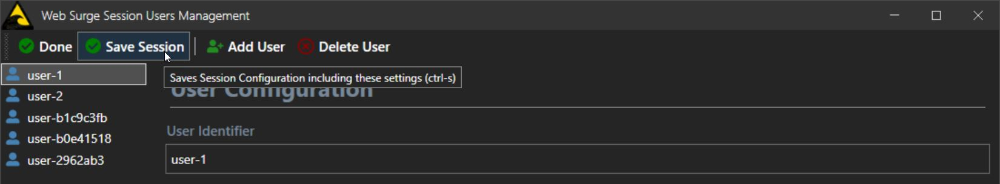
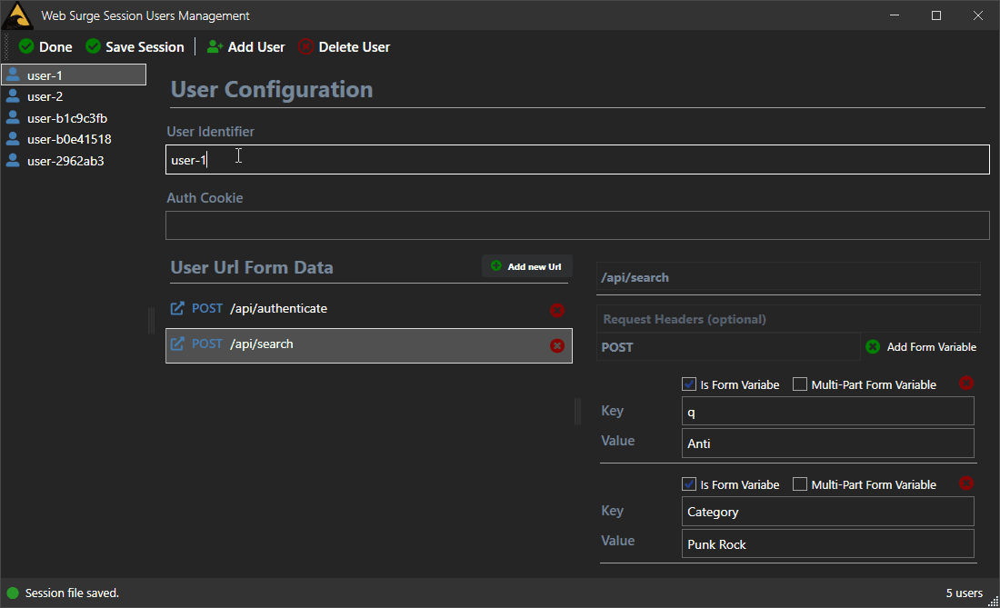
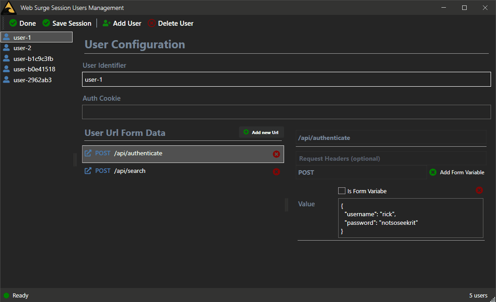
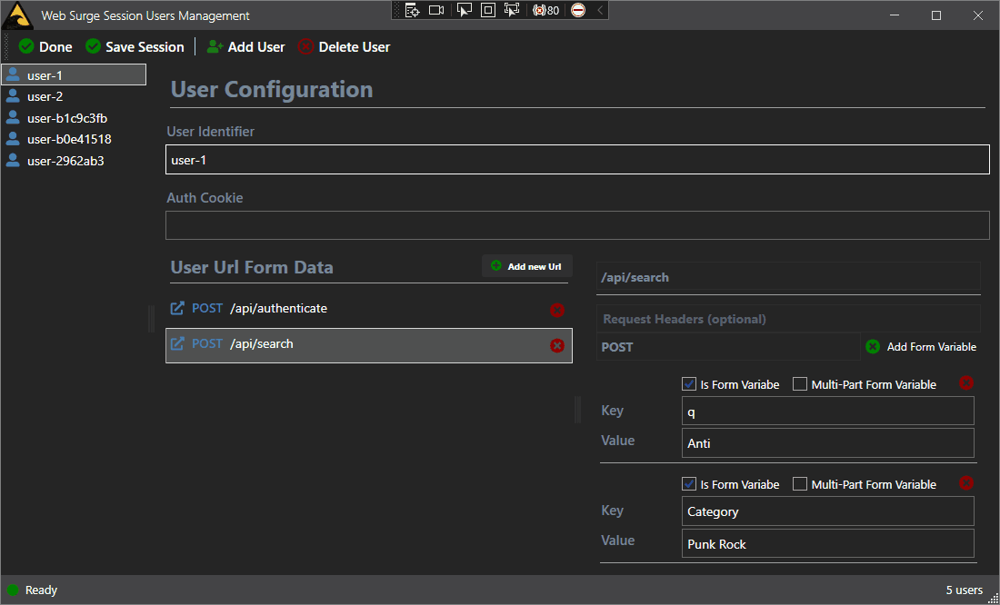

# Fixing Windows Control Focus on Toolbar and Menu Controls



When building Windows desktop applications with any sort of data binding - regardless of whether you use WPF, WinForms, UWP or heck even Visual Basic or Visual FoxPro - you are likely to eventually run into a nasty issue  around the failure of Menu and Toolbar controls to shift focus away from the active control. If you're using any sort of data binding that assigns values when focus changes - as most data binders do - you can find that you lose the last changed value in an input field. 

The typical scenario is that you have a Save operation on a toolbar and/or menu and when you save in the control's event or command operation,  the active control's value doesn't make it into the saved data. That's a major fail but one that may not bite you right away because everything seems to work fine **until you make a change in the active control and don't change focus before the Menu/Toolbar save operation**. Arrgh!

This is a nasty issue because it often goes undetected until a bit later - usually when someone actually starts using the application and notices that 'data was lost'.

> #### @icon-info-circle Applies to DataBinding Only
> To be clear, this behavior is related to data binding or data binders which typically rely on controls losing focus to bind the control's data to the underlying data source.  
>
> If you are **manually unbinding values directly from an input field**, then this behavior does not apply as you are explicitly retrieving the input state from the control.

## Failure to Communicate
To sum up when this fails here is a more explicit description of steps that usually lead to this:

* You're using data binding to bind control data to a data source
* You make a bunch of control input changes on a form
* Now you make one last change in an input control
* But you don't tab/click off yet...
* You then save by:
	* Clicking on a Toolbar Button
	* Clicking a Menu Button
	* Using a hotkey bound to the above
	* Using a hotkey bound to a KeyBinding

If you do this what you are very likely to see is the following:

* Changes made to all input controls save correctly
* **Except** for the actively focused control if you haven't navigated off

Alternately, if you repeat the operations above, but for the last steps you first move off the last changed control and then click the toolbar/menu button - then the data saves correctly. 

The problem occurs only if you:

* Make a change to a control
* Don't lose focus
* Save via Toolbar/Menu/ShortCut/KeyBinding

This is a nasty problem because in many cases the save operation worked just fine, because the last field you were focused on wasn't changed. But then at some point you do make a change on a control and immediately saved using a toolbar/menu/hotkey operation.

IOW, it's one of those tricky errors that occurs only sometimes depending on the final input state of the form in question. 

Ugly dat!

It's an old problem, but one that I repeatedly run into, usually after scratching my head for a bit on why data isn't updating consistently. It's an easy problem to overlook...

## What causes this Problem?
The reason for this behavior is not hard to deduce: Most data binding solutions by default assign control state to the underlying data source when focus to the control is lost. But clicking on Menu or Toolbar UI objects, there is no `LostFocus` event that is fired on the original control. This means the button events fire, but the data source has not been updated. If you save the data at this point, you'll be saving without the last updated value.

The issue here is that `LostFocus` doesn't fire on the source control when Menu or Toolbar buttons are activated. In the data binding context this can be problematic, but for pure UI behavior you **wouldn't want to set focus to Menu/Toolbar Buttons** and lose your place in a form - that would be seriously disruptive!

The problem really is that **most data binding frameworks rely on the focus change to unbind their data**, unless the mechanism is explicitly overridden to update the data source as soon as you change the value (which has its own problems for things like validation).

Damned if you do, damned if you don't. As I'll show there are workarounds for this, but that's just it - they are workarounds that you have to remember, and unfortunately that have to be applied in any situations where data is explicitly saved.

Note that if you explicitly handle events, you can get the data out manually, without data binding - that works fine. Using the `Text`, `Checked` (or whatever other input value property on the control) you can retrieve the value in any Key or Mouse event for example and it will always be current - that's not the problem. The problem is that the DataSource is not updated as most data binding engines - by default - use a focus change to assign the bound value to the data binding source.

#### Promiscuous Bindings: Direct Source to Target Binding
I say **by default** because there are ways around this depending on the framework used. For example in WPF you can configure data bindings to explicitly write the bound value out on each keystroke or other state change. Specifically in WPF you can an `UpdateSourceTrigger=PropertyChanged` to force the control to bind immediately to its data source:

```xml
<TextBox x:Name="TextId" Text="{Binding User.Id, UpdateSourceTrigger=PropertyChanged}" />
```
Now as soon as you type any character into the textbox it updates the underlying data source and if you save even off a Menu or Toolbar button, it works because the values are always up to date regardless of the fact that focus was never lost on the control. There are other problems with this approach, like validation which now has to fire on every key stroke and possibly not work correctly because user input is not complete yet.

If you're using Windows Forms or third party data controls there tend to be similar options on `DataBinder` style controls with similar behavior. 

While this promiscuous update data source update mechanism works, these properties **are meant for special scenarios, not as a general purpose solution for updating user input**. There's overhead in immediately updating values - especially for large input fields - and most fields in an application don't need this sort of immediate data feedback logistically. It also can cause problems for validation code which now has to be checked on every input operation, and has to figure out whether user input is complete or still in process - this doesn't solve all problems.

And it's definitely not the default behavior so at minimum you'd have to assign the extra properties to all input controls on a form and sub forms.

In short, these solutions are useful to avoid the problem if you have only a few controls on a form, but is not realistic for larger forms with a variety of data input.

## Looking at the Problem
This is something that I've dealt with as long as I can remember way before .NET was even a thing. I'm running into this problem again today in a WPF application on this form in [West Wind WebSurge](https://websurge.west-wind.com/) User Management Form where **Save Operation** is operated through a Toolbar button or a hotkey.

Lets see what this looks like. I'm going to attach a few screen captures here that demonstrate the different scenarios:

* No mitigation
* Using UpdateSourceTrigger in some fields
* Using a FocusHelper mitigation

### No Mitigation - Value not Updated
In this scenario I have a form with several sub controls and a bunch of input fields. In this example I'm making changes to the User Identifier as an example. It's the name of a new user and that user is also displayed in the list view on the right. If the User Id value is updated the ListView value should reflect that change.

That's not happening with the default behavior:



What you see is I make the change and then press **Save**. If I look at the saved data I see the original value `user-1` instead of the new value of `user-1sssss`. Then I explicitly tab off the field into the Auth Cookie field and you can immediately see the ListView value update as the data binding is applied. Now if I save I get the correct value into my file. This demonstrates the basic problem:

* No focus change: Value is not updated and Save writes old value
* Focus change: Value is updated and Save correctly writes new value

### Using UpdateSourceTrigger in WPF - Updated Continuously
As mentioned one way to work around this is to use `UpdateSourceTrigger=PropertyChanged` in a WPF Binding:

```xml
<TextBox x:Name="TextId" Text="{Binding User.Id, UpdateSourceTrigger=PropertyChanged}" />
```

Now when I run this the value is updated as soon as the character is typed, and you can immediately see the change reflected in the ListView username as I type:
 


This certainly works to update the User Id and in this particular scenario where the value is also displayed in the ListView it even makes good sense to use to force the immediate data updates as soon as you type so you can see the new value reflected in the list.

While that works for the single field it's not something I want to do to every input control on the page.

### Fixing Fake Focus
This focus update is something I've had to work around in just about every Windows application I've ever built all the way back to Visual FoxPro for Windows and Visual Basic, and I've pretty much solved it the same way on all of these platforms.

The workaround that has worked for me is using some code to temporarily change the control focus to another control then immediately setting the focus back to the original control. Over the years I have built a more than a few helpers that provide a semi-generic solution to this on various platforms.

Here's my WPF version of it:

```cs
public static void FixFocus(Window parentControl, Control control)
{
    var ctl = FocusManager.GetFocusedElement(parentControl);
    if (ctl == null)
        return;

    control.Focus();
    parentControl.Dispatcher.Invoke(() => ctl.Focus(), DispatcherPriority.ApplicationIdle);
}
```

The idea here is to change focus to some other control on the page away from the current control. You provide a parent control - in this case window that lets us find the active control, and a control to set the focus to temporarily. 

In my case I pass in the Window and the `TextAuthCookie` field which is rarely changed field and unlikely to be the last field that change before saving:

```cs
UsersSaveSessionCommand = new CommandBase((parameter, command) =>
{
    WindowUtilities.FixFocus(Window, Window.UserContent.TextAuthCookie);

    AppModel.Commands.File.SaveSessionCommand.Execute(null);

    Window.StatusBar.ShowStatusSuccess("Session file saved.");
}, (p, c) => true);
```            

One problem with this approach is that using an actual in-use control, you might want to change and save  the content of that very control you're setting focus to. In that scenario a focus change won't work because focus doesn't actually change. Duh!

As workaround and also to be very explicit about the use case, I sometimes add a 0 height control just for the focus change scenario at the Window level:

```xml
<StackPanel>
  <ToolBarTray>...</ToolbarTray>
  <TextBox x:Name="FocusControl" Height="0" Width="0" MinWidth="0" MinHeight="0"  IsTabStop="False"/>
</StackPanel>
```

and then call:

```cs
WindowUtilities.FixFocus(Window, Window.FocusControl);

SaveData(Model);
```

just before the Save operation.

Running this now properly unbinds value before saving:



You can see that now - even without `UpdateSourceTrigger` - the value entered is updated when clicking on the toolbar button as focus is changed out of the control. 

Unlike in the first capture, here you can see that the ListView value which reflects the updated data value,  is updated when the toolbar button is clicked which indicates the value has updated in the underlying data model.

## Not Just WPF
While I used WPF in these examples, it's important to point out this is not specific to WPF - it's a general problem in Windows in that Menu and Toolbar controls don't affect control focus. So it applies equally to Windows Forms, UWP, WinUI, Visual Basic, Visual FoxPro and any other solution that uses Windows controls.

A similar solution that temporarily changes focus can be used in these other platforms. I have similar helper routines for my Windows Forms and FoxPro applications.

## Summary
This Windows Focus issue with Toolbars and Menus is something that I trip over every few years when I venture into a Windows Desktop application. And even though I've known about this problem it ends up biting me at some point as it did today. In the WebSurge example, it took me a little while to realize what the problem was when I saw values that I had clearly entered where not saving, while others were. It took a minute to remember that this sneaky focus problem is at fault.

I wrote it up this time around for a couple of reasons: Writing things like this down makes my aging memory retain it better, so maybe next time I run into this data saving issue I won't first stumble around wondering why the data isn't saving. It also helps my future self so if I don't remember (likely) I can find it on my own blog, if I go off searching for a workaround. For those of you building Windows apps I've hopefully saved some of from wasting a couple of hours of trying to sleuth out why values aren't saving.

<div style="margin-top: 30px;font-size: 0.8em;
            border-top: 1px solid #eee;padding-top: 8px;">
    
    this post created and published with the 
    <a href="https://markdownmonster.west-wind.com" 
       target="top">Markdown Monster Editor</a> 
</div>