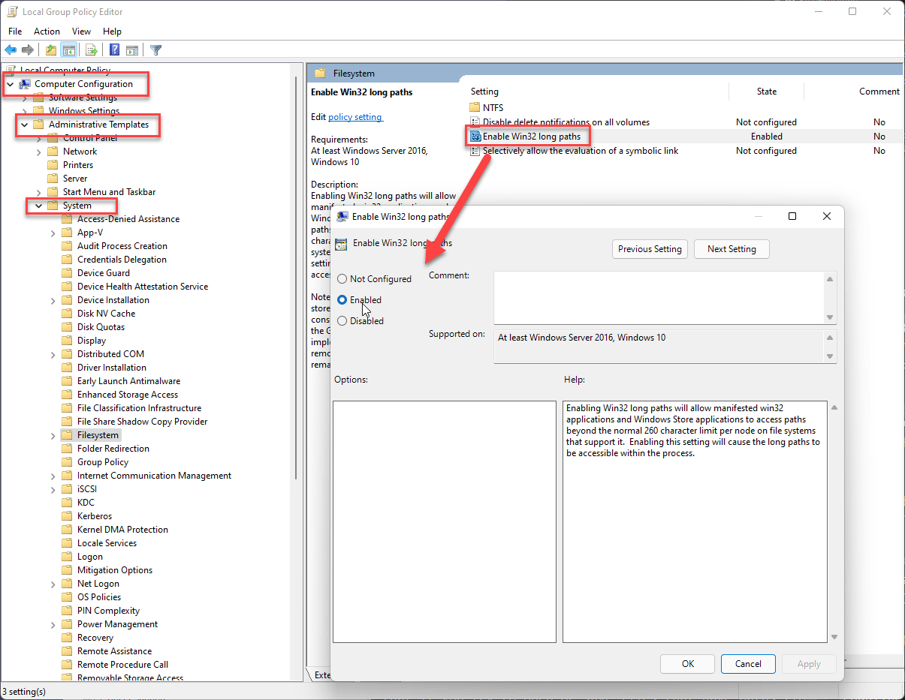
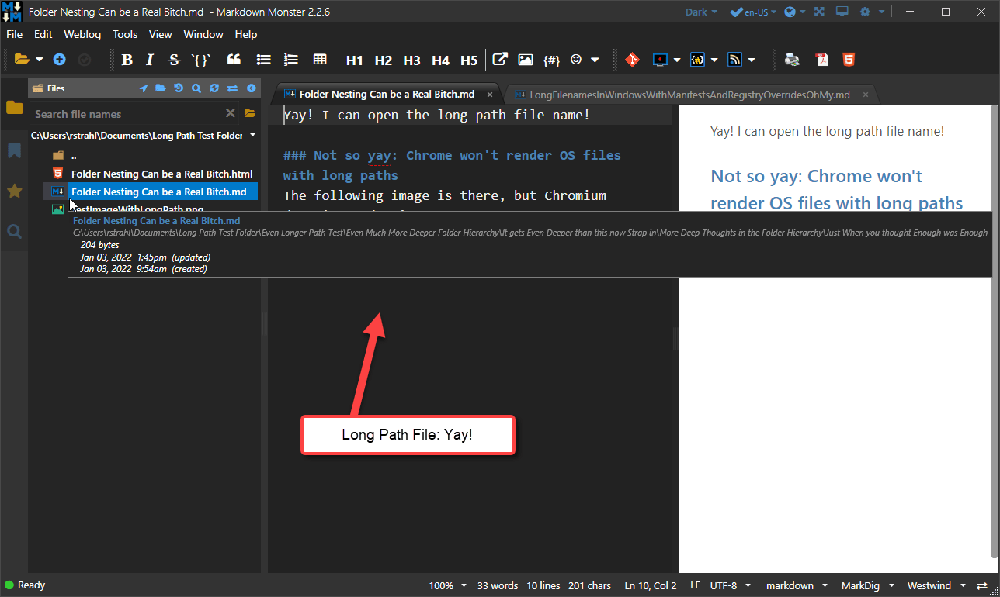
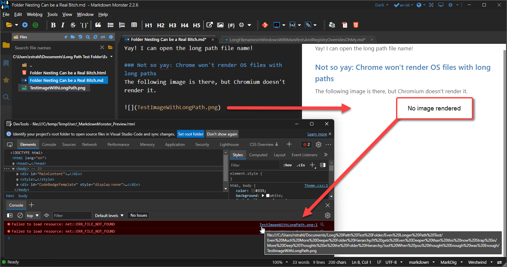
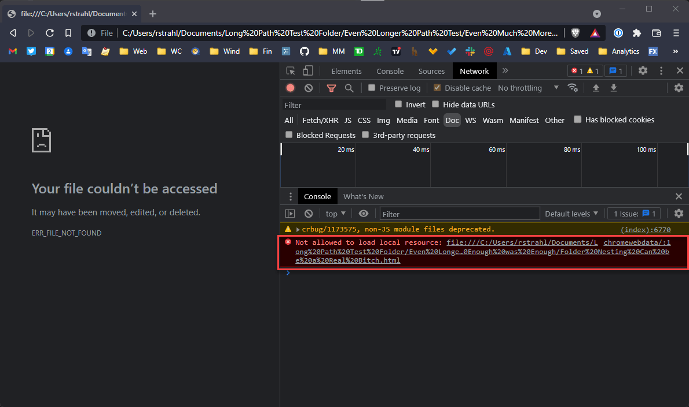
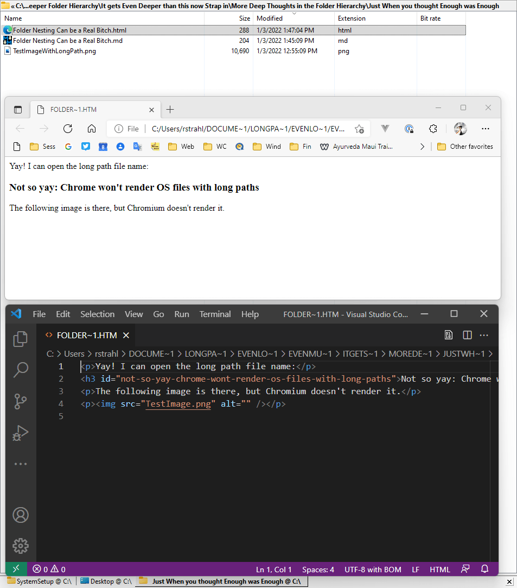
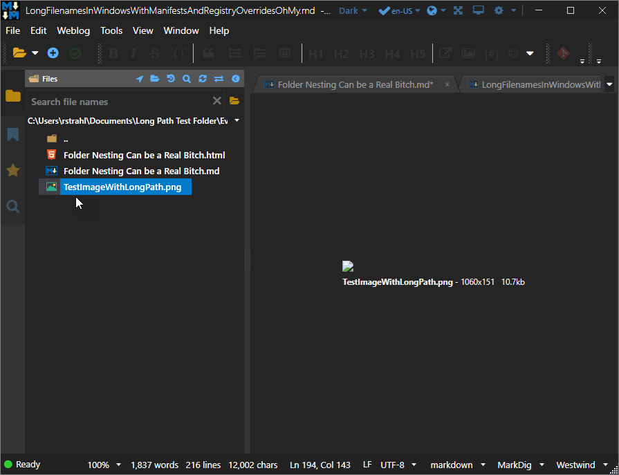
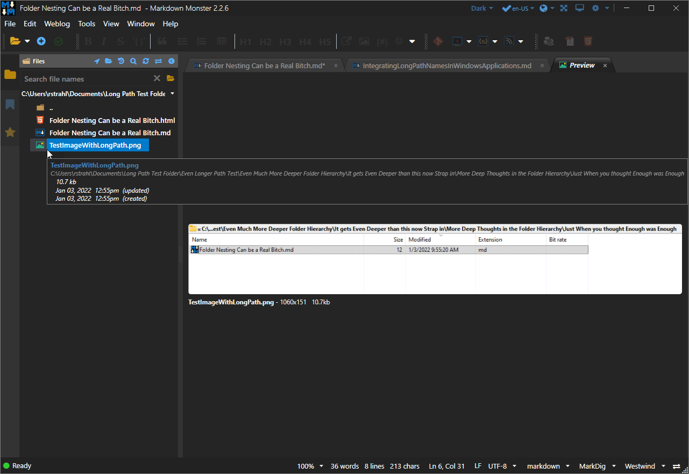
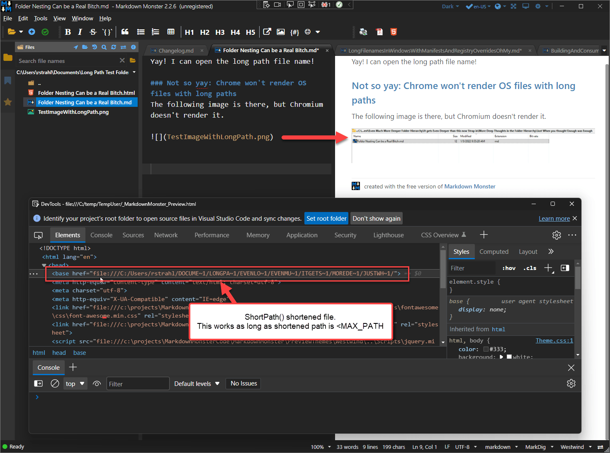

# Integrating Long Path Names in Windows Applications


Today I got a [bug report](https://github.com/RickStrahl/MarkdownMonster/issues/900) for [Markdown Monster](https://markdownmonster.west-wind.com/) that said that Markdown files could not be opened from certain locations. Hard crash when trying to open the file. Ugh!

Odd, because if that was a wide-spread problem I'd hear about this no end, but this was a one-off bug report. After a bit of back and forth, it turns out the user was trying open a file in a folder that exceeded Windows `MAX_PATH` limit, which is 260 characters. Any file opened in this path would fail with a File not found exception which would then not open the file in Markdown Monster.

The direct file open is one scenario, but this can come up plenty of other scenarios too - opening related assets like image files or saving a new file in a folder that has a long path. I've seen file IO errors for opening files not found in my application logs, and most of these are probably  caused by this very same scenario.

## Windows and MAX_PATH (260)
Windows traditionally has a 260 character path limit which applies to both the folder + filename combination. The native Windows APIs can handle files up to the 260 character limit, but exceed that and lots of things go boom. 

It's not just Markdown Monster - even Windows Explorer and command shells like PowerShell and Command have issues with long paths. For example, Explorer won't let you create a folder name that ends up with a path that is longer than 260 characters and you can delete folders or files in folders that exceed the `MAX_PATH` limit.

It's an inherent issue in Windows because the base Windows file APIs by default don't recognize these long paths. Most applications don't work with them and even if they do there may be odd behaviors caused by interaction with other applications, components or tools that don't. It's very insidious how deeply embedded this problem is.

This is true of raw Windows APIs as well as high level runtimes like the .NET Runtime which use those very APIs. For Markdown Monster which is a .NET Full Framework (`net472`) application, this means it can't open or save files that are 260 characters or longer and this was the cause of the problems reported in the Bug report. Depending on the operation, files either would not open with *File not found* errors, or outright crash the application. Not cool, but not unexpected...

##AD##

### 260 is not small!
To be clear: 260 characters is not exactly small for a folder and file path. It's pretty freaking long and for manual folder creation - which is the likely use case in Markdown Monster - you have to work pretty hard to get near the 260 character limit. Just creating a repro case for the bug report took a while to actually build folders deep enough to trigger errors - I thought 260 chars would have come a lot sooner than they actually did! But apparently it happens quite a bit anyway :smile: as I see errors like this in my logs on a regular basis.

While trying to duplicate the problem I created a folder structure that would exceed 260 characters in my `Documents` hierarchy and it took 8 levels down plus insanely long, spaced out folder names to get there. That's not to say this never happens but there probably are ways to minimize the size of these path lengths with some prudence in folder naming.

The more common scenarios is that you run into problems with automated tools or development environments that don't primarily run on Windows. For example, NPM in the past would create package dependencies as a nested tree that frequently overshot the 255 limit and ended up creating folders and files that were very difficult to access and even remove using just basic Windows built-in applications. 

Long story short Long Path names are still a problem on Windows.

## Making it Work Anyway!
As of Windows 10 Version 1607 there are improvements that can make things better with Long Path Support via here are  configuration settings at the Windows and Application level. Unfortunately this is not automatic and requires both some Windows setting changes and configuration at the application level to support those Windows features.

Here are the requirements:

* Set a global Registry Key that enables Long Paths
* *Or*: Use a Group Policy Setting
* Add a key to an App Manifest to allow Long Paths in the Application

For an application like Markdown Monster both things have to be in place in order to get long path support to work.

## Enabling Long Paths in Windows
There are two ways to enable the core Windows support for long path names.

### Registry Key
For a typical developer the easiest way to add support is via the registry setting.

Copy the following text to a `.reg` file and run it as Administrator, or enter the key and value into the registry directly:

```text
Windows Registry Editor Version 5.00

[HKEY_LOCAL_MACHINE\SYSTEM\CurrentControlSet\Control\FileSystem]
"LongPathsEnabled"=dword:00000001
```

or you can use Powershell from an Adminstrative Terminal:

```ps
Set-ItemProperty `
  -Path HKLM:\SYSTEM\CurrentControlSet\Control\FileSystem `
e  -Name LongPathsEnabled -Value 1
``` 

This enables Windows support for long path names via the core Windows APIs without explicitly having to specify extended path syntax (`\\?\` prefixed described below).

### Group Policy
There's also a Group Policy setting that can be made on your machine that behind the scenes affects the above registry key. The group policy is a bit less of a hacky approach and allows administrative automation over the feature more 'officially'.



### Enabling Long Paths in Applications via Application Manifest
Enabling the Operating System for long paths is not enough however. You also need to **enable your application to take advantage of the long path enhancements** by adding a switch to the application's `app.manifest` file:

```xml
<?xml version="1.0" encoding="utf-8"?>
<assembly manifestVersion="1.0" xmlns="urn:schemas-microsoft-com:asm.v1">
  <assemblyIdentity version="1.0.0.0" name="MarkdownMonster.app"/>
  <application xmlns="urn:schemas-microsoft-com:asm.v3">

    <!-- This setting -->
    <windowsSettings xmlns:ws2="http://schemas.microsoft.com/SMI/2016/WindowsSettings">
        <ws2:longPathAware>true</ws2:longPathAware>
    </windowsSettings>
  
  </application>
</assembly>
```

In .NET you can add an `app.manifest` file to your project, and then make sure to add to your project via this setting:

```xml
<PropertyGroup>
 <ApplicationManifest>app.manifest</ApplicationManifest>
</PropertyGroup>
```

This automatically embeds the `app.manifest` file into your executable as a resource when the application is built into the final EXE.

With both the Windows setting and the app manifest in place, your application can now use Long Path disk operations using 'normal' Windows or .NET APIs.

It's kind of a mystery that this setting is enabled via a switch rather than being enabled by default. I suspect the long path behavior has some performance implications as long paths have to stored differently in NTFS. But I would think that this feature should just be enabled by default, and have support for turning off as an option. I can't see any downsides to this, but it's probably more complicated than that - if anybody has any insight on why this isn't the default, please leave a comment. As it is it has to be enabled as an option. Booo!

### Extended Path Syntax (\\\\?\\\): No System Settings Required
The registry and group policy settings require that an explicit Administrative Windows Setting is set which can be problematic. Nobody wants to send their users to the registry or group policy administration tool. These settings also work only on somewhat recent versions of Windows 10, so it's not a universal option.

Windows has had some level of support for long file names for some times by using **Extended Path Syntax** which involves prefixing fully qualified paths with `\\?\`:

```text
\\?\c:\users\rick\<myverylongpath>\somefile.md
```

If you pass a Long Path filename to a Windows or .NET API it'll work with the extended path syntax filename even when no system setting changes have been made. Cool.

Well, sort of... While extended path syntax works it has a couple of big problems:

* **Requires changes to code**  
Although the concept of a prefix is simple, it's not so easy to capture **every location** where file APIs are used. There are so many different file APIs and scenarios where and how files are used - some of them likely not under your control in an application - that can thwart this scheme. This might work for some basic tools or utilities, but in a full fledged application this is likely a non-starter especially as a retro-active fix. 

* **It doesn't work with relative paths**  
Extended path syntax requires fully qualified paths to work. It doesn't work with relative paths. While you may have control over all file access that your application explicitly handles, dependent components or tools often use relative paths. Lots of stuff that may not be in your control, from library loaders to resource loading, to browser controls etc. rely on relative paths and can then fail. As I show later as an example, Chromium can render a file with a long path, but fails to render relatively pathed resources because they resolve to a long path. This can bite you in unexpected ways.

* **It doesn't work everywhere**  
Most (but not all Windows and .NET APIs) work with extended path syntax. But the bigger problem is that other applications and the Windows Shell operations don't work with these paths when invoked through `Process.Start()`. For example, passing an extended path via parameter to `Explorer` just ends in tears - doing absolutely nothing. Same with terminal and `Process.Start()` arguments for many apps.

In short I think that extended path syntax on its own is not a solution. It's too difficult to figure out where it works and where it doesn't and then to find all the places in the application where it needs to be used. It's useful if you have a very focused scenario for using File IO, but for generic applications it's just not consistent enough to work for all use cases - it's definitely not a one size fits all solution.

##AD## 

### Windows Short Path Names
Another option that works without new Windows features and settings is to use Short Path Names as provided by the Windows API `GetShortPathName()` function. This function shortens paths to the old school DOS 8.3 length by uniquely creating shortfile paths. Here's what a very long path looks like when truncated:

```text
c:\\users\\rstrahl\\docume~1\\longpa~1\\evenlo~1\\evenmu~1\\itgets~1\\morede~1\\justwh~1\\testim~1.png
```

Because the syntax drastically compacts the path, it allows for much longer paths to be used and this works to use paths **as long as the shortened path does not exceed MAX_PATH**.


#### GetShortPath() in .NET
.NET doesn't have direct support for `GetShortPathName()`, so you have to use `PInvoke` to make the API calls from .NET. 

But there are a few quirks:

* `GetShortPathName()` does not work with Long Paths directly!
* You have to use `\\?\` extended path syntax for it to work with long paths
* Paths passed to `GetShortPathName()` have to exist in order to convert 

> #### @icon-warning Requires that the Path Exists 
> One big caveat of `GetShortPathName()` is that it only works with paths that physically exist on disk. Unlike other file apis which can deduce names even without a file existing, this one requires a physical file on disk. Because this API has to create unique names with a limited set of characters that might cause naming conflicts, it depends on the current disk state to produce the short, unique file name.


With that in mind the following [`GetShortPath()` helper method in my FileUtils class](https://github.com/RickStrahl/Westwind.Utilities/blob/c9ae36e3bf47c6123d3e68ced45e9a4c61ca8700/Westwind.Utilities/Utilities/FileUtils.cs#L136) returns null if the conversion fails, otherwise it returns the shortened path:

```cs
/// <summary>
/// Returns a short form Windows path (using ~8 char segment lengths)
/// that can help with long filenames.
/// </summary>
/// <remarks>
/// IMPORTANT: File has to exist when this function is called otherwise
/// `null` is returned.
///
/// Path has to be fully qualified (no relative paths)
/// 
/// Max shortened file size is MAX_PATH (260) characters
/// </remarks>
/// <param name="path">Long Path syntax</param>
/// <returns>Shortened 8.3 syntax or null on failure</returns>
public static string GetShortPath(string path)
{
    if (string.IsNullOrEmpty(path))
        return null;

    // allow for extended path syntax
    bool addExtended = false;
    if (path.Length >= 255 && !path.StartsWith(@"\\?\"))
    {
        path = @"\\?\" + path;
        addExtended = true;
    }

    var shortPath = new StringBuilder(1024);
    int res = GetShortPathName(path, shortPath, 1024);
    if (res < 1)
        return null;

    path = shortPath.ToString();

    if (addExtended)
        path = path.Substring(4);

    return path;
}

[DllImport("kernel32.dll", CharSet = CharSet.Auto)]
private static extern int GetShortPathName(
    [MarshalAs(UnmanagedType.LPTStr)]
    string path,
    [MarshalAs(UnmanagedType.LPTStr)]
    StringBuilder shortPath,
    int shortPathLength
);
```
To use it I call the method and make sure to check for `null` results. `null` means the call failed in which case we keep the original file name and (likely) fail with that. Most likely the failure is caused by a file that doesn't exist. Otherwise the API returns the shortened unique file path.

As it turns out `GetShortPath()` is a real life saver as it's the key functionality that works external application invocation where extended path syntax often fails.

## In the Real World: It's never easy!
So what does this look like in a real application? The short answer is that there is no one solution that works for everything. In Markdown Monster I had to combine both the native support with the `GetShortPath()` functionality to make most common scenarios work.

Let's get back to the original bug report, based on what we know now it's seems pretty straight forward to make Markdown Monster support long file names. 

The first and obvious change in the application is adding the `app.manifest` setting described, along with a [new documentation topic](https://markdownmonster.west-wind.com/docs/_68d0r8rej.htm) on how to enable Long Path support in Windows. Eventually I'll also add an option to set the setting as part of the Markdown Monster CLI.

Performing these two relatively simple steps make Markdown Monster's core file handling work with Long Path names. Yay!

Here's my test document with a long path opened in Markdown Monster:



Problem solved, case closed right? 

### Markdown Monster File Operations are Peachy
This fixes Markdown Monster so that it can work with Long Path Files for:

* Opening Documents
* Saving Documents
* Saving Image Captures/Pastes etc.
* Creating New Files for Web log etc.

All of that, which uses the file operations that **directly go through Markdown Monster work just fine**.

##AD##

## Dependencies, Dependencies... not so much
But Houston hold on...  we have a problem. 

Markdown Monster uses quite a bit of external functionality like the Edge WebView Chromium Browser for the live Html previews, many, many shell operations to open image editors, viewers, open files from the folder browser, open files and folders in Explorer, or open a shell prompt in a give folder. 

A lot of these operations are **not working with long paths** with just the steps outlined above.  
Let's look a few of these use cases that **are not working** because it's instructive in showing how insidious the lack of true long path support is in Windows.

### Chromium Browsing: Documents work, Relative Links do not
The WebView Chromium browser component is very important for Markdown Monster as it provides the preview functionalitythat renders documents **in place** so that relative file dependencies can be rendered. It also is the Html host for the editor which is a JavaScript component and is heavily automated. The editor is fine since it lives in a fixed folder that is unlikely to be deep inside of a folder hierarchy. But the preview is dynamic and changes where it looks for files depending on where documents are stored in order to be able to find relative resources like images and links to other documents.

The preview works by rendering Markdown into a file into a fixed, well known folder (typically the temp path) and then explicitly sets a `<base />` path reference in the Html to the location of the document.

Essentially what MM does is set a document base path so it can find relative dependencies on disk:

```html
 <base href="file:///c:/<verylongpath>/"/>
```

Since this path is dynamic and follows the base document, the base path can point anywhere including to a long path.

If I then open the Html file, which lives in the fixed local path on disk, I get the following when I try to embed an image with a relative path (which now  is a long file path) into the page:



So although the Html document renders, because it's opened in the temp path, the image does not, because of the relative image path that is a long path, the Chromium browser refuses to render the image. You can see Chromium acts as if it can't find the image even though in a non-long-path it would render just fine.

This is not only a problem for the WebView, by the way. My desktop Chromium Browser - Brave - doesn't load long path names pasted into the browser address bar from long paths. Here's what I get:



It does however work using Windows Short File Syntax, which is what happens if you open a file from Windows Explorer by double clicking. Apparently Chromium detects the long path and creates a short file path from it and then opens the file:



The file loads (notice short files syntax using 8 character segments with `~` prefixes... Cool, but even then - just as in my Markdown Monster preview scenario -  the image rendering fails as you can see in the middle Edge browser in the image above. Argh...

Another problem in Markdown Monster is related to this issue too: MM fails to preview files in Long Paths that use Chromium to open files for display. For example previewing images in the Folder Browser, which displays them in a Browser control also fails with the long image path:



The same is true for `.html` or `.pdf` documents which also preview in a browser tab.

In short there are lots of issues with long file names in browsers that don't automatically fix just by making Windows and your application work with long paths. The reason is simple: Your application maybe ready, but **support features, components or applications may not be**. 

### More failures: Opening Files through other Applications
Markdown Monster integrates with a lot of external tools by activating them via shell execution. In MM you can:

* Open files in Explorer
* Open files in an Image Editor
* Open a Terminal at the current path
* Open Git Client at current path

and many more. Most of these shell operations also fail with long paths, **because Explorer, and most other tools don't directly support long filenames**. Neither does the Windows Shell support this consistently. If you pass filenames as parameters most Windows internal tools will not work with long paths.

For example, to open Explorer I use a shell command that essentially does:

```ps
Explorer.exe /select "{filename}"
```

This opens Explorer with the file selected in Explorer. This works great with normal files, but with Long Paths that fails. 

It also doesn't work with extended path syntax (`\\?\` prefix). Instead Explorer fails silently and opens in the default folder as if you hadn't passed a file.

Likewise opening a terminal in a Long Path ends up opening it in the terminal default folder (the User folder typically).

All of this **does not work** because the target applications do not have support for long file names.

### A Partial Cure: Windows Short Paths
After a lot more experimenting with extended paths and short paths, I finally figured out that the best approach for external applications is to use short path names as that is universally understood by any application, because it effectively uses short file names.

As a reminder, this involves using the Windows `GetShortPathName()` API to 'truncate' filenames into the legacy 8.3 DOS path syntax. This syntax looks like this:

```text
c:\users\rstrahl\docume~1\longpa~1\evenlo~1\evenmu~1\itgets~1\morede~1\justwh~1\testim~1.png
```

#### Using GetShortPath() for External Applications
I showed how to create above, here are a few examples how I use it. Basically for several scenarios that shell out and pass file names to other applications I use `GetShortPath()` to shorten the path **if the path is near `MAX_PATH` length.

To use it I call the method and make sure to check for `null` results, which means it failed in which case we keep the original file, which likely means that MM will fail in the same way as before. Technically that shouldn't happen and only will if the file doesn't exist in the first place - which is one of the limitations of the API.

Here's an example of how I use it in Markdown Monster. The code below is for opening documents in the Preview browser which previously showed a broken image or showed an error loading message.

```cs
// filepath is the full path to the file to open
var filePath = selected.FullPath;

if (string.IsNullOrEmpty(filePath))
    return;

string shortPath = filePath;
if (filePath.Length >= 255)
    shortPath = FileUtils.GetShortPath(filePath)?.ToLower() ?? filePath;

var ext = Path.GetExtension(filePath).ToLower();
if (ext == ".jpg" || ext == ".png" || ext == ".gif" || ext == ".jpeg")
{
    await Window.OpenBrowserTab(shortPath, isImageFile: true);
    return;
}
else if (ext == ".html" || ext == ".htm")
{
    await Window.OpenBrowserTab(shortPath);
    return;
}
// more non WebBrowser preview selections
```

And that happens to work just fine. The files now open as expected. Here's the image preview:



I use similar code for any file previews that use a browser with disk files in a special help `Window.OpenFileTab()` as well as specific open operations like opening a terminal and opening Explorer with other applications.

#### Setting `<base />` to Short Path
I was also able to fix the Preview in a similar manner by setting the `<base>` path to a short path in the document rendering logic.

```cs
// use short path syntax if path is getting close to MAX_PATH
if (docPath.Length >= 255)
{
    var sPath = FileUtils.GetShortPath(docPath);
    if (!string.IsNullOrEmpty(sPath))
        docPath = sPath;
}

var html = themeHtml.Replace("{$themePath}", "file:///" + themePath)
    // this is the basePath rendered into the template
    .Replace("{$docPath}", "file:///" + docPath.Replace("\\","/"))
    
    .Replace("{$markdownHtml}", markdownHtml)
    .Replace("{$renderedMarkdown}", markdown ?? CurrentText)
    .Replace("{$extraDocHeaders}", ExtraHtmlHeaders);
```

And that now works too. The `<base/>` tag renders into the document with the short path and this makes the relative path work - the image now displays:



Yay!

## Summary
Is this going to fix all issues with long paths in Markdown Monster? Nope, not by a long shot. It's going to take me some time to hunt the many file access and application opening scenarios down, but these initial updates - especially the browser base path - address some of the most obvious failures. The rest will take time, but is probably less critical than the big ones which is opening and saving of files which just work with the Windows features and `app.manifest`.

To summarize:

* Windows Supports Long Paths via Registry or Group Policy Settings
* Applications must add `longPathAware` to their `app.manifest`
* Long Paths to external applications may have to fixed up with `GetShortPath()`

Between these 3 scenarios I can get most if not all things working in Markdown Monster.

Which isn't to say that this is easy or clean. It's hacky as hell and there's no easy way to make these changes in existing applications that never planned for long path access explicitly.

It's never easy, but hopefully this post has given you the tools to make it possible to get a head start at supporting Long Paths in your Windows applications. It's about time that more Windows applications do - it's shocking how many do not and the fact that Windows doesn't just make it work by default for every application without Registry hacks and explicit application requirements. But this is better than nothing...


## Resources

* [Maximum Path Length Limitation (ms)](https://docs.microsoft.com/en-us/windows/win32/fileio/maximum-file-path-limitation?tabs=cmd)
* [Markdown Monster Docs for Long Paths](https://markdownmonster.west-wind.com/docs/_68d0r8rej.htm)
* [GetShortPath() in Westwind.Utilities](https://github.com/RickStrahl/Westwind.Utilities/blob/c9ae36e3bf47c6123d3e68ced45e9a4c61ca8700/Westwind.Utilities/Utilities/FileUtils.cs#L136)
* [Markdown Monster with Long Path Support (2.2.7+)](https://markdownmonster.west-wind.com)

<div style="margin-top: 30px;font-size: 0.8em;
            border-top: 1px solid #eee;padding-top: 8px;">
    
    this post created and published with the 
    <a href="https://markdownmonster.west-wind.com" 
       target="top">Markdown Monster Editor</a> 
</div>