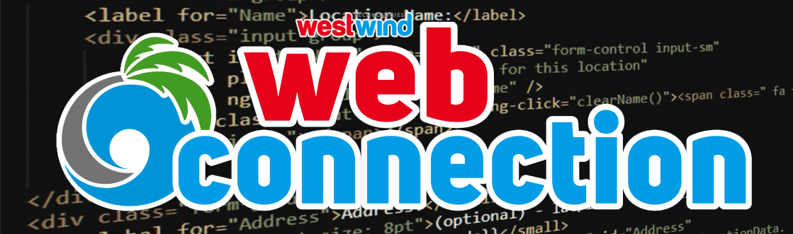
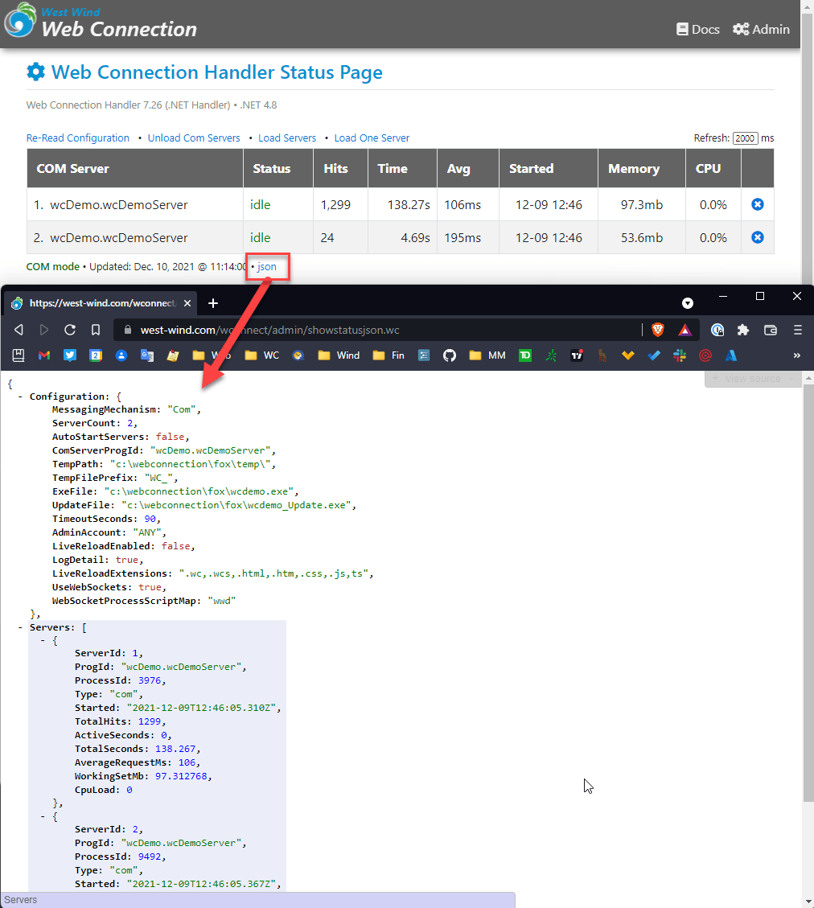
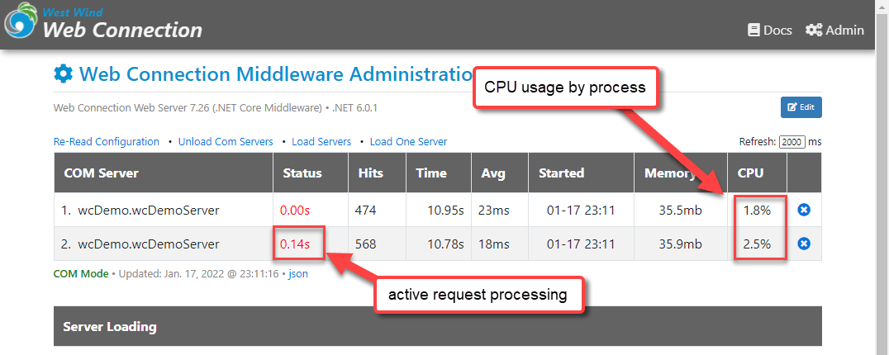
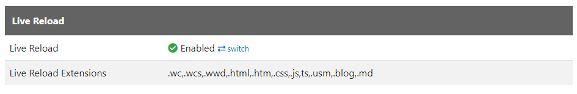

# Web Connection 7.26 has been released

[](https://webconnection.west-wind.com)

[Web Connection 7.26](https://webconnection.west-wind.com) is out and in this post I'll go over some of the new features of this release. As has been the norm for many of the recent updates, this is a relatively small update, with only small incremental feature updates. 

## Breaking Ch... Ch... Changes
Breaking changes in Web Connection are few these days, and it's not any different for this release. Breaking Code changes rarely occur and haven't since the major release of 7.0. However, we do have the occasional external dependency updates that require that applications and local development setups are updated, which is the case this time around.

* .NET 6.0 Dependency for the Web Connection Web Server (optional)
* `Newtonsoft.json.dll` needs to be updated (required for JSON)

The first is a breaking dependency change in this release. The second is a reminder from the last release pulled forward as an additional hint to update. 

Remember to update your dependencies **in your Web Connection projects** (if you use new projects) **and in live deployed applications**. 

Here's a link to the documentation that talks about what needs to be updated for version updates:

* [Updating Web Connection](https://webconnection.west-wind.com/docs/_2jw0bpb4d.htm)

### One Breaking Change: Web Connection Web Server requires .NET 6
There is one breaking change, namely that the [new, local Web Connection Web Server](https://webconnection.west-wind.com/docs/_5lw0ysxq9.htm) now requires .NET 6.0 instead of .NET 5.0 in previous release. If you update to the latest version of the Web Server you'll need to make sure to [install the .NET Runtime](https://dotnet.microsoft.com/en-us/download/dotnet/6.0).

For the optional Web Connection Web Server you can download either:

* .NET 6.0 SDK (x64)
* Hosting Bundle (x64)

This new, self-contained and shippable Web Connection Web Server is and always will be optional - you can [use IIS Express](https://webconnection.west-wind.com/docs/_3nj01rj5n.htm) or full IIS instead if you choose, but if you're already using it you'll likely want to update. 

> Personally I run the Web Connection Web Server **for local development**, as the local Console app shows me what's going on with server requests going through the server and it's easy to launch from anywhere from the command line. 
>
> For **deployed applications** - although the .NET Core server can also run in IIS and gives roughly the same performance as the .NET Handler - I typically still use the .NET Handler, because it's easier to deploy.

If you're using the Web Connection Web Server for development or in production inside of IIS, you'll want to update the `WebConnectionWebServer` folder in your project folder and in the deployed application as well, as the server is not shared but rather distributed with each project/application. If you don't update your apps continue to work, but with the older version of .NET.

> Note that **.NET Core does not automatically update to newer major versions of .NET** which means if you only have .NET 6 installed but you're running the older .NET 5.0 server, the server **will not start**. If you mix and match versions of the Web Connection Web Server you may have to have multiple .NET Runtimes installed, which is fully supported now. 

### One more breaking change: NewtonSoft.Json.dll needs to be Updated
This is actually breaking change from the last release but it's good to keep this one active as it affects deployed applications that update to Web Connection 7.25+.

We've updated the .NET JSON serializer which is `NewtonSoft.Json.dll` to the latest version `13.0.1`. This DLL is used in conjunction with `wwDotnetBridge` and the `wwJsonSerializer` class and used for all JSON deserialization. As `wwDotnetBridge` has a dependency on `13.0.1` both files need to be synced. Other libraries that might require older versions can use [assembly forwarding](https://webconnection.west-wind.com/docs/_5aq0m5auy.htm) to get versions synced up to this latest version.

## Bug Fixes 
As has been the case for the last few release, the brunt of updates have been small bug fixes and performance tweaks. Web Connection has a lot of moving parts so you guys still find little nooks and crannies that break every once in a while. 

There are a few bug fixes:

### Fix: Issue with Live Reload Requests not Firing on IIS
Fixed issue where hitting a link on IIS/IISEXPRESS occasionally would not work when LiveReload was enabled. Fixed by ensuring the output stream is properly disposed before writing the injected reload script.

### [Fix wwSftp::OnFtpBufferUpdate()](VFPS://Topic/_67N0SA4AA) to allow Canceling Downloads and Uploads
Fix `OnFtpBufferUpdate()` for `wwSftp` so it now works to provide to check for the `lDownloadCancelled` flag on a passed in `loSftp` instance when set. Previously this flag was ignored.

### Fix: ExpandTemplate with _Layout Pages not reading Base Path correctly 
Fixed issue where `wwPageResponse.ExpandTemplate()` was not correctly setting the Web site base path resulting in empty layout pages to be rendered. This in turn resulted in empty pages. Fixed. Note this bug only applied to Templates, not Script pages.

## So what's new?

### Administration Updates
This release has a few updates, most of them centering around the administration interface. If you've upgraded recently you've probably noticed that there's a new Administration page at `Administration.wc` that consolidates both the 'module' handled operations and the FoxPro server operations into a single redesigned page. The idea of that change has been to provide a single page that lets you manage all Web Connection Administration settings and operations in one place. 
  
This page has seen some additional tweaks to make it easier to work with and easier to see option settings. There are also a couple more toggles you can set now, like toggling Live Reload and Web Socket support.

#### JSON API for Server Status
The Web Connection Handler and Web Connection Web Server now have a dedicated `AdministrationJson.wc` link you can use to retrieve server configuration information as JSON. The result includes all the server configuration settings as well as information about the running server similar to the main `Administration.wc` page.

Here's what the JSON output looks like:



The real use case for this though is for monitoring applications that can get access to all these stats and perhaps automatically start and stop servers or reset servers if memory get to high etc. Lots of things you can do with this if you are creative in the admin space.

#### Add Performance Counters back to Web Connection Server
The .NET Core Web Server now displays CPU usage for server instances on the Middleware Administration page. 



#### Live Reload Toggling now 'just works'
Live Reload mode toggling in the Admin interface has been a bit fiddly as there are a few moving parts. In this update Live Reload can now be more easily be toggled on the bottom of the configuration form:



More importantly though that change now works in real time for static and script resources, and it also attempts to update the FoxPro server `app.ini` `LiveReload=on` setting. 

Previously LiveReload setting changes required a restart of both the Web Application in the Web COnnection Web Server, or recycling in IIS/IISExpress and a restart of the FoxPro Server. With these updates the Web server auto-refreshes for static and script files, and the FoxPro server in most cases will also update and auto-refresh.  
  
Worst case scenario you may still have to restart the FoxPro server, in order to auto-refresh FoxPro server code changes.

##### LiveReload Disabled for running in IIS
Note by default when running inside of IIS, LiveReload is completely disabled at the middleware level by not loading up the file watcher or hooking up the HTML content interception. When disabled like this in IIS, toggling the configuration flag through the admin interface or the `WebConnectionWebServerConfiguration.xml` file has no effect.

You can override this behavior via the `WEBCONNECTION_USELIVERELOAD` flag in the `web.config` `<aspNetCore>` section. The default looks like this:

```xml
<aspNetCore>
	 ...
	 <environmentVariables>
	 	...
		<environmentVariable name="WEBCONNECTION_USELIVERELOAD" value="False" />
	</environmentVariables>
</aspNetCore>
```

`False` here means LiveReload **does not work**, even if set in the toggle flag described above. `True` enables it so that the toggling works the same as in development

### Miscellaneous Changes
The following are a few odds and end updates to Web Connection.

#### Better Error Handling for REST Service Invalid URLs
Invalid REST Routes - ie. referencing a missing method in a REST Service - now return an HTTP 404 error. In addition, the error message now also describes the error better as `Missing endpoint method: MethodName`.

#### [wwJsonSerializer::MapPropertyName()](VFPS://Topic/_67X0KWDFD)
JSON Serialization with FoxPro requires some extra work for dealing with properly cased property names. FoxPro's internal Reflection APIs don't return property names in their proper case. So, Web Connection by default just lower cases all property names.

There's always been a [loSerializer.PropertyNameOverrides](https://webconnection.west-wind.com/docs/_3fy0sy7k1.htm) property to allow you recast property names by essentially replacing them with proper case names in a comma separated list.
 
In addition to that there, now a helper method called `MapPropertyName()` on the serializer that allows you to map an individual property name to a new name. 

This lets you completely transform a property name rather than just changing case as `PropertyNameOverrides`.

For example it allows you to map names to values that standard FoxPro property serialization would not normally allow for such as property names with spaces or special characters. Similar to `PropertyNameOverrides` in behavior but with much more control.

```foxpro
loSer = CREATEOBJECT("wwJsonSerializer")
loObj = CREATEOBJECT("EMPTY")
ADDPROPERTY(loObj,"LastName","Strahl")
ADDPROPERTY(loObj,"FirstName","Rick")

*** Create initial JSON
*** { "lastname": "Strahl", "firstname": "Rick" }
lcJson = loSer.Serialize(loObj)

*** Now update the property names
loSer.MapPropertyName(@lcJson, "lastName","Last Name")
loSer.MapPropertyName(@lcJson, "firstName","First Name")

*** { "Last Name": "Strahl", "First Name": "Rick" }
? lcJson
```

And yes those 'property names' (JavaScript folks would call that a 'Property Map' more likely) are legal in JavaScript.

#### Automatically clear wwSql Named Parameters before new command executes
The wwSQL class has support for running queries with Named Parameters that you can pass into the query. Parameterized query are the preferred way to write SQL statements because it avoids the potential of SQL Injection as parameters are passed are never assigned directly and sanitized before getting applied into a SQL statement.

One problem in the past was that running multiple successive commands would require explicitly clearing the parameter list before running the next command.

This has been changed so now the parameter list is cleared by default before a new command is executed. The sequence is:

* Add parameters
* Execute Statement
* Add First parameter for second statement 
* Clear parameter list before first parameter is added
* Add more parameters
* Execute second statement

The list is cleared on  the first `AddParameter()` call **after a query was executed**. This behavior can be overriden via the `lNoParameterReset` property which when set leaves the first parameter list intact.

The idea is that you usually want the list cleared before a new command is run. Previously you had to explcitly call `loSql.AddParameter("CLEAR")` to clear the list, which is no longer required now.

This may break code, in rare situations, if code depended on running the same parameters in multiple commands, but this should far and beyond be the exception.

## Summary
There you have it. This is a small update, and it should be an easy one to update in production with minimal effect. Just make sure if you're using the Web Connection Web Server to update the server in your created projects.