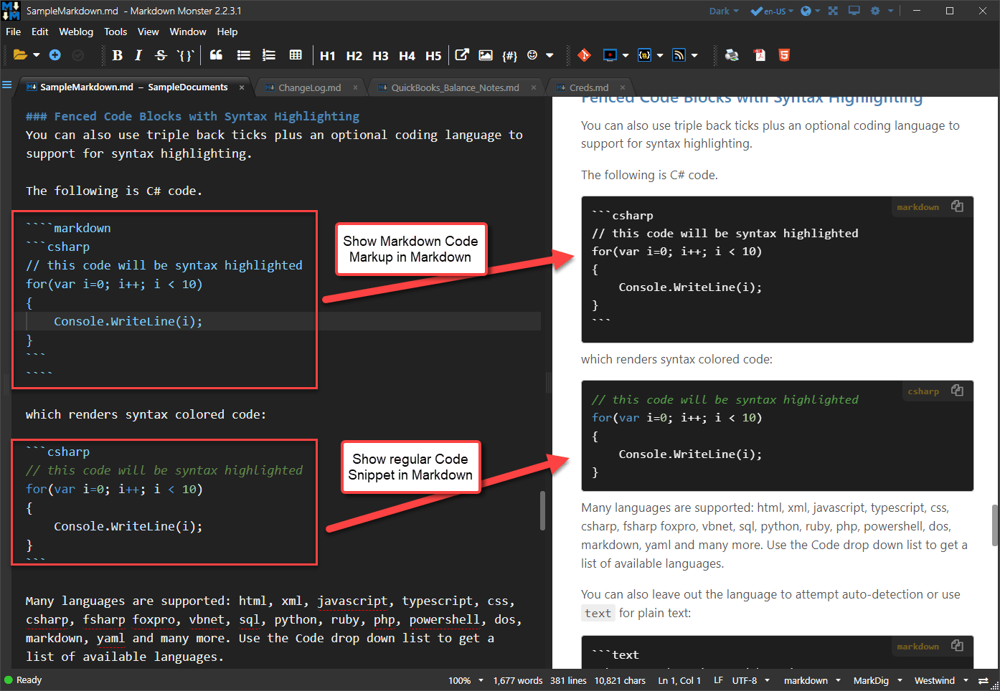
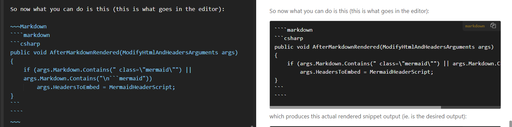

# Escaping Markdown Code Snippets and Inline Code as Markdown



If you write Markdown for code related documentation it's not uncommon that you need to create code snippets or inline-code blocks that contain the Markdown code delimiters. For example, you might want to document the Markdown syntax of embedding a code snippet or inline code block using Markdown. Bam! Instant nesting for `` ` `` characters that will cause problems in Markdown rendering.

At this point it gets confusing **on how to escape the Markdown code inside of the Markdown Code snippet**.  **How very meta, huh?** And it gets **even more meta** with this post which is trying to use Markdown to show you the wrapper code that wraps Markdown and then to show that code as Markdown, he he...

Ok, Ok, this kind of deep nesting is highly unusual, but single level nesting of say a code snippet or inline code inside of another Markdown document is not uncommon and quite often comes up in technical documentation.

In fact, this post is an example of just that scenario - I'm talking about code snippets and and I want to display the code snippet code as well as the rendered code snippet code.

Luckily there are some not so obvious workarounds to make nested Markdown Snippets and the `` ` `` character  inside of Markdown Snippets work and in this post I'm going to address these. 

I'll talk about:

* Escaping Markdown Code Snippets 
* Escaping Inline Code blocks

##AD## 

## Markdown in Code Blocks
A common example that I run into is this:  I want to embed and display a Code Snippet in Markdown and then display the embedded Code Snippet as code in a Markdown document. So, a Code Snippet, displayed as a Markdown Snippet.

This is not as weird as it sounds - it's a common scenario in documentation where you discuss Markdown which is common for tools that use Markdown, editors, or commonly in code documentation.

The problem is that the `` ``` `` escape characters are a one time delimiter. You can't wrap multiple code blocks in multiple nested `` ``` `` blocks. Instead there are alternative delimiters to represent Code snippets and those can be nested.

There are a couple of ways to escape triple tick code blocks:

* Using ` ```` ` (4 back ticks)  instead of 3 ` ``` ` 
* Using `~~~` instead of ` ``` `
* You can combine the two for yet another level of meta

### Baseline Markdown Code Snippet

So let's start with the **normal** thing to do which might be to embed a simple code snippet into Markdown like this:

````markdown
```csharp
public void AfterMarkdownRendered(ModifyHtmlAndHeadersArguments args)
{
    if (args.Markdown.Contains(" class=\"mermaid\"") || args.Markdown.Contains("\n```mermaid"))
        args.HeadersToEmbed = MermaidHeaderScript;
}
```
````

which renders like this:

```csharp
public void AfterMarkdownRendered(ModifyHtmlAndHeadersArguments args)
{
    if (args.Markdown.Contains(" class=\"mermaid\"") || args.Markdown.Contains("\n```mermaid"))
        args.HeadersToEmbed = MermaidHeaderScript;
}
```

nothing unusual here - this is standard fenced code block rendering in Markdown. The syntax is optional but supported by many common renderers.

### Baseline Markdown Code Snippet as a Code Snippet
Now if you want to show in your code how this **Markdown** renders you run into a problem because you want to render a code snippet in a code snippet and the snippet already has a ` ``` ` block to dilineate it. You can't just use another ` ``` ` block around it because the second block interferes with the first.

So now what you can do escape the original code with a another block of code - in this cases using the 4 back tick syntax (`` ````markdown ``) which is what you'd see in the editor:

~~~Markdown
````markdown
```csharp
public void AfterMarkdownRendered(ModifyHtmlAndHeadersArguments args)
{
    if (args.Markdown.Contains(" class=\"mermaid\"") || args.Markdown.Contains("\n```mermaid"))
        args.HeadersToEmbed = MermaidHeaderScript;
}
```
````
~~~


This renders out the following snippet output that shows the Code Snippet as Markdown:

````markdown
```csharp
public void AfterMarkdownRendered(ModifyHtmlAndHeadersArguments args)
{
    if (args.Markdown.Contains(" class=\"mermaid\"") || args.Markdown.Contains("\n```mermaid"))
        args.HeadersToEmbed = MermaidHeaderScript;
}
```
````

Ok, cool, that works! 

And that's most likely where this story can end for most of you.

##AD##

#### Code Snippet of the Markdown Snippet of a Code Snippet
But, for this post I actually need to **get one more level deep** into the meta: I need to show the first - already nested -  snippet as a Markdown Snippet. And surprisingly that's possible too by mixing the two different escape types:



Is that meta enough for 'ya? 

And yes, the only way to display this level of nesting is via screenshot - I couldn't create a code snippet of that last code block to display as a code block. There's no way that I could figure out to extend the meta snippet nesting another level, which is probably a good thing. But - ouch my head hurts from all this indirection :laughing: 

The bottom line is that `~~~` and ` ```` ` allow you to escape markdown code blocks for up to 2 nested levels - one for each of those escape sequences!

This type of nesting of content can be confusing to think about, so it definitely helps to have a live preview as you create these nested Markdown snippets so you can immediately see what output is produced.

## Inline Back Tick Escaping
Another related issue is escaping of the back tick character `` ` `` in an inline code block. The problem here is that the `` ` `` is the delimiter and if you use it inside of the inline code block the Markdown parser assumes the tag is complete.

A standard inline code block looks like this:

```markdown
It's all fun and games until a `<script>` tag pokes you in the eye.
```

which renders as:

---

It's all fun and games until a `<script>` tag pokes you in the eye.

---

The inline code block renders as a `<code></code>` in Html.

But what happens if you need to have a `` ` `` in your escaped text?

Take Markdown like this where the triple back ticks are meant to show a single back tick as inline code and a generic expression that has an embedded back tick:

```markdown
But what happens if you need to have a ``` in your escaped text?

A generic looks like this:`CustomList<`1>`
```

Here's what you get with the above Markdown:

---

But what happens if you need to have a ``` in your escaped text?

A generic looks like this:`CustomList<`1>`

---

Not quite what you want! The problem is that the inline back tick breaks the end of the inline code block and so any code block that contains at least one breaks.
  
There are a couple of workarounds:

* Use `<code></code>` explicitly
* Use two double ticks <code>``</code> 


### Using `<code></code>` to Escape Inline Code
The first is to use a raw Html via `<code></code>` escape. This lets you use a back tick without an issue:

```markdown
But what happens if you need to have a <code>`</code> in your escaped text?

To use Mermaid delimit your code with a <code>```mermaid</code> block

A generic looks like this: <code>CustomList&lt;`1&gt;</code>
```

Here's what you get with the above Markdown:

---

But what happens if you need to have a <code>`</code> in your escaped text?

To use Mermaid delimit your code with a <code>```mermaid</code> block


A generic looks like this: <code>CustomList&lt;`1&gt;</code>

---

This works, but... you're now responsible for escaping the Html text. 
Notice the second block requires that the `<  >` tags are explicitly escaped or otherwise they are interpreted as an Html tag and don't render.

In most cases where you're likely to be double escaping like this the Html encoding is unlikely to be a problem though, so this isn't a big deal usually.

### Using Double Ticks  delimiting in Inline Code Blocks
Another option is to use extra spacing in the inline code block, which is a hint to the parser that the code includes escapable text.


```markdown
But what happens if you need to have a `` ` `` in your escaped text?

To use Mermaid delimit your code with a `` ```mermaid`` block

A generic looks like this: ``CustomList<`1>``
```

Here's what you get with the above Markdown:

---

But what happens if you need to have a `` ` `` in your escaped text?

To use Mermaid delimit your code with a `` ```mermaid`` block

A generic looks like this: ``CustomList<`1>``

---

Double backticks escape single ticks inside of the code block. However, if the code block **starts or ends with a backtick you have to add an extra space before or after the start/end backtick.


Note that the single `` ` ``\ back tick **requires spaces around it** in order to work. The `` ```mermaid`` example requires a space before the starting 3 ticks, in order to work.

If the code block doesn't start or end with a backtick (like the CustomList example above) no extra spaces are required.

## Which Inline Escaping to use?
Either of these approaches works obviously. Personally I probably opt for the `<code></code>` first - mainly because it's easy to remember. It's simple and also in most cases much easier to read than nested `` ``` `` characters. Your editor is also more likely to not have a hissy fit over the nested back tick tags. But the combination and `<code>` and `` `` `` can in some cases lead to the parser getting confused. 

Bottom line - it depends. Use what works for you first, but make sure the parser you're targeting does the right thing. It's good to have a few different options!

## Automating Nested Code Insertions? Yes Please!
In [Markdown Monster](https://markdownmonster.west-wind.com) there's a UI based inline code wrapping tool that lets you select text and then wraps the `` `text` `` tags around the text or - for code snippets checks to see if the selected code block is already a Markdown code snippet. Writing this post got me thinking that both of these operations could  be automated.

So spent a few minutes, adding the following two expansion behaviors for inline code (``ctrl-` ``) and Code Block insertion (`alt-c`) functionality:


Notice the `` ```mermaid`` embed adds both the double ticks as well as the leading space. 

For code snippets the expansion checks to see if the code block selected starts and ends with `` ``` `` and if so creates a wrapped code snippet. The following capture first shows a 'normal' code insertion of plain CSharp code , then with the entire Markdown code snippet for the second operation.


Nice - now I don't have to remember how this works and it will handle most of these special situations interactively! Yay!

##AD##

## Summary
All kidding about meta nesting aside, I've run into these issues frequently writing documentation. If you write documentation for Markdown - like for a documentation system or code generator - you will often need to show markdown code snippets or code blocks inside of a Markdown document. These escape mechanisms - although pretty terse and abstract to parse, allow you to get around the initial issue of rendering nested back tick based code snippets and inline code.

I've put this all into one place here to have a future reference when I inevitably forget the exact syntax or how many back ticks I need to escape a Markdown code snippet. Hopefully a few of you will also find this useful...


## Resources

* [For Reference: This Post as Markdown (more meta!)]()
* [Original Markdown:Syntax Spec](https://daringfireball.net/projects/markdown/syntax)
* [StackOverflow Post on Inline Code Syntax](https://meta.stackexchange.com/a/82722)


<div style="margin-top: 30px;font-size: 0.8em;
            border-top: 1px solid #eee;padding-top: 8px;">
    
    this post created and published with the 
    <a href="https://markdownmonster.west-wind.com" 
       target="top">Markdown Monster Editor</a> 
</div>