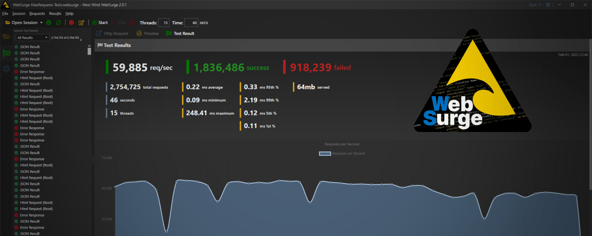

# West Wind WebSurge 2.0 is here

Today I'm happy to announce - after a long road of final tweaks and updates - that I'm releasing [West Wind WebSurge 2.0](https://websurge.west-wind.com). WebSurge is an easy to use **REST Client and Web Load Testing tool for Windows**, designed to make it easy to create and test Http requests, and with minimal effort put Web applications under load.

Version 2.0 is a complete re-write of this tool from version 1.x, with a complete replacement User Interface with a modern and much more responsive and visually appealing interface. The underlying Http engine used for load testing has also been completely re-written to take advantage of many of the new features available in .NET 6.0, which this new release is built on top of.

## Overview Video
For the release I've put together a 10 minute overview and getting started video:

<iframe src="https://www.youtube.com/embed/jgEYn-ldr30?version=3&vq=hd1080" 
        title="West Wind WebSurge Intro" 
        frameborder="0" allowfullscreen
        allow="accelerometer; autoplay; clipboard-write; encrypted-media; gyroscope; picture-in-picture" 
        style="position: absolute; width: 100%; height: 100%;">
</iframe>

<small>* *make sure you watch video in **HD Video Mode***</small>

The video is an overview, so it doesn't go into the weeds for many options, but there's lots of additional information available [in the documentation](https://websurge.west-wind.com/docs) that expands on the basic concepts. In most places in WebSurge pressing `F1` will take you to the appropriate help topics.

## A few Screen Shots
Here are a few screen shots of the new version, that give an idea of functionality:

**The main request manager view used for entering, editing and testing requests:**

**Test result view:**

**OpenApi/Swagger Imports:**

**Command line testing:**

There's obviously much more but this gives a rough idea of what WebSurge is about.

## Philosophy
Web Stress Testing has traditionally been a major pain in the ass, and WebSurge's goal has always been to make this process easier, so that anybody can get started quickly and without having to understand all the nuances up front. Load Testing is never 'easy', but having a tool that helps make getting started easier is a big step towards actually setting up requests and and then actually running load tests more consistently. 

WebSurge has been around for nearly 20 years now. It started out as an internal tool written in Borland C++ many moons ago, to replace abandoned Windows load testing tools back in the 90's. When .NET was released the tool was re-written using the .NET Framework - initially in .NET 1.1 - and then updated through the versions with incremental improvements.
  
Along the road and especially in recent years, WebSurge has also morphed into an efficient REST client providing functionality for which most probably use [Postman](https://www.postman.com/). Although Postman works fine and is widely used, personally I've always found the user interface counter-productive for testing requests, with too much clicky-di-clicks required to enter requests information and see response results. WebSurge makes this process much more streamlined with live request and response views that are editable for quickly updating requests and viewing response data. WebSurge is also a local tool and stores data in easy to use, edit and share text files that are plain Http Traces that are easy to share in code repositories. Sharing tests is as easy as checking it into Git or simply sharing a text file.

First and foremost this is a tool that I wrote for myself as I do a lot of API and Web testing since most of the work I do is centered around services and APIs and WebSurge makes my life a lot easier. So hopefully some of you will find it as useful as I do :smile:

## From .NET Framework to .NET 6.0
This release is built on top of .NET 6.0 and this is my first desktop application I've published that runs on .NET 6.0. The move to a .NET 6.0 WPF application from an existing full framework Windows Forms application, was a surprisingly painless process! I was expecting a number of things to break in the update process, but to my pleasant surprise there were **very few things that didn't *just work* in .NET 6.0**!

Performance of the application improved significantly due to some internal overhaul of key components that could benefit from the improvements in .NET - especially the Http engine.

The move from WinForms to WPF was obviously an effort but that was to be expected. However, having available many of the components and support tools from [Markdown Monster](https://markdownmonster.west-wind.com) greatly facilitated setting up the new user interface in WPF. The user interface in v2 is much more responsive, with UI changes reflecting throughout the UI immediately, which is big improvement over v1's rigid save and update requirements.

The only thing that outright did not work was my custom Razor Engine that v1 used to render Request and Response views. Rather than replace the Razor rendering logic in v2 (which is problematic due to dependencies and compilation changes in Razor in .NET 6), in v2 the templating for result views is handled in browser using client side templating - via VueJS. This turned out to provide many additional benefits over the old Razor generated result views with more interactive features in result views and more flexible data display features.

### Http Processing
The biggest challenge for v2 however was re-writing the Http engine. WebSurve v1 on full framework used a custom implemented, thread based processing engine for Http requests using `HttpWebRequest` with synchronous requests. While that sounds downright archaic in today's *async all the things* environment, back in the day I had spent a lot of time trying different solutions and the thread based sync approach was by far the most efficient way to run Http requests at the time.

In .NET 6.0 however, `HttpWebRequest` is not performant and doesn't actually even support real **sync** behavior. Rather `HttpWebRequest` (and also `WebClient`) routes through the newer `HttpClient` object, with terrible performance limitations. Running my original  code in .NET 6.0 originally resulted in a 10x performance loss. Yikes.

However, after experimenting with various approaches I ended up using a hybrid custom threads for sessions and async requests for individual Session requests set up that in the end ended up **improving on the v1 performance by roughly 35%**, plus it resulted in **less than half the CPU usage for similar loads**. This turned out to be a major improvement and it's obviously a key feature of this load testing tool. 

**Big win on that front!**

## Deployment and 6.0
As nice as .NET 6.0 is the big downside to running NET 6.0 is that I need to ensure that the .NET 6.0 desktop runtime is installed in some way. v1 ran on full framework, and since it's part of Windows, there's no additional install. For v2 I do not want to ship a self-contained installer and bloat my installation size to 80mb (as opposed 7mb), so .NET 6.0 for now is a pre-requisite. Installing through Chocolatey automatically installs the runtime which helps, but when doing the self contained install when .NET 6.0 is not installed fails to start the application.

Thankfully, .NET 6.0 displays a dialog box that specifies the problem exactly and sends users that arrive there to a download and install link. It's not ideal, but it's preferrable over a huge self-contained installation that is so big that the packed version can't be stored on GitHub for download (overruns the size limit).

## Source Code - no more due to License Abuse
WebSurge started out as a source open project - licensed, but with source code in the open on GitHub. Unfortunately, just like I had to [remove Markdown Monster from GitHub](https://weblog.west-wind.com/posts/2021/May/05/Taking-down-the-Markdown-Monster-Source-Code), there has been rampant license abuse and outright code theft and rebranding of WebSurge's source code. There were also very few contributions over the course of a lot of years of code availability that the liability of having the code out in the open to be ursurped unfortunately outweighed the benefits.

I hate this decision as I often reference WebSurge (and Markdown Monster) code in blog posts or other code references and removing the code makes that unfortunately impossible. It also makes it more difficult to reference GitHub issues to specific code fixes, but I see no alternative given the destructive environment that the source in the open environment has brought.

So, it's with a heavy heart that I moved the source code for v2 into a **private repository**. However, for anybody that wants to contribute the source code is still available [by request](https://websurge.west-wind.com/purchase#source-code-access). If you want to fix a bug, add enhancements or simply make a small customization for your own internal use you can send an email 

## Free Licenses for MVPs and Contributors
Although the source code has been pulled and is available only by request,  we still offer free licenses to anybody who makes a non-trivial (spelling corrections don't count :smile:) contribution to WebSurge either via code fixes, PR contributions, quality feature requests that lead to new features and heck even bug high quality reports that fix non-trivial problems in WebSurge. 

As with all West Wind Products we also extend free licenses to

* Microsoft MVPs
* Microsoft Development Insiders (.NET/ASP.NET/Client Technologies etc.)
* Microsoft Employees
* Any vendor that provides MVP licenses of their products

This is a small way of giving back to those communities that have provided so much value to me over the years. You can find out more in the license information for WebSurge:

* [MVP Licenses](https://websurge.west-wind.com/purchase#microsoft-mvps-and-microsoft-employees-get-free-licenses)

## Summary
Well, I'm stoked WebSurge is finally out in release form. The last preview updates already have been very stable, but this official release adds the final polish and cleanup. 

Check it out and hopefully some of you will find this tool useful.

## Resources

* [West Wind WebSurge Site](https://websurge.west-wind.com)
* [Intro Video on YouTube](https://www.youtube.com/watch?v=jgEYn-ldr30)
* [WebSurge Twitter Account](https://twitter.com/WebSurge1)
* [MVP Licenses](https://websurge.west-wind.com/purchase#microsoft-mvps-and-microsoft-employees-get-free-licenses)

    
    this post created and published with the 
    <a href="https://markdownmonster.west-wind.com" 
       target="top">Markdown Monster Editor</a> 

