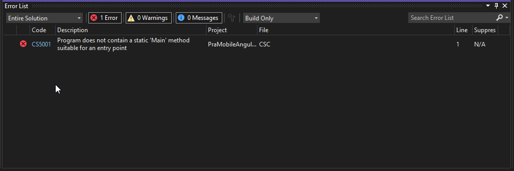

# Creating a Static Web Content Project for Publishing with WebDeploy


I've been working on updating a small and old customer application that is directly deployed to an IIS Web server. The app goes to a staging server first, and then is moved from there to the live site when approved using old school Powershell scripts that are automated via a Web front end. And it works just fine. Yup, that is very old school compared to using build pipelines, but for many smaller businesses and projects - like this very project that replaces the front end only - using a self-hosted server or full Virtual Machine server is not an uncommon scenario. 

> If you're one of those people that sets their hair on fire and can't control yourself with leaving *"Lost soul"* comments when you hear about *'Push Button Deployment'*, you might want to stop right here and be on your merry way! This post is not for your cynical self...

So this application has two top level projects - one for the service backend and one for the client static file front end both hosted on the same server but on separate Web sites in IIS. Plus it has an output project that's used purely for publishing the static client side code.

For the server application the IIS Web Publishing via `MsDeploy` that is used by Visual Studio and `dotnet publish` just works, since that's the use case that `<Project Sdk="Microsoft.NET.Sdk.Web">` project type designed for - to publish a .NET Core Web application which includes both code and static resources using a standard project layout and structure (ie. binary root and `wwwroot` for content). Likewise classic ASP.NET project publishing (used for this old server application that runs a generic Http Handler) *just works*. It handles publishing binaries, hooking up the ASP.NET Core Module, performing `web.config` transforms, copying and compiling .Razor files and more. That's great - it just works!

## Where's my Static Content Project Type?
But things are not quite as nice for static content projects that don't have a dependency on .NET Core. You would think that **this would be easier** since a lot less has to happen to publish static content, but all Visual Studio and .NET project types are geared toward .NET code and don't 'just work' without a compiled target.

You'd also think that this is something quite common these days: You have a project that is a Web project that consists in its entirety of static HTML, CSS, JS, image and other Web resources. For publishing all that really needs to happen in this use case is copying the files **as is** into the build output folder and pushing the entire content **as is** to the server.

Easier said than done - there's no such explicit project type supported in Visual Studio or just as a .NET/MsBuild project type.

There are a few contenders in Visual Studio and all have their issues:

* **Classic Web Site Projects**  
This is the closest in concept to a content only project that allows you to publish files - 'as is' to the server. However the problem with this project type is that it has no understanding of exclusion folders, so if you have things like `node_modules` folder, it will try to load that folder into the IDE and slow down massively. The other problem is that it's a classic style project using the old school verbose `.csproj` format and there are issues with these projects when mixed with the newer .NET SDK projects. In a pinch this works, but it's not ideal.

* **Visual Studio Folder Projects**    
This is not really a project, but rather runs Visual Studio like an editor that has a folder open. There's project available and while that works for working on static content unfortunately there's no support for publishing from this non-project type. Natch that.

* **.NET Core Web Projects** (with some tweaking)  
.NET Core Web Projects overall have all the features needed to effectively edit and manage static file content, and you can publish from the project type.  There's also integrated tooling via `dotnet publish` which is nice for automation. However, because it's a 'code' project, it **requires that a `public static void Main()` function exists** and the projects ends up compiling a binary main assembly. It also - non-helpfully - automatically injects the ASP.NET Core Hosting Module into the `web.config` even if you have a pre-provided static version. For content only (non-publishing) it works without a issues, but if you want to publish a little more work is required to make that work.

.NET Core Web Projects is 90% there in providing the desired functionality for static content, but it has some quirks. In this post **I'll discuss how you can set up a .NET SDK Web project for static content** and show the workarounds to make it more usable. **I also provide `dotnet new` project template that sets up a base static content project**.

There are obviously other ways than using WebDeploy to publish a site - if the server has the ability to use FTP there are many other options and tools available. But FTP requires another thing to maintain on a server, and WebDeploy is part of the IIS Infrastructure and available. It also works very well and efficiently once up and running.

##AD##

## Setting the Stage
To demonstrate, let me give my current project scenario, which is an Angular front-end application that talks to a .NET (classic) service application. The backend is a generic Application Service application that has an engine that rarely changes and is really irrelevant for this disccussion. It's the purely static front end site that is the focus of this post. The front end's API requests drive the server logic for the most part. So most of the changes and updates that occur happen in the client side project.

> Although I use Angular here for my example, other frameworks like VueJs and React use similar build steps and output management configuration. The actual settings might be different, but similar behavior is available for most JavaScript Platform CLI tools.

There are 3 projects:


* **The client Angular Project**  
This is the development folder for the Angular application. I tend to work on this project externally to Visual Studio in Web Storm, but you can of course use Visual Studio for client side projects as well, although I would recommend either VS Code or WebStorm as both have much richer Typescript and Angular support.
 
  I don't actually use this project in Visual Studio - I use WebStorm to work on the client side project, so this project is just there so I can look at files in Visual Studio as that's the one place where both the client server and published code live in one place.   
  
  **So this project only holds static content, but it doesn't need to publish. That's scenario #1.**

* **The Build Output Project**  
This is the project that contains the build output from Client Side Angular project, which is also just static Web based resources and assets for the client side application. This project is not meant to be changed, it merely **acts as a container** to allow publishing of the final output to the Web site.
  
  **Unlike the client development project this static content project is not edited but needs to be published via Web Deploy. That's scenario #2**.

* **The Service Project**  
This not really relevant for this discussion, but for completeness this is a standard .NET Project that provides the service backend. It's an ancient, classic .NET application that has very little code in it and that rarely if ever changes as it's basically a template engine. It deploys separately from the client on separate Web site on a separate Web Server and is access by multiples of the Angular front end running for different customers. Many front ends to a single backend.

For development the process is to work on the Angular client side project in WebStorm with the local Angular CLI dev server. When changes are ready to be deploy, the client application is built with `ng build` and published into the `project_Publish` project folder. The client project needs to ensure **all files - including some of the project files required** are part of the published content as the output directly is completely overwritten by the client build process. IOW, the Angular client project contains everything needed for the static client content plus the few project specific files (more on that shortly).

The application is then ready to be published from this Publish project without any further changes using either Visual Studio's publish feature, or `dotnet publish` to publish the application.

The backend service is managed separately in this setup - it's rarely updated and doesn't deploy often and when it does it is deployed to a completely separate Web site that the many client applications connect to.

## Bastardizing the .NET Core Web Project Type
So the key item of discussion here is the project that is used to publish the project, which is the `_Publish` project in the example above. This project is a standard .NET SDK Web Project, but with a few tweaks that ensure that the project can publish static content to IIS properly.

A standard SDK style Web Project is pretty simple and looks like this:

```xml
<Project Sdk="Microsoft.NET.Sdk.Web">
	<PropertyGroup>
		<TargetFramework>net60</TargetFramework>
	</PropertyGroup>
</Project>
```

If you were to just use this project file and use it to publish to IIS you would end up running into a few problems:

* The project doesn't 'compile' and fails to build - can't publish  


* When you do manage to publish the static Site doesn't work unless .NET Core is installed  


### Site Compile - Missing `static void Main()`
If you have a purely static content site a .NET SDK project will not compile - it needs at least an entry point method and ends up compiling a final output binary. If the project can't compile it also can't be publish. Grrr...

To fix this you can add a `program.cs` to your project that's simply a *do nothing* method:

```cs
using System;

namespace PraMobileAngular_Publish
{
    public class program
    {
        public static void Main()
        {  }
    }
}
```

That's easy enough to do. We'll have to exclude this file later so it won't publish. Hold tight...

If you only need a project container and don't need to publish the client side project - ie. Scenario #1 - then you are done.


##AD##

### Generating the .NET Project from the Client Build
In my case for Scenario #2 I need to generate build output from the Scenario #1 project, and then take that project and publish it with Web Deploy. In order to use Web Deploy I need to have working and compilable project. This means at minimum I need:

* The `.csproj` file
* The `program.cs` with `Main()` that compiles
* A resusable Publish Profile (so you don't reenter specs each time)


This means that when the client project is built - **the above files that make up the .NET Project files** have to be generated as part of the build output.

This means including the `.csproj` file, `program.cs` and the `.pubxml` file as part of the Client side build assets (in `angular.json` for my Angular app). For my Angular app, an `ng build` blows away the output folder, so my Angular build command has to include these files. To do this in Angular I can add `program.cs`, `PraMobileAngular_Publish.csproj` and the `.pubxml` file to the explicit client project resources that get deployed into the output folder.

In Angular the way to do this is in `angular.json` and providing a list of explicit `assets` that should be copied to the build output folder:

```js
{
  "$schema": "./node_modules/@angular/cli/lib/config/schema.json",
  "version": 1,
  "newProjectRoot": "projects",
  "projects": {
    "PraMobile": {
      ...
      "architect": {
        "build": {
          "builder": "@angular-devkit/build-angular:browser",
          "options": {
             ...
            "assets": [
              "src/favicon.ico",
              "src/assets",
              "src/themes",
              "src/appConfiguration.json",
              "src/themes/appConfiguration.production.json",
              "src/themes/dark/theme.css",
              "src/themes/default/theme.css",
              "src/icon.png",
              
              // *** These are project specific files
              "src/*.csproj",
              "src/*.csproj.user",
              "src/program.cs",
              "src/Properties/PublishProfiles/IISProfile.pubxml",
              "src/web.config"
            ],
            "styles": [],
            "scripts": []
          },
          ...
        }
    }
}
```

If you look back at the project image above and you look in the `_Publish` project you'll see the `program.cs` file, the `Properties` folder. You don't see the project file because that's open in the Solution Explorer in Vs and hidden in the project file view. These files are copied from the client project **every time** the client project is built.

To reiterate: All client files - including those .NET project files -  are managed as part of the Client Angular project which is the client side *'source of truth'*.

## The Project File
The second problem we ran into is that after publishing, the Web site doesn't load **if .NET Core is not installed**. Even if .NET Core **is installed** the site probably won't run because the project isn't set up for .NET Core. It's just an empty console because of the `Main()` method created. Also even if .NET core were running you probably don't need it to serve your static files as IIS is much more efficient due its built-in highly optimized content caching and compression. 

Either way we need to make sure that the **ASP.NET Core Hosting Module is not injected when the project is published**.
  
What does that mean?

Assume you have Web.Config that looks like this in your project:

```xml
<?xml version="1.0" encoding="utf-8"?>
<configuration>
    <location path="." inheritInChildApplications="false">
    </location>

    <system.webServer>
        <rewrite>
            <rules>
                <rule name="SPA Fallback Routes" stopProcessing="true">
                    <!-- match everything by default -->
                    <match url=".*" />
                    <conditions logicalGrouping="MatchAll">
                        <!-- unless its a file -->
                        <add input="{REQUEST_FILENAME}" matchType="IsFile" negate="true" />
                        <!-- or a directory -->
                        <add input="{REQUEST_FILENAME}" matchType="IsDirectory" negate="true" />
                        <!-- or is under the /api directory -->
                        <add input="{REQUEST_URI}" pattern="^/(api)" negate="true" />
                        <!-- list other routes or route prefixes here if you need to handle them server side -->
                    </conditions>
                    <!-- rewrite it to /index.html -->
                    <action type="Rewrite" url="/index.html" />
                </rule>
            </rules>
        </rewrite>
    </system.webServer>
</configuration>
```

Web Deploy **injects the ASP.NET Core Module reference into this web.config** by default:

```xml
<?xml version="1.0" encoding="utf-8"?>
<configuration>
  <location path="." inheritInChildApplications="false">
    <system.webServer>
     
      <!-- this section gets injected -->
      <handlers>
        <add name="aspNetCore" path="*" verb="*" modules="AspNetCoreModuleV2" resourceType="Unspecified" />
      </handlers>
      <aspNetCore processPath="dotnet" arguments=".\PraMobileAngular_Publish.dll" stdoutLogEnabled="false" stdoutLogFile=".\logs\stdout" hostingModel="inprocess" />
      
    </system.webServer>
  </location>
  ...
  <system.webServer>
</configuration>  	
```

If .NET Core is not installed that's when you get this error:


If .NET **is installed** content will be served through ASP.NET Core, but - since there is no application configured it'll likely just fail with a 404 or 500 error too. 

To fix this we can add a `<IsWebConfigTransformDisabled>True</IsWebConfigTransformDisabled>` - thanks to [@DamianEdwards](https://twitter.com/DamianEdwards) and [sayedihashimi](https://twitter.com/sayedihashimi) who pointed me at this option:

```xml
<Project Sdk="Microsoft.NET.Sdk.Web">
	<PropertyGroup>
		<TargetFramework>net60</TargetFramework>
		
		<!-- THIS -->
		<IsWebConfigTransformDisabled>True</IsWebConfigTransformDisabled>
	</PropertyGroup>

</Project>
```

which disables the ASP.NET core and any other `web.config` transformations.

Cool, but not an obvious setting to find!

## Missing Files and File Cleanup
We're almost there. The final step is making sure that all files we are interested in are deployed and some others are filtered out. ASP.NET Core apps by default deploy static content from a `wwwroot` folder, but the output we have here is in its own root and we don't want to deploy into a `wwwroot` folder on the server either.

So in order to push files into the output folder we have to explicitly specify the files to send. This is a lot easier than it sounds as you can use wildcards to specify all files and folders including recursive files. 

For this application here's what I use:

```xml
<Project Sdk="Microsoft.NET.Sdk.Web">
	<PropertyGroup>
		<TargetFramework>net60</TargetFramework>
		<OutputType>Library</OutputType>
		<IsWebConfigTransformDisabled>True</IsWebConfigTransformDisabled>
	</PropertyGroup>

	<ItemGroup>
		<None Include="*.*;assets/**;themes/**" 
		      Exclude="program.cs;*.csproj;*.csproj.user">
			<CopyToOutputDirectory>Always</CopyToOutputDirectory>
		</None>
	</ItemGroup>
</Project>
```

In this case I'm selecting all files in the root folder, plus the two folders that need to be copied. I then exclude a few files and folders as needed. In my project this is easiest - if you have a lot of folders you'll likely want to start with including all files `./**` and then exclude folders that you don't want.

With this in place when you build you now get the following build output that is sent to the server with WebDeploy:


This output contains all the files needed for deployment and no more, **except for the binary files which are unfortunately required in order for WebDeploy to work**. However, there are only 3 of them and they are small (&lt;25k), so this isn't a big deal as they aren't used once published. You can delete them on the server if you need to.

Also notice that I set the `<OutputType>Library</OutputType>` which results in one less of those extra files as it doesn't produce an `.exe` file.

## Publishing!
With all this in place you can now use WebDeploy to publish. There a few ways to do this:

* Using Visual Studio
* Using `dotnet publish`
* Using `msdeploy` directly (not discussed here)

### Publishing from Visual Studio
For Visual Studio you can open the project in Visual Studio and then **Publish from the context menu**:


which brings up the Publish Dialog:


If you don't have already created a Publish profile you can create one using **Create a Web Deploy Package** and add a new profile. Choose **Web Server IIS** from the list:


You then need to specify a Web site url, the Site name, and your credentials on the server to publish:


> #### @icon-info-circle WebDeploy on the Server is Required
> In order to use WebDeploy make sure [WebDeploy is installed](https://www.microsoft.com/en-us/download/details.aspx?id=43717) on the server. The easiest is to install with Chocolatey.
> ```ps
> choco install webdeploy
> ```

Once a profile is available, you can then use **Publish** to publish your site. 

## Publishing from the Command Line
You can also publish from the command line using the `dotnet publish`  command.

Essentially you can use `dotnet publish` plus use the MsDeploy parameters:

```ps
dotnet publish 
  .\PraMobileAngular_Published\PraMobileAngular_Publish.csproj `
  /p:PublishProfile=".\PraMobileAngular_Published\Properties\PublishProfiles\IISProfile.pubxml" `
  /p:Password=password -c Release
```

That's a bit of a mouthful so I tend to stick that into a `publish.ps1` file. Running `build` and `publish` in succession gets the app up to the staging server in a 30 seconds or less.


You can find more info for Command Line Publishing here:

[Visual Studio Publish Profiles](https://docs.microsoft.com/en-us/aspnet/web-forms/overview/deployment/web-deployment-in-the-enterprise/deploying-web-packages)

## Summarizing the Process
And there you have it - a .NET SDK compatible project that can now publish a static Web site. Once this is set up properly you don't need to mess with it again unless you make specific project output changes. You might have to tweak your file inclusions for the final build output, but otherwise this stuff is mostly generic - one and done.


This all sounds like a lot of effort just to get an integrated publish process. But honestly it's a lot more complicated to talk about than it is to implement. Lets review what's needed to make this work:

* Create a .NET Core Web project
* Set project `OutputType` to `Library` (removes the exe)
* Add `<IsWebConfigTransformDisabled>True</IsWebConfigTransformDisabled>`
* Add `program.cs` in your Client Side Project 
* Add `project.csproj` to your Client Side Project
* Make sure that these files added are output into the output folder  
by the Client Side 'compilation' process
* Add File Inclusions and Exclusions to your Project File 
* Build your client project
* Open the Project in Visual Studio
* Create a Publishing Profile and try to publish (save the profile)
* Add `project.csproj.user` to your Client Side Project
* Add the `.pubxml` file to your Client side project 
* Make sure that these files added are output into the output folder  
by the Client Side 'compilation' process
* Build the client project again
* Publish from Visual Studio or `dotnet publish`

You should now be able to publish on each new build.

> #### @icon-info WebDeploy in Other Tools
> The [JetBrains Rider IDE](https://www.jetbrains.com/rider/) also has integrated support for WebDeploy and publishing profiles and it works well although the UI to create profiles is a bit quirky. It automates `dotnet publish`.
>  
> Surprisingly I haven't found a lot of other tools that integrate WebDeploy. For example I couldn't find a VS Code addin that works well with WebDeploy (the Deploy Addin says it does but I couldn't make it work).

## A .NET Project Template
To make the initial empty project creation a little easier I've also created a Dotnet Project Template and published it on NuGet:

* [Nuget Package](https://www.nuget.org/packages/EmptyWebContentProject.Template/)
* [Template Project on GitHub](https://github.com/RickStrahl/EmptyWebContentProjectTemplate)

Using the NuGet package you can install the project template and then create a project:

**Install the Template**

```ps
dotnet new -i EmptyWebContentProject.Template
```

**Use the Template**

```ps
md MyProject
cd MyProject

dotnet new EmptyWebContentProject

# Open your IDE or editor
code . 
```

If you need more control, the source code to the template is on GitHub which allows you to customize the template and add or remove features. You can rebuild the template and install it from a folder or the local NuGet package. ([more info](https://weblog.west-wind.com/posts/2020/Oct/05/Creating-a-dotnet-new-Project-Template#trying-out-your-template-locally))

> Note that this dotnet template provides only creates a single project - it handles the scenario of the `_Published` project - it does not handle the Angular (or other) client side includes as that will vary depending on which tool you use. But since this project generates the base files, you can more easily move them into a Client Source project as needed.

## Where to from here?
When I ran into this issue once again today, I fired off a few Tweets to see if there was a solution to the problem of the Web.Config transform screwing up my static site deploy. You can check out the longish thread here:

<blockquote class="twitter-tweet" data-theme="dark"><p lang="en" dir="ltr">Anybody remember what the setting in a `.csproj` file is that allows you to **not have a Main() entry point**? <br><br>I know there&#39;s a setting that keeps the project from wanting to compile but I can&#39;t find the name of it.<a href="https://twitter.com/hashtag/dotnet?src=hash&amp;ref_src=twsrc%5Etfw">#dotnet</a></p>&mdash; Rick Strahl (@RickStrahl) <a href="https://twitter.com/RickStrahl/status/1499506119827288078?ref_src=twsrc%5Etfw">March 3, 2022</a></blockquote> <script async src="https://platform.twitter.com/widgets.js" charset="utf-8"></script>

In the process there was a bit of a discussion on use cases [@TimHeuer](https://twitter.com/timheuer) mentioned that there is work being done on a JavaScript project type that might make this process more natural. 


<blockquote class="twitter-tweet" data-theme="dark"><p lang="en" dir="ltr">Kinda. If it’s just content I am not sure we’d involve CLI but look at new JS proj type is where we are leaning for the closest to that. It is react/angular etc so there is some ‘build’ there but you can see to strip away all that. However publish not hooked up yet</p>&mdash; Tim (@timheuer) <a href="https://twitter.com/timheuer/status/1499528165323984920?ref_src=twsrc%5Etfw">March 3, 2022</a></blockquote> <script async src="https://platform.twitter.com/widgets.js" charset="utf-8"></script>

I haven't seen this project type yet, but without the Deploy capability this is not quite as useful for this particular use case.  Hopefully this discussion adds some fuel to the fire to get a content project type for Web resources that includes deployment.

For now, I'm glad I got this working and although it's a little cumbersome to get going, it's workable. I just set up another project in a similar way and it took me 5 minutes to get it publishing on repeated builds, so although quite a few steps are involved, they're accomplished quickly and with a one time up front configuration.

Onwards and upwards!

## Resources

* [dotnet publish command](https://docs.microsoft.com/en-us/dotnet/core/tools/dotnet-publish)
* [Visual Studio Publish Profiles](https://docs.microsoft.com/en-us/aspnet/core/host-and-deploy/visual-studio-publish-profiles?view=aspnetcore-6.0#basic-command-line-publishing)
* [Empty Project Template Nuget Package](https://www.nuget.org/packages/EmptyWebContentProject.Template/)
* [Empty Project Template Project on GitHub](https://github.com/RickStrahl/EmptyWebContentProjectTemplate)


<div style="margin-top: 30px;font-size: 0.8em;
            border-top: 1px solid #eee;padding-top: 8px;">
    
    this post created and published with the 
    <a href="https://markdownmonster.west-wind.com" 
       target="top">Markdown Monster Editor</a> 
</div>